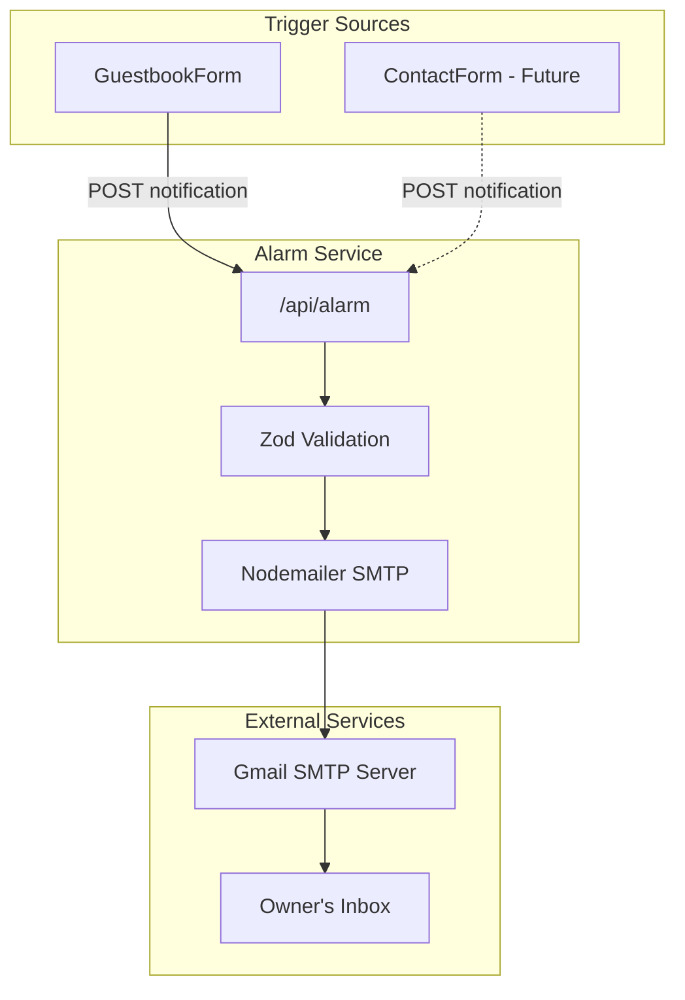
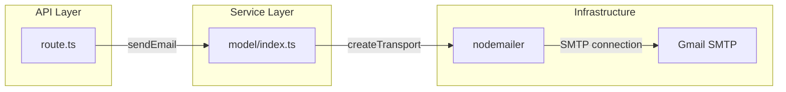
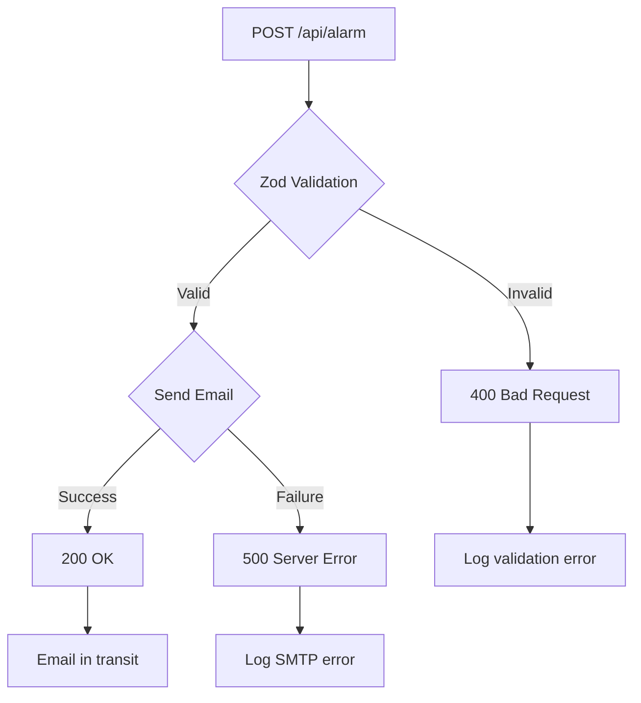

# Alarm 도메인 정보 구조

이 문서는 Alarm 도메인의 정보 구조를 설명합니다. 다른 도메인과 달리 Alarm은 전용 UI 화면이 없는 백그라운드 서비스입니다.

## 서비스 개요

Alarm 도메인은 알림 요청을 처리하고 이메일을 전송하는 백엔드 서비스로 운영됩니다. 사용자 대면 인터페이스는 없지만 다른 기능들과 통합됩니다.



---

## 통합 지점

### 1. 방명록 폼 통합

**위치**: `src/features/guestbooks/ui/guestbook-form.tsx`

**트리거 지점**: 성공적인 방명록 제출 후

**데이터 흐름**:
```
GuestbookForm.onSubmit()
  → POST /api/guestbooks (성공)
  → POST /api/alarm (fire-and-forget)
  → 폼 초기화 및 목록 새로고침 계속
```

**통합 패턴**:
```typescript
// 성공적인 방명록 제출 후
const response = await fetch('/api/guestbooks', {...});

if (response.ok) {
  // Fire and forget - await 하지 않음
  fetch('/api/alarm', {
    method: 'POST',
    body: JSON.stringify({
      from: 'guestbook@blog.com',
      subject: `새로운 방명록: ${data.name}`,
      message: `이름: ${data.name}\n내용: ${data.content}\n공개여부: ${data.isPrivate ? '비공개' : '공개'}`
    })
  });

  // 알림 완료 대기 없이 계속
  reset();
  refetchGuestbooks();
}
```

### 2. 연락처 폼 통합 (향후)

**위치**: `src/features/contact/ui/contact-form.tsx`에 위치 예정

**계획된 트리거**: 연락처 메시지 제출 후

---

## API 인터페이스

### 엔드포인트 구조

```
POST /api/alarm
├── 요청 검증 (Zod)
├── 이메일 구성
├── SMTP 전송
└── 응답
```

### 요청 스키마

```typescript
// Zod 유효성 검증 스키마
const bodySchema = z.object({
  from: z.string(),     // 발신자 식별자
  subject: z.string(),  // 이메일 제목
  message: z.string(),  // 이메일 본문 내용
});
```

### 응답 코드

| 상태 | 의미 | 응답 본문 |
|-----|-----|----------|
| 200 | 이메일 전송 성공 | `{ message: "메일을 성공적으로 보냈음" }` |
| 400 | 유효성 검증 실패 | `"보내는이, 제목, 내용은 문자열만 가능합니다."` |
| 500 | SMTP 실패 | `{ message: "메일 전송에 실패함", error }` |

---

## 이메일 구성

### 템플릿 구조

```html
<!-- 생성되는 이메일 HTML -->
<h1>{subject}</h1>
<div>{message}</div>
<br />
<p>보낸사람: {from}</p>
```

### 헤더 설정

| 헤더 | 값 | 목적 |
|-----|---|-----|
| To | `AUTH_USER` | 블로그 소유자 이메일 |
| From | 요청의 `from` 필드 | 발신자 식별자 |
| Subject | `[BLOG] {subject}` | 필터링을 위한 접두사 |

### 이메일 미리보기

**방명록 알림**:
```
To: owner@gmail.com
From: guestbook@blog.com
Subject: [BLOG] 새로운 방명록: 홍길동

---

<h1>새로운 방명록: 홍길동</h1>
<div>
이름: 홍길동
내용: 좋은 글 감사합니다!
공개여부: 공개
</div>
<br />
<p>보낸사람: guestbook@blog.com</p>
```

---

## 서비스 아키텍처

### 컴포넌트 다이어그램



### 파일 구조

```
src/features/alarm/
├── model/
│   └── index.ts          # sendEmail 함수, transporter 설정
└── (UI 컴포넌트 없음)    # 백그라운드 서비스만

src/app/api/alarm/
└── route.ts              # 유효성 검증이 포함된 POST 핸들러
```

---

## 설정

### 환경 변수

| 변수 | 목적 | 예시 |
|-----|-----|-----|
| `AUTH_USER` | Gmail 계정 (발신자 & 수신자) | `owner@gmail.com` |
| `AUTH_PASS` | Gmail 앱 비밀번호 | `xxxx xxxx xxxx xxxx` |

### SMTP 설정

```typescript
const transporter = nodemailer.createTransport({
  host: "smtp.gmail.com",
  port: 465,
  secure: true,  // SSL/TLS
  auth: {
    user: process.env.AUTH_USER,
    pass: process.env.AUTH_PASS,
  },
});
```

---

## 데이터 개인정보

### 전송되는 내용

| 데이터 | 이메일에 포함 | 저장 여부 |
|-------|-------------|----------|
| 작성자 이름 | 예 | 아니오 (이메일만) |
| 메시지 내용 | 예 | 아니오 (이메일만) |
| 공개 상태 | 예 | 아니오 (이메일만) |
| IP 주소 | 아니오 | 아니오 |
| 타임스탬프 | 암시적 (이메일 헤더) | 아니오 |

### 저장되지 않는 내용

- 이메일 내용은 애플리케이션에 영속되지 않음
- 전송된 알림에 대한 데이터베이스 레코드 없음
- 로그에는 오류 정보만 포함 가능 (내용 제외)

---

## 오류 처리 흐름



---

## 모니터링 지점

### 로깅 지점

| 이벤트 | 로그 레벨 | 정보 |
|-------|---------|-----|
| 요청 수신 | Debug | 요청 본문 |
| 유효성 검증 실패 | Warn | 오류 상세 |
| SMTP 성공 | Info | 없음 (개인정보) |
| SMTP 실패 | Error | 오류 객체 |

### 헬스 체크

전용 헬스 엔드포인트 없음. 서비스 상태는 다음으로 표시됨:
- 성공적인 방명록 제출 (알림 발생)
- 소유자 받은 편지함에 이메일 도착
- 서버 로그에 SMTP 오류 없음

---

## 확장성 고려사항

### 현재 제한사항

| 측면 | 현재 | 확장성 우려 |
|-----|-----|-----------|
| 처리량 | ~1 이메일/제출 | Gmail 속도 제한 |
| 재시도 | 없음 | 알림 손실 |
| 큐 | 없음 | 높은 부하 시 차단 |

### 향후 개선

| 개선 | 이점 | 복잡도 |
|-----|-----|--------|
| 이메일 큐 | 안정적인 전송 | 중간 |
| 재시도 메커니즘 | 일시적 실패 처리 | 낮음 |
| 다중 제공자 | 장애 조치 기능 | 높음 |
| 속도 제한 | 남용 방지 | 낮음 |
