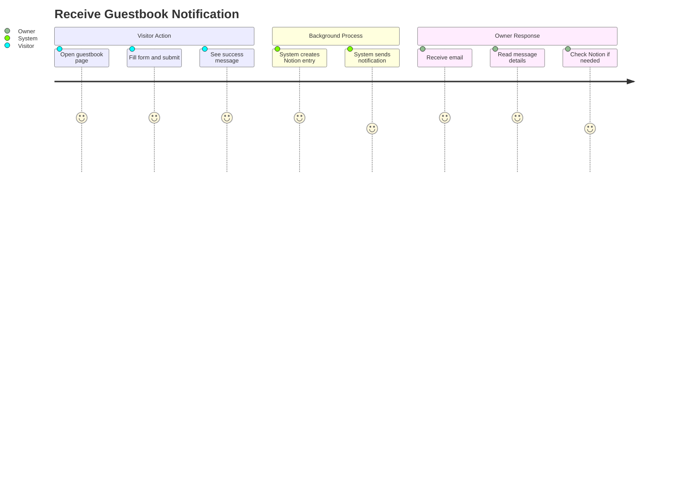
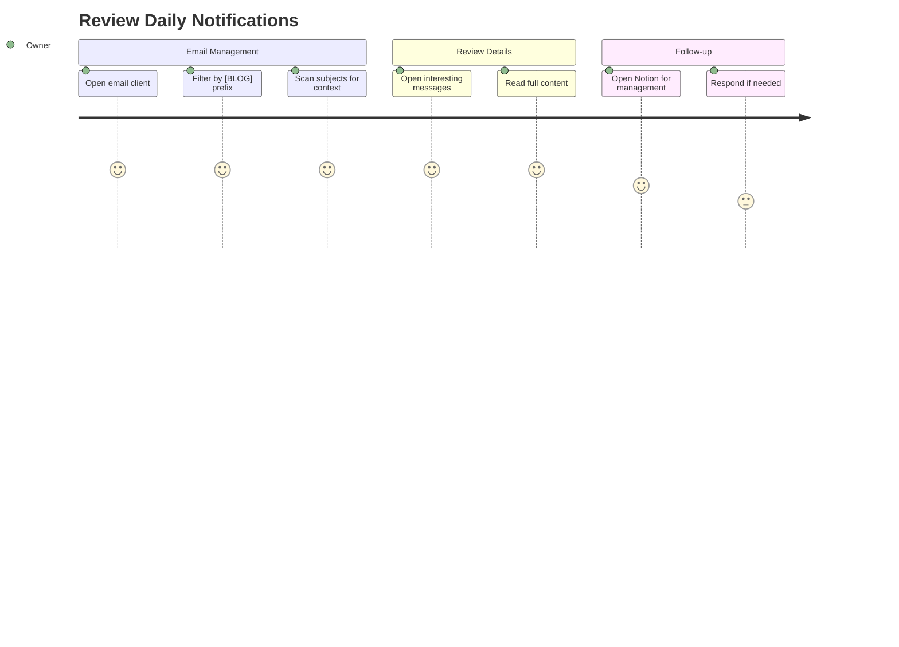
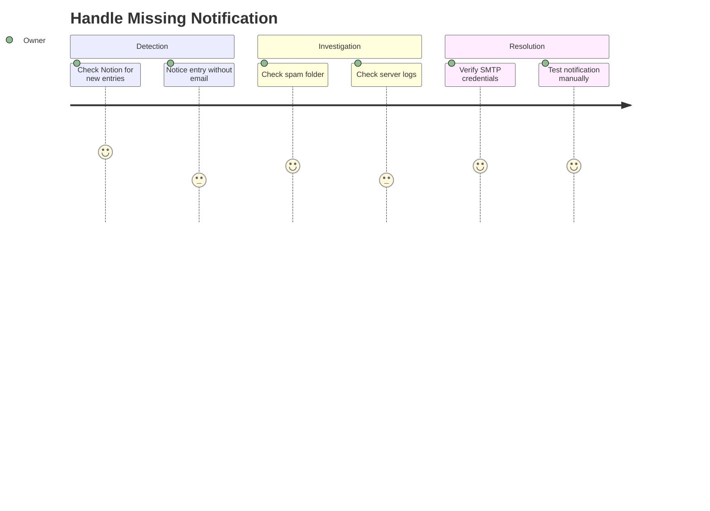

# Alarm 도메인 사용자 스토리

이 문서는 Alarm 도메인의 엔드투엔드 사용자 여정을 설명합니다. 블로그 소유자 관점에서의 이메일 알림 시나리오에 중점을 둡니다.

## 사용자 페르소나

### 블로그 소유자 (Meti)
Notion 대시보드를 지속적으로 확인하지 않고도 방문자 상호작용에 대해 알림 받기를 원하는 알림의 주요 수신자입니다.

### 방문자
방명록, 연락처 폼 등 블로그 상호작용을 통해 알림을 트리거하는 익명 사용자입니다.

---

## 사용자 여정

### 여정 1: 방명록 알림 수신

**페르소나**: 블로그 소유자
**목표**: 방문자가 방명록 메시지를 남기면 알림 받기
**전제조건**: Gmail 계정이 앱 비밀번호로 설정됨



#### 단계

1. **방문자 방명록 제출**
   - 사용자 행동: 방명록 폼 작성 및 제출
   - 시스템 응답: Notion에 항목 저장, 성공 토스트 표시
   - 검증: 폼 제출 성공

2. **시스템 알림 트리거**
   - 시스템 행동: 방명록 데이터로 `/api/alarm` 호출
   - 프로세스: Fire-and-forget (논블로킹)
   - 검증: API가 요청 수락

3. **SMTP로 이메일 전송**
   - 시스템 행동: Gmail SMTP에 연결, 이메일 전송
   - 내용: 작성자 이름, 메시지, 공개 상태
   - 검증: SMTP 핸드셰이크 완료

4. **소유자 이메일 수신**
   - 알림: 이메일이 받은 편지함에 도착
   - 제목: `[BLOG] 새로운 방명록: {authorName}`
   - 타이밍: 일반적으로 1-2분 내

5. **소유자 메시지 검토**
   - 사용자 행동: 이메일 내용 읽기
   - 정보: 메타데이터가 포함된 전체 메시지
   - 다음 단계: 선택적으로 관리를 위해 Notion 확인

#### 성공 기준
- [ ] 제출 후 5분 이내 이메일 수신
- [ ] 이메일에 완전한 메시지 내용 포함
- [ ] 이메일 제목이 출처를 명확히 식별
- [ ] 방문자 제출 흐름이 차단되지 않음

#### 오류 시나리오

| 시나리오 | 방문자에 미치는 영향 | 소유자에 미치는 영향 | 복구 |
|---------|-------------------|-------------------|------|
| SMTP 연결 실패 | 없음 (제출 성공) | 알림 없음 | 서버 로그 확인 |
| 잘못된 자격 증명 | 없음 | 알림 없음 | env에서 AUTH_PASS 수정 |
| Gmail 속도 제한 | 없음 | 지연된 알림 | 제한 해제 대기 |
| 네트워크 타임아웃 | 없음 | 알림 없음 | 재시도 미구현 |

---

### 여정 2: 일일 알림 검토

**페르소나**: 블로그 소유자
**목표**: 알림을 통해 방문자 상호작용 파악
**전제조건**: 알림 이메일을 수신함



#### 단계

1. **이메일 클라이언트 열기**
   - 사용자 행동: Gmail 또는 이메일 앱 접속
   - 컨텍스트: 일상 루틴의 일부
   - 검증: 올바른 계정에 로그인됨

2. **블로그 알림 필터링**
   - 사용자 행동: `[BLOG]` 접두사 검색
   - 시스템 응답: 모든 블로그 알림 표시
   - 대안: Gmail 필터/라벨 설정

3. **알림 제목 스캔**
   - 사용자 행동: 제목 라인 검토
   - 정보: 메시지 유형 및 작성자 이름
   - 결정: 어떤 메시지를 전체 읽을지

4. **전체 메시지 읽기**
   - 사용자 행동: 클릭하여 이메일 열기
   - 정보: 완전한 메시지 내용, 발신자, 타임스탬프
   - 검증: 모든 데이터가 존재하고 읽기 가능

5. **선택: Notion에서 관리**
   - 사용자 행동: Notion 방명록 데이터베이스 열기
   - 목적: 스팸 삭제, 상태 업데이트, 응답
   - 검증: 데이터베이스에 항목 존재

#### 성공 기준
- [ ] 모든 제출에 해당하는 이메일 존재
- [ ] 제목 라인이 분류를 위한 충분한 컨텍스트 제공
- [ ] 이메일 내용이 Notion 항목과 일치
- [ ] 메시지 유형 구분 용이

---

### 여정 3: 누락된 알림 처리

**페르소나**: 블로그 소유자
**목표**: 예상한 알림이 도착하지 않을 때 조사
**전제조건**: 방명록이 제출되었지만 이메일이 수신되지 않음을 알고 있음



#### 단계

1. **Notion 대시보드 확인**
   - 사용자 행동: 방명록 데이터베이스 열기
   - 관찰: 새 항목 존재
   - 문제: 해당 이메일 없음

2. **스팸/필터 확인**
   - 사용자 행동: Gmail 스팸 폴더 확인
   - 대안: 이메일 필터/규칙 확인
   - 해결: 스팸 아님으로 표시, 필터 조정

3. **서버 로그 확인**
   - 사용자 행동: Vercel 배포 로그 검토
   - 정보: `/api/alarm`의 오류 메시지
   - 일반적인 문제: 인증 실패, 네트워크 타임아웃

4. **설정 검증**
   - 사용자 행동: 환경 변수 확인
   - 검증: `AUTH_USER`와 `AUTH_PASS`가 올바름
   - 테스트: 재배포 또는 로컬 테스트

5. **수동 테스트**
   - 사용자 행동: 테스트 방명록 항목 제출
   - 검증: 이메일 도착 모니터링
   - 해결: 필요시 수정 및 재배포

#### 성공 기준
- [ ] 근본 원인 식별
- [ ] 설정 문제 해결
- [ ] 향후 알림 작동
- [ ] 모니터링 추가 고려

---

## 수락 테스트 시나리오 (E2E)

### 시나리오 1: 성공적인 알림 전송

```gherkin
Feature: Guestbook Notification
  As a blog owner
  I want to receive email notifications
  So that I know when visitors leave messages

  Scenario: Receive notification for public message
    Given the alarm API is configured correctly
    And a visitor submits a public guestbook entry
    When the submission completes successfully
    Then an email should be sent to AUTH_USER
    And the subject should contain "[BLOG] 새로운 방명록"
    And the body should contain the message content
    And the body should indicate "공개" status

  Scenario: Receive notification for private message
    Given the alarm API is configured correctly
    And a visitor submits a private guestbook entry
    When the submission completes successfully
    Then an email should be sent to AUTH_USER
    And the body should indicate "비공개" status
```

### 시나리오 2: 알림 실패 처리

```gherkin
Feature: Graceful Failure
  As a blog system
  I want to handle notification failures gracefully
  So that visitor experience is not affected

  Scenario: Guestbook succeeds when notification fails
    Given the SMTP server is unreachable
    And a visitor submits a guestbook entry
    When the entry is saved to Notion
    Then the visitor should see success message
    And the notification failure should be logged
    And the entry should exist in Notion database
```

### 시나리오 3: API 유효성 검증

```gherkin
Feature: Alarm API Validation
  As the alarm service
  I want to validate incoming requests
  So that only valid notifications are processed

  Scenario: Reject missing fields
    When POST /api/alarm is called without "from" field
    Then response status should be 400
    And response body should indicate validation error

  Scenario: Accept valid request
    When POST /api/alarm is called with from, subject, message
    Then response status should be 200
    And email should be queued for delivery
```

---

## 메트릭 및 성공 지표

| 메트릭 | 목표 | 측정 방법 |
|-------|-----|----------|
| 이메일 전송 성공률 | > 99% | 서버 로그 |
| 알림 지연 시간 | < 5초 | API 응답 시간 |
| 소유자 인지율 | 100% 제출 | 수동 검증 |
| 오탐률 | 0% | 스팸 불만 |

---

## 이메일 템플릿 미리보기

### 방명록 알림

**제목**: `[BLOG] 새로운 방명록: 홍길동`

**본문**:
```html
<h1>새로운 방명록: 홍길동</h1>
<div>
  이름: 홍길동
  내용: 좋은 글 감사합니다!
  공개여부: 공개
</div>
<br />
<p>보낸사람: guestbook@blog.com</p>
```

---

## 향후 개선 사항

| 개선 사항 | 우선순위 | 설명 |
|---------|---------|------|
| 전송 추적 | 중간 | 이메일 열람률 추적 |
| 재시도 메커니즘 | 중간 | 실패한 전송 재시도 |
| 템플릿 시스템 | 낮음 | 사용자 정의 가능한 이메일 템플릿 |
| 다중 수신자 | 낮음 | CC/BCC 지원 |
| 속도 제한 | 중간 | 알림 스팸 방지 |
