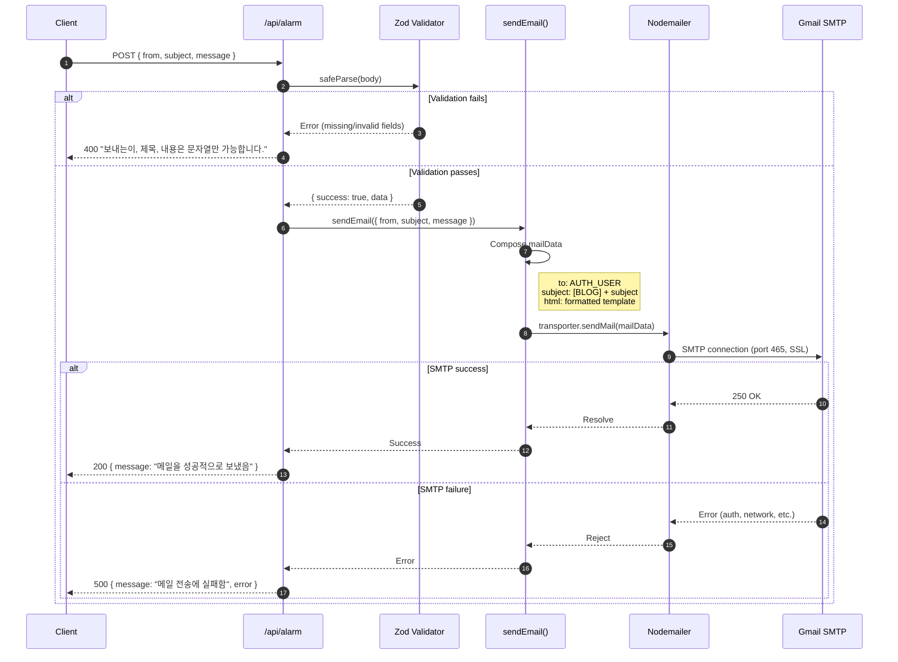
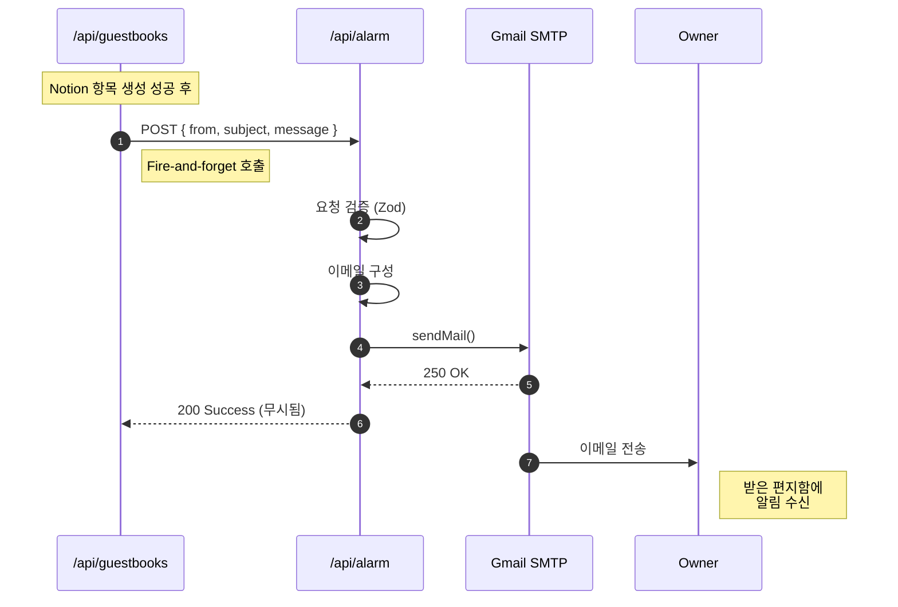
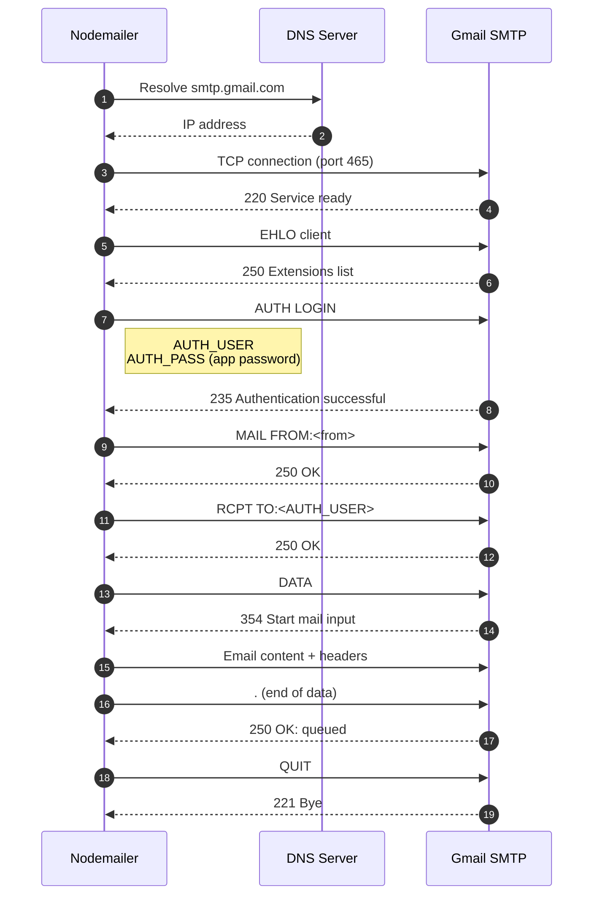
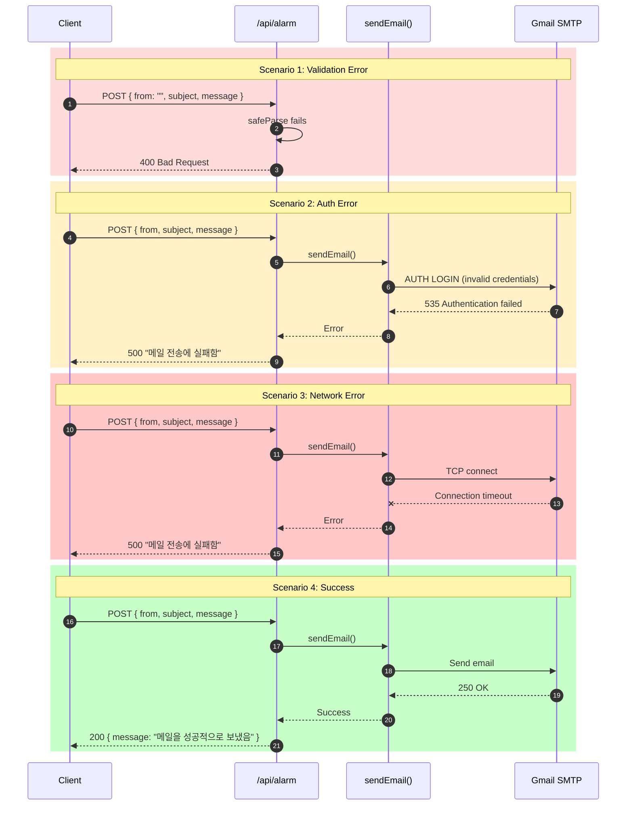
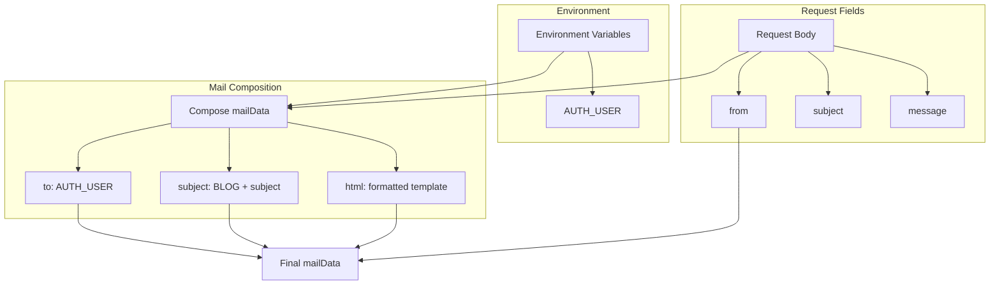

# Alarm 도메인 시퀀스 다이어그램

이 문서는 Alarm 도메인의 모든 백엔드 워크플로우에 대한 상세 시퀀스 다이어그램을 포함합니다.

## 1. 이메일 알림 전송

### 개요

알림 요청을 처리하고 Gmail SMTP를 통해 이메일을 전송합니다.

### 액터

- **Client**: 호출 기능 (예: Guestbook API)
- **API Route**: `/api/alarm`
- **Service**: 이메일 서비스 (`sendEmail`)
- **Nodemailer**: SMTP 클라이언트 라이브러리
- **Gmail**: 외부 SMTP 서버

### 시퀀스



### 요청/응답 스키마

**요청**:
```typescript
POST /api/alarm
Content-Type: application/json

{
  from: string;     // 발신자 식별자
  subject: string;  // 이메일 제목
  message: string;  // 이메일 본문 내용
}
```

**성공 응답** (200):
```typescript
{
  message: "메일을 성공적으로 보냈음"
}
```

**유효성 검증 오류 응답** (400):
```typescript
"보내는이, 제목, 내용은 문자열만 가능합니다."
```

**서버 오류 응답** (500):
```typescript
{
  message: "메일 전송에 실패함",
  error: Error
}
```

---

## 2. 방명록 알림 흐름

### 개요

방명록 API에서 소유자 알림까지의 백엔드 흐름입니다 (성공적인 방명록 제출 후 트리거됨).

### 액터

- **Guestbook API**: `/api/guestbooks` (호출자)
- **Alarm API**: `/api/alarm`
- **Gmail**: SMTP 서버
- **Owner**: 이메일 수신자

### 시퀀스



### 알림 페이로드

```typescript
// Guestbook API에서 구성
{
  from: "guestbook@blog.com",
  subject: `새로운 방명록: ${authorName}`,
  message: `
    이름: ${authorName}
    내용: ${content}
    공개여부: ${isPrivate ? "비공개" : "공개"}
  `
}
```

---

## 3. SMTP 연결 상세

### 개요

SMTP 핸드셰이크 및 이메일 전송의 내부 상세입니다.

### 시퀀스



### SMTP 설정

```typescript
const transporter = nodemailer.createTransport({
  host: "smtp.gmail.com",
  port: 465,
  secure: true,  // SSL 사용
  auth: {
    user: process.env.AUTH_USER,
    pass: process.env.AUTH_PASS,
  },
});
```

---

## 4. 오류 처리 흐름

### 개요

다양한 오류 시나리오가 어떻게 처리되는지 설명합니다.

### 시퀀스



---

## 5. 이메일 템플릿 생성

### 개요

요청 데이터에서 이메일 내용이 어떻게 구성되는지 설명합니다.

### 데이터 흐름



### 템플릿 코드

```typescript
const mailData = {
  to: process.env.AUTH_USER,        // 블로그 소유자
  subject: `[BLOG] ${subject}`,     // 필터링을 위한 접두사
  from,                              // 발신자 식별자
  html: `
    <h1>${subject}</h1>
    <div>${message}</div>
    <br />
    <p>보낸사람: ${from}</p>
  `,
};
```

---

## 오류 처리 매트릭스

| 시나리오 | 오류 소스 | HTTP 상태 | 사용자 영향 | 복구 |
|---------|---------|----------|-----------|------|
| 필수 필드 누락 | Zod 유효성 검증 | 400 | 없음 (호출자 처리) | 요청 수정 |
| 잘못된 타입 | Zod 유효성 검증 | 400 | 없음 (호출자 처리) | 요청 수정 |
| 인증 실패 | Gmail SMTP | 500 | 알림 없음 | AUTH_PASS 수정 |
| 네트워크 타임아웃 | Nodemailer | 500 | 알림 없음 | 재시도 (자동 아님) |
| 속도 제한 | Gmail | 500 | 지연된 알림 | 대기 후 재시도 |
| 잘못된 수신자 | Gmail | 500 | 알림 없음 | AUTH_USER 수정 |

---

## 성능 특성

### 타이밍 분석

| 단계 | 일반적인 소요 시간 | 참고 |
|-----|-----------------|-----|
| 유효성 검증 | < 1ms | 동기 |
| SMTP 연결 | 100-500ms | DNS + TCP + TLS |
| 인증 | 50-100ms | SMTP 핸드셰이크 |
| 이메일 전송 | 50-200ms | 크기에 따라 다름 |
| **총계** | **200-800ms** | 정상 조건 |

### 병목 현상

| 병목 | 영향 | 완화 방법 |
|-----|-----|---------|
| 콜드 SMTP 연결 | 첫 이메일 느림 | 영속 연결 (향후) |
| Gmail 속도 제한 | 500 이메일/일 | 배치 또는 계정 업그레이드 |
| 네트워크 지연 | 가변적인 타이밍 | 비동기 패턴 (현재) |
