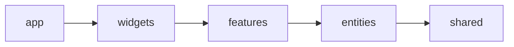
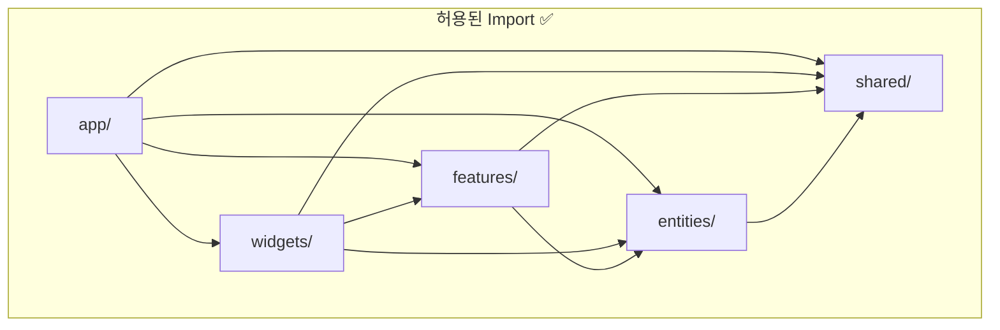
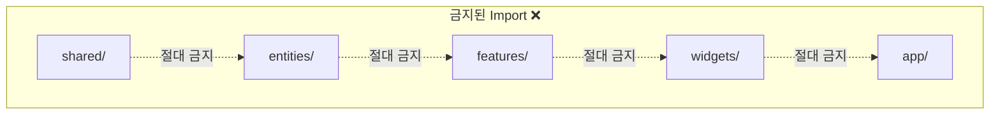
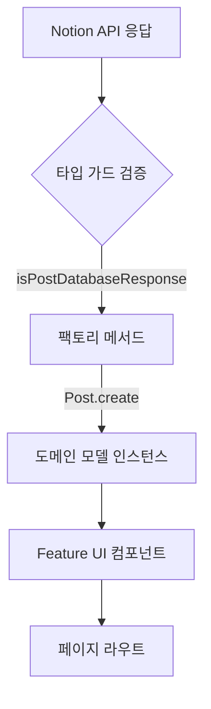
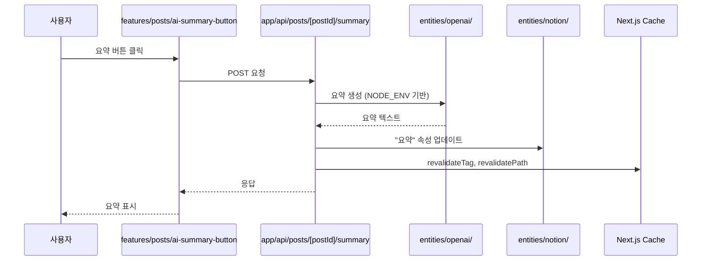
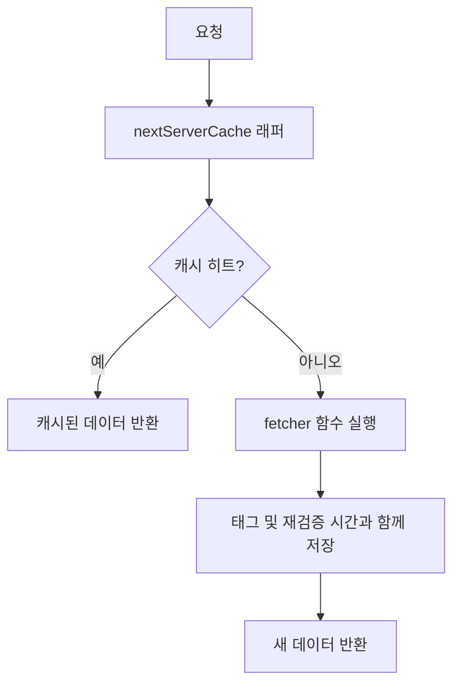

# 아키텍처 명세서

## TL;DR (빠른 참조)

**아키텍처**: 엄격한 레이어 경계를 가진 Feature-Sliced Design (FSD)

**레이어 계층** (import 방향 →):



**황금률**: 절대 상향 import 금지 (예: entities/는 features/를 import할 수 없음)

**주요 레이어**:

- `app/` - 라우트, 레이아웃, API 엔드포인트 (모든 것을 import 가능)
- `widgets/` - 복합 레이아웃 (Header, Footer)
- `features/` - 사용자 기능 (필터링, 방명록, AI 요약)
- `entities/` - 도메인 모델 (Post, Tag, Notion 클라이언트)
- `shared/` - 유틸리티 (캐시, 로거, UI 원시 요소)

**일반적인 패턴**:

- `static create()` 팩토리 메서드를 가진 protected 생성자
- 런타임 검증을 위한 타입 가드 (`isPostDatabaseResponse()`)
- 서버 사이드 캐싱 래퍼 (`nextServerCache`)
- 환경 기반 설정 (`config/index.ts`)

**참조**: 아래의 전체 레이어 세부사항 및 예시

---

## 개요

이 프로젝트는 Notion에서 콘텐츠를 가져와 AI 기반 기능을 추가하고 개인 블로그 경험을 제공하는 Next.js App Router 애플리케이션입니다. 코드베이스는 **Feature-Sliced Design (FSD)**를 따라 도메인 로직, UI 구성, 공유 유틸리티를 명확하게 분리합니다.

## 아키텍처 원칙

### Feature-Sliced Design (FSD)

FSD는 코드를 수평 레이어와 수직 슬라이스로 구성합니다. 각 레이어는 특정 책임이 있으며 순환 의존성을 방지하고 관심사의 명확한 분리를 유지하기 위한 엄격한 import 규칙이 있습니다.

### 레이어 책임

#### 1. `src/app/` - 애플리케이션 레이어

- **목적**: App Router 라우트, 레이아웃, API 라우트
- **책임**: 구성만 - features와 widgets를 연결
- **내용**:
  - 페이지 라우트 (`page.tsx`, `layout.tsx`)
  - API 엔드포인트 (`route.ts`)
  - 라우트 그룹 및 동적 세그먼트
- **Import 규칙**: 모든 하위 레이어에서 import 가능

#### 2. `src/widgets/` - 위젯 레이어

- **목적**: 화면 전반에서 재사용되는 대형 레이아웃 블록
- **책임**: 여러 features를 결합하는 복합 UI 컴포넌트
- **내용**: Header, Footer 및 기타 고수준 레이아웃 컴포넌트
- **Import 규칙**: `features/`, `entities/`, `shared/`에서 import 가능

#### 3. `src/features/` - Features 레이어

- **목적**: 특정 작업을 해결하는 사용자 대면 기능
- **책임**: entities를 결합하는 작업 지향 로직
- **내용**:
  - 포스트 필터링 UI 및 로직
  - 방명록 제출 플로우
  - AI 요약 버튼 및 생성
  - 이메일 알림
  - 태그 필터링
- **Import 규칙**: `entities/`와 `shared/`에서만 import 가능
- **핵심 원칙**: Features는 entities를 조율하지만 핵심 도메인 로직을 포함하지 않음

#### 4. `src/entities/` - Entities 레이어

- **목적**: 도메인 모델, 데이터 매퍼, entity별 UI
- **책임**: 특정 entities에 연결된 순수 도메인 로직 및 저수준 컴포넌트
- **내용**:
  - `entities/posts/`: Post 및 Tag 모델, 타입 가드, 기본 UI 컴포넌트
  - `entities/notion/`: Notion API 클라이언트 (공식 및 비공식)
  - `entities/guestbooks/`: 방명록 도메인 모델
  - `entities/theme/`: 테마 프로바이더 및 훅
  - `entities/openai/`: OpenAI/로컬 LLM 통합
- **Import 규칙**: `shared/`에서만 import 가능
- **핵심 원칙**: Entities는 자체 포함되며 features와 독립적임

#### 5. `src/shared/` - Shared 레이어

- **목적**: 교차 절단 유틸리티, 설정, 원시 요소
- **책임**: 비즈니스 로직이 없는 재사용 가능한 코드
- **내용**:
  - `shared/config/`: 캐시 설정, 상수
  - `shared/lib/`: 유틸리티 함수 (캐시 래퍼, 로거, cn 헬퍼)
  - `shared/ui/`: 원시 UI 컴포넌트 (Button, Tooltip, Loading, Error)
- **Import 규칙**: 상위 레이어에서 import 불가
- **핵심 원칙**: 모든 컨텍스트에서 범용적이고 재사용 가능해야 함

#### 6. `src/mocks/` & `src/__test__/` - 테스팅 인프라

- **목적**: MSW 핸들러, 테스트 컴포넌트, Vitest 스위트
- **책임**: 프로덕션 코드에 영향을 주지 않는 테스팅 지원
- **내용**:
  - MSW API 핸들러
  - 테스트 전용 컴포넌트
  - 단위 및 통합 테스트

## Import 규칙 및 경계

### Import 규칙 다이어그램





**규칙**:

- **절대** 상향 import 금지 (예: `entities/`에서 `features/` import 불가)
- **절대** 편의를 위해 레이어 건너뛰기 금지
- **절대** features 또는 entities 간 순환 의존성 생성 금지

## 데이터 흐름 패턴

### Notion에서 도메인 모델로



### AI 요약 생성 플로우



### 캐싱 전략



## 도메인 모델 설계

### Protected Constructor 패턴

모든 도메인 entities는 검증을 보장하기 위해 정적 팩토리 메서드와 함께 protected 생성자를 사용합니다:

```typescript
export class Post {
  private constructor(
    public readonly id: string,
    public readonly title: string,
    // ... 기타 속성
  ) {}

  static create(page: DatabaseObjectResponse): Post {
    if (!isPostDatabaseResponse(page)) {
      throw new Error('Invalid post data');
    }
    // 검증 및 변환
    return new Post(/* ... */);
  }
}
```

**이점**:

- 중앙 집중식 검증 로직
- 불변 인스턴스
- 타입 안전 생성
- 인스턴스 생성을 위한 명확한 API

### 타입 가드

런타임 검증은 Notion API 응답이 예상 구조와 일치하는지 확인합니다:

- `isPostDatabaseResponse()`: 포스트 데이터베이스 쿼리 검증
- `isIPost()`: Post 인스턴스의 런타임 타입 체킹
- 타입 가드는 API 변경으로 인한 런타임 오류를 방지

## 주요 아키텍처 결정

### 1. 이중 Notion 클라이언트 전략

**결정**: 공식 및 비공식 Notion 클라이언트 모두 사용

**근거**:

- 공식 클라이언트 (`@notionhq/client`): 쿼리/업데이트를 위한 신뢰할 수 있는 API
- 비공식 클라이언트 (`notion-client`): 풍부한 렌더링 기능

**트레이드오프**: 더 나은 UX를 위해 추가 의존성 및 `NOTION_TOKEN_V2` 요구사항 필요

### 2. ISR을 사용한 서버 사이드 렌더링

**결정**: Incremental Static Regeneration과 함께 Next.js App Router 사용

**근거**:

- 독자를 위한 빠른 페이지 로드
- 전체 리빌드 없이 신선한 콘텐츠
- SEO 최적화

**설정**:

- 개발: 30초 재검증
- 프로덕션: 5분 재검증

### 3. 환경 기반 LLM 선택

**결정**: 프로덕션에서는 OpenAI, 개발에서는 로컬 LLM

**근거**:

- 비용 최적화 (개발 중 API 요금 회피)
- 로컬 테스팅을 위한 프라이버시
- 프로덕션 품질 유지

**구현**: `entities/openai/`가 `NODE_ENV`를 확인하고 적절한 엔드포인트 선택

### 4. 중앙 집중식 캐시 관리

**결정**: 통합 설정을 가진 단일 캐시 래퍼

**근거**:

- 애플리케이션 전반에 걸친 일관된 캐시 동작
- 재검증 시간 조정 용이
- 단순화된 캐시 무효화

**구현**: `shared/lib/cache.ts`가 프로젝트별 기본값으로 `unstable_cache`를 래핑

## 새 기능 추가하기

새로운 동작을 추가할 때 이 의사결정 트리를 따르세요:

1. **순수 도메인 로직?** → `entities/`에 추가
   - 예: 새 Post 속성, 검증 규칙

2. **사용자 대면 작업?** → `features/`에 추가
   - 예: 검색 기능, 댓글 시스템

3. **레이아웃 구성?** → `widgets/`에 추가
   - 예: 사이드바, 네비게이션 메뉴

4. **범용 유틸리티?** → `shared/`에 추가
   - 예: 날짜 포맷터, 문자열 헬퍼

5. **라우트 또는 API 엔드포인트?** → `app/`에 추가
   - 예: 새 페이지, REST 엔드포인트

**핵심 규칙**: 항상 올바른 레이어에 추가하세요. 편의를 위해 FSD 원칙을 우회하지 마세요.
