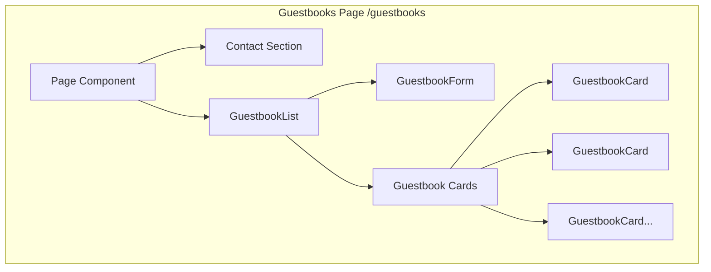
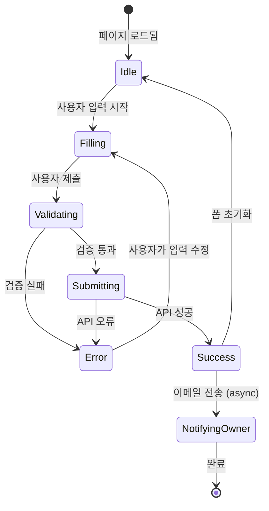
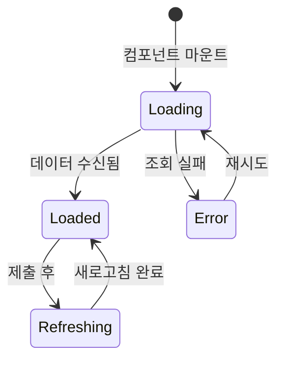

# Guestbook 도메인 정보 아키텍처

이 문서는 Guestbook 도메인의 화면 구조, 레이아웃, 컴포넌트, 데이터 흐름을 설명합니다.

## 화면 인벤토리

### 방명록 페이지

**경로**: `/guestbooks`
**목적**: 방문자가 메시지를 남기고 기존 공개 항목을 볼 수 있도록 함

#### 레이아웃 구조

```
+--------------------------------------------------+
|                    Header                         |
+--------------------------------------------------+
|                                                  |
|  +--------------------------------------------+  |
|  |             Contact Section                 |  |
|  |                                            |  |
|  |  [Email Icon] meti@example.com             |  |
|  |  [GitHub Icon] github.com/meti             |  |
|  |  [LinkedIn Icon] linkedin.com/in/meti      |  |
|  |                                            |  |
|  +--------------------------------------------+  |
|                                                  |
|  +--------------------------------------------+  |
|  |            Guestbook Form                   |  |
|  |                                            |  |
|  |  이름: [________________]                   |  |
|  |                                            |  |
|  |  메시지:                                   |  |
|  |  [__________________________________]      |  |
|  |  [__________________________________]      |  |
|  |                                            |  |
|  |  [ ] 이 메시지를 비공개로 유지              |  |
|  |                                            |  |
|  |  [제출 버튼]                               |  |
|  |                                            |  |
|  +--------------------------------------------+  |
|                                                  |
|  +--------------------------------------------+  |
|  |            Guestbook List                   |  |
|  |                                            |  |
|  |  +--------------------------------------+  |  |
|  |  | 작성자: John | 날짜: 2024-01-15      |  |  |
|  |  | "좋은 블로그네요! 계속 화이팅!"       |  |  |
|  |  +--------------------------------------+  |  |
|  |  +--------------------------------------+  |  |
|  |  | 작성자: Jane | 날짜: 2024-01-14      |  |  |
|  |  | "정말 도움이 되는 튜토리얼이에요!"    |  |  |
|  |  +--------------------------------------+  |  |
|  |                                            |  |
|  +--------------------------------------------+  |
|                                                  |
+--------------------------------------------------+
|                    Footer                         |
+--------------------------------------------------+
```

#### 컴포넌트

| 컴포넌트 | 타입 | 소스 |
|---------|------|------|
| Header | Server | `src/widgets/ui/header.tsx` |
| Contact | Server | `src/features/profile/ui/contact.tsx` |
| GuestbookList | Client | `src/features/guestbooks/ui/guestbook-list.tsx` |
| GuestbookForm | Client | `src/entities/guestbooks/ui/guestbook-form.tsx` |
| GuestbookCard | Client | `src/entities/guestbooks/ui/guestbook-card.tsx` |
| Footer | Server | `src/widgets/ui/footer.tsx` |

#### 데이터 요구사항

**서버 사이드**:
- 없음 (인터랙티브를 위해 클라이언트 사이드에서 데이터 조회)

**클라이언트 사이드**:
- `guestbooks: Guestbook[]` - 공개 방명록 항목 목록
- `isLoading: boolean` - 목록 로딩 상태
- `formState` - 폼 입력 값 및 검증 상태
- `isSubmitting: boolean` - 폼 제출 상태

#### SEO 메타데이터

| 속성 | 값 |
|-----|-----|
| title | `contact` |
| description | `메티에게 방명록 남기기` |
| og:type | `website` |

---

## 컴포넌트 계층 구조



---

## 데이터 흐름 아키텍처

```mermaid
flowchart LR
    subgraph "External"
        Notion[(Notion API)]
        SMTP[Gmail SMTP]
    end

    subgraph "API Layer"
        GuestbookAPI[/api/guestbooks]
        AlarmAPI[/api/alarm]
    end

    subgraph "Feature Layer"
        GL[GuestbookList]
        GF[GuestbookForm]
    end

    subgraph "Entity Layer"
        GB[Guestbook Model]
        GC[GuestbookCard]
    end

    GF -->|POST| GuestbookAPI
    GL -->|GET| GuestbookAPI
    GuestbookAPI -->|읽기/쓰기| Notion
    GuestbookAPI --> GB

    GF -->|알림| AlarmAPI
    AlarmAPI --> SMTP

    GB --> GC
    GL --> GC
```

---

## 상태 흐름

### 폼 제출 상태



### 목록 로딩 상태



---

## 폼 명세

### 입력 필드

| 필드 | 타입 | 필수 | 검증 |
|-----|------|-----|------|
| name | text | 예 | 비어있지 않은 문자열 |
| content | textarea | 예 | 비어있지 않은 문자열 |
| isPrivate | checkbox | 아니오 | Boolean (기본값: false) |

### 폼 상태

| 상태 | UI 표현 |
|-----|---------|
| Idle | 폼 활성화, 메시지 없음 |
| Filling | 폼 활성화, 실시간 검증 |
| Submitting | 버튼 로딩, 폼 비활성화 |
| Success | 성공 토스트, 폼 초기화 |
| Error | 필드 아래 오류 메시지 |

---

## 반응형 브레이크포인트

| 브레이크포인트 | 너비 | 레이아웃 조정 |
|--------------|------|-------------|
| Mobile | < 640px | 단일 컬럼, 전체 너비 카드 |
| Tablet | 640px - 1024px | 단일 컬럼, 패딩 있는 카드 |
| Desktop | > 1024px | 중앙 정렬 콘텐츠, 최대 너비 |

---

## API 통합

### GET /api/guestbooks

**트리거**: 컴포넌트 마운트, 성공적인 제출 후
**응답**: 모든 방명록 항목 (클라이언트에서 공개 필터링)

```typescript
// 응답 구조
{
  message: "게스트북을 성공적으로 가져왔습니다.",
  data: DatabaseObjectResponse[]
}
```

### POST /api/guestbooks

**트리거**: 폼 제출
**페이로드**:
```typescript
{
  name: string;
  content: string;
  isPrivate: boolean;
}
```

**응답**:
```typescript
{
  message: "게스트북을 성공적으로 생성했습니다.",
  data: { id, name, content, isPrivate }
}
```

---

## 오류 상태

### 폼 오류
- **빈 이름**: "이름은 필수입니다."
- **빈 내용**: "내용은 필수입니다."
- **서버 오류**: "게스트북 생성에 실패했습니다."

### 목록 오류
- **조회 실패**: "게스트북 가져오기에 실패했습니다." + 재시도 버튼
- **빈 목록**: "아직 남겨진 방명록이 없습니다." (친근한 메시지)

---

## 접근성 고려사항

| 요소 | 접근성 기능 |
|-----|-----------|
| 폼 | 레이블 연결, ARIA 레이블 |
| 제출 버튼 | 로딩 상태 안내 |
| 오류 메시지 | 폼 필드와 연결 |
| 카드 목록 | 시맨틱 리스트 마크업 |
| 프라이버시 토글 | 명확한 레이블, 키보드 접근 가능 |
