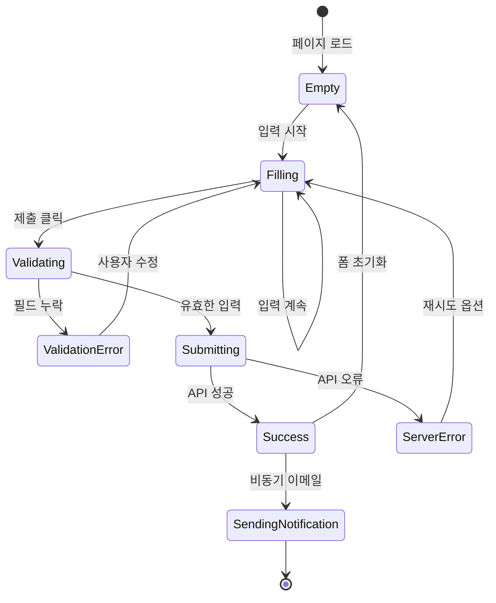
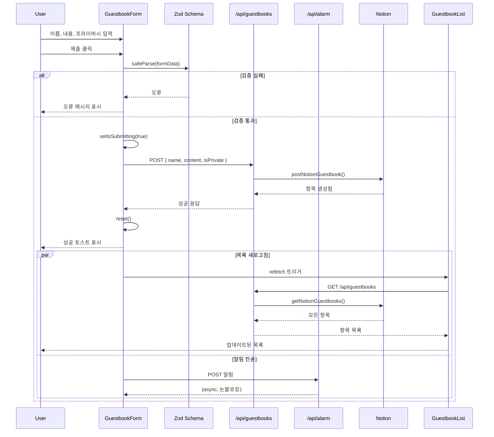
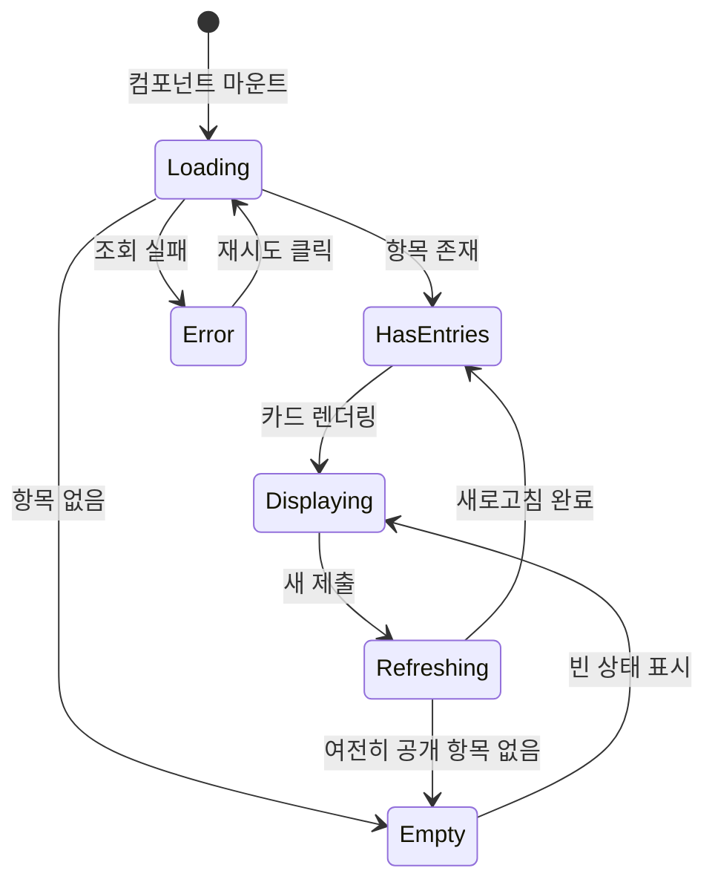
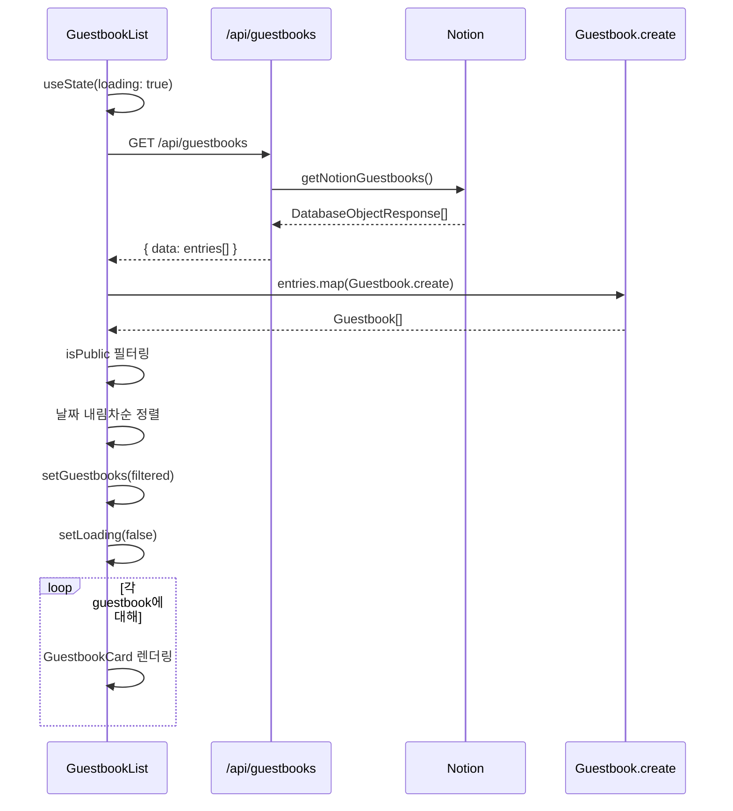

# Guestbook 도메인 유즈케이스 (프론트엔드)

이 문서는 Guestbook 도메인의 프론트엔드 유즈케이스를 설명합니다. 폼 상호작용과 목록 표시를 포함합니다.

## UC-F-010: 방명록 항목 제출

### 개요

| 속성 | 값 |
|-----|-----|
| 주요 액터 | 방문자 |
| 트리거 | 사용자가 방명록 폼의 제출 버튼 클릭 |
| 전제조건 | 방명록 페이지가 폼과 함께 로드됨 |
| 사후조건 | 항목이 Notion에 저장되고 목록 새로고침됨 |

### 메인 플로우

1. **사용자**가 `/guestbooks` 페이지로 이동
2. **시스템**이 연락처 섹션과 방명록 폼 표시
3. **사용자**가 이름 필드에 이름 입력
4. **사용자**가 내용 필드에 메시지 입력
5. **사용자**가 선택적으로 프라이버시 설정 토글
6. **사용자**가 제출 버튼 클릭
7. **시스템**이 클라이언트 사이드에서 입력 검증
8. **시스템**이 버튼에 로딩 상태 표시
9. **시스템**이 API로 POST 요청 전송
10. **API**가 Notion 데이터베이스에 항목 저장
11. **시스템**이 성공 메시지 표시
12. **시스템**이 폼 초기화
13. **시스템**이 방명록 목록 새로고침
14. **사용자**가 목록에서 새 항목 확인 (공개인 경우)

### 대안 플로우

**AF-1: 검증 실패**
1. 7단계에서 이름 또는 내용이 비어있으면
2. 시스템이 검증 오류 메시지 표시
3. 버튼 활성화 상태 유지
4. 사용자가 입력 수정 후 재시도

**AF-2: 서버 오류**
1. 10단계에서 API가 오류 반환하면
2. 시스템이 오류 메시지 표시
3. 재시도를 위해 폼 데이터 보존
4. 사용자가 제출 재시도 가능

**AF-3: 비공개 메시지**
1. 5단계에서 사용자가 프라이버시를 비공개로 토글
2. 메시지가 "비공개" 상태로 저장됨
3. 메시지가 공개 목록에 표시되지 않음

### UI 상태 다이어그램



### 컴포넌트 상호작용



### 상태 관리

```typescript
// GuestbookForm 컴포넌트 내부
const {
  register,
  handleSubmit,
  reset,
  formState: { errors, isSubmitting }
} = useForm<GuestbookFormData>({
  resolver: zodResolver(guestbookSchema)
});

const onSubmit = async (data: GuestbookFormData) => {
  try {
    const response = await fetch('/api/guestbooks', {
      method: 'POST',
      body: JSON.stringify(data),
    });

    if (!response.ok) throw new Error('제출 실패');

    toast.success('메시지가 등록되었습니다!');
    reset();
    refetchGuestbooks();

    // 비동기 알림 (fire and forget)
    sendNotification(data);
  } catch (error) {
    toast.error('등록에 실패했습니다. 다시 시도해주세요.');
  }
};
```

---

## UC-F-011: 방명록 목록 보기

### 개요

| 속성 | 값 |
|-----|-----|
| 주요 액터 | 방문자 |
| 트리거 | 페이지 로드 또는 제출 후 새로고침 |
| 전제조건 | 방명록 페이지 접근 가능 |
| 사후조건 | 공개 항목이 표시됨 |

### 메인 플로우

1. **시스템** 컴포넌트 마운트
2. **시스템**이 API로 GET 요청 전송
3. **API**가 Notion에서 모든 항목 조회
4. **시스템**이 항목 목록 수신
5. **시스템**이 항목을 Guestbook 도메인 모델로 매핑
6. **시스템**이 공개 항목만 표시하도록 필터링
7. **시스템**이 날짜 내림차순 정렬
8. **시스템**이 각 항목에 대해 GuestbookCard 렌더링
9. **사용자**가 메시지 목록 확인

### 대안 플로우

**AF-1: 빈 목록**
1. 4단계에서 항목이 없으면
2. 시스템이 친근한 빈 상태 메시지 표시
3. 첫 항목을 위해 폼 접근 가능

**AF-2: 조회 오류**
1. 3단계에서 API 호출 실패하면
2. 시스템이 재시도 버튼과 함께 오류 메시지 표시
3. 사용자가 재시도 클릭하여 다시 시도 가능

**AF-3: 모든 비공개 메시지**
1. 6단계에서 모든 항목이 비공개면
2. 시스템이 빈 상태와 동일하게 표시
3. 사용자는 자신의 공개 제출만 확인

### UI 상태 다이어그램



### 컴포넌트 상호작용



### 데이터 변환

```typescript
// GuestbookList 컴포넌트 내부
const [guestbooks, setGuestbooks] = useState<Guestbook[]>([]);
const [isLoading, setIsLoading] = useState(true);
const [error, setError] = useState<string | null>(null);

const fetchGuestbooks = async () => {
  setIsLoading(true);
  setError(null);

  try {
    const response = await fetch('/api/guestbooks');
    const { data } = await response.json();

    const entries = data
      .map(Guestbook.create)
      .filter((g: Guestbook) => g.isPublic)
      .sort((a: Guestbook, b: Guestbook) =>
        new Date(b.date).getTime() - new Date(a.date).getTime()
      );

    setGuestbooks(entries);
  } catch (err) {
    setError('게스트북을 불러오는데 실패했습니다.');
  } finally {
    setIsLoading(false);
  }
};
```

---

## 오류 처리 요약

| 유즈케이스 | 오류 타입 | 사용자 메시지 | 복구 액션 |
|-----------|---------|--------------|----------|
| UC-F-010 | 이름 누락 | "이름은 필수입니다" | 이름 필드 입력 |
| UC-F-010 | 내용 누락 | "내용은 필수입니다" | 내용 필드 입력 |
| UC-F-010 | 서버 오류 | "게스트북 생성에 실패했습니다" | 재시도 버튼 |
| UC-F-011 | 조회 오류 | "게스트북 가져오기에 실패했습니다" | 재시도 버튼 |
| UC-F-011 | 빈 목록 | "아직 남겨진 방명록이 없습니다" | 필요 없음 |

---

## 접근성 고려사항

| 유즈케이스 | 접근성 기능 |
|-----------|-----------|
| UC-F-010 | 폼 레이블, 오류 안내, 로딩 상태 |
| UC-F-011 | 시맨틱 리스트 마크업, 로딩 안내 |

---

## 성능 고려사항

| 측면 | 최적화 |
|-----|-------|
| 초기 로드 | 로딩 중 스켈레톤 표시 |
| 제출 후 | refetch 전 낙관적 업데이트 |
| 알림 | Fire-and-forget (논블로킹) |
| 목록 렌더링 | 많은 목록을 위한 가상화 |
