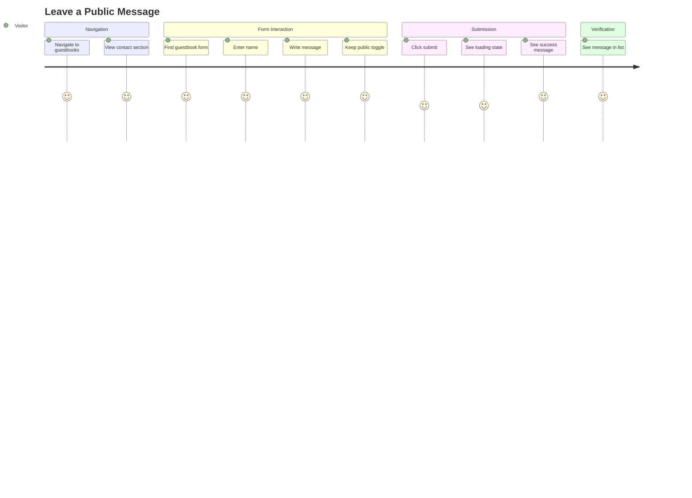
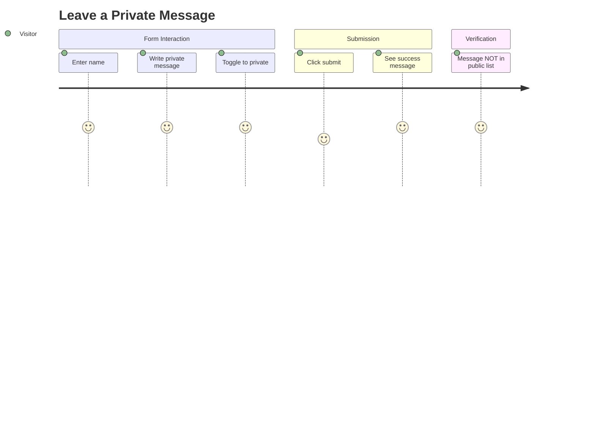
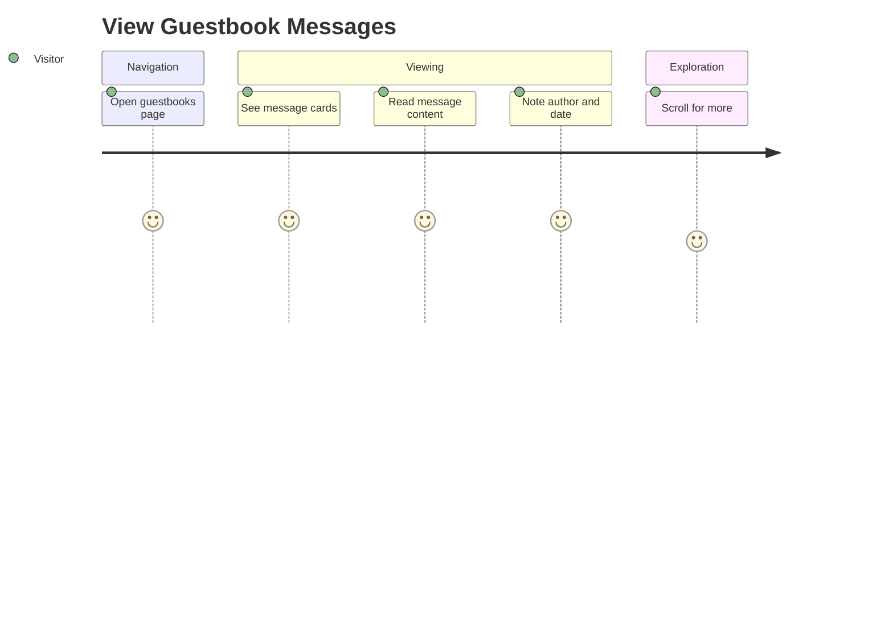
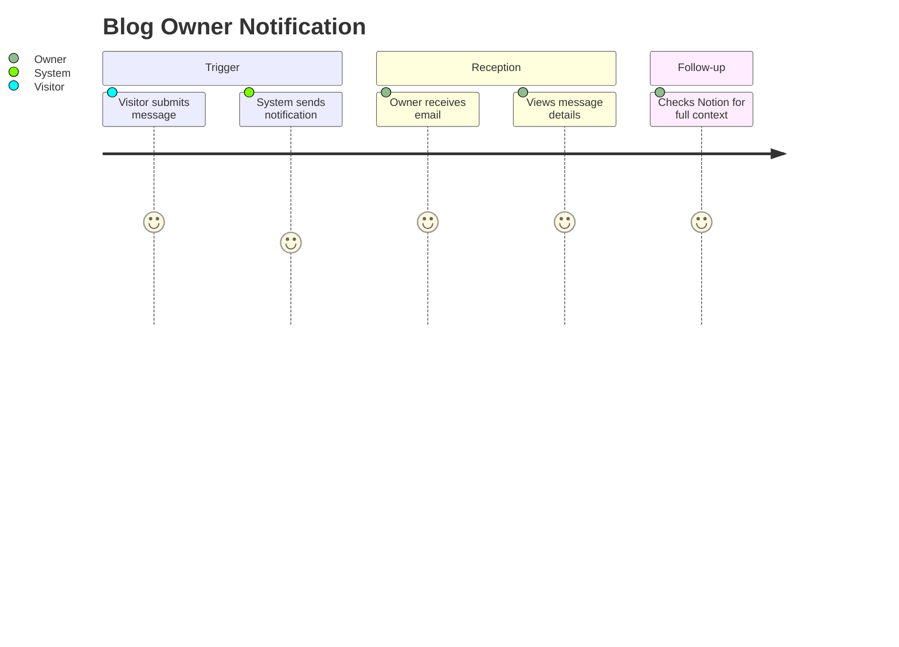

# Guestbook 도메인 유저 스토리

이 문서는 Guestbook 도메인의 엔드투엔드 사용자 여정을 설명합니다. 메시지 제출, 조회, 프라이버시 제어를 포함합니다.

## 사용자 페르소나

### 방문자
블로그 소유자에게 피드백, 감사 또는 질문을 남기고 싶은 익명의 블로그 독자.

### 블로그 소유자 (Meti)
Notion을 통해 방문자 메시지를 받고 관리하려는 콘텐츠 제작자.

---

## 사용자 여정

### 여정 1: 공개 메시지 남기기

**페르소나**: 방문자
**목표**: 다른 방문자에게도 보이는 감사나 피드백 공유
**전제조건**: 사용자가 방명록 페이지로 이동함



#### 단계

1. **방명록 페이지로 이동**
   - 사용자 행동: 네비게이션에서 "Guestbooks" 클릭
   - 시스템 응답: 연락처 섹션과 폼이 있는 방명록 페이지 표시
   - 검증: 페이지가 2초 이내에 로드됨

2. **연락처 정보 확인**
   - 사용자 행동: 연락처 섹션 관찰
   - 시스템 응답: 이메일, 소셜 링크, 연락처 정보 표시
   - 검증: 연락처 정보가 표시됨

3. **방명록 폼 찾기**
   - 사용자 행동: 폼 섹션으로 스크롤
   - 시스템 응답: 이름, 메시지, 프라이버시 토글이 있는 폼 표시
   - 검증: 모든 폼 필드가 표시되고 인터랙티브

4. **폼 작성**
   - 사용자 행동: 이름과 메시지 입력
   - 시스템 응답: 실시간 검증 피드백
   - 검증: 필수 필드 표시기 표시됨

5. **공개 설정 유지**
   - 사용자 행동: 프라이버시 토글을 기본값 (공개)으로 유지
   - 시스템 응답: 토글이 "공개" 상태 표시
   - 검증: 기본값은 공개

6. **폼 제출**
   - 사용자 행동: 제출 버튼 클릭
   - 시스템 응답:
     - 버튼에 로딩 상태 표시
     - POST /api/guestbooks로 API 호출
     - 성공 메시지 표시
     - 폼 초기화
   - 검증: 제출이 3초 이내에 완료됨

7. **제출된 메시지 확인**
   - 사용자 행동: 방명록 목록으로 스크롤
   - 시스템 응답: 새 메시지가 목록 상단에 표시됨
   - 검증: 메시지 내용이 제출과 일치

#### 성공 기준
- [ ] 폼이 필수 필드 검증
- [ ] 제출 중 로딩 상태 표시
- [ ] 제출 후 성공 메시지 표시
- [ ] 성공적인 제출 후 폼 초기화
- [ ] 공개 목록에 새 메시지 표시됨

#### 오류 시나리오

| 시나리오 | 사용자 경험 | 복구 |
|---------|------------|------|
| 빈 이름 | 오류: "이름은 필수입니다" | 이름 입력 |
| 빈 내용 | 오류: "내용은 필수입니다" | 내용 입력 |
| 서버 오류 | 오류: "게스트북 생성에 실패했습니다" | 제출 재시도 |
| 네트워크 타임아웃 | 재시도 옵션과 함께 오류 메시지 | 제출 재시도 |

---

### 여정 2: 비공개 메시지 남기기

**페르소나**: 방문자
**목표**: 블로그 소유자에게만 보이는 비공개 피드백 공유
**전제조건**: 사용자가 비공개로 소통하고 싶어함



#### 단계

1. **폼 작성**
   - 사용자 행동: 이름과 비공개 메시지 내용 입력
   - 시스템 응답: 검증 통과
   - 검증: 필드가 유효

2. **비공개 모드 활성화**
   - 사용자 행동: 공개 여부를 "비공개"로 토글
   - 시스템 응답: 토글이 비공개 상태로 전환
   - 검증: 프라이버시 설정이 "비공개"

3. **비공개 메시지 제출**
   - 사용자 행동: 제출 클릭
   - 시스템 응답:
     - Notion에 "비공개" 상태로 저장
     - 성공 메시지 표시
     - 폼 초기화
   - 검증: 제출 성공

4. **프라이버시 확인**
   - 사용자 행동: 방명록 목록 확인
   - 시스템 응답: 비공개 메시지가 공개 목록에 표시되지 않음
   - 검증: 소유자만 Notion에서 비공개 메시지 확인 가능

#### 성공 기준
- [ ] 프라이버시 토글이 올바르게 작동
- [ ] 비공개 메시지가 "비공개" 상태로 저장됨
- [ ] 비공개 메시지가 공개 목록에 표시되지 않음
- [ ] 성공 확인은 여전히 표시됨

---

### 여정 3: 방명록 메시지 보기

**페르소나**: 방문자
**목표**: 다른 방문자들의 메시지 읽기
**전제조건**: 방명록 페이지 접근 가능



#### 단계

1. **방명록으로 이동**
   - 사용자 행동: /guestbooks로 이동
   - 시스템 응답: 연락처 정보와 메시지 목록이 있는 페이지 로드
   - 검증: 페이지 완전히 렌더링됨

2. **메시지 목록 보기**
   - 사용자 행동: 메시지 카드 관찰
   - 시스템 응답: 작성자, 날짜, 내용이 있는 카드 표시
   - 검증: 공개 메시지만 표시됨

3. **개별 메시지 읽기**
   - 사용자 행동: 메시지 내용 읽기
   - 시스템 응답: 잘림 없이 전체 내용 표시
   - 검증: 내용이 읽기 쉽고 잘 포맷됨

4. **더 많은 메시지 탐색**
   - 사용자 행동: 더 보기 위해 스크롤
   - 시스템 응답: 추가 메시지 로드 (페이지네이션 시)
   - 검증: 모든 공개 메시지 접근 가능

#### 성공 기준
- [ ] 모든 공개 메시지 표시됨
- [ ] 비공개 메시지 표시되지 않음
- [ ] 날짜 기준 내림차순 정렬
- [ ] 작성자 이름과 날짜 표시됨
- [ ] 모든 디바이스에서 반응형 레이아웃

---

### 여정 4: 블로그 소유자 알림 수신

**페르소나**: 블로그 소유자 (Meti)
**목표**: 새 방명록 항목 알림 받기
**전제조건**: 이메일 알림이 설정됨



#### 단계

1. **방문자가 메시지 제출**
   - 트리거: 폼 제출 성공
   - 시스템 액션: API가 Notion에 메시지 저장
   - 검증: Notion 데이터베이스 업데이트됨

2. **시스템이 알림 트리거**
   - 시스템 액션: /api/alarm 엔드포인트 호출
   - 페이로드: 발신자 주소, 제목, 메시지 내용
   - 검증: 알림 요청 전송됨

3. **소유자가 이메일 수신**
   - 시스템 액션: Gmail SMTP를 통해 이메일 전달
   - 내용: 방문자 이름, 메시지, 프라이버시 상태
   - 검증: 이메일이 받은편지함에 도착

4. **소유자가 Notion에서 검토**
   - 소유자 액션: Notion 방명록 데이터베이스 열기
   - 시스템 응답: 모든 속성과 함께 전체 항목 표시
   - 검증: 항목이 이메일 알림과 일치

#### 성공 기준
- [ ] 각 제출에 대해 알림 전송됨
- [ ] 이메일에 관련 세부사항 포함
- [ ] 논블로킹 (사용자 경험 저하 없음)
- [ ] 이메일 실패 우아하게 처리

---

## 인수 테스트 시나리오 (E2E)

### 시나리오 1: 완전한 제출 흐름

```gherkin
Feature: 방명록 제출
  방문자로서
  메시지를 남기고 싶습니다
  블로그 소유자에게 피드백을 공유하기 위해

  Scenario: 공개 메시지 제출
    Given 방명록 페이지에 있음
    When 이름 필드에 "John"을 입력함
    And 내용 필드에 "Great blog!"를 입력함
    And 제출 버튼을 클릭함
    Then 성공 메시지가 표시되어야 함
    And 폼이 초기화되어야 함
    And 내 메시지가 목록에 표시되어야 함

  Scenario: 이름 없이 제출
    Given 방명록 페이지에 있음
    When 이름 필드를 비워둠
    And 내용 필드에 "Hello"를 입력함
    And 제출 버튼을 클릭함
    Then "이름은 필수입니다" 오류 메시지가 표시되어야 함
    And 폼이 제출되지 않아야 함
```

### 시나리오 2: 프라이버시 제어

```gherkin
Feature: 메시지 프라이버시
  방문자로서
  메시지 공개 여부를 제어하고 싶습니다
  공개 또는 비공개 커뮤니케이션을 선택하기 위해

  Scenario: 비공개 메시지 제출
    Given 방명록 페이지에 있음
    When 이름과 메시지를 입력함
    And 프라이버시 설정을 비공개로 토글함
    And 폼을 제출함
    Then 성공 메시지가 표시되어야 함
    And 내 메시지가 공개 목록에 표시되지 않아야 함

  Scenario: 기본값 공개
    Given 방명록 페이지에 있음
    When 프라이버시 변경 없이 폼을 작성함
    And 폼을 제출함
    Then 내 메시지가 공개 목록에 표시되어야 함
```

### 시나리오 3: 메시지 표시

```gherkin
Feature: 방명록 표시
  방문자로서
  방명록 메시지를 보고 싶습니다
  다른 사람들이 공유한 것을 읽기 위해

  Scenario: 공개 메시지만 보기
    Given 공개 및 비공개 메시지가 있음
    When 방명록 페이지를 방문함
    Then 공개 메시지만 표시되어야 함
    And 메시지가 날짜 내림차순으로 정렬되어야 함

  Scenario: 빈 방명록 보기
    Given 방명록 항목이 없음
    When 방명록 페이지를 방문함
    Then 적절한 빈 상태 메시지가 표시되어야 함
```

---

## 메트릭 및 성공 지표

| 메트릭 | 목표 | 측정 |
|--------|-----|------|
| 폼 제출 성공률 | > 95% | API 성공/오류 비율 |
| 페이지 로드 시간 | < 2초 | Lighthouse |
| 폼 완료율 | > 70% | Analytics |
| 비공개 메시지 비율 | 참고용 | 데이터베이스 쿼리 |
| 이메일 알림 전달 | > 99% | 이메일 서비스 로그 |
