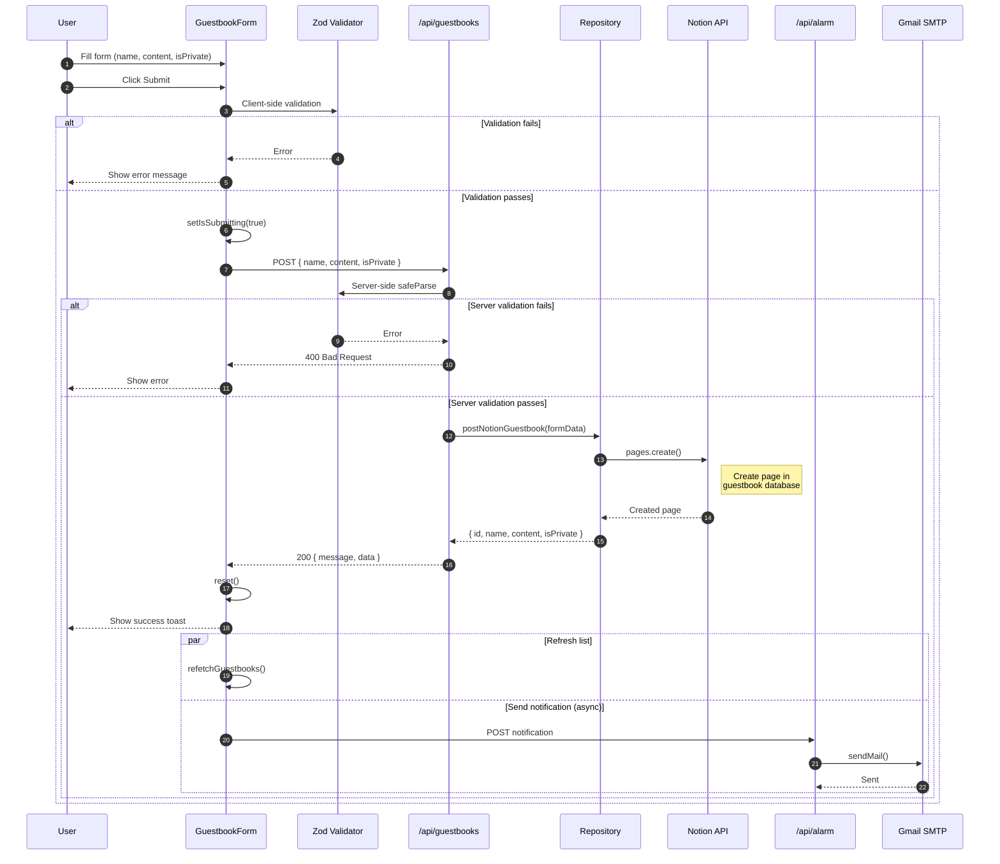
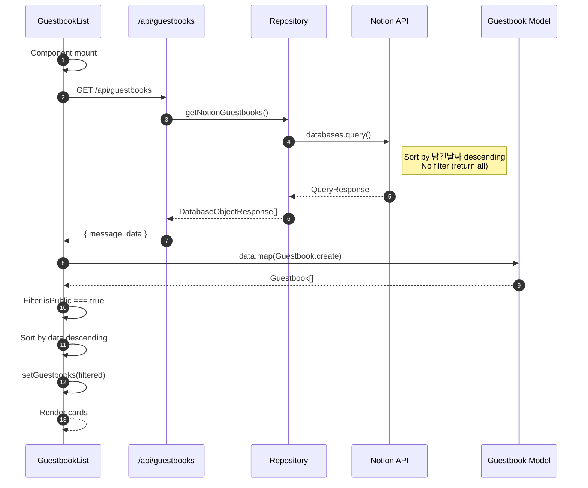
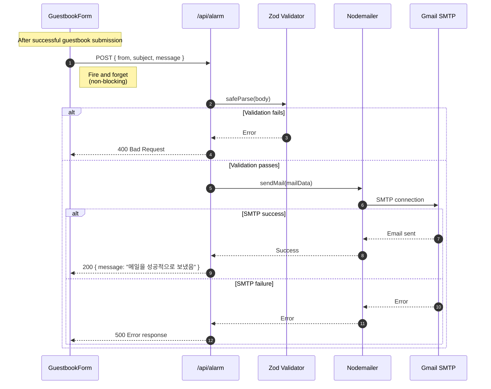
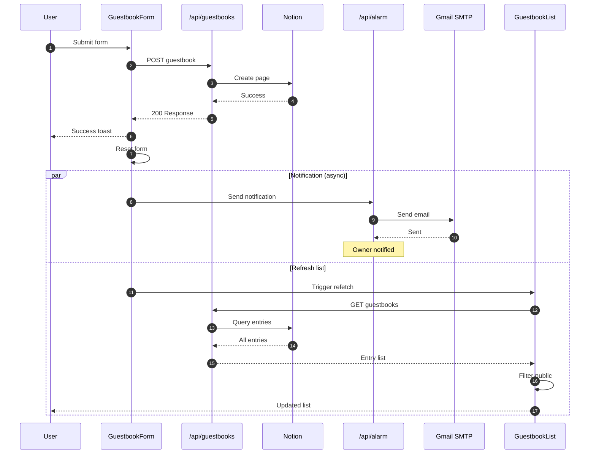
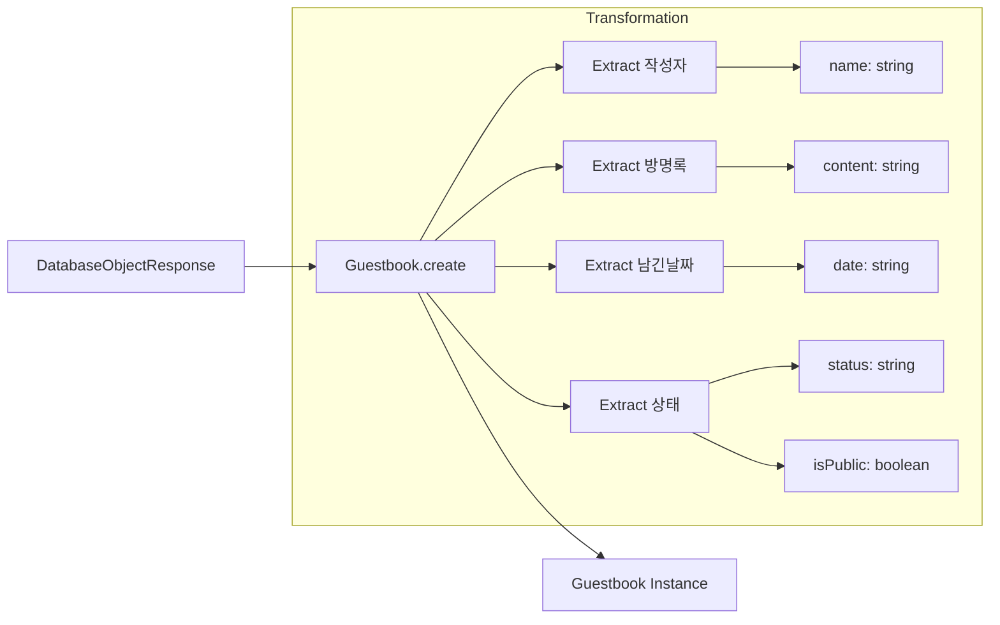

# Guestbook 도메인 시퀀스 다이어그램

이 문서는 Guestbook 도메인의 모든 백엔드 워크플로우에 대한 상세 시퀀스 다이어그램을 포함합니다.

## 1. 방명록 항목 제출

### 개요

유효성 검증과 선택적 이메일 알림을 포함한 새로운 방명록 항목을 제출합니다.

### 액터

- **Client**: 브라우저 UI (GuestbookForm)
- **API Route**: `/api/guestbooks`
- **Repository**: Notion 클라이언트 래퍼
- **Alarm API**: 이메일 알림 서비스
- **Notion**: 외부 Notion API

### 시퀀스



### 요청/응답 스키마

**요청**:
```typescript
POST /api/guestbooks
Content-Type: application/json

{
  name: string;      // 작성자 이름
  content: string;   // 메시지 내용
  isPrivate: boolean; // 공개 여부 플래그
}
```

**성공 응답** (200):
```typescript
{
  message: "게스트북을 성공적으로 생성했습니다.",
  data: {
    id: string;        // Notion 페이지 ID
    name: string;
    content: string;
    isPrivate: boolean;
  }
}
```

**유효성 검증 오류 응답** (400):
```typescript
"이름, 내용을 입력 해주세요."
```

**서버 오류 응답** (500):
```typescript
{
  message: "게스트북 생성에 실패했습니다.",
  error: Error
}
```

### Notion 페이지 생성

```typescript
// Notion에 저장되는 데이터
await notion.pages.create({
  parent: { database_id: GUESTBOOK_DATABASE_ID },
  properties: {
    작성자: {
      title: [{ text: { content: `${name} 님의 방명록` } }]
    },
    방명록: {
      rich_text: [{ text: { content: content } }]
    },
    남긴날짜: {
      date: { start: new Date().toISOString() }
    },
    상태: {
      status: { name: isPrivate ? "비공개" : "공개" }
    }
  }
});
```

---

## 2. 방명록 항목 조회

### 개요

Notion 데이터베이스에서 모든 방명록 항목을 조회합니다.

### 액터

- **Client**: 브라우저 UI (GuestbookList)
- **API Route**: `/api/guestbooks`
- **Repository**: Notion 클라이언트 래퍼
- **Notion**: 외부 Notion API

### 시퀀스



### 요청/응답 스키마

**요청**:
```typescript
GET /api/guestbooks
```

**성공 응답** (200):
```typescript
{
  message: "게스트북을 성공적으로 가져왔습니다.",
  data: DatabaseObjectResponse[]  // Raw Notion 데이터
}
```

**오류 응답** (500):
```typescript
{
  message: "게스트북 가져오기에 실패했습니다.",
  error: Error
}
```

### Notion 쿼리

```typescript
await notion.databases.query({
  database_id: GUESTBOOK_DATABASE_ID,
  sorts: [
    {
      property: "남긴날짜",
      direction: "descending"
    }
  ]
  // 필터 없음 - 모든 항목 반환
  // 클라이언트 사이드에서 공개 항목 필터링
});
```

---

## 3. 이메일 알림 플로우

### 개요

방명록 제출 후 블로그 소유자에게 이메일 알림을 전송합니다.

### 액터

- **Client**: GuestbookForm (성공적인 제출 후)
- **Alarm API**: `/api/alarm`
- **Nodemailer**: 이메일 라이브러리
- **SMTP**: Gmail SMTP 서버

### 시퀀스



### 알림 페이로드

```typescript
// 제출 후 GuestbookForm에서 전송
{
  from: "guestbook@blog.com",
  subject: `새로운 방명록: ${formData.name}`,
  message: `
    이름: ${formData.name}
    내용: ${formData.content}
    공개여부: ${formData.isPrivate ? "비공개" : "공개"}
  `
}
```

---

## 4. 전체 제출 워크플로우

### 개요

사용자 제출부터 알림까지의 엔드투엔드 플로우입니다.

### 시퀀스



---

## 오류 처리 매트릭스

| 플로우 | 오류 유형 | HTTP 상태 | 복구 방법 |
|--------|----------|-----------|----------|
| 제출 | 유효성 검증 실패 | 400 | 필드 오류 표시 |
| 제출 | Notion API 오류 | 500 | 제출 재시도 |
| 조회 | Notion API 오류 | 500 | 재시도 버튼 |
| 알림 | 이메일 실패 | 500 | 오류 로깅 (논블로킹) |

---

## 데이터 변환

### Notion 응답에서 도메인 모델로



### 속성 추출

```typescript
// Guestbook.create() 내부
if (isGuestbookDatabaseResponse(data)) {
  const id = data.id;
  const name = data.properties.작성자.title[0].plain_text;
  const content = data.properties.방명록.rich_text[0].plain_text;
  const date = data.properties.남긴날짜.date.start.split("T")[0];
  const status = data.properties.상태.status.name;

  return new Guestbook({ id, name, content, date, status });
}
```
