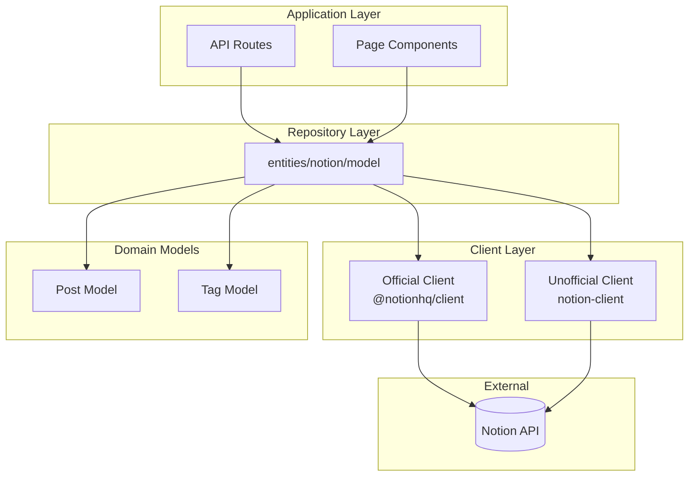
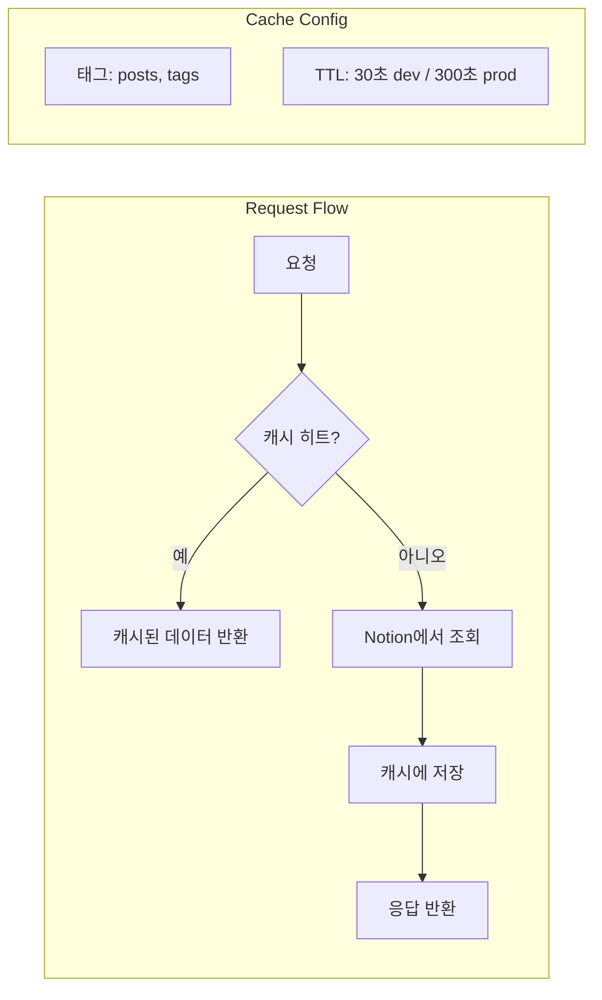
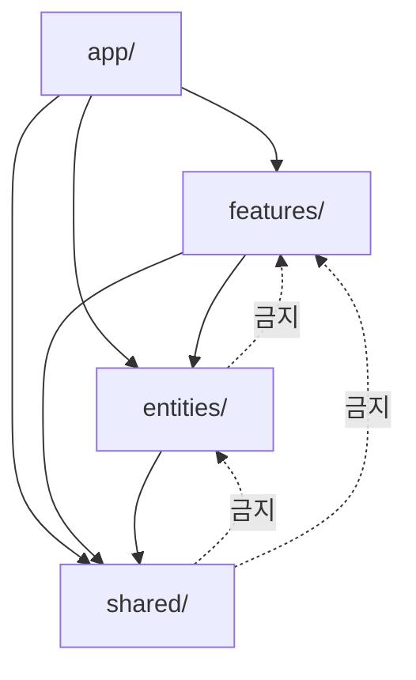
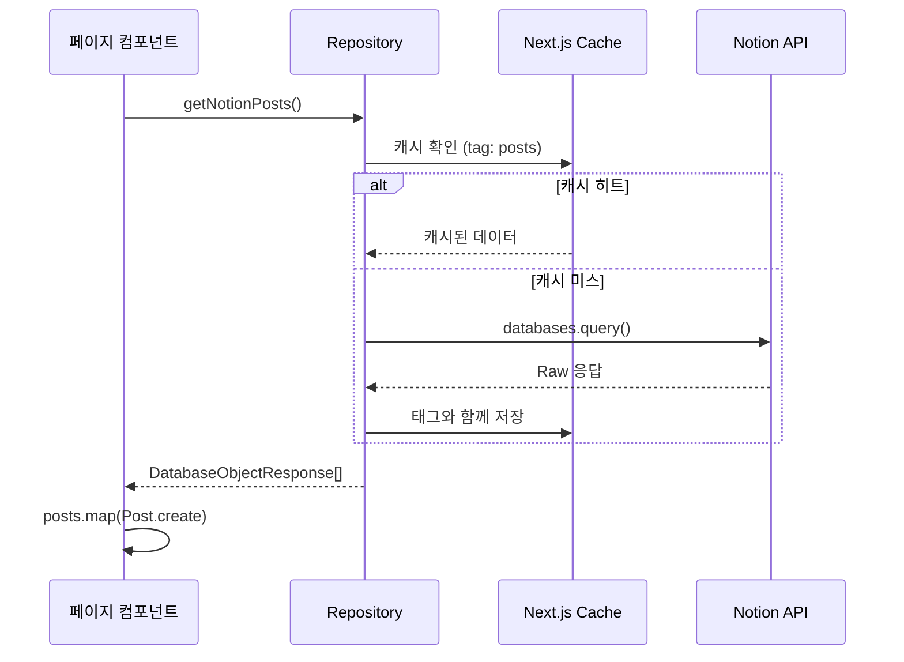
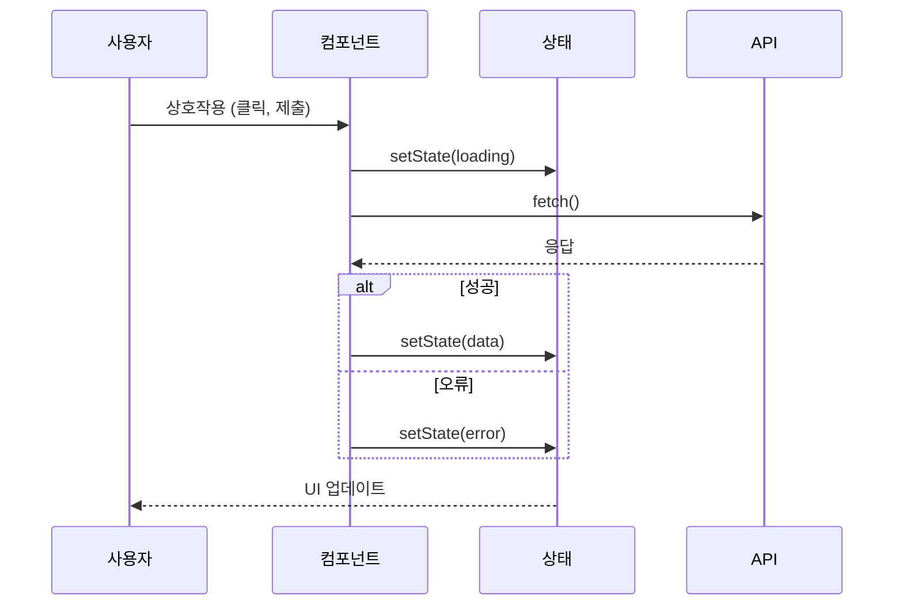

# Posts 도메인 컴포넌트 설계

이 문서는 Posts 도메인에서 사용되는 컴포넌트 아키텍처, Repository 패턴 구현, 설계 패턴을 설명합니다.

## Repository 패턴: Notion 클라이언트 추상화

### 개요

프로젝트는 Notion API 상호작용을 추상화하기 위해 **Repository 패턴**을 사용합니다. 이를 통해:
- 비즈니스 로직에 영향 없이 Notion 클라이언트 교체 가능
- 중앙화된 캐싱 전략
- 통합된 오류 처리
- 타입 안전한 데이터 접근

### 아키텍처 다이어그램



### 듀얼 클라이언트 전략

| 클라이언트 | 라이브러리 | 용도 | 토큰 |
|-----------|-----------|------|------|
| Official | `@notionhq/client` | 데이터베이스 쿼리, 속성 업데이트 | `NOTION_KEY` |
| Unofficial | `notion-client` | 리치 페이지 콘텐츠 렌더링 | `NOTION_TOKEN_V2` |

**왜 두 개의 클라이언트인가?**
- 공식 API는 복잡한 콘텐츠 렌더링 지원 부족
- 비공식 클라이언트가 `react-notion-x`와 함께 더 나은 UI 렌더링 제공
- 전체 기능을 위해 둘 다 필요

### Repository 함수

```typescript
// src/entities/notion/model/index.ts

// Posts - 읽기 작업
export const getNotionPosts = nextServerCache(_getNotionPosts, ["posts"]);
export const getNotionPostMetadata = _getNotionPostMetadata;
export const getNotionPostContentForSummary = _getNotionPostContentForSummary;
export const getNotionPostDatabaseTags = nextServerCache(
  _getNotionPostDatabaseTags,
  ["tags"]
);
export const getNotionPage = _getNotionPage;
export const getSlugMap = _getSlugMap;

// Posts - 쓰기 작업
export const patchNotionPostSummary = _patchNotionPostSummary;
```

### 캐싱 레이어



**캐시 래퍼 함수**:
```typescript
// src/shared/lib/cache.ts
export function nextServerCache<T>(
  fn: () => Promise<T>,
  tags: string[]
): () => Promise<T> {
  return unstable_cache(fn, tags, {
    revalidate: CACHE_CONFIG.ISR_REVALIDATE_TIME,
    tags,
  });
}
```

### 캐시 무효화

쓰기 작업 후 영향받는 캐시 무효화:

```typescript
// 성공적인 업데이트 후 API 라우트에서
revalidateTag("posts");     // 모든 포스트 쿼리 무효화
revalidatePath("/posts");   // 포스트 목록 페이지 무효화
revalidatePath("/");        // 홈 페이지 무효화
```

---

## 도메인 모델 패턴

### Protected Constructor 패턴

도메인 엔티티는 다음을 보장하기 위해 protected 생성자를 사용합니다:
- 모든 인스턴스가 적절히 검증됨
- 중앙화된 데이터 변환 로직
- 불변 도메인 객체
- 생성 시점의 타입 안전성

### Post 모델

```typescript
// src/entities/posts/model/index.ts

export class Post implements IPost {
  public id;
  public title;
  public slugifiedTitle;
  public tags;
  public cover;
  public icon;
  public publishTime;
  public lastEditedTime;
  public aiSummary;

  protected constructor(post: IPost) {
    this.id = post.id;
    this.title = post.title;
    this.slugifiedTitle = post.slugifiedTitle;
    this.tags = post.tags.map(Tag.create);
    this.cover = post.cover;
    this.icon = post.icon;
    this.publishTime = post.publishTime;
    this.lastEditedTime = post.lastEditedTime;
    this.aiSummary = post.aiSummary;
  }

  public static create(data: unknown): Post {
    if (data instanceof Post) return data;
    if (isIPost(data)) return new Post(data);
    if (isPostDatabaseResponse(data)) {
      // Notion 응답을 도메인 모델로 변환
      return new Post({
        id: data.id,
        title: data.properties.제목.title[0].plain_text,
        slugifiedTitle: slug(title),
        tags: data.properties.Tags.multi_select,
        cover: data.cover?.external?.url ?? "",
        icon: data.icon?.external?.url ?? "/mascot.png",
        publishTime: data.properties.날짜.date.start,
        lastEditedTime: data.last_edited_time,
        aiSummary: data.properties.summary?.rich_text[0]?.plain_text ?? "",
      });
    }
    throw Error("Post 객체 생성 오류");
  }

  get aiSummarized(): boolean {
    return this.aiSummary !== "";
  }
}
```

### Tag 모델

```typescript
export class Tag implements ITag {
  public id;
  public name;
  public color;
  public description;

  protected constructor(tag: ITag) {
    this.id = tag.id;
    this.name = tag.name;
    this.color = tag.color;
    this.description = tag.description;
  }

  public static create(data: unknown): Tag {
    if (data instanceof Tag) return data;
    if (isITag(data)) return new Tag(data);
    if (isTagDatabaseResponse(data)) return new Tag(data);
    throw Error("Tag 객체 생성 오류");
  }
}
```

### 타입 가드

```typescript
export function isIPost(obj: unknown): obj is IPost {
  if (typeof obj !== "object" || obj === null) return false;
  const o = obj as IPost;
  return (
    typeof o.id === "string" &&
    typeof o.title === "string" &&
    Array.isArray(o.tags) &&
    o.tags.every(isITag) &&
    typeof o.cover === "string" &&
    typeof o.icon === "string" &&
    typeof o.publishTime === "string"
  );
}

export function isPostDatabaseResponse(
  obj: unknown
): obj is PostDatabaseResponse {
  // Notion API 응답 구조 검증
  // 한글 속성명 확인 (제목, 날짜, 상태)
}
```

---

## 컴포넌트 계층 구조

### Feature-Sliced Design 레이어

```
src/
├── app/                    # 라우트 & API
│   ├── posts/
│   │   ├── page.tsx       # 포스트 목록 페이지
│   │   └── [slug]/
│   │       └── page.tsx   # 포스트 상세 페이지
│   └── api/
│       └── posts/
│           └── [postId]/
│               └── summary/
│                   └── route.ts
│
├── features/posts/         # 사용자 대면 기능
│   ├── api/
│   │   └── index.ts       # 기능 API 함수
│   └── ui/
│       ├── ai-summary-button.tsx
│       ├── featured-post.tsx
│       ├── filterable-post.tsx
│       ├── post-navigator.tsx
│       └── posts-grid.tsx
│
├── entities/posts/         # 도메인 모델 & UI
│   ├── model/
│   │   ├── index.ts       # Post, Tag 클래스
│   │   └── type.d.ts      # 타입 정의
│   ├── ui/
│   │   ├── post-card.tsx
│   │   ├── small-post-card.tsx
│   │   ├── ai-summary-card.tsx
│   │   ├── empty-posts.tsx
│   │   └── client-notion-renderer.tsx
│   └── utils/
│       └── index.ts       # 유틸리티 함수
│
└── shared/                 # 횡단 관심사
    ├── lib/
    │   └── cache.ts       # 캐싱 유틸리티
    └── config/
        └── index.ts       # 설정
```

### Import 규칙 (FSD)



---

## 주요 컴포넌트

### AISummaryButton

**목적**: 요약이 없는 포스트에 대해 AI 요약 생성 트리거

**Props**:
```typescript
interface AISummaryButtonProps {
  postId: string;
  initialSummary?: string;
}
```

**State**:
```typescript
const [isGenerating, setIsGenerating] = useState(false);
const [summary, setSummary] = useState<string | null>(initialSummary ?? null);
const [error, setError] = useState<string | null>(null);
```

**렌더링 로직**:
```typescript
if (summary) {
  return <AISummaryCard summary={summary} />;
}
return (
  <Button onClick={handleGenerate} disabled={isGenerating}>
    {isGenerating ? <Spinner /> : "AI 요약 생성"}
  </Button>
);
```

### FilterablePosts

**목적**: 클라이언트 사이드 필터링과 함께 태그 필터 및 포스트 그리드 컨테이너

**Props**:
```typescript
interface FilterablePostsProps {
  dataList: DatabaseObjectResponse[];
  tagDataList: TagDatabaseResponse[];
}
```

**State**:
```typescript
const [selectedTags, setSelectedTags] = useState<Set<string>>(new Set());
```

**필터 로직**:
```typescript
const filteredPosts = useMemo(() => {
  const posts = dataList.map(Post.create);
  if (selectedTags.size === 0) return posts;
  return posts.filter(post =>
    post.tags.some(tag => selectedTags.has(tag.id))
  );
}, [dataList, selectedTags]);
```

### ClientNotionRenderer

**목적**: react-notion-x를 사용하여 Notion 페이지 콘텐츠 렌더링

**Props**:
```typescript
interface ClientNotionRendererProps {
  recordMap: ExtendedRecordMap;
}
```

**기능**:
- 코드 블록 구문 강조
- 이미지 최적화
- 다크 모드 지원
- 수식 렌더링 (KaTeX)
- 목차

### PostNavigator

**목적**: 이전/다음 및 관련 포스트 링크 표시

**Props**:
```typescript
interface PostNavigatorProps {
  id: string; // 현재 포스트 ID
}
```

**데이터 조회**:
```typescript
// 서버 컴포넌트
const posts = await getNotionPosts();
const sortedPosts = posts.map(Post.create).sort(byDate);
const currentIndex = sortedPosts.findIndex(p => p.id === id);
```

---

## 데이터 흐름 패턴

### 서버 사이드 데이터 조회



### 클라이언트 사이드 상태 업데이트



---

## 오류 바운더리 전략

```typescript
// 클라이언트 컴포넌트를 오류 바운더리로 감싸기
<ErrorBoundary fallback={<PostErrorFallback />}>
  <ClientNotionRenderer recordMap={recordMap} />
</ErrorBoundary>
```

**오류 상태**:
| 컴포넌트 | 오류 폴백 |
|---------|----------|
| FilterablePosts | 필터 없이 모든 포스트 표시 |
| ClientNotionRenderer | "콘텐츠 로드 실패" 메시지 |
| AISummaryButton | 재시도 버튼과 함께 오류 메시지 |
| PostNavigator | 네비게이션 섹션 숨김 |

---

## 성능 최적화

### 코드 스플리팅

```typescript
// 무거운 컴포넌트를 위한 동적 임포트
const ClientNotionRenderer = dynamic(
  () => import("@/entities/posts/ui/client-notion-renderer"),
  { loading: () => <PostSkeleton /> }
);
```

### 이미지 최적화

```typescript
// Next.js Image 컴포넌트 사용
<Image
  src={post.cover}
  alt={post.title}
  width={800}
  height={400}
  loading="lazy"
/>
```

### 메모이제이션

```typescript
// 필터링된 포스트 메모이제이션
const filteredPosts = useMemo(() => {
  return posts.filter(/* ... */);
}, [posts, selectedTags]);

// 비용이 큰 계산 메모이제이션
const relatedPosts = useMemo(() => {
  return calculateRelatedPosts(currentPost, allPosts);
}, [currentPost.id, allPosts]);
```
