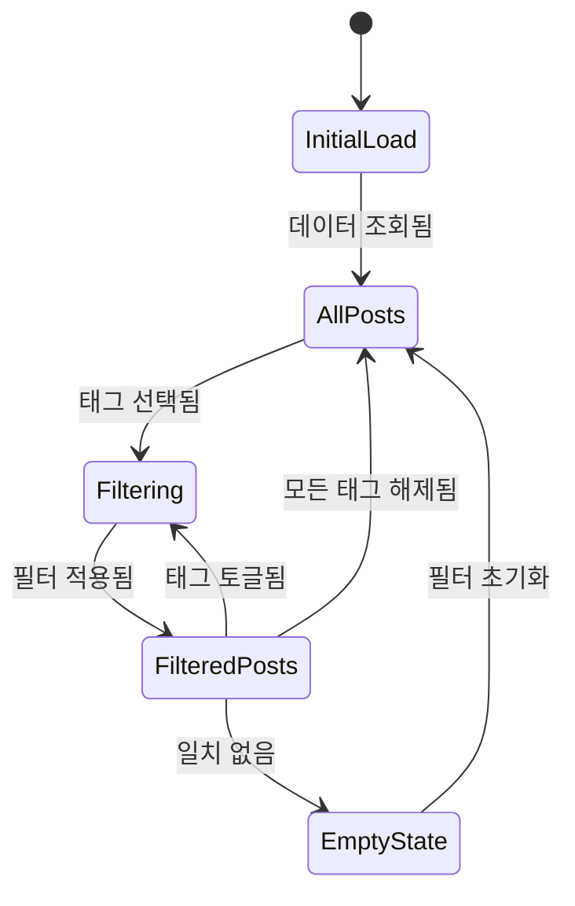
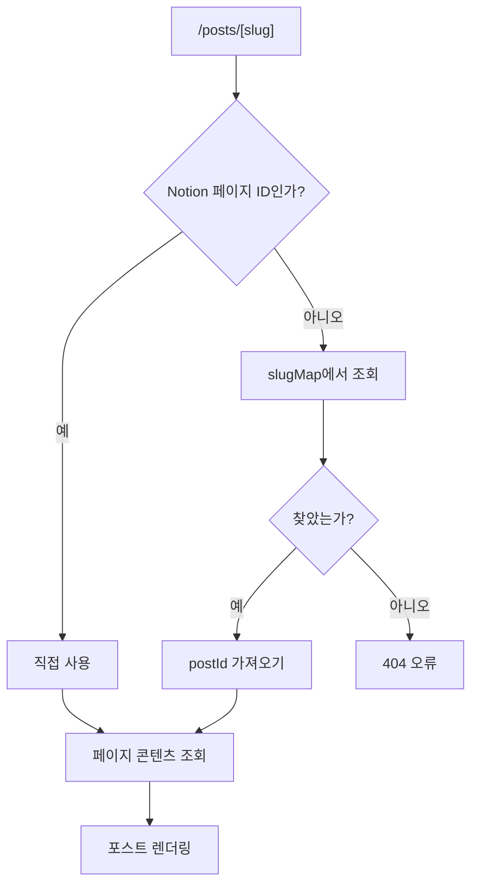
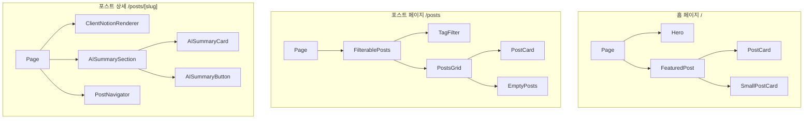
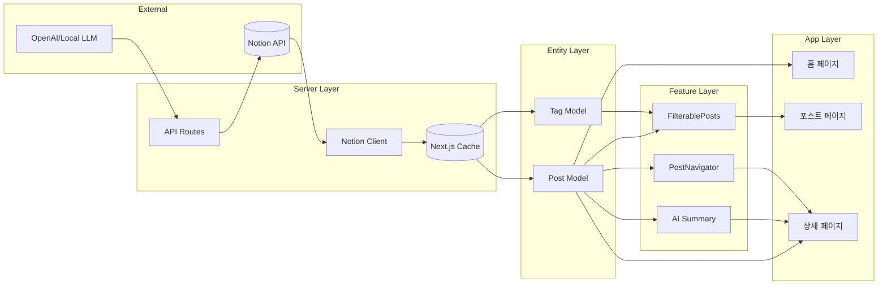

# Posts 도메인 정보 아키텍처

이 문서는 Posts 도메인과 관련된 모든 페이지의 화면 구조, 레이아웃, 컴포넌트, 데이터 흐름을 설명합니다.

## 화면 인벤토리

### 1. 홈 페이지 (포스트 섹션)

**경로**: `/`
**목적**: 추천 포스트를 표시하여 방문자 참여 유도

#### 레이아웃 구조

```
+--------------------------------------------------+
|                    Header                         |
+--------------------------------------------------+
|                                                  |
|                 Hero Section                     |
|              (프로필/소개)                        |
|                                                  |
+--------------------------------------------------+
|                                                  |
|              Featured Posts Grid                 |
|                                                  |
|  +------------+  +------------+  +------------+  |
|  | Post Card  |  | Post Card  |  | Post Card  |  |
|  +------------+  +------------+  +------------+  |
|  +------------+  +------------+  +------------+  |
|  | Post Card  |  | Post Card  |  | Post Card  |  |
|  +------------+  +------------+  +------------+  |
|                                                  |
+--------------------------------------------------+
|                    Footer                         |
+--------------------------------------------------+
```

#### 컴포넌트

| 컴포넌트 | 타입 | 소스 |
|---------|------|------|
| Header | Server | `src/widgets/ui/header.tsx` |
| Hero | Server | `src/features/profile/ui/hero.tsx` |
| FeaturedPost | Server | `src/features/posts/ui/featured-post.tsx` |
| PostCard | Server | `src/entities/posts/ui/post-card.tsx` |
| SmallPostCard | Server | `src/entities/posts/ui/small-post-card.tsx` |
| Footer | Server | `src/widgets/ui/footer.tsx` |

#### 데이터 요구사항

**서버 사이드**:
- `getNotionPosts()` - 모든 발행 포스트 조회
- `Post.create()`로 도메인 모델 매핑

**클라이언트 사이드**:
- 없음 (정적 렌더링)

#### SEO 메타데이터

| 속성 | 값 |
|-----|-----|
| title | `Meti's Blog` |
| description | 블로그 소개 |
| og:image | 기본 블로그 이미지 |

---

### 2. 포스트 목록 페이지

**경로**: `/posts`
**목적**: 태그 기반 필터링으로 모든 포스트 탐색

#### 레이아웃 구조

```
+--------------------------------------------------+
|                    Header                         |
+--------------------------------------------------+
|                                                  |
|  +--------------------------------------------+  |
|  |             Tag Filter Section              |  |
|  |  [React] [TypeScript] [CSS] [Node.js] ...  |  |
|  +--------------------------------------------+  |
|                                                  |
|  +--------------------------------------------+  |
|  |              Posts Grid                     |  |
|  |                                            |  |
|  |  +----------+  +----------+  +----------+  |  |
|  |  |Post Card |  |Post Card |  |Post Card |  |  |
|  |  +----------+  +----------+  +----------+  |  |
|  |  +----------+  +----------+  +----------+  |  |
|  |  |Post Card |  |Post Card |  |Post Card |  |  |
|  |  +----------+  +----------+  +----------+  |  |
|  |                                            |  |
|  +--------------------------------------------+  |
|                                                  |
+--------------------------------------------------+
|                    Footer                         |
+--------------------------------------------------+
```

#### 컴포넌트

| 컴포넌트 | 타입 | 소스 |
|---------|------|------|
| Header | Server | `src/widgets/ui/header.tsx` |
| FilterablePosts | Client | `src/features/posts/ui/filterable-post.tsx` |
| TagFilter | Client | `src/features/tags/ui/tag-filter.tsx` |
| PostsGrid | Client | `src/features/posts/ui/posts-grid.tsx` |
| PostCard | Server | `src/entities/posts/ui/post-card.tsx` |
| EmptyPosts | Client | `src/entities/posts/ui/empty-posts.tsx` |
| Footer | Server | `src/widgets/ui/footer.tsx` |

#### 데이터 요구사항

**서버 사이드**:
- `getNotionPosts()` - 모든 발행 포스트 조회
- `getNotionPostDatabaseTags()` - 사용 가능한 태그 옵션 조회

**클라이언트 사이드**:
- `selectedTags: Set<string>` - 현재 선택된 태그 ID
- `filteredPosts: Post[]` - 필터 조건에 맞는 포스트
- 공유 가능한 링크를 위한 URL 쿼리 파라미터 동기화

#### 상태 흐름



#### SEO 메타데이터

| 속성 | 값 |
|-----|-----|
| title | `posts` |
| description | `메티의 포스트` |
| og:type | `website` |

---

### 3. 포스트 상세 페이지

**경로**: `/posts/[slug]`
**목적**: AI 요약 및 네비게이션과 함께 전체 포스트 콘텐츠 표시

#### 레이아웃 구조

```
+--------------------------------------------------+
|                    Header                         |
+--------------------------------------------------+
|                                                  |
|  +--------------------------------------------+  |
|  |              Post Header                    |  |
|  |  제목: "Next.js로 블로그 만들기"              |  |
|  |  날짜: 2024-01-15                          |  |
|  |  태그: [React] [Next.js] [TypeScript]      |  |
|  +--------------------------------------------+  |
|                                                  |
|  +--------------------------------------------+  |
|  |           AI Summary Section                |  |
|  |  +--------------------------------------+  |  |
|  |  | AI Summary Card                      |  |  |
|  |  | "이 포스트는 ...를 설명합니다..."      |  |  |
|  |  +--------------------------------------+  |  |
|  |            OR                              |  |
|  |  +--------------------------------------+  |  |
|  |  | [AI 요약 생성] 버튼                    |  |  |
|  |  +--------------------------------------+  |  |
|  +--------------------------------------------+  |
|                                                  |
|  +--------------------------------------------+  |
|  |            Post Content                     |  |
|  |  (Notion Rich Text Rendering)              |  |
|  |                                            |  |
|  |  ## 소개                                   |  |
|  |  Lorem ipsum dolor sit amet...            |  |
|  |                                            |  |
|  |  ```typescript                             |  |
|  |  const example = "code block";             |  |
|  |  ```                                       |  |
|  |                                            |  |
|  |                               |  |
|  |                                            |  |
|  +--------------------------------------------+  |
|                                                  |
|  +--------------------------------------------+  |
|  |           Post Navigator                    |  |
|  |  <- 이전 포스트    |    다음 포스트 ->      |  |
|  |  +------------------+  +------------------+ |  |
|  |  | 관련 포스트 1     |  | 관련 포스트 2    | |  |
|  |  +------------------+  +------------------+ |  |
|  +--------------------------------------------+  |
|                                                  |
+--------------------------------------------------+
|                    Footer                         |
+--------------------------------------------------+
```

#### 컴포넌트

| 컴포넌트 | 타입 | 소스 |
|---------|------|------|
| Header | Server | `src/widgets/ui/header.tsx` |
| ClientNotionRenderer | Client | `src/entities/posts/ui/client-notion-renderer.tsx` |
| AISummaryCard | Client | `src/entities/posts/ui/ai-summary-card.tsx` |
| AISummaryButton | Client | `src/features/posts/ui/ai-summary-button.tsx` |
| PostNavigator | Server | `src/features/posts/ui/post-navigator.tsx` |
| Footer | Server | `src/widgets/ui/footer.tsx` |

#### 데이터 요구사항

**서버 사이드**:
- `getSlugMap()` - URL slug를 Notion 페이지 ID로 매핑
- `getNotionPage(postId)` - 비공식 클라이언트로 페이지 콘텐츠 조회
- `getNotionPostMetadata(postId)` - 제목, 설명, 태그 조회
- `getNotionPosts()` - 네비게이션용 (이전/다음/관련)

**클라이언트 사이드**:
- `recordMap: ExtendedRecordMap` - 렌더러용 Notion 페이지 데이터
- `summary: string` - AI 요약 텍스트
- `isGenerating: boolean` - 요약 생성 로딩 상태

#### URL 라우팅



#### SEO 메타데이터

| 속성 | 소스 |
|-----|------|
| title | Notion의 포스트 제목 |
| description | 첫 단락 발췌 (77자) |
| keywords | 포스트 태그 |
| canonical | `/posts/[slugified-title]` |
| og:type | `article` |

---

## 컴포넌트 계층 구조



---

## 데이터 흐름 아키텍처



---

## 반응형 브레이크포인트

| 브레이크포인트 | 너비 | 포스트 그리드 컬럼 |
|--------------|------|------------------|
| Mobile | < 640px | 1 |
| Tablet | 640px - 1024px | 2 |
| Desktop | > 1024px | 3 |

---

## 네비게이션 구조

```
/                     # 홈 (추천 포스트)
├── /posts           # 전체 포스트 (필터링 가능)
│   └── /posts/[slug]  # 포스트 상세
├── /about           # 소개 페이지
└── /guestbooks      # 방명록
```

---

## 페이지별 캐싱 전략

| 페이지 | 재검증 | 캐시 태그 |
|-------|--------|----------|
| `/` | 300초 (운영) | `posts` |
| `/posts` | 180초 | `posts`, `tags` |
| `/posts/[slug]` | ISR 설정 | - |

---

## 오류 상태

### 404 Not Found
- **트리거**: 잘못된 slug 또는 삭제된 포스트
- **표시**: 포스트 목록 링크가 있는 커스텀 404 페이지

### 로딩 상태
- **포스트 그리드**: 스켈레톤 카드
- **포스트 상세**: 전체 페이지 스켈레톤
- **AI 요약**: 버튼 스피너, 이후 카드

### 빈 상태
- **포스트 없음**: "발행된 포스트가 없습니다"
- **필터 일치 없음**: "선택한 태그와 일치하는 포스트가 없습니다" + 초기화 버튼
