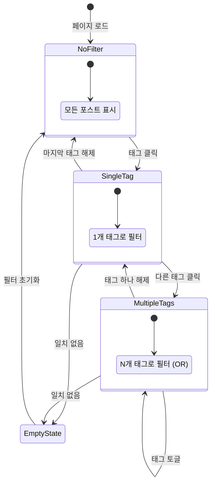
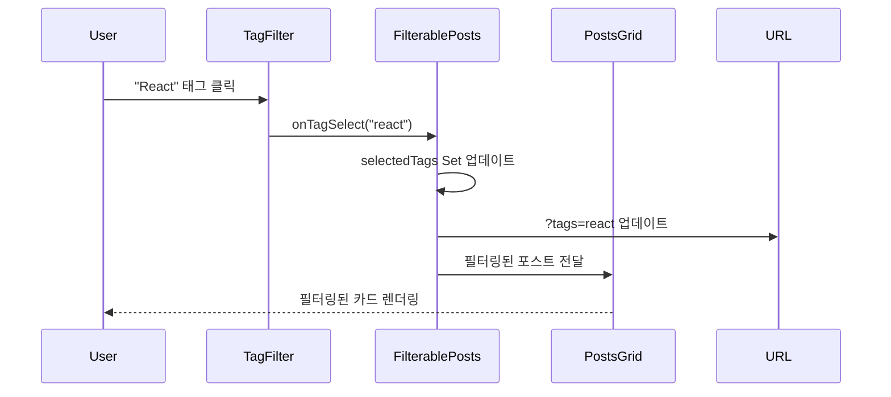
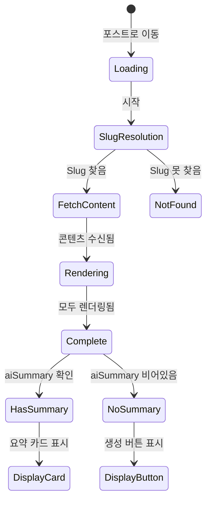
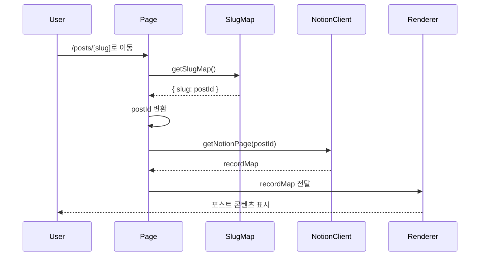
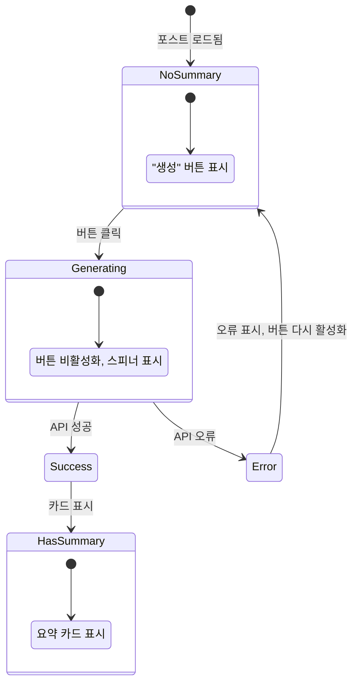
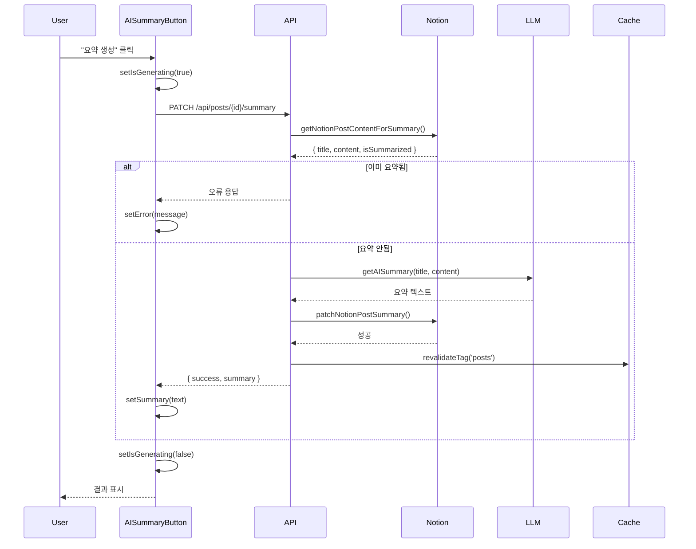
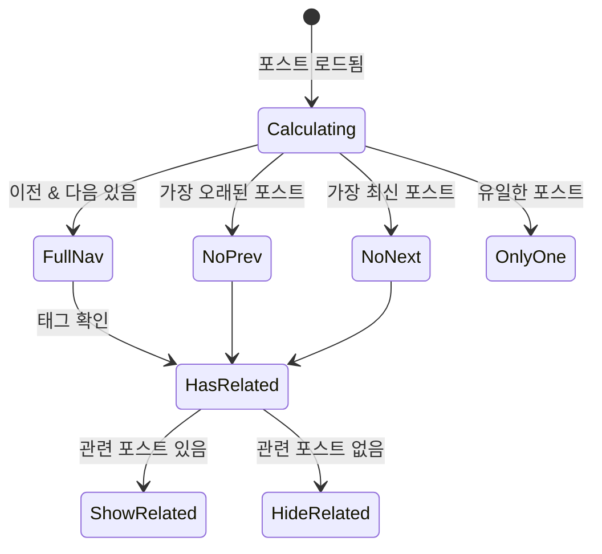
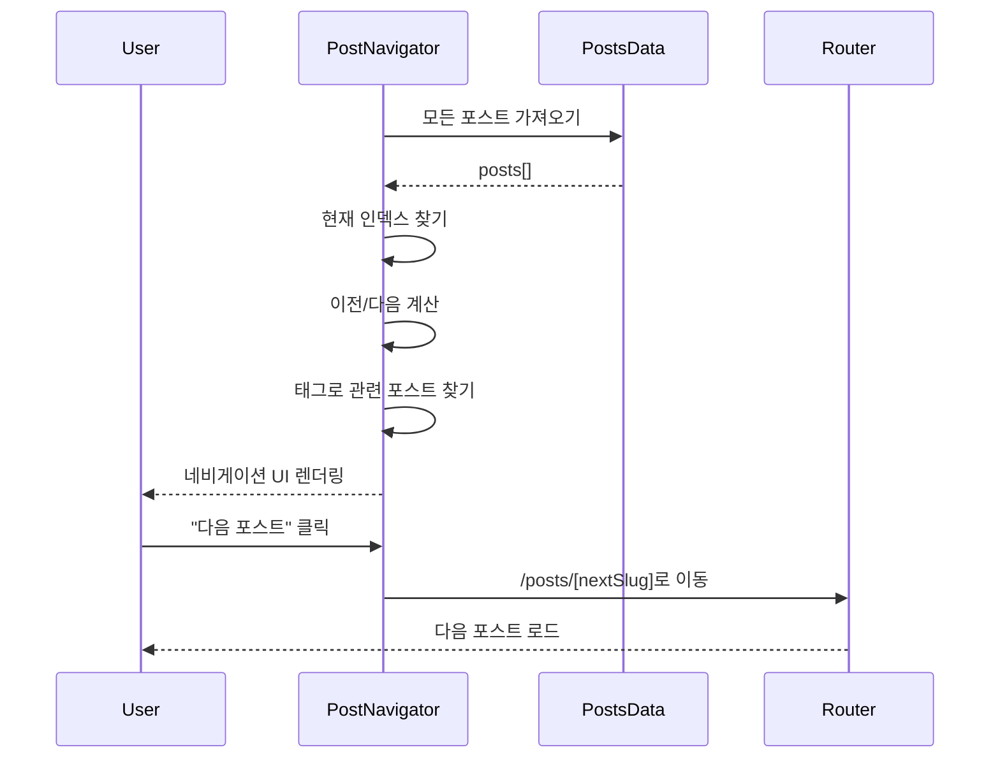

# Posts 도메인 유즈케이스 (프론트엔드)

이 문서는 Posts 도메인의 프론트엔드 유즈케이스를 설명합니다. 사용자 상호작용, UI 상태 관리, 컴포넌트 동작을 포함합니다.

## UC-F-001: 태그로 포스트 필터링

### 개요

| 속성 | 값 |
|-----|-----|
| 주요 액터 | 방문자 |
| 트리거 | 사용자가 필터 섹션에서 태그 클릭 |
| 전제조건 | 포스트 목록 페이지가 모든 포스트와 함께 로드됨 |
| 사후조건 | 선택된 태그와 일치하는 포스트만 표시됨 |

### 메인 플로우

1. **사용자**가 `/posts`에서 포스트 목록 페이지 조회
2. **시스템**이 모든 발행 포스트와 사용 가능한 태그 표시
3. **사용자**가 태그 클릭 (예: "React")
4. **시스템**이 선택된 태그를 시각적으로 강조
5. **시스템**이 선택된 태그를 포함하는 포스트만 표시하도록 필터링
6. **시스템**이 URL 쿼리 파라미터 업데이트 (`?tags=react`)
7. **사용자**가 필터링된 포스트 그리드 확인

### 대안 플로우

**AF-1: 추가 태그 선택**
1. 3단계에서 사용자가 다른 태그 클릭 (예: "TypeScript")
2. 시스템이 OR 필터 적용 (React OR TypeScript가 있는 포스트)
3. URL이 `?tags=react,typescript`로 업데이트

**AF-2: 필터에서 태그 제거**
1. 7단계에서 사용자가 이미 선택된 태그 클릭
2. 시스템이 태그 선택 해제하고 필터 업데이트
3. 선택된 태그가 없으면 모든 포스트 표시

**AF-3: 일치하는 포스트 없음**
1. 5단계에서 필터와 일치하는 포스트가 없으면
2. 시스템이 "포스트를 찾을 수 없습니다"와 함께 EmptyPosts 컴포넌트 표시
3. 시스템이 "필터 초기화" 액션 표시

### UI 상태 다이어그램



### 컴포넌트 상호작용



### 상태 관리

```typescript
// FilterablePosts 컴포넌트 내부
const [selectedTags, setSelectedTags] = useState<Set<string>>(new Set());

const filteredPosts = useMemo(() => {
  if (selectedTags.size === 0) return posts;
  return posts.filter(post =>
    post.tags.some(tag => selectedTags.has(tag.id))
  );
}, [posts, selectedTags]);
```

---

## UC-F-002: 포스트 상세 보기

### 개요

| 속성 | 값 |
|-----|-----|
| 주요 액터 | 방문자 |
| 트리거 | 사용자가 포스트 카드 클릭 |
| 전제조건 | 포스트 카드가 표시됨 (홈 페이지 또는 포스트 목록) |
| 사후조건 | 전체 포스트 콘텐츠가 표시됨 |

### 메인 플로우

1. **사용자**가 포스트 카드 클릭
2. **시스템**이 `/posts/[slug]`로 이동
3. **시스템**이 slug를 Notion 페이지 ID로 변환
4. **시스템**이 비공식 Notion 클라이언트로 페이지 콘텐츠 조회
5. **시스템**이 포스트 헤더 렌더링 (제목, 날짜, 태그)
6. **시스템**이 AI 요약 카드 렌더링 (요약 있는 경우)
7. **시스템**이 react-notion-x로 전체 Notion 콘텐츠 렌더링
8. **시스템**이 이전/다음/관련 포스트와 함께 포스트 네비게이터 렌더링
9. **사용자**가 완전한 포스트 조회

### 대안 플로우

**AF-1: 직접 URL 접근**
1. 사용자가 `/posts/[slug]`로 직접 이동
2. 3단계부터 계속

**AF-2: 잘못된 Slug**
1. 3단계에서 slug가 slug 맵에 없음
2. 시스템이 404 오류 페이지 표시
3. 사용자가 포스트 목록으로 이동 가능

**AF-3: AI 요약 없음**
1. 6단계에서 포스트에 AI 요약이 없음
2. 시스템이 대신 "AI 요약 생성" 버튼 표시
3. 생성 플로우는 UC-F-003 참조

### UI 상태 다이어그램



### 컴포넌트 상호작용



---

## UC-F-003: AI 요약 생성

### 개요

| 속성 | 값 |
|-----|-----|
| 주요 액터 | 방문자 |
| 트리거 | 사용자가 "AI 요약 생성" 버튼 클릭 |
| 전제조건 | 포스트 상세 페이지 로드됨, 기존 요약 없음 |
| 사후조건 | AI 요약이 생성되어 표시됨 |

### 메인 플로우

1. **사용자**가 기존 AI 요약 없는 포스트 조회
2. **시스템**이 "AI 요약 생성" 버튼 표시
3. **사용자**가 버튼 클릭
4. **시스템**이 버튼 비활성화, 로딩 스피너 표시
5. **시스템**이 `/api/posts/[postId]/summary`로 PATCH 요청 전송
6. **API**가 Notion에서 포스트 콘텐츠 추출
7. **API**가 LLM (OpenAI/로컬)으로 요약 생성
8. **API**가 Notion "summary" 속성에 요약 저장
9. **API**가 캐시 태그 무효화
10. **API**가 요약과 함께 성공 응답 반환
11. **시스템**이 버튼을 AI 요약 카드로 교체
12. **사용자**가 생성된 요약 읽음

### 대안 플로우

**AF-1: 생성 타임아웃**
1. 7단계에서 LLM 요청 타임아웃 (>30초)
2. API가 오류 응답 반환
3. 시스템이 재시도 옵션과 함께 오류 메시지 표시
4. 버튼이 활성화 상태로 복귀

**AF-2: 이미 요약됨 (경쟁 조건)**
1. 6단계에서 API가 기존 요약 발견
2. API가 오류 반환: "이미 요약이 생성된 포스트입니다"
3. 시스템이 오류 메시지 표시
4. 사용자가 새로고침하여 기존 요약 확인

**AF-3: API 요청 제한**
1. 5단계에서 API가 요청 제한 오류 반환
2. 시스템이 "잠시 후 다시 시도해주세요" 표시
3. 쿨다운 후 버튼 다시 활성화

### UI 상태 다이어그램



### 컴포넌트 상호작용



### 상태 관리

```typescript
// AISummaryButton 컴포넌트 내부
const [isGenerating, setIsGenerating] = useState(false);
const [summary, setSummary] = useState<string | null>(null);
const [error, setError] = useState<string | null>(null);

const handleGenerate = async () => {
  setIsGenerating(true);
  setError(null);

  try {
    const response = await fetch(`/api/posts/${postId}/summary`, {
      method: 'PATCH',
    });
    const result = await response.json();

    if (result.success) {
      setSummary(result.summary);
    } else {
      setError(result.error);
    }
  } catch (err) {
    setError('요약 생성에 실패했습니다');
  } finally {
    setIsGenerating(false);
  }
};
```

---

## UC-F-004: 포스트 간 이동

### 개요

| 속성 | 값 |
|-----|-----|
| 주요 액터 | 방문자 |
| 트리거 | 사용자가 이전/다음 또는 관련 포스트 링크 클릭 |
| 전제조건 | 네비게이션 섹션이 표시된 포스트 상세 페이지 로드됨 |
| 사후조건 | 사용자가 선택한 포스트로 이동됨 |

### 메인 플로우

1. **사용자**가 포스트 콘텐츠 하단으로 스크롤
2. **시스템**이 다음과 함께 PostNavigator 표시:
   - 이전 포스트 링크 (시간순으로 이전)
   - 다음 포스트 링크 (시간순으로 다음)
   - 관련 포스트 (공유 태그)
3. **사용자**가 네비게이션 링크 클릭
4. **시스템**이 선택된 포스트의 상세 페이지로 이동
5. **사용자**가 새 포스트 조회

### 대안 플로우

**AF-1: 첫 포스트 (이전 없음)**
1. 2단계에서 현재 포스트가 가장 오래된 것
2. 시스템이 "이전" 링크 숨기거나 비활성화
3. "다음"과 관련 포스트만 표시

**AF-2: 마지막 포스트 (다음 없음)**
1. 2단계에서 현재 포스트가 가장 최신인 것
2. 시스템이 "다음" 링크 숨기거나 비활성화
3. "이전"과 관련 포스트만 표시

**AF-3: 관련 포스트 없음**
1. 2단계에서 태그를 공유하는 다른 포스트가 없음
2. 시스템이 관련 포스트 섹션 숨김
3. 이전/다음 네비게이션만 표시

### UI 상태 다이어그램



### 컴포넌트 상호작용



### 네비게이션 로직

```typescript
// PostNavigator 컴포넌트 내부
const currentIndex = sortedPosts.findIndex(p => p.id === currentId);

const prevPost = currentIndex > 0
  ? sortedPosts[currentIndex - 1]
  : null;

const nextPost = currentIndex < sortedPosts.length - 1
  ? sortedPosts[currentIndex + 1]
  : null;

const relatedPosts = sortedPosts
  .filter(p => p.id !== currentId)
  .filter(p => p.tags.some(t => currentTags.includes(t.name)))
  .slice(0, 3); // 관련 포스트 3개로 제한
```

---

## 오류 처리 요약

| 유즈케이스 | 오류 타입 | 사용자 메시지 | 복구 액션 |
|-----------|---------|--------------|----------|
| UC-F-001 | 일치 없음 | "선택한 태그와 일치하는 포스트가 없습니다" | 필터 초기화 버튼 |
| UC-F-002 | 잘못된 slug | 404 페이지 | 포스트 목록 링크 |
| UC-F-003 | API 타임아웃 | "생성 시간이 초과되었습니다" | 재시도 버튼 |
| UC-F-003 | 요청 제한 | "잠시 후 다시 시도해주세요" | 지연 후 자동 재시도 |
| UC-F-003 | 이미 요약됨 | "요약이 이미 존재합니다" | 페이지 새로고침 |
| UC-F-004 | 네비게이션 오류 | 우아한 폴백 | 깨진 링크 비활성화 |

---

## 접근성 고려사항

| 유즈케이스 | 접근성 기능 |
|-----------|-----------|
| UC-F-001 | 태그 선택을 위한 키보드 네비게이션, ARIA 레이블 |
| UC-F-002 | 포스트 콘텐츠의 시맨틱 제목, 이미지 대체 텍스트 |
| UC-F-003 | 스크린 리더에 로딩 상태 안내 |
| UC-F-004 | 네비게이션 시 포커스 관리, 키보드 접근 가능한 링크 |
