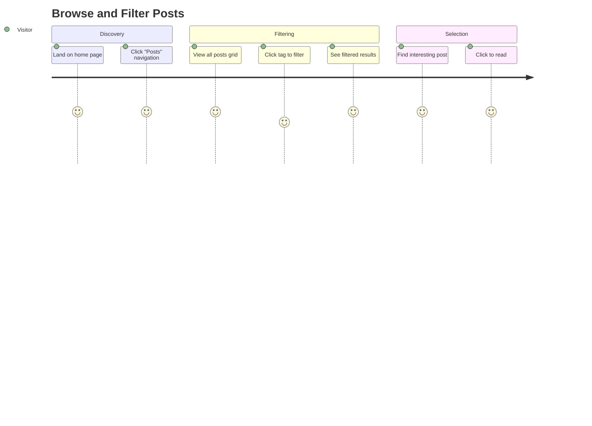
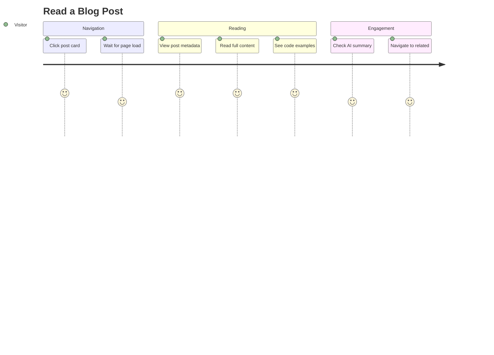
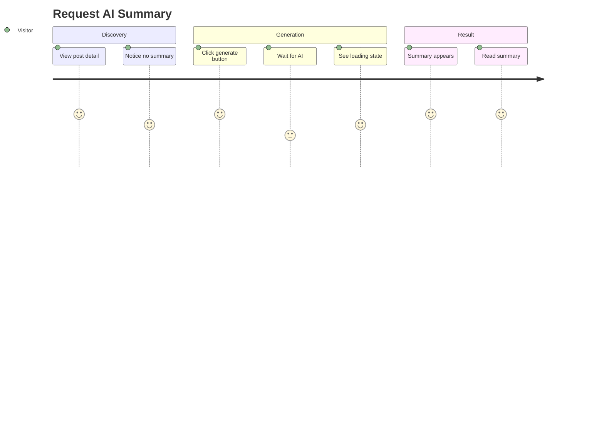
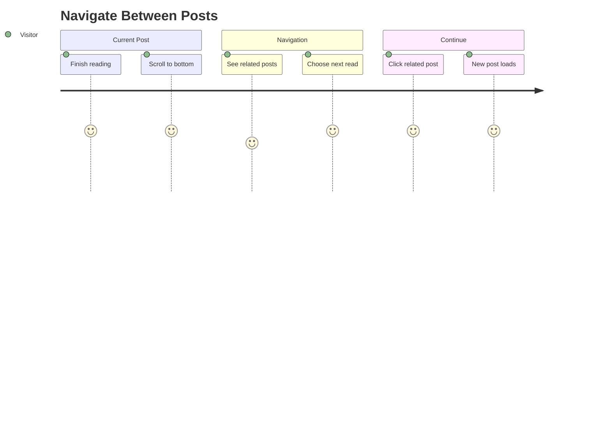

# Posts 도메인 유저 스토리

이 문서는 Posts 도메인의 엔드투엔드 사용자 여정을 설명합니다. 콘텐츠 탐색, 읽기, AI 요약 생성, 네비게이션 기능을 포함합니다.

## 사용자 페르소나

### 방문자
기술 콘텐츠를 탐색하고 소비하려는 익명의 블로그 독자. 특정 주제를 검색하거나 캐주얼하게 탐색하는 개발자, 학생 또는 기술 애호가일 수 있습니다.

### 블로그 소유자 (Meti)
Notion을 통해 포스트를 발행하고 독자들이 AI 강화 콘텐츠와 상호작용하기를 원하는 콘텐츠 제작자 및 사이트 관리자.

---

## 사용자 여정

### 여정 1: 포스트 탐색 및 필터링

**페르소나**: 방문자
**목표**: 관심 있는 특정 주제의 포스트 찾기
**전제조건**: 사용자가 블로그에 접속함



#### 단계

1. **홈 페이지 도착**
   - 사용자 행동: 블로그 URL로 이동
   - 시스템 응답: 히어로 섹션과 추천 포스트 표시
   - 검증: 페이지가 2초 이내에 로드됨

2. **포스트로 이동**
   - 사용자 행동: 헤더 네비게이션에서 "Posts" 링크 클릭
   - 시스템 응답: `/posts` 페이지로 라우팅, 모든 발행 포스트 표시
   - 검증: 모든 발행 콘텐츠가 포함된 포스트 그리드 렌더링

3. **태그 옵션 확인**
   - 사용자 행동: 태그 필터 사이드바/섹션 관찰
   - 시스템 응답: Notion 데이터베이스에서 사용 가능한 모든 태그 표시
   - 검증: 태그가 Notion 데이터베이스 스키마와 일치

4. **태그 필터 선택**
   - 사용자 행동: 태그 클릭 (예: "React", "TypeScript")
   - 시스템 응답:
     - 선택된 태그 시각적으로 강조
     - 선택된 태그가 있는 포스트만 표시하도록 필터링
     - 쿼리 파라미터와 함께 URL 업데이트 (`?tags=react`)
   - 검증: 일치하는 포스트만 표시됨

5. **다중 태그 추가**
   - 사용자 행동: 추가 태그 클릭
   - 시스템 응답:
     - OR 필터 적용 (선택된 ANY 태그가 있는 포스트)
     - URL에 모든 선택된 태그 반영
   - 검증: 필터 로직이 배타적(AND)이 아닌 포함적(OR)

6. **필터 해제**
   - 사용자 행동: 모든 태그 선택 해제 또는 "초기화" 버튼 클릭
   - 시스템 응답: 모든 포스트 다시 표시
   - 검증: URL 쿼리 파라미터 제거됨

#### 성공 기준
- [ ] 초기 로드 시 모든 발행 포스트 표시
- [ ] 태그 필터가 즉시 업데이트됨 (< 100ms)
- [ ] URL이 공유 가능하고 필터 상태 복원
- [ ] 일치하는 포스트가 없을 때 빈 상태 표시

#### 오류 시나리오

| 시나리오 | 사용자 경험 | 복구 |
|---------|------------|------|
| 필터와 일치하는 포스트 없음 | "포스트를 찾을 수 없습니다" 메시지와 필터 초기화 옵션 | 필터 초기화 클릭 |
| 태그 로드 실패 | 필터 옵션 없이 포스트 표시 | 페이지 새로고침 |
| 네트워크 타임아웃 | 로딩 스켈레톤, 이후 오류 메시지 | 재시도 버튼 |

---

### 여정 2: 블로그 포스트 읽기

**페르소나**: 방문자
**목표**: 특정 블로그 포스트의 전체 콘텐츠 소비
**전제조건**: 사용자가 관심 있는 포스트를 찾음 (홈, 포스트 목록 또는 직접 링크를 통해)



#### 단계

1. **포스트 카드 클릭**
   - 사용자 행동: 그리드 또는 추천 섹션에서 포스트 카드 클릭
   - 시스템 응답: `/posts/[slug]`로 이동
   - 검증: slug 기반으로 올바른 포스트 로드

2. **포스트 메타데이터 확인**
   - 사용자 행동: 포스트 헤더 관찰
   - 시스템 응답: 제목, 발행일, 태그 표시
   - 검증: 메타데이터가 Notion 소스와 일치

3. **포스트 콘텐츠 읽기**
   - 사용자 행동: 콘텐츠 스크롤
   - 시스템 응답: 다음을 포함한 리치 Notion 콘텐츠 렌더링:
     - 포맷된 텍스트 (볼드, 이탤릭 등)
     - 적절한 계층의 제목
     - 구문 강조가 적용된 코드 블록
     - 지연 로딩 이미지
     - 임베디드 미디어
   - 검증: 모든 콘텐츠 타입이 올바르게 렌더링됨

4. **AI 요약 확인 (있는 경우)**
   - 사용자 행동: 요약 섹션 찾기
   - 시스템 응답: 2문장 요약이 포함된 AI 요약 카드 표시
   - 검증: 요약이 정확한 포스트 개요 제공

5. **관련 포스트로 이동**
   - 사용자 행동: 포스트 푸터로 스크롤
   - 시스템 응답: 이전/다음 포스트 및 관련 콘텐츠 표시
   - 검증: 네비게이션 링크가 기능함

#### 성공 기준
- [ ] 포스트 콘텐츠가 완전히 렌더링됨
- [ ] 코드 블록에 구문 강조 적용
- [ ] 이미지가 적절한 크기로 로드됨
- [ ] 요약이 있으면 AI 요약 카드 표시
- [ ] 이전/다음 네비게이션 작동

#### 오류 시나리오

| 시나리오 | 사용자 경험 | 복구 |
|---------|------------|------|
| 잘못된 slug | 404 페이지 | 포스트 목록으로 링크 |
| 콘텐츠 렌더링 실패 | 오류 바운더리와 함께 부분 콘텐츠 | 새로고침 또는 문제 보고 |
| 이미지 로드 실패 | 대체 텍스트와 함께 플레이스홀더 | 브라우저 새로고침 |

---

### 여정 3: AI 요약 요청

**페르소나**: 방문자
**목표**: 긴 포스트의 빠른 AI 생성 요약 얻기
**전제조건**: 사용자가 기존 AI 요약이 없는 포스트를 보고 있음



#### 단계

1. **요약 없음 인지**
   - 사용자 행동: 포스트에서 AI 요약 섹션 찾기
   - 시스템 응답: 요약 카드 대신 "AI 요약 생성" 버튼 표시
   - 검증: `aiSummary`가 없는 포스트에 버튼 표시

2. **생성 버튼 클릭**
   - 사용자 행동: "AI 요약 생성" 버튼 클릭
   - 시스템 응답:
     - 버튼이 로딩 상태로 전환
     - 중복 클릭 방지를 위해 버튼 비활성화
     - 로딩 스피너/애니메이션 표시
   - 검증: UI가 처리 상태 반영

3. **생성 대기**
   - 사용자 행동: 대기 (일반적으로 5-15초)
   - 시스템 응답:
     - `/api/posts/[postId]/summary`로 API 호출
     - LLM이 2문장 요약 생성
     - Notion에 요약 저장
     - 캐시 무효화
   - 검증: 타임아웃 없이 프로세스 완료

4. **생성된 요약 확인**
   - 사용자 행동: 요약 카드 출현 관찰
   - 시스템 응답:
     - 버튼을 AI 요약 카드로 교체
     - 요약 텍스트 표시
     - 성공 표시 표시
   - 검증: 요약이 포스트 콘텐츠와 맥락적으로 관련됨

5. **재방문**
   - 사용자 행동: 나중에 같은 포스트 재방문
   - 시스템 응답: 요약 카드가 즉시 표시됨 (영구 저장)
   - 검증: 재생성 필요 없음

#### 성공 기준
- [ ] 요약이 없을 때만 버튼 표시
- [ ] 로딩 상태가 명확하게 전달됨
- [ ] 30초 이내에 요약 생성
- [ ] 요약이 포스트 콘텐츠를 정확하게 반영
- [ ] 페이지 새로고침 후에도 요약 유지

#### 오류 시나리오

| 시나리오 | 사용자 경험 | 복구 |
|---------|------------|------|
| LLM API 타임아웃 | 오류 메시지: "생성 시간 초과" | 재시도 버튼 |
| 요청 제한 초과 | 대기 시간과 함께 오류 메시지 | 대기 후 재시도 |
| 이미 요약됨 | 오류 메시지 (정상 흐름에서는 발생하지 않음) | 페이지 새로고침 |
| Notion 업데이트 실패 | 오류 메시지: "요약 저장 실패" | 재시도 또는 소유자에게 연락 |

---

### 여정 4: 포스트 간 이동

**페르소나**: 방문자
**목표**: 관련 콘텐츠 탐색 및 읽기 계속
**전제조건**: 사용자가 현재 포스트 읽기를 마침



#### 단계

1. **현재 포스트 완료**
   - 사용자 행동: 포스트 콘텐츠 끝까지 스크롤
   - 시스템 응답: 포스트 네비게이터 섹션 표시
   - 검증: 네비게이터가 포스트 푸터에 렌더링됨

2. **네비게이션 옵션 확인**
   - 사용자 행동: 사용 가능한 링크 검토
   - 시스템 응답: 표시:
     - 이전 포스트 (시간순으로 이전)
     - 다음 포스트 (시간순으로 다음)
     - 관련 포스트 (태그 유사성)
   - 검증: 링크가 맥락적으로 관련됨

3. **다음 포스트 선택**
   - 사용자 행동: 네비게이션 링크 클릭
   - 시스템 응답: 선택한 포스트로 이동
   - 검증: 올바른 포스트 로드

4. **읽기 루프 계속**
   - 사용자 행동: 새 포스트 읽기, 네비게이션 반복
   - 시스템 응답: 각 포스트에 적절한 네비게이션 있음
   - 검증: 사용자가 전체 블로그 탐색 가능

#### 성공 기준
- [ ] 이전/다음 링크가 올바르게 작동
- [ ] 관련 포스트가 현재 포스트와 태그 공유
- [ ] 첫 포스트는 "이전" 링크 없음
- [ ] 마지막 포스트는 "다음" 링크 없음
- [ ] 네비게이션이 키보드 접근 가능

#### 오류 시나리오

| 시나리오 | 사용자 경험 | 복구 |
|---------|------------|------|
| 관련 포스트 없음 | 섹션 숨김 또는 "관련 포스트 없음" | 이전/다음 대신 사용 |
| 오래된 네비게이션 데이터 | 잠재적으로 깨진 링크 | 페이지 새로고침 |

---

## 인수 테스트 시나리오 (E2E)

### 시나리오 1: 완전한 포스트 탐색 흐름

```gherkin
Feature: 포스트 탐색
  방문자로서
  포스트를 탐색하고 필터링하고 싶습니다
  내 관심사에 맞는 콘텐츠를 찾기 위해

  Scenario: 태그로 포스트 필터링
    Given 포스트 페이지에 있음
    And "React", "TypeScript", "CSS" 태그가 있는 포스트가 있음
    When "React" 태그 필터를 클릭함
    Then "React" 태그가 있는 포스트만 표시되어야 함
    And URL에 "tags=react"가 포함되어야 함

  Scenario: 태그 필터 초기화
    Given "React" 태그로 포스트를 필터링함
    When "React" 태그 선택을 해제함
    Then 모든 포스트가 표시되어야 함
    And URL에 쿼리 파라미터가 없어야 함
```

### 시나리오 2: AI 요약 생성

```gherkin
Feature: AI 요약 생성
  방문자로서
  AI 요약을 생성하고 싶습니다
  포스트 내용을 빠르게 이해하기 위해

  Scenario: 새 포스트에 요약 생성
    Given AI 요약이 없는 포스트를 보고 있음
    When "AI 요약 생성"을 클릭함
    And 생성이 완료될 때까지 기다림
    Then 요약 카드가 표시되어야 함
    And 요약이 2문장이어야 함
    And 요약이 영구 저장되어야 함

  Scenario: 기존 요약 보기
    Given 포스트에 AI 요약이 있음
    When 포스트 페이지를 방문함
    Then 요약 카드가 즉시 표시되어야 함
    And 생성 버튼이 없어야 함
```

### 시나리오 3: 포스트 네비게이션

```gherkin
Feature: 포스트 네비게이션
  방문자로서
  포스트 간에 이동하고 싶습니다
  관련 콘텐츠를 계속 읽기 위해

  Scenario: 다음 포스트로 이동
    Given 가장 최신이 아닌 포스트를 보고 있음
    When "다음 포스트"를 클릭함
    Then 시간순으로 다음 포스트에 있어야 함

  Scenario: 관련 포스트 보기
    Given "React" 태그가 있는 포스트를 보고 있음
    When 네비게이션 섹션으로 스크롤함
    Then "React" 태그를 공유하는 관련 포스트가 표시되어야 함
```

---

## 메트릭 및 성공 지표

| 메트릭 | 목표 | 측정 |
|--------|-----|------|
| 포스트 목록 로드 시간 | < 2초 | Lighthouse |
| 포스트 상세 로드 시간 | < 3초 | Lighthouse |
| 필터 응답 시간 | < 100ms | 클라이언트 사이드 타이밍 |
| AI 요약 생성 | < 30초 | API 응답 시간 |
| 네비게이션 클릭률 | > 20% | Analytics |
| 요약 생성률 | > 포스트 조회의 10% | Analytics |
