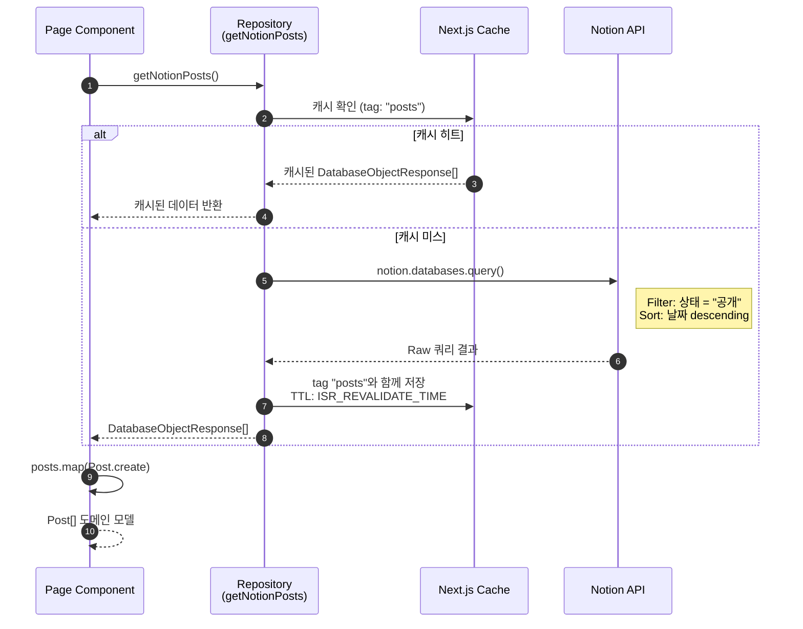
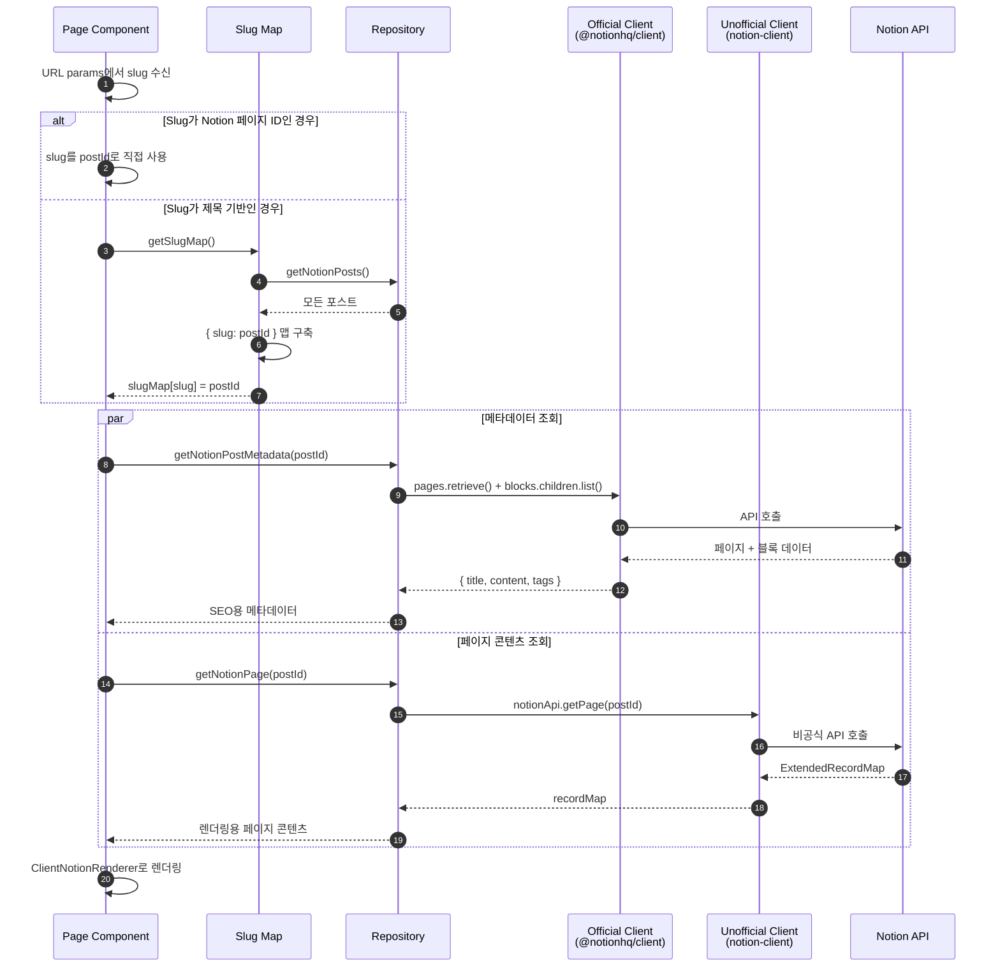
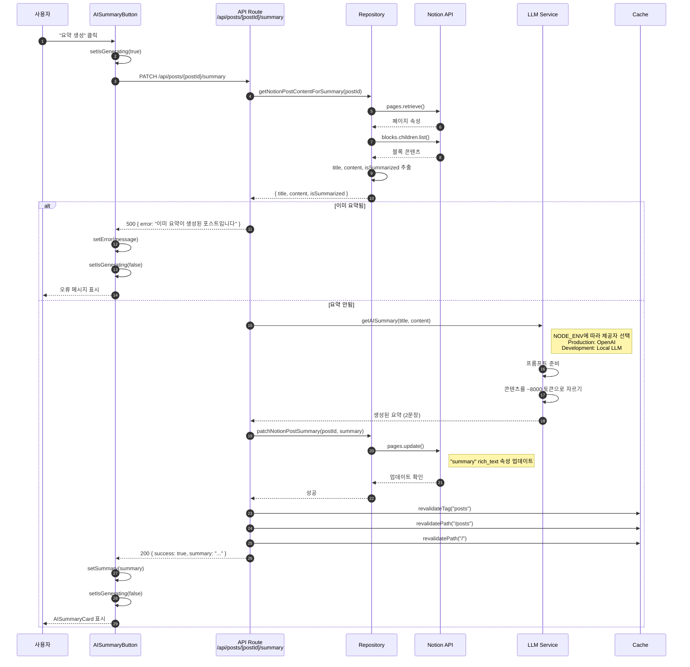
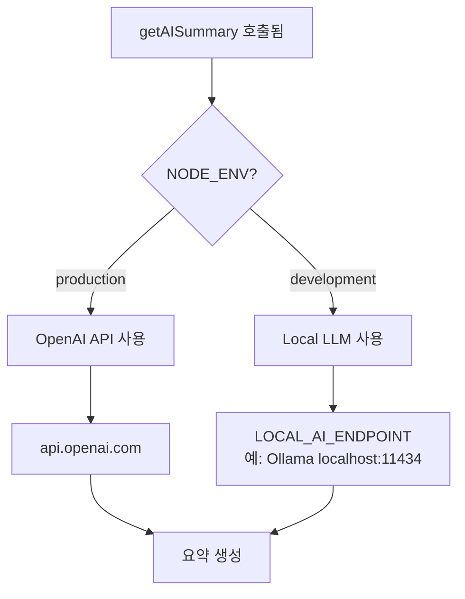
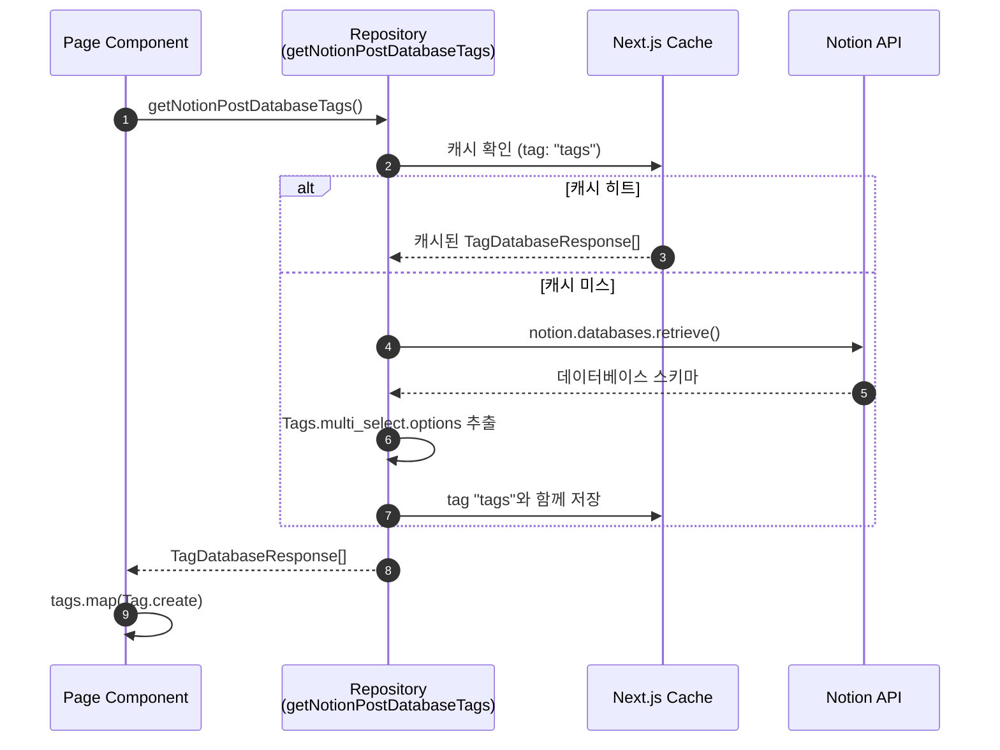
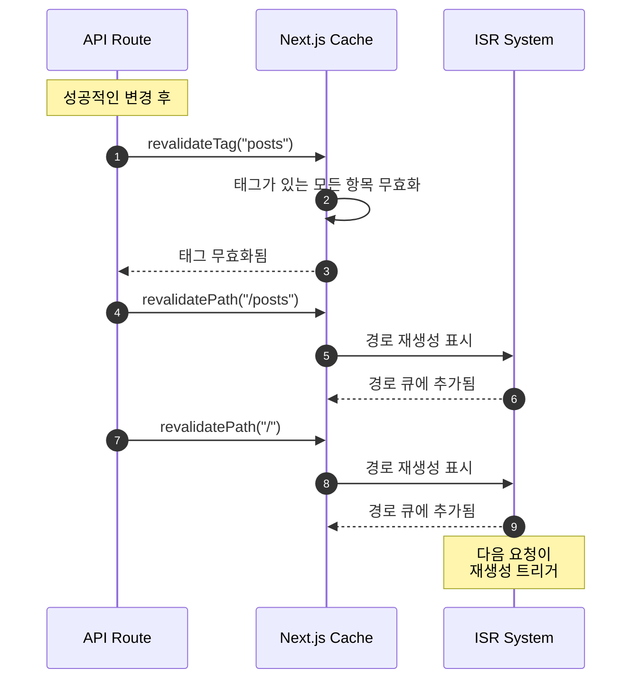
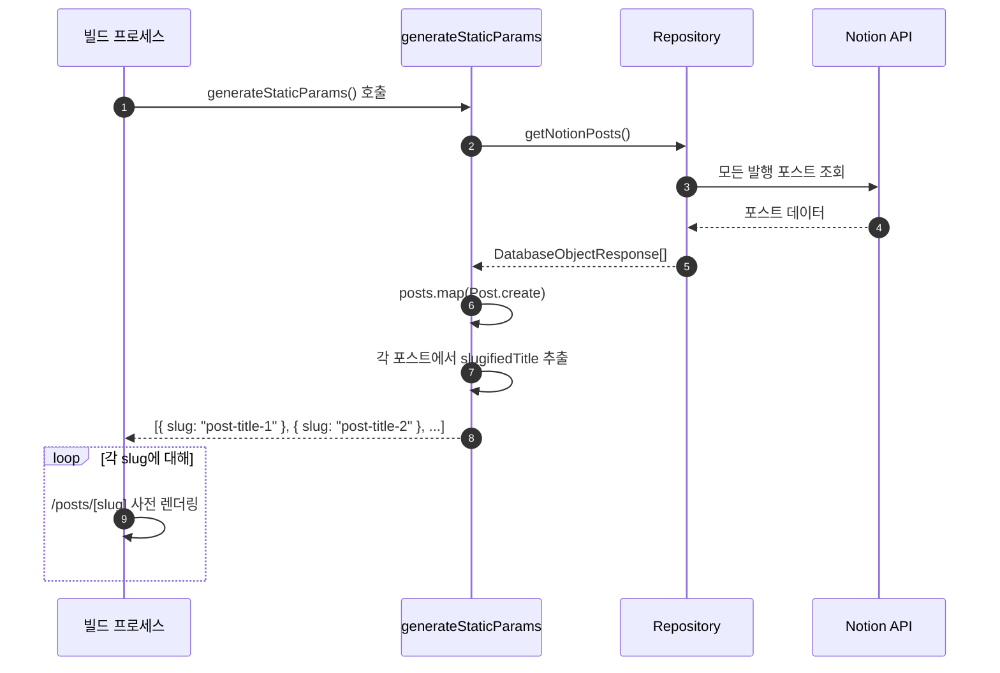

# Posts 도메인 시퀀스 다이어그램

이 문서는 Posts 도메인의 모든 백엔드 워크플로우에 대한 상세 시퀀스 다이어그램을 포함합니다.

## 1. 포스트 목록 조회

### 개요

서버 사이드 캐싱과 함께 Notion 데이터베이스에서 모든 발행 포스트를 조회합니다.

### 액터

- **Page Component**: 데이터를 요청하는 Next.js 페이지
- **Repository**: `entities/notion/model`
- **Cache**: Next.js `unstable_cache`
- **Notion**: 외부 Notion API

### 시퀀스



### 요청 상세

**Notion 쿼리**:
```typescript
{
  database_id: NOTION_POST_DATABASE_ID,
  filter: {
    property: "상태",
    status: { equals: "공개" }
  },
  sorts: [{
    property: "날짜",
    direction: "descending"
  }]
}
```

### 캐시 설정

| 속성 | 값 |
|-----|-----|
| 캐시 태그 | `posts` |
| 재검증 (개발) | 30초 |
| 재검증 (운영) | 300초 |

---

## 2. 포스트 상세 조회

### 개요

URL slug를 Notion 페이지 ID로 변환하고 렌더링을 위한 전체 페이지 콘텐츠를 조회합니다.

### 액터

- **Page Component**: 포스트 상세 페이지
- **Slug Map**: 캐시된 slug-ID 매핑
- **Repository**: Notion API 래퍼
- **Official Client**: 메타데이터용
- **Unofficial Client**: 콘텐츠 렌더링용

### 시퀀스



### Slug 변환 로직

```typescript
async function slugToPostId(slugOrId: string) {
  // 이미 Notion 페이지 ID인지 확인
  if (isNotionPageId(slugOrId)) {
    return slugOrId;
  }

  // slug 맵에서 조회
  const slugMap = await getSlugMap();
  const postId = slugMap[decodeURIComponent(slugOrId)];

  if (!postId) {
    throw new Error("Post not found for given slug or id.");
  }

  return postId;
}
```

---

## 3. AI 요약 생성

### 개요

블로그 포스트에 대한 AI 기반 요약을 생성하고 Notion에 저장합니다.

### 액터

- **Client**: 브라우저 UI (AISummaryButton)
- **API Route**: `/api/posts/[postId]/summary`
- **Repository**: Notion 클라이언트 래퍼
- **LLM Service**: OpenAI 또는 Local LLM
- **Cache**: Next.js 캐시 무효화

### 시퀀스



### 요청/응답 스키마

**요청**:
```typescript
PATCH /api/posts/{postId}/summary
Content-Type: application/json

// Body 필요 없음 - postId는 URL params에서
```

**성공 응답** (200):
```typescript
{
  success: true,
  summary: "이 포스트는... 결론적으로...",
  message: "AI 요약이 성공적으로 생성되었습니다."
}
```

**오류 응답** (500):
```typescript
{
  success: false,
  error: "이미 요약이 생성된 포스트입니다." | "Notion API 권한이 부족합니다." | ...
}
```

### LLM 제공자 선택



### 콘텐츠 추출

```typescript
// Notion 블록에서 텍스트 콘텐츠 추출
const content = contentResponse.results
  .filter(block => block.type === "paragraph")
  .map(block =>
    block.paragraph.rich_text
      .map(text => text.plain_text)
      .join("")
  )
  .join("");
```

---

## 4. 태그 목록 조회

### 개요

Notion 데이터베이스 스키마에서 사용 가능한 태그 옵션을 조회합니다.

### 시퀀스



### 응답 스키마

```typescript
interface TagDatabaseResponse {
  id: string;      // Notion 태그 ID
  name: string;    // 표시 이름 (예: "React", "TypeScript")
  color: string;   // Notion 색상 값
}
```

---

## 5. 캐시 무효화 플로우

### 개요

데이터 변경 후 트리거되는 캐시 무효화.

### 시퀀스



### 무효화 트리거

| 작업 | 무효화되는 태그 | 무효화되는 경로 |
|-----|---------------|----------------|
| AI 요약 생성됨 | `posts` | `/`, `/posts` |
| (향후) 포스트 생성됨 | `posts`, `tags` | `/`, `/posts` |
| (향후) 포스트 업데이트됨 | `posts` | `/`, `/posts`, `/posts/[slug]` |
| (향후) 포스트 삭제됨 | `posts` | `/`, `/posts` |

---

## 6. 정적 생성 플로우

### 개요

빌드 시점에 모든 포스트에 대한 정적 경로를 생성합니다.

### 시퀀스



### 구현

```typescript
export async function generateStaticParams() {
  const posts = (await getNotionPosts()).map(Post.create);

  return posts.map(({ slugifiedTitle }) => ({
    slug: slugifiedTitle,
  }));
}
```

---

## 오류 처리 매트릭스

| 플로우 | 오류 타입 | HTTP 상태 | 복구 |
|-------|---------|----------|------|
| 포스트 조회 | Notion API 오류 | 500 | 오래된 캐시 제공 |
| 상세 조회 | 잘못된 slug | 404 | 404 페이지 표시 |
| 상세 조회 | Notion 페이지 삭제됨 | 404 | 404 페이지 표시 |
| AI 요약 | 이미 요약됨 | 500 | 오류 메시지 표시 |
| AI 요약 | LLM 타임아웃 | 500 | 재시도 버튼 |
| AI 요약 | 요청 제한 | 429 | 대기 후 재시도 |
| AI 요약 | Notion 업데이트 실패 | 500 | 재시도 버튼 |
| 태그 조회 | Notion API 오류 | 500 | 필터 섹션 숨김 |
