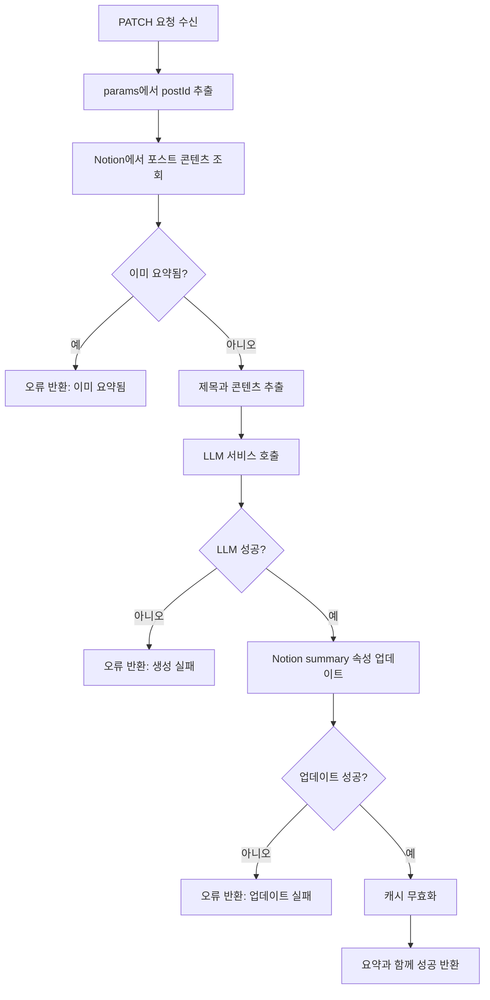

# Posts 도메인 유즈케이스 (백엔드)

이 문서는 Posts 도메인의 백엔드 API 유즈케이스를 설명합니다.

## UC-API-001: AI 요약 생성

### 엔드포인트 상세

| 속성 | 값 |
|-----|-----|
| 메서드 | `PATCH` |
| 경로 | `/api/posts/[postId]/summary` |
| 인증 | 없음 (공개) |
| 요청 제한 | 암시적 (LLM 제공자 제한) |

### 목적

블로그 포스트에 대한 AI 기반 요약을 생성하고 Notion 데이터베이스에 영구 저장합니다.

### 요청

```typescript
// 메서드
PATCH

// URL 파라미터
postId: string  // Notion 페이지 ID

// 헤더
Content-Type: application/json

// Body
// 필요 없음 - postId는 URL에서 가져옴
```

### 응답

**성공 (200)**:
```typescript
interface SuccessResponse {
  success: true;
  summary: string;  // 생성된 2문장 요약
  message: string;  // "AI 요약이 성공적으로 생성되었습니다."
}
```

**오류 (500)**:
```typescript
interface ErrorResponse {
  success: false;
  error: string;  // 사람이 읽을 수 있는 오류 메시지
}
```

### 구현 플로우



### 코드 구현

```typescript
// src/app/api/posts/[postId]/summary/route.ts

export async function PATCH(
  _: NextRequest,
  { params }: { params: { postId: string } }
) {
  const { postId } = params;

  try {
    // 1. 포스트 콘텐츠 조회
    const { title, content, isSummarized } =
      await getNotionPostContentForSummary(postId);

    // 2. 이미 요약되었는지 확인
    if (isSummarized) {
      throw new Error("이미 요약이 생성된 포스트입니다.");
    }

    // 3. AI 요약 생성
    const newSummary = await getAISummary(title, content);

    // 4. Notion 데이터베이스 업데이트
    await patchNotionPostSummary(postId, newSummary);

    // 5. 캐시 무효화
    revalidateTag("posts");
    revalidatePath("/posts");
    revalidatePath("/");

    // 6. 성공 반환
    return NextResponse.json({
      success: true,
      summary: newSummary,
      message: "AI 요약이 성공적으로 생성되었습니다.",
    });
  } catch (error) {
    // 특정 메시지와 함께 오류 처리
    let errorMessage = "AI 요약 생성에 실패했습니다.";

    if (error instanceof Error) {
      if (error.message.includes("unauthorized")) {
        errorMessage = "Notion API 권한이 부족합니다.";
      } else if (error.message.includes("not found")) {
        errorMessage = "포스트를 찾을 수 없습니다.";
      } else if (error.message.includes("rate limit")) {
        errorMessage = "요청 제한에 걸렸습니다. 잠시 후 다시 시도해주세요.";
      } else {
        errorMessage = error.message;
      }
    }

    return NextResponse.json(
      { success: false, error: errorMessage },
      { status: 500 }
    );
  }
}
```

### 의존성

**내부 모듈**:
- `src/entities/notion/model/index.ts`
  - `getNotionPostContentForSummary()`
  - `patchNotionPostSummary()`
- `src/entities/openai/model/index.ts`
  - `getAISummary()`

**외부 서비스**:
- Notion API (읽기/쓰기)
- OpenAI API 또는 Local LLM

### 오류 처리

| 오류 조건 | 상태 | 오류 메시지 |
|---------|------|-----------|
| 포스트에 이미 요약 있음 | 500 | "이미 요약이 생성된 포스트입니다." |
| Notion API 권한 없음 | 500 | "Notion API 권한이 부족합니다." |
| 포스트 찾을 수 없음 | 500 | "포스트를 찾을 수 없습니다." |
| LLM 요청 제한 | 500 | "요청 제한에 걸렸습니다. 잠시 후 다시 시도해주세요." |
| 일반 실패 | 500 | "AI 요약 생성에 실패했습니다." |

### 캐시 전략

| 액션 | 캐시 작업 |
|-----|---------|
| 요약 저장 후 | `revalidateTag("posts")` |
| 요약 저장 후 | `revalidatePath("/posts")` |
| 요약 저장 후 | `revalidatePath("/")` |

### LLM 서비스 설정

```typescript
// src/entities/openai/model/index.ts

export async function getAISummary(
  title: string,
  content: string
): Promise<string> {
  // 토큰 제한을 위한 콘텐츠 자르기
  const truncatedContent = safeSlice(content, 8000);

  // 환경에 따른 제공자 선택
  const provider = process.env.NODE_ENV === "production"
    ? openaiProvider
    : localLLMProvider;

  // 요약 생성
  const response = await provider.chat.completions.create({
    model: modelConfig.model,
    messages: [
      { role: "system", content: SUMMARY_SYSTEM_PROMPT },
      { role: "user", content: `Title: ${title}\n\nContent: ${truncatedContent}` }
    ],
    max_tokens: 200,
  });

  return response.choices[0].message.content;
}
```

### Notion 업데이트 스키마

```typescript
// Notion에서 summary 속성 업데이트
await notion.pages.update({
  page_id: postId,
  properties: {
    summary: {
      rich_text: [
        {
          text: {
            content: aiSummary,
          },
        },
      ],
    },
  },
});
```

---

## 사용되는 Repository 함수

### getNotionPostContentForSummary

**목적**: AI 요약을 위해 포스트 제목과 콘텐츠 추출

**시그니처**:
```typescript
async function getNotionPostContentForSummary(id: string): Promise<{
  title: string;
  content: string;
  isSummarized: boolean;
}>
```

**구현**:
```typescript
async function _getNotionPostContentForSummary(id: string) {
  // 페이지 메타데이터 조회
  const pageResponse = await notion.pages.retrieve({ page_id: id });

  // 블록 콘텐츠 조회
  const contentResponse = await notion.blocks.children.list({ block_id: id });

  // 제목 추출
  const title = pageResponse.properties.제목.title[0].plain_text;

  // 문단 텍스트 콘텐츠 추출
  const content = contentResponse.results
    .filter(block => block.type === "paragraph")
    .map(block =>
      block.paragraph.rich_text
        .map(text => text.plain_text)
        .join("")
    )
    .join("");

  // 기존 요약 확인
  const summary = pageResponse.properties.summary.rich_text
    .map(text => text.plain_text)
    .join("");

  return {
    title,
    content,
    isSummarized: summary.length > 0,
  };
}
```

### patchNotionPostSummary

**목적**: Notion 데이터베이스의 summary 속성 업데이트

**시그니처**:
```typescript
async function patchNotionPostSummary(
  postId: string,
  aiSummary: string
): Promise<PageObjectResponse>
```

**구현**:
```typescript
const _patchNotionPostSummary = async (postId: string, aiSummary: string) => {
  const response = await notion.pages.update({
    page_id: postId,
    properties: {
      summary: {
        rich_text: [
          {
            text: { content: aiSummary },
          },
        ],
      },
    },
  });

  return response;
};
```

---

## 보안 고려사항

### 입력 검증

- `postId`는 유효한 Notion 페이지 ID 형식으로 검증됨
- 사용자 제공 콘텐츠는 소독 없이 LLM에 직접 전달되지 않음

### 요청 제한

- LLM 제공자 (OpenAI/로컬)를 통한 암시적 요청 제한
- 현재 서버 사이드 요청 제한 미구현
- 운영 환경에서 요청 제한 추가 고려

### 권한

- 현재 공개 엔드포인트 (인증 필요 없음)
- 악용 방지를 위해 운영 환경에서 인증 추가 고려

### 데이터 프라이버시

- 포스트 콘텐츠가 외부 LLM 서비스 (운영 환경의 OpenAI)로 전송됨
- 데이터를 비공개로 유지하기 위한 로컬 LLM 옵션 개발 환경에서 사용 가능

---

## 테스트

### 단위 테스트 시나리오

```typescript
describe("PATCH /api/posts/[postId]/summary", () => {
  it("기존 요약이 없는 포스트에 대해 요약을 생성해야 함", async () => {
    // Notion API 응답 모킹
    // LLM 응답 모킹
    // 성공 응답 검증
  });

  it("이미 요약된 포스트에 대해 오류를 반환해야 함", async () => {
    // 기존 요약이 있는 Notion API 모킹
    // 올바른 메시지와 함께 오류 응답 검증
  });

  it("LLM 서비스 실패를 처리해야 함", async () => {
    // LLM 타임아웃/오류 모킹
    // 오류 응답 검증
  });

  it("성공적인 요약 후 캐시를 무효화해야 함", async () => {
    // 성공 플로우 모킹
    // revalidateTag와 revalidatePath 호출 검증
  });
});
```

### 통합 테스트 시나리오

```typescript
describe("AI 요약 통합", () => {
  it("Notion에 요약을 영구 저장하고 페이지 새로고침 시 표시해야 함", async () => {
    // API를 통해 요약 생성
    // 포스트 조회하여 summary 속성 업데이트 확인
    // 캐시 무효화 작동 확인
  });
});
```

---

## 모니터링 & 관찰성

### 로깅

```typescript
// 현재 구현은 오류 로깅
console.error(`❌ [API Route] AI 요약 업데이트 실패 (${postId}):`, error);
```

### 권장 메트릭

| 메트릭 | 설명 |
|-------|-----|
| `ai_summary_requests_total` | 총 요약 생성 요청 |
| `ai_summary_success_total` | 성공한 생성 |
| `ai_summary_errors_total` | 오류 타입별 실패한 생성 |
| `ai_summary_duration_seconds` | 요약 생성 시간 |
| `llm_tokens_used` | 요청당 사용된 토큰 |

### 알림

| 조건 | 심각도 | 조치 |
|-----|-------|------|
| 오류율 > 10% | 경고 | LLM 서비스 조사 |
| 지연 > 30초 | 경고 | LLM 제공자 상태 확인 |
| Notion API 실패 | 위험 | API 자격 증명 확인 |
