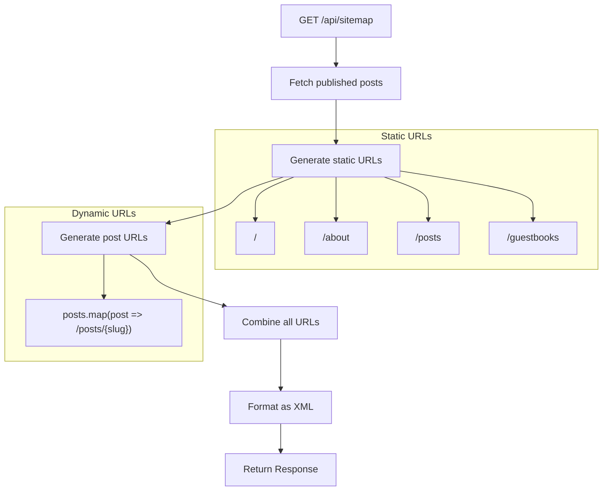
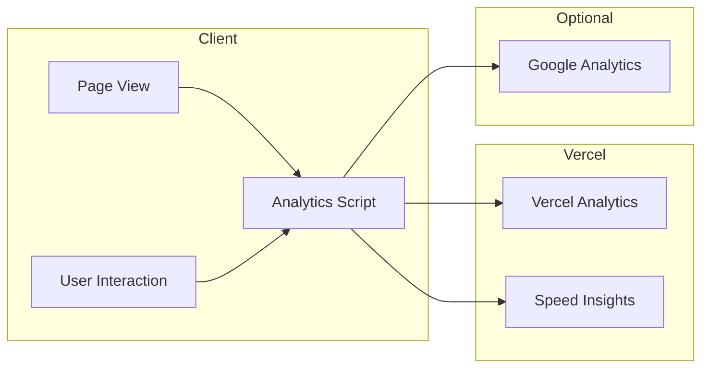

# Site 도메인 정보 구조

이 문서는 Site 도메인 컴포넌트의 정보 구조를 설명합니다. 블로그 전반의 여러 페이지에 영향을 미치는 요소들을 다룹니다.

## 전역 컴포넌트

### 헤더 네비게이션

**위치**: 모든 페이지

**구조**:
```
┌─────────────────────────────────────────────────────────────┐
│  [Logo]     Home  |  Posts  |  About  |  Guestbook    [🌙]  │
└─────────────────────────────────────────────────────────────┘
```

**요소**:
| 요소 | 기능 | 대상 |
|-----|-----|------|
| 로고 | 브랜드 아이덴티티, 홈 링크 | `/` |
| Home | 네비게이션 | `/` |
| Posts | 네비게이션 | `/posts` |
| About | 네비게이션 | `/about` |
| Guestbook | 네비게이션 | `/guestbooks` |
| 테마 토글 | 라이트/다크 전환 | 클라이언트 사이드 |

---

### 푸터

**위치**: 모든 페이지

**구조**:
```
┌─────────────────────────────────────────────────────────────┐
│                                                             │
│         © 2024 Meti. Built with Next.js & Notion           │
│                                                             │
└─────────────────────────────────────────────────────────────┘
```

---

## 화면: 홈 페이지 (`/`)

### 개요

홈 페이지는 블로그 소유자를 소개하고 추천 콘텐츠를 보여줍니다.

### 레이아웃

```
┌─────────────────────────────────────────────────────────────┐
│                        Header                               │
├─────────────────────────────────────────────────────────────┤
│                                                             │
│                     ┌─────────┐                             │
│                     │ Mascot  │                             │
│                     │  Image  │                             │
│                     └─────────┘                             │
│                                                             │
│              안녕하세요. 메티입니다.                          │
│                                                             │
│     노션에서 작성한 TIL을 쉽게 공개하기 위해 만든              │
│               블로그 입니다!                                 │
│                                                             │
│                  [GitHub Button]                            │
│                                                             │
├─────────────────────────────────────────────────────────────┤
│                    Featured Posts                           │
│  ┌──────────┐  ┌──────────┐  ┌──────────┐  ┌──────────┐    │
│  │ Post 1   │  │ Post 2   │  │ Post 3   │  │ Post 4   │    │
│  │ Card     │  │ Card     │  │ Card     │  │ Card     │    │
│  └──────────┘  └──────────┘  └──────────┘  └──────────┘    │
├─────────────────────────────────────────────────────────────┤
│                        Footer                               │
└─────────────────────────────────────────────────────────────┘
```

### 컴포넌트

| 컴포넌트 | 위치 | 데이터 소스 |
|---------|-----|-----------|
| Hero | 상단 중앙 | 정적 콘텐츠 |
| 마스코트 이미지 | 히어로 섹션 | `/mascot.png` |
| GitHub 버튼 | 히어로 섹션 | 정적 링크 |
| 추천 포스트 | 히어로 아래 | `getNotionPosts()` |

### 반응형 동작

| 브레이크포인트 | 레이아웃 |
|--------------|---------|
| 모바일 (< 768px) | 단일 컬럼, 포스트 스택 |
| 태블릿 (768-1024px) | 2컬럼 포스트 그리드 |
| 데스크톱 (> 1024px) | 4컬럼 포스트 그리드 |

---

## 화면: 소개 페이지 (`/about`)

### 개요

Notion에서 렌더링된 블로그 소유자에 대한 상세 정보입니다.

### 레이아웃

```
┌─────────────────────────────────────────────────────────────┐
│                        Header                               │
├─────────────────────────────────────────────────────────────┤
│                                                             │
│                     About Me                                │
│                                                             │
│  ┌─────────────────────────────────────────────────────┐   │
│  │                                                     │   │
│  │               Notion Page Content                   │   │
│  │                                                     │   │
│  │   - Rich text formatting                           │   │
│  │   - Images and media                               │   │
│  │   - Code blocks                                    │   │
│  │   - Lists and tables                               │   │
│  │                                                     │   │
│  └─────────────────────────────────────────────────────┘   │
│                                                             │
├─────────────────────────────────────────────────────────────┤
│                        Footer                               │
└─────────────────────────────────────────────────────────────┘
```

### 컴포넌트

| 컴포넌트 | 위치 | 데이터 소스 |
|---------|-----|-----------|
| 페이지 제목 | 상단 | 정적 |
| Notion 렌더러 | 메인 콘텐츠 | `getNotionAboutPage()` |

### 데이터 흐름


---

## 컴포넌트: 테마 토글

### 상태


### 시각적 상태

| 상태 | 아이콘 | 배경 | 텍스트 |
|-----|-------|-----|-------|
| 라이트 | 🌙 (달) | 화이트/라이트 그레이 | 다크 그레이/블랙 |
| 다크 | ☀️ (해) | 다크 그레이/블랙 | 화이트/라이트 그레이 |
| 마운팅 | 로딩 점 | 현재 테마 | - |

### 구현

```typescript
// ThemeToggle 컴포넌트 로직
export function ThemeToggle() {
  const [mounted, setMounted] = useState(false);
  const { theme, setTheme } = useTheme();

  useEffect(() => setMounted(true), []);

  // 하이드레이션 전까지 로딩 상태 표시
  if (!mounted) return <LoadingDot />;

  return theme === "light" ? (
    <DarkModeIcon onClick={() => setTheme("dark")} />
  ) : (
    <LightModeIcon onClick={() => setTheme("light")} />
  );
}
```

---

## 컴포넌트: 히어로 섹션

### 레이아웃 상세

```
                    ┌──────────────────┐
                    │    ┌────────┐    │
                    │    │        │    │
                    │    │ 240px  │    │
                    │    │        │    │
                    │    └────────┘    │
                    │                  │
                    │  안녕하세요.      │
                    │   메티입니다.     │
                    │                  │
                    │  [Description]   │
                    │                  │
                    │  ┌────────────┐  │
                    │  │  GitHub   │  │
                    │  │  Button   │  │
                    │  └────────────┘  │
                    └──────────────────┘
```

### 요소

| 요소 | 스타일 | 내용 |
|-----|-------|-----|
| 이미지 | 240x240, 중앙 정렬 | `/mascot.png` |
| 인사말 | 볼드, 3xl | "안녕하세요. 메티입니다." |
| 설명 | 일반, 기본값 | 블로그 목적 |
| 버튼 | 파란 배경, 둥근 모서리 | 아이콘과 함께 "Github" |

---

## 사이트맵 구조

### URL 계층 구조

```
/                           # 홈 페이지
├── /posts                  # 포스트 목록
│   ├── /posts/[slug-1]    # 개별 포스트
│   ├── /posts/[slug-2]
│   └── ...
├── /about                  # 소개 페이지
└── /guestbooks            # 방명록 페이지
```

### 사이트맵 생성 흐름



### 우선순위 할당

| 페이지 유형 | 우선순위 | 변경 빈도 |
|----------|---------|---------|
| 홈 | 1.0 | daily |
| 소개 | 0.8 | daily |
| 포스트 목록 | 0.8 | daily |
| 방명록 | 0.8 | always |
| 개별 포스트 | 0.8 | daily |

---

## 분석 통합

### 데이터 흐름



### 구현 위치

```typescript
// src/app/layout.tsx
import { Analytics } from "@vercel/analytics/react";
import { SpeedInsights } from "@vercel/speed-insights/next";

export default function RootLayout({ children }) {
  return (
    <html>
      <body>
        {children}
        <Analytics />
        <SpeedInsights />
      </body>
    </html>
  );
}
```

---

## SEO 메타데이터 구조

### 페이지 레벨 메타데이터

```typescript
// Posts 페이지 예시
export const metadata: Metadata = {
  title: "Posts - Meti's Blog",
  description: "Browse all technical blog posts",
  openGraph: {
    title: "Posts - Meti's Blog",
    description: "Browse all technical blog posts",
    type: "website",
  },
};
```

### 동적 메타데이터 (포스트 상세)

```typescript
// src/app/posts/[slug]/page.tsx
export async function generateMetadata({ params }): Promise<Metadata> {
  const post = await getPost(params.slug);

  return {
    title: `${post.title} - Meti's Blog`,
    description: post.aiSummary || post.excerpt,
    openGraph: {
      title: post.title,
      description: post.aiSummary || post.excerpt,
      type: "article",
      images: [post.cover],
    },
  };
}
```

---

## 접근성 고려사항

### 키보드 네비게이션

| 요소 | 키 | 동작 |
|-----|---|-----|
| 테마 토글 | Enter/Space | 테마 토글 |
| 네비게이션 링크 | Tab | 다음 링크로 포커스 |
| GitHub 버튼 | Enter | 저장소 열기 |

### ARIA 레이블

| 요소 | aria-label |
|-----|------------|
| 테마 토글 | "Toggle dark mode" |
| 네비게이션 | "Main navigation" |
| 푸터 | "Site footer" |

### 색상 대비

| 테마 | 전경색 | 배경색 | 대비율 |
|-----|-------|-------|--------|
| 라이트 | #1a1a1a | #ffffff | 21:1 |
| 다크 | #ffffff | #1a1a1a | 21:1 |
