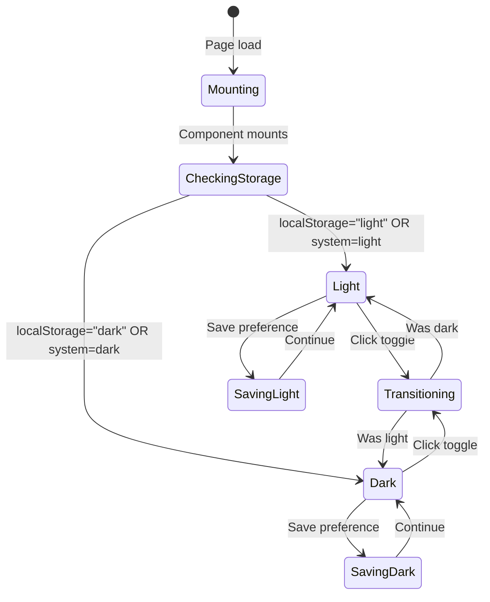
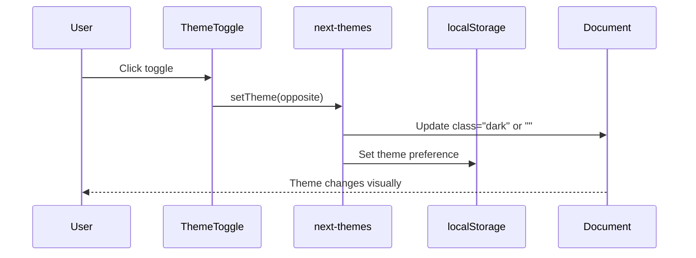
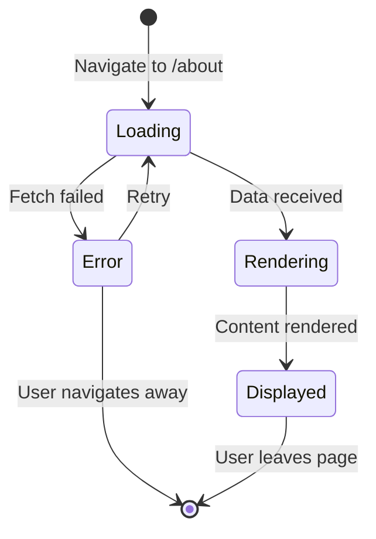
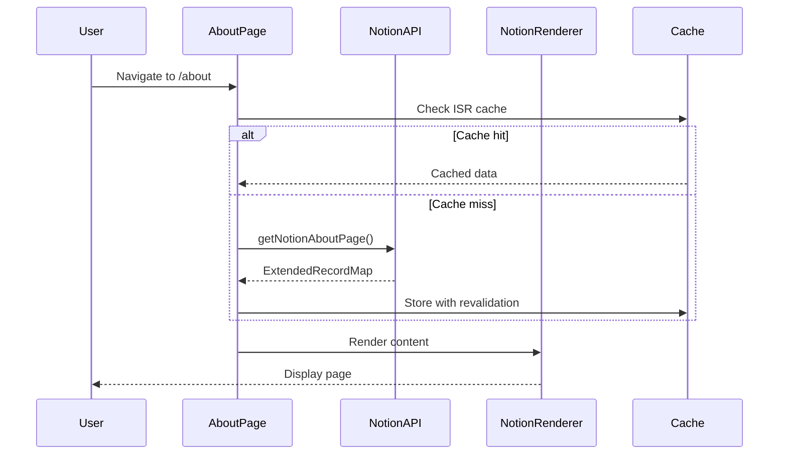
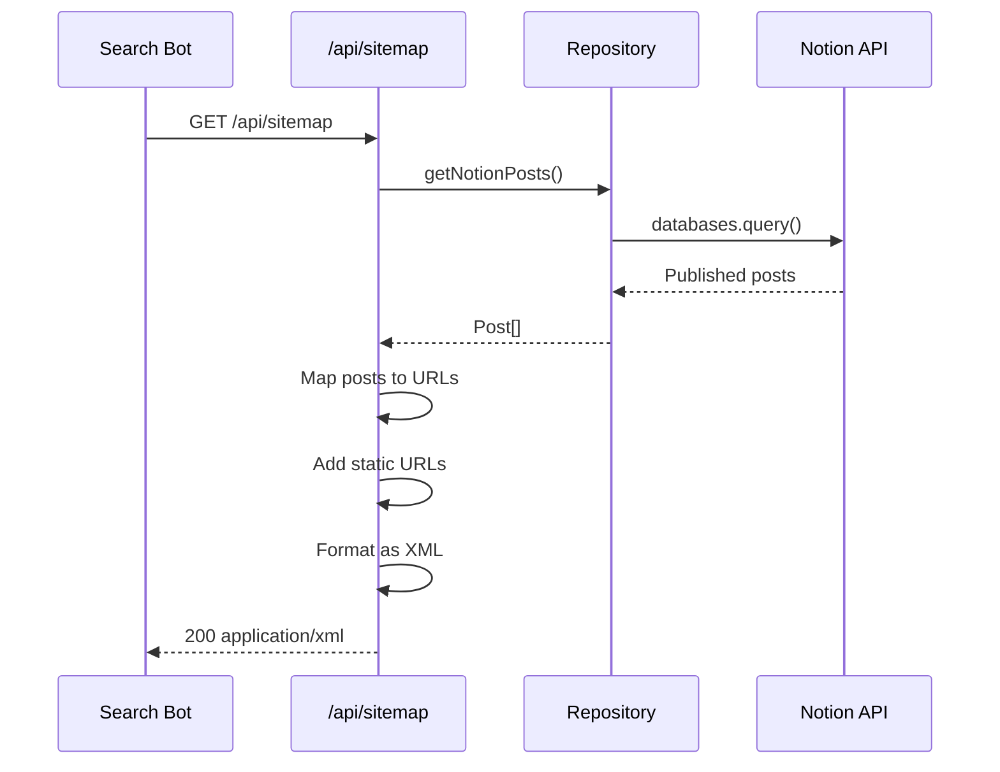
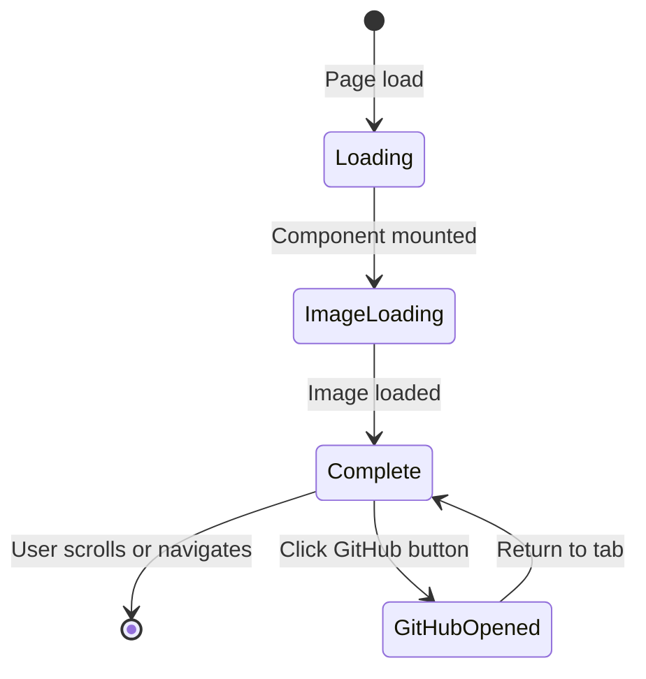

# Site 도메인 유즈케이스 (프론트엔드)

이 문서는 Site 도메인의 프론트엔드 유즈케이스를 설명합니다. 테마 관리, 소개 페이지 보기, SEO 관련 기능을 다룹니다.

## UC-F-030: 테마 토글

### 개요

| 속성 | 값 |
|------|-----|
| 주요 액터 | 방문자 |
| 트리거 | 사용자가 테마 토글 아이콘 클릭 |
| 전제조건 | 페이지가 로드되고 하이드레이션됨 |
| 사후조건 | 테마가 변경되고 유지됨 |

### 메인 플로우

1. **사용자**가 헤더에서 테마 토글 위치 확인
2. **시스템**이 현재 테마 아이콘(해/달) 표시
3. **사용자**가 토글 아이콘 클릭
4. **시스템**이 현재 테마 식별
5. **시스템**이 반대 테마로 전환
6. **시스템**이 문서에 테마 클래스 적용
7. **시스템**이 localStorage에 환경설정 저장
8. **사용자**가 모든 요소에서 업데이트된 테마 확인

### 대안 플로우

**AF-1: 첫 방문 (저장된 환경설정 없음)**
1. 4단계에서 localStorage에 환경설정 없음
2. 시스템이 시스템 테마 환경설정 사용
3. 감지된 테마로 5단계부터 계속

**AF-2: 페이지 하이드레이션 안됨**
1. 1단계에서 페이지가 아직 서버 렌더링 중
2. 시스템이 로딩 인디케이터 표시
3. 하이드레이션 후 올바른 토글 아이콘 표시
4. 이후 사용자가 상호작용 가능

**AF-3: localStorage 사용 불가**
1. 7단계에서 localStorage가 오류 발생
2. 시스템이 조용히 오류 로깅
3. 현재 세션에만 테마 적용
4. 페이지 새로고침 시 환경설정 손실

### UI 상태 다이어그램



### 컴포넌트 상호작용



### 상태 관리

```typescript
// ThemeToggle 컴포넌트
const [mounted, setMounted] = useState(false);
const { theme, setTheme } = useTheme();

useEffect(() => setMounted(true), []);

const toggleTheme = () => {
  setTheme(theme === "light" ? "dark" : "light");
};
```

---

## UC-F-031: 소개 페이지 보기

### 개요

| 속성 | 값 |
|------|-----|
| 주요 액터 | 방문자 |
| 트리거 | 사용자가 /about으로 이동 |
| 전제조건 | 블로그 접근 가능 |
| 사후조건 | 소개 콘텐츠 표시됨 |

### 메인 플로우

1. **사용자**가 네비게이션에서 "About" 클릭
2. **시스템**이 `/about` 페이지로 라우팅
3. **시스템**이 Notion 페이지 콘텐츠 조회 (서버 사이드)
4. **시스템**이 로딩 상태로 페이지 렌더링
5. **시스템**이 Notion 데이터 수신
6. **시스템**이 NotionRenderer에 데이터 전달
7. **NotionRenderer**가 풍부한 콘텐츠 표시
8. **사용자**가 소개 페이지 콘텐츠 읽음

### 대안 플로우

**AF-1: 캐시된 콘텐츠**
1. 3단계에서 ISR 캐시에 유효한 데이터 존재
2. 시스템이 캐시된 Notion 콘텐츠 즉시 반환
3. 6단계로 건너뜀

**AF-2: Notion API 오류**
1. 5단계에서 Notion API 실패
2. 시스템이 오류 메시지 표시
3. 사용자가 재시도하거나 다른 곳으로 이동 가능

**AF-3: 콘텐츠 없음**
1. 5단계에서 페이지 ID가 빈 값 반환
2. 시스템이 "콘텐츠를 사용할 수 없음" 메시지 표시
3. 사용자가 홈으로 리다이렉트

### UI 상태 다이어그램



### 컴포넌트 상호작용



### 데이터 흐름

```typescript
// About 페이지 (서버 컴포넌트)
export default async function AboutPage() {
  const aboutPage = await getNotionAboutPage();

  return (
    <main>
      <ClientNotionRenderer recordMap={aboutPage} />
    </main>
  );
}
```

---

## UC-F-032: 사이트맵 생성

### 개요

| 속성 | 값 |
|------|-----|
| 주요 액터 | 검색 엔진 봇 |
| 트리거 | 봇이 /api/sitemap 요청 |
| 전제조건 | 블로그가 배포됨 |
| 사후조건 | 유효한 XML 사이트맵 반환 |

### 메인 플로우

1. **봇**이 `/api/sitemap` 요청
2. **시스템**이 GET 요청 처리
3. **시스템**이 모든 게시된 포스트 조회
4. **시스템**이 정적 페이지 항목 생성
5. **시스템**이 슬러그로 포스트 항목 생성
6. **시스템**이 모든 항목 결합
7. **시스템**이 XML로 포맷
8. **시스템**이 올바른 헤더와 함께 사이트맵 반환
9. **봇**이 사이트맵 수신 및 파싱

### 대안 플로우

**AF-1: 게시된 포스트 없음**
1. 3단계에서 포스트가 반환되지 않음
2. 시스템이 정적 페이지만 생성
3. 6단계부터 계속

**AF-2: Notion API 오류**
1. 3단계에서 포스트 조회 실패
2. 시스템이 500 오류 반환
3. 봇이 나중에 재시도

### 사이트맵 생성 흐름



### URL 생성

```typescript
// 사이트맵 API 라우트
export async function GET() {
  const baseUrl = process.env.BLOG_URL || "";
  const posts = (await getNotionPosts()).map(Post.create);

  // 동적 포스트 URL
  const postUrls = posts.map(({ slugifiedTitle, lastEditedTime }) => ({
    url: `${baseUrl}/posts/${slugifiedTitle}`,
    lastModified: new Date(lastEditedTime),
    changeFrequency: "daily",
    priority: 0.8,
  }));

  // 정적 URL
  const staticUrls = [
    { url: baseUrl, priority: 1, changeFrequency: "daily" },
    { url: `${baseUrl}/about`, priority: 0.8, changeFrequency: "daily" },
    { url: `${baseUrl}/posts`, priority: 0.8, changeFrequency: "daily" },
    { url: `${baseUrl}/guestbooks`, priority: 0.8, changeFrequency: "always" },
  ];

  // 결합 및 포맷
  const sitemap = formatAsXml([...staticUrls, ...postUrls]);
  return new Response(sitemap, {
    headers: { "Content-Type": "application/xml" },
  });
}
```

---

## UC-F-033: 히어로 섹션 보기

### 개요

| 속성 | 값 |
|------|-----|
| 주요 액터 | 방문자 |
| 트리거 | 사용자가 홈페이지에 도착 |
| 전제조건 | 홈페이지 접근 가능 |
| 사후조건 | 히어로 섹션 표시됨 |

### 메인 플로우

1. **사용자**가 홈페이지로 이동
2. **시스템**이 Hero 컴포넌트 렌더링
3. **시스템**이 마스코트 이미지 로드
4. **시스템**이 인사말 텍스트 표시
5. **시스템**이 블로그 설명 표시
6. **시스템**이 GitHub 버튼 렌더링
7. **사용자**가 완전한 히어로 섹션 확인
8. **사용자**가 선택적으로 GitHub 버튼 클릭
9. **시스템**이 새 탭에서 저장소 열기

### UI 상태 다이어그램



### 컴포넌트 구조

```typescript
export function Hero() {
  return (
    <section className="flex flex-col items-center gap-3 text-center">
      <Image
        src="/mascot.png"
        alt="profile_image"
        width={240}
        height={240}
        priority  // 즉시 로드 (LCP 최적화)
      />
      <h2 className="mt-4 font-bold text-3xl">
        안녕하세요. 메티입니다.
      </h2>
      <p>노션에서 작성한 TIL을 쉽게 공개하기 위해 만든 블로그 입니다!</p>
      <p>블로그의 소스코드는 아래 버튼을 통해 확인해주세요.</p>
      <Tooltip>
        <TooltipTrigger>
          <Link href="https://github.com/ywj3493/metis-blog">
            <button className="...">
              Github <AiFillGithub />
            </button>
          </Link>
        </TooltipTrigger>
        <TooltipContent>
          <p>블로그 repository 주소</p>
        </TooltipContent>
      </Tooltip>
    </section>
  );
}
```

---

## 오류 처리 요약

| 유즈케이스 | 오류 유형 | 사용자 메시지 | 복구 액션 |
|----------|---------|-------------|----------|
| UC-F-030 | localStorage 사용 불가 | (조용히) | 세션 전용 테마 |
| UC-F-031 | Notion API 오류 | "콘텐츠를 불러올 수 없습니다" | 재시도 버튼 |
| UC-F-032 | 포스트 조회 오류 | 500 응답 | 봇 재시도 |
| UC-F-033 | 이미지 로드 오류 | alt 텍스트 표시 | 브라우저 새로고침 |

---

## 접근성 고려사항

| 유즈케이스 | 접근성 기능 |
|----------|-----------|
| UC-F-030 | 키보드 조작 가능 (Enter/Space), 포커스 표시 |
| UC-F-031 | 시맨틱 헤딩, 이미지 alt 텍스트 |
| UC-F-032 | 해당 없음 (머신 소비) |
| UC-F-033 | 이미지 alt 텍스트, 버튼 툴팁 |

---

## 성능 고려사항

| 측면 | 최적화 |
|-----|-------|
| 테마 전환 | CSS 전환, 레이아웃 시프트 없음 |
| 소개 페이지 | ISR 캐싱, 스트리밍 |
| 사이트맵 | 엣지 함수, 캐시된 포스트 |
| 히어로 이미지 | 우선순위 로딩, 최적화된 포맷 |
