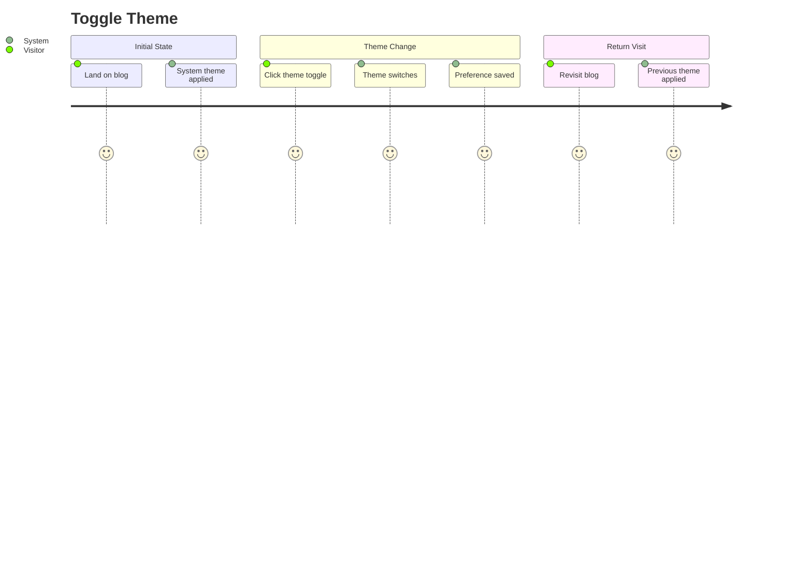
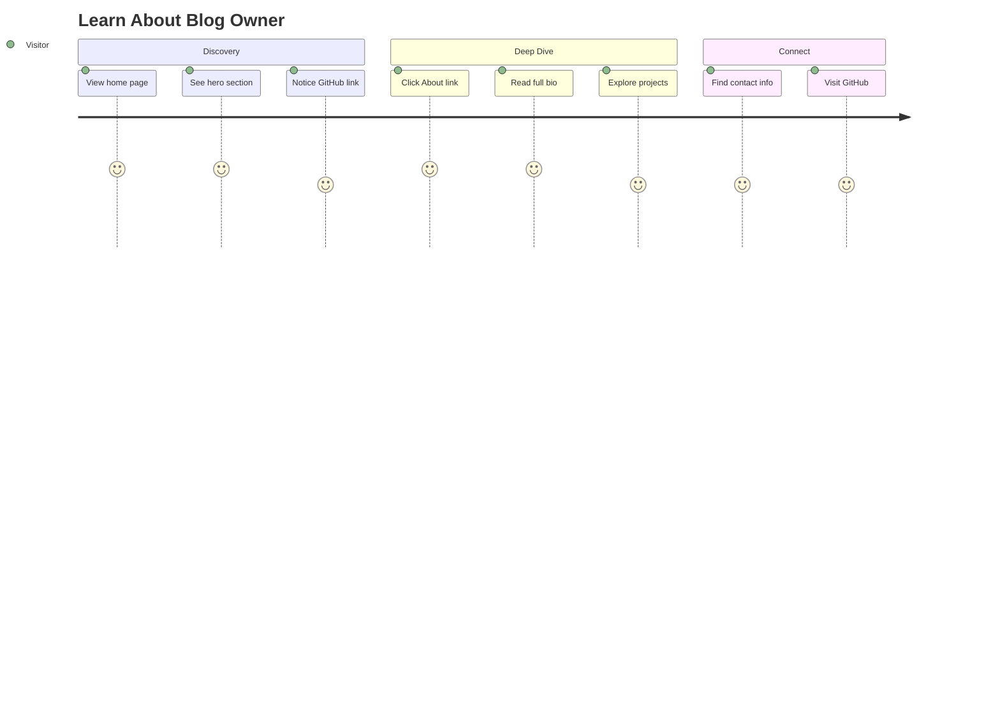
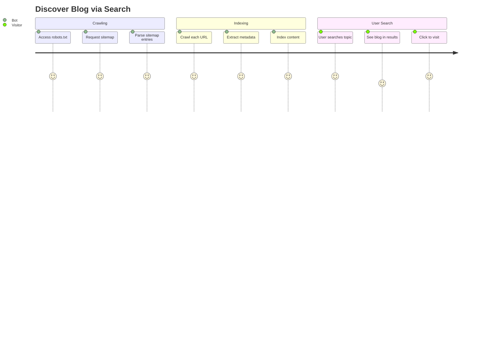
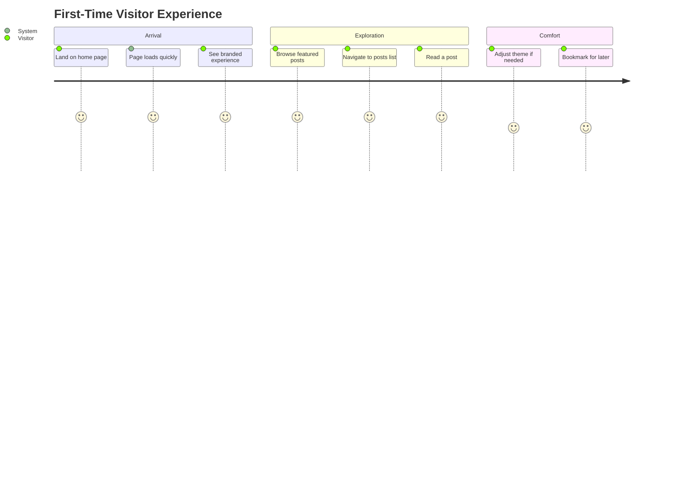

# Site 도메인 사용자 스토리

이 문서는 Site 도메인의 엔드투엔드 사용자 여정을 설명합니다. 테마 환경설정, 블로그 소유자 발견, 검색 엔진 최적화를 다룹니다.

## 사용자 페르소나

### 방문자
편안한 독서 경험과 블로그 소유자에 대한 정보에 쉽게 접근하기를 원하는 익명의 블로그 독자입니다.

### 블로그 소유자 (Meti)
블로그가 검색 가능하고, 성능이 좋으며, 개인 브랜드를 대표하기를 원하는 콘텐츠 제작자입니다.

### 검색 엔진 봇
검색 결과를 위해 콘텐츠를 색인하는 자동화된 크롤러입니다.

---

## 사용자 여정

### 여정 1: 테마 토글

**페르소나**: 방문자
**목표**: 편안한 독서를 위해 라이트/다크 테마 간 전환
**전제조건**: 사용자가 블로그의 아무 페이지나 탐색함



#### 단계

1. **최초 방문**
   - 사용자 행동: 블로그 URL로 탐색
   - 시스템 응답: 시스템 테마 환경설정 감지
   - 검증: 테마가 OS 설정과 일치

2. **테마 토글 위치 확인**
   - 사용자 행동: 헤더에서 테마 컨트롤 찾기
   - 시스템 응답: 현재 테마에 기반한 태양/달 아이콘 표시
   - 검증: 토글이 보이고 접근 가능

3. **테마 토글**
   - 사용자 행동: 토글 아이콘 클릭
   - 시스템 응답:
     - 모든 색상 부드럽게 전환
     - 새 테마를 반영하도록 아이콘 업데이트
     - localStorage에 환경설정 저장
   - 검증: 모든 UI 요소가 일관되게 업데이트

4. **변경 확인**
   - 사용자 행동: 페이지 스크롤
   - 시스템 응답: 모든 콘텐츠가 새 테마 존중
   - 검증: 잘못된 테마에 고정된 요소 없음

5. **재방문**
   - 사용자 행동: 브라우저 닫고 다시 열어 블로그 방문
   - 시스템 응답: 저장된 테마 환경설정 적용
   - 검증: 세션 간 테마 유지

#### 성공 기준
- [ ] 테마 토글이 키보드로 접근 가능
- [ ] 페이지 로드 시 잘못된 테마 깜빡임 없음
- [ ] 모든 컴포넌트가 양쪽 테마 지원
- [ ] 테마 환경설정 유지

#### 오류 시나리오

| 시나리오 | 사용자 경험 | 복구 |
|---------|-----------|------|
| localStorage 사용 불가 | 시스템 테마 사용 | 필요 없음 |
| JavaScript 비활성화 | 라이트 테마 기본값 | 정적 스타일링 |
| 테마 유지 안됨 | 시스템으로 복귀 | 브라우저 데이터 삭제 |

---

### 여정 2: 블로그 소유자에 대해 알아보기

**페르소나**: 방문자
**목표**: 블로그 제작자와 그 배경 이해
**전제조건**: 사용자가 블로그를 찾았고 더 많은 맥락을 원함



#### 단계

1. **히어로 섹션 보기**
   - 사용자 행동: 홈페이지 도착
   - 시스템 응답: 마스코트, 인사말, 블로그 설명 표시
   - 검증: 히어로 섹션이 눈에 띄게 보임

2. **소개 읽기**
   - 사용자 행동: 인사말과 설명 읽기
   - 시스템 응답: "안녕하세요. 메티입니다."와 블로그 목적 표시
   - 검증: 텍스트가 명확하고 읽기 쉬움

3. **GitHub 탐색**
   - 사용자 행동: 히어로에서 GitHub 버튼 클릭
   - 시스템 응답: 새 탭에서 저장소 열기
   - 검증: 링크 작동, 툴팁이 목적지 설명

4. **소개 페이지로 이동**
   - 사용자 행동: 헤더 네비게이션에서 "About" 클릭
   - 시스템 응답: `/about` 페이지로 이동
   - 검증: 풍부한 콘텐츠와 함께 페이지 로드

5. **전체 프로필 읽기**
   - 사용자 행동: 소개 페이지 스크롤
   - 시스템 응답: 서식이 포함된 Notion 콘텐츠 렌더링
   - 검증: 모든 콘텐츠 블록이 올바르게 표시

6. **연락 방법 찾기**
   - 사용자 행동: 연락처 정보 찾기
   - 시스템 응답: 이메일, 소셜 링크 표시
   - 검증: 링크가 클릭 가능하고 기능함

#### 성공 기준
- [ ] 히어로 섹션이 폴드 위에 로드
- [ ] GitHub 링크가 새 탭에서 열림
- [ ] 소개 페이지가 완전한 Notion 콘텐츠 렌더링
- [ ] 연락처 정보를 쉽게 찾을 수 있음

#### 오류 시나리오

| 시나리오 | 사용자 경험 | 복구 |
|---------|-----------|------|
| 소개 페이지 로드 실패 | 오류 메시지 표시 | 페이지 새로고침 |
| Notion 콘텐츠 오래됨 | 오래된 정보 표시 | ISR 재검증 대기 |
| 이미지 로드 실패 | alt 텍스트 표시 | 브라우저 새로고침 |

---

### 여정 3: 검색을 통한 블로그 발견

**페르소나**: 검색 엔진 봇 / 검색을 통한 방문자
**목표**: 검색 결과를 위해 블로그 콘텐츠 찾고 색인
**전제조건**: 블로그가 배포되고 접근 가능



#### 단계

1. **봇이 사이트맵 발견**
   - 봇 행동: `/api/sitemap` 요청
   - 시스템 응답: 모든 URL이 포함된 XML 사이트맵 반환
   - 검증: 유효한 XML, 모든 게시된 포스트 포함

2. **봇이 URL 파싱**
   - 봇 행동: 사이트맵에서 URL 추출
   - 시스템 응답: 각각에 대해 URL, lastmod, priority 제공
   - 검증: 모든 URL이 접근 가능

3. **봇이 페이지 크롤링**
   - 봇 행동: 각 URL 방문
   - 시스템 응답: 메타 태그가 포함된 HTML 제공
   - 검증: 메타 태그가 존재하고 정확함

4. **봇이 메타데이터 추출**
   - 봇 행동: title, description, Open Graph 파싱
   - 시스템 응답: 페이지 헤드에 구조화된 데이터
   - 검증: 블로그 포스트용 JSON-LD

5. **사용자 검색**
   - 사용자 행동: 관련 검색 쿼리 입력
   - 검색 응답: 결과에 블로그 표시
   - 검증: 제목과 설명이 페이지와 일치

6. **사용자 결과 클릭**
   - 사용자 행동: 검색 결과 클릭
   - 시스템 응답: 블로그 페이지로 이동
   - 검증: 콘텐츠가 검색 스니펫과 일치

#### 성공 기준
- [ ] 사이트맵이 유효한 XML 반환
- [ ] 모든 게시된 포스트가 사이트맵에 포함
- [ ] 각 페이지에 정확한 메타 태그
- [ ] 7일 이내 페이지 색인

#### 오류 시나리오

| 시나리오 | 영향 | 복구 |
|---------|-----|------|
| 사이트맵 생성 실패 | 새 포스트 색인 안됨 | API 수정, 재제출 |
| 메타 태그 누락 | 불량한 검색 스니펫 | 메타데이터 추가 |
| Notion 동기화 지연 | 오래된 콘텐츠 색인 | ISR 대기 |

---

### 여정 4: 첫 방문자 경험

**페르소나**: 방문자
**목표**: 블로그에 대한 긍정적인 첫인상 얻기
**전제조건**: 사용자가 이전에 방문한 적 없음



#### 단계

1. **빠른 페이지 로드**
   - 사용자 행동: URL 입력 또는 링크 클릭
   - 시스템 응답: 2초 이내 페이지 로드
   - 검증: Lighthouse 성능 > 90

2. **브랜드 경험 보기**
   - 사용자 행동: 홈페이지 보기
   - 시스템 응답: 일관된 디자인, 마스코트, 색상
   - 검증: 전문적인 외관

3. **콘텐츠 탐색**
   - 사용자 행동: 추천 포스트 스크롤
   - 시스템 응답: 제목, 날짜, 태그가 포함된 포스트 카드
   - 검증: 콘텐츠가 정리되고 스캔 가능

4. **사이트 탐색**
   - 사용자 행동: 헤더 네비게이션 사용
   - 시스템 응답: 부드러운 페이지 전환
   - 검증: 모든 링크가 올바르게 작동

5. **환경설정 조정**
   - 사용자 행동: 원하면 테마 토글
   - 시스템 응답: 테마가 부드럽게 변경
   - 검증: 환경설정 저장됨

6. **사이트 북마크**
   - 사용자 행동: 북마크 저장
   - 시스템 응답: 파비콘과 제목이 올바르게 설정
   - 검증: 북마크가 인식 가능

#### 성공 기준
- [ ] 페이지 로드 < 2초
- [ ] 로드 중 레이아웃 시프트 없음
- [ ] 일관된 시각적 디자인
- [ ] 작동하는 네비게이션

---

## 수락 테스트 시나리오 (E2E)

### 시나리오 1: 테마 유지

```gherkin
Feature: Theme Persistence
  As a visitor
  I want my theme preference saved
  So that I don't have to change it every visit

  Scenario: Theme saved across sessions
    Given I am on the home page
    And the system theme is "light"
    When I click the theme toggle
    Then the theme should change to "dark"
    And when I refresh the page
    Then the theme should still be "dark"

  Scenario: Theme applied on new session
    Given I previously selected "dark" theme
    When I visit the blog in a new session
    Then the theme should be "dark"
```

### 시나리오 2: 사이트맵 생성

```gherkin
Feature: Sitemap Generation
  As a search engine
  I want an accurate sitemap
  So that I can index all blog content

  Scenario: Sitemap includes all pages
    Given there are 10 published posts
    When I request /api/sitemap
    Then the response should be valid XML
    And it should include 14 URLs (home, about, posts, guestbook, 10 posts)
    And each URL should have lastModified date

  Scenario: New post appears in sitemap
    Given a new post was published
    When I request /api/sitemap
    Then the new post URL should be included
```

### 시나리오 3: 소개 페이지 콘텐츠

```gherkin
Feature: About Page Content
  As a visitor
  I want to read about the blog owner
  So that I understand their background

  Scenario: View about page
    When I navigate to /about
    Then I should see content from Notion
    And all text formatting should be preserved
    And images should be displayed

  Scenario: About page caching
    Given the about page has been loaded
    When the Notion content is updated
    And I wait for ISR revalidation
    Then I should see the updated content
```

---

## 메트릭 및 성공 지표

| 메트릭 | 목표 | 측정 방법 |
|-------|-----|----------|
| Lighthouse 성능 | > 90 | Lighthouse 감사 |
| First Contentful Paint | < 1.5초 | Web Vitals |
| Cumulative Layout Shift | < 0.1 | Web Vitals |
| 테마 전환 시간 | < 100ms | 사용자 인식 |
| 사이트맵 최신성 | < 5분 지연 | Notion과 비교 |
| 검색 색인률 | 100% 게시됨 | Google Search Console |

---

## 컴포넌트 요약

| 기능 | 컴포넌트 | 위치 |
|-----|---------|------|
| 테마 프로바이더 | `ThemeProvider` | `src/entities/theme/hooks/` |
| 테마 토글 | `ThemeToggle` | `src/entities/theme/ui/` |
| 히어로 섹션 | `Hero` | `src/features/profile/ui/` |
| 연락처 정보 | `Contact` | `src/features/profile/ui/` |
| 사이트맵 API | Route Handler | `src/app/api/sitemap/` |
| 분석 | 루트 레이아웃 | `src/app/layout.tsx` |
