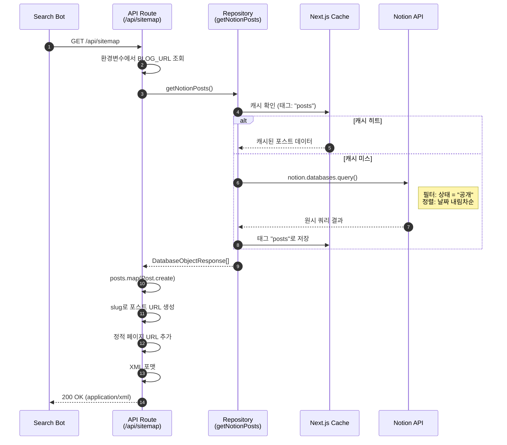
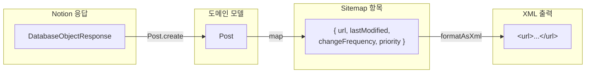
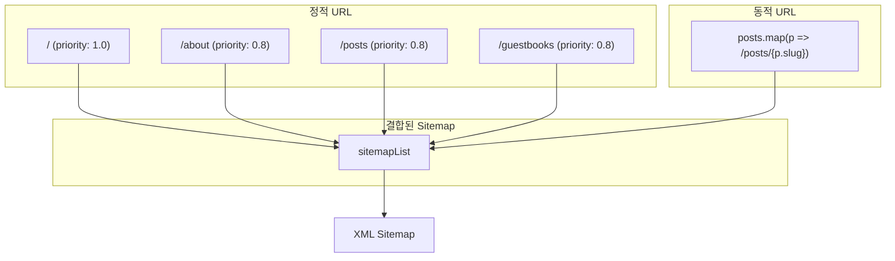
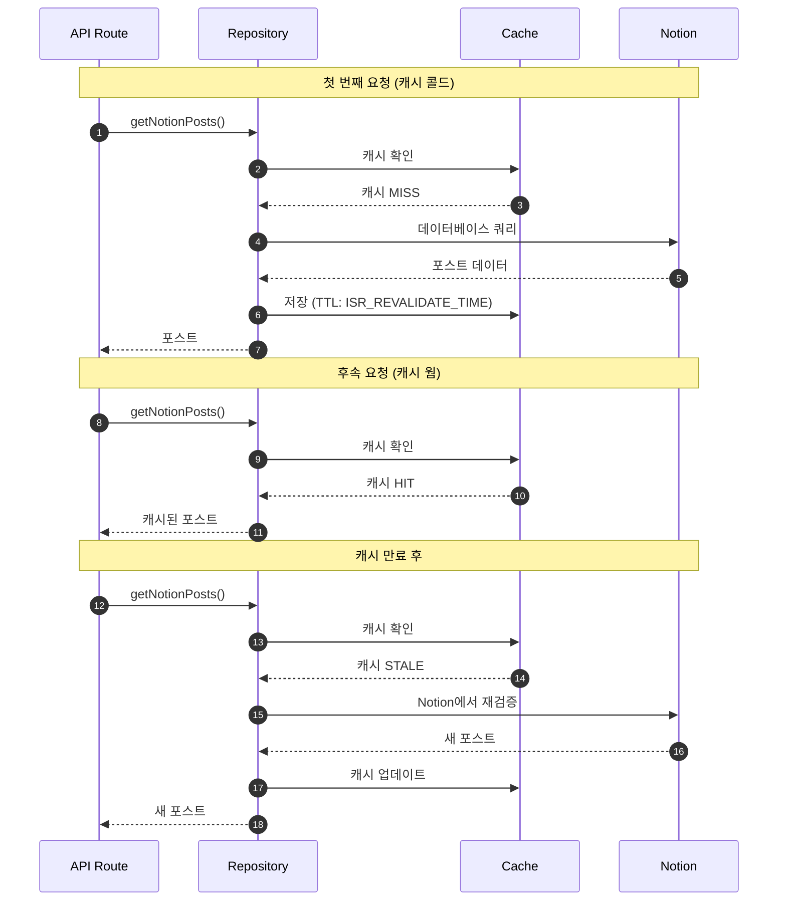
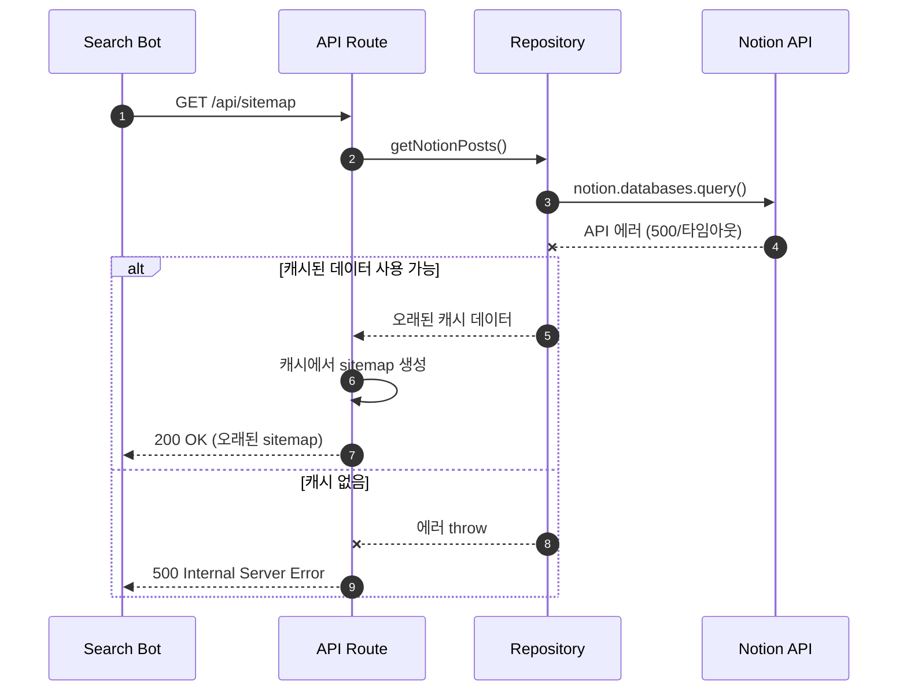
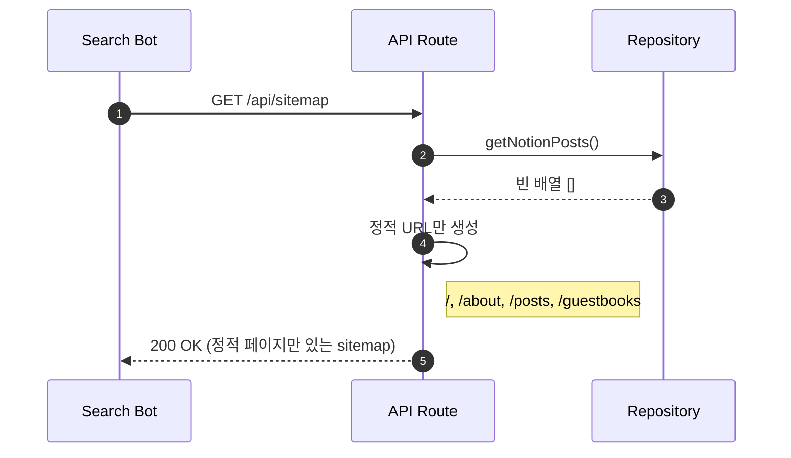

# Site 도메인 시퀀스 다이어그램

이 문서는 Site 도메인의 모든 백엔드 워크플로우에 대한 상세 시퀀스 다이어그램을 포함합니다.

## 1. Sitemap 생성

### 개요

검색 엔진 크롤러를 위해 모든 공개 블로그 URL을 포함하는 XML sitemap을 생성합니다.

### 액터

- **Search Bot**: 외부 크롤러 (Google, Bing 등)
- **API Route**: `/api/sitemap` 핸들러
- **Repository**: `entities/notion/model`
- **Cache**: Next.js `unstable_cache`
- **Notion**: 외부 Notion API

### 시퀀스

### 데이터 변환

### URL 조합

---

## 2. Sitemap 캐시 흐름

### 개요

Sitemap 생성은 포스트 목록과 동일한 캐싱 전략을 활용합니다.

### 시퀀스

### 캐시 설정

| 환경 | ISR_REVALIDATE_TIME | 동작 |
|------|---------------------|------|
| 개발 | 30초 | 빠른 반복 |
| 운영 | 300초 | API 호출 감소 |

---

## 3. 에러 시나리오

### Notion API 실패

### 빈 포스트 목록

---

## 4. 성능 고려사항

### 요청 흐름 타이밍

```mermaid
gantt
    title Sitemap 생성 타임라인
    dateFormat X
    axisFormat %L ms

    section 캐시 히트
    캐시 확인              :0, 5
    캐시된 포스트 반환      :5, 10
    XML 포맷               :10, 20
    응답 전송              :20, 25

    section 캐시 미스
    캐시 확인              :0, 5
    Notion API 쿼리        :5, 500
    응답 파싱              :500, 520
    캐시에 저장            :520, 530
    XML 포맷               :530, 550
    응답 전송              :550, 560
```

### 최적화 포인트

| 항목 | 최적화 |
|------|--------|
| 캐싱 | 포스트가 캐시되어 Notion API 호출 감소 |
| 응답 크기 | XML은 요청 시 생성되며 저장되지 않음 |
| 병렬 조회 | 모든 포스트에 대해 단일 데이터베이스 쿼리 |
| Content-Type | 올바른 `application/xml` 헤더 |
