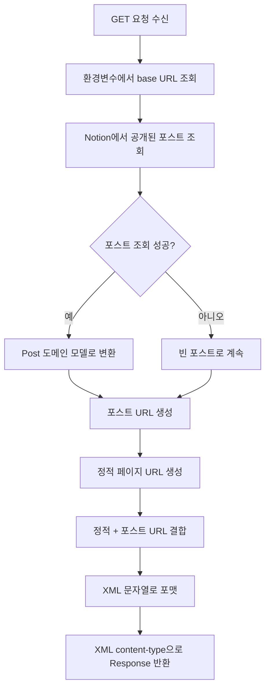

# Site 도메인 유즈케이스 (백엔드)

이 문서는 Site 도메인의 백엔드 API 유즈케이스를 설명합니다.

## UC-API-030: Sitemap 생성

### 엔드포인트 상세

| 속성 | 값 |
|------|---|
| 메서드 | `GET` |
| 경로 | `/api/sitemap` |
| 인증 | 없음 (공개) |
| Rate Limit | 없음 |

### 목적

검색 엔진 크롤러를 위해 모든 공개 블로그 URL을 포함하는 XML sitemap을 생성합니다.

### 요청

```typescript
// 메서드
GET

// URL
/api/sitemap

// 헤더
Accept: application/xml
```

### 응답

**성공 (200)**:

```xml
<?xml version="1.0" encoding="UTF-8"?>
<urlset xmlns="http://www.sitemaps.org/schemas/sitemap/0.9">
  <url>
    <loc>https://example.com</loc>
    <lastmod>2024-12-08T00:00:00.000Z</lastmod>
    <changefreq>daily</changefreq>
    <priority>1</priority>
  </url>
  <url>
    <loc>https://example.com/posts/my-post</loc>
    <lastmod>2024-12-07T00:00:00.000Z</lastmod>
    <changefreq>daily</changefreq>
    <priority>0.8</priority>
  </url>
  <!-- ... 추가 URL -->
</urlset>
```

**에러 (500)**:

```typescript
// 내부 서버 에러 (예: Notion API 실패)
// 빈 sitemap 또는 부분 sitemap 반환
```

### 구현 흐름



### 코드 구현

```typescript
// src/app/api/sitemap/route.ts

import type { MetadataRoute } from "next";
import { getNotionPosts } from "@/entities/notion/model";
import { Post } from "@/entities/posts/model";

export async function GET() {
  const baseUrl = process.env.BLOG_URL || "";

  // 1. 포스트 조회 및 변환
  const posts = (await getNotionPosts()).map(Post.create);

  // 2. 포스트 URL 생성
  const postUrls: MetadataRoute.Sitemap = posts.map(
    ({ slugifiedTitle, lastEditedTime }) => ({
      url: `${baseUrl}/posts/${slugifiedTitle}`,
      lastModified: new Date(lastEditedTime),
      changeFrequency: "daily",
      priority: 0.8,
    }),
  );

  // 3. 정적 URL 정의
  const staticUrls = [
    { url: baseUrl, priority: 1, changeFrequency: "daily" },
    { url: `${baseUrl}/about`, priority: 0.8, changeFrequency: "daily" },
    { url: `${baseUrl}/posts`, priority: 0.8, changeFrequency: "daily" },
    { url: `${baseUrl}/guestbooks`, priority: 0.8, changeFrequency: "always" },
  ];

  // 4. 결합 및 XML 포맷
  const sitemapList = [...staticUrls, ...postUrls];
  const sitemap = formatAsXml(sitemapList);

  // 5. 올바른 content type으로 반환
  return new Response(sitemap, {
    headers: { "Content-Type": "application/xml" },
  });
}
```

### URL 구조

| 페이지 유형 | URL 패턴 | 우선순위 | 변경 빈도 |
|------------|----------|---------|----------|
| 홈 | `/` | 1.0 | daily |
| 소개 | `/about` | 0.8 | daily |
| 포스트 목록 | `/posts` | 0.8 | daily |
| 방명록 | `/guestbooks` | 0.8 | always |
| 포스트 상세 | `/posts/{slug}` | 0.8 | daily |

### 의존성

**내부 모듈**:

- `src/entities/notion/model/index.ts`
  - `getNotionPosts()` - Notion에서 공개된 포스트 조회
- `src/entities/posts/model/post.ts`
  - `Post.create()` - slugified title을 가진 도메인 모델 생성

**외부 서비스**:

- Notion API (읽기 전용)

**환경 변수**:

- `BLOG_URL` - sitemap 항목의 기본 URL

### 에러 처리

| 에러 상황 | 동작 | 복구 |
|----------|------|------|
| Notion API 실패 | 부분 또는 빈 sitemap 반환 가능 | 봇이 재시도 |
| BLOG_URL 누락 | URL이 상대 경로가 됨 (무효) | 환경 변수 설정 |
| 포스트 변환 에러 | 유효하지 않은 포스트 건너뜀 | 유효한 포스트로 계속 |

### 캐시 전략

sitemap은 기반이 되는 `getNotionPosts()` 캐시에 의존합니다:

| 항목 | 설정 |
|------|------|
| 캐시 태그 | `posts` |
| Revalidate (개발) | 30초 |
| Revalidate (운영) | 300초 |

---

## XML 포맷 명세

### Sitemap 프로토콜

생성된 sitemap은 [Sitemaps XML 포맷](https://www.sitemaps.org/protocol.html)을 따릅니다:

```xml
<?xml version="1.0" encoding="UTF-8"?>
<urlset xmlns="http://www.sitemaps.org/schemas/sitemap/0.9">
  <url>
    <loc>URL</loc>
    <lastmod>ISO8601 날짜</lastmod>
    <changefreq>빈도</changefreq>
    <priority>0.0-1.0</priority>
  </url>
</urlset>
```

### 필드 설명

| 필드 | 설명 | 포맷 |
|------|------|------|
| `loc` | 페이지의 전체 URL | 절대 URL |
| `lastmod` | 마지막 수정 날짜 | ISO 8601 (YYYY-MM-DDTHH:MM:SS.sssZ) |
| `changefreq` | 예상 변경 빈도 | always, hourly, daily, weekly, monthly, yearly, never |
| `priority` | 상대적 중요도 | 0.0 ~ 1.0 (기본값 0.5) |

---

## 보안 고려사항

### 공개 접근

- sitemap은 검색 엔진을 위해 의도적으로 공개됨
- 인증 불필요
- 민감한 정보 노출 없음

### Rate Limiting

- 명시적 rate limiting 없음
- 포스트 조회 시 Notion API rate limit에 의존
- 캐시된 응답으로 API 부하 감소

---

## 테스트

### 단위 테스트 시나리오

```typescript
describe("GET /api/sitemap", () => {
  it("올바른 content-type과 함께 유효한 XML을 반환해야 함", async () => {
    const response = await GET();
    expect(response.headers.get("Content-Type")).toBe("application/xml");
  });

  it("sitemap에 정적 페이지가 포함되어야 함", async () => {
    const response = await GET();
    const xml = await response.text();

    expect(xml).toContain("<loc>https://example.com</loc>");
    expect(xml).toContain("<loc>https://example.com/about</loc>");
    expect(xml).toContain("<loc>https://example.com/posts</loc>");
    expect(xml).toContain("<loc>https://example.com/guestbooks</loc>");
  });

  it("sitemap에 공개된 포스트가 포함되어야 함", async () => {
    // getNotionPosts를 테스트 포스트를 반환하도록 Mock
    const response = await GET();
    const xml = await response.text();

    expect(xml).toContain("/posts/test-post-slug");
  });

  it("빈 포스트 목록을 처리해야 함", async () => {
    // getNotionPosts를 빈 배열을 반환하도록 Mock
    const response = await GET();
    const xml = await response.text();

    // 정적 페이지는 여전히 있어야 함
    expect(xml).toContain("<loc>");
  });
});
```

### 통합 테스트 시나리오

```typescript
describe("Sitemap 통합", () => {
  it("XML 파서로 파싱 가능한 유효한 sitemap을 생성해야 함", async () => {
    const response = await fetch("/api/sitemap");
    const xml = await response.text();

    // XML 구조 검증
    const parser = new DOMParser();
    const doc = parser.parseFromString(xml, "application/xml");
    expect(doc.querySelector("parsererror")).toBeNull();
  });
});
```
