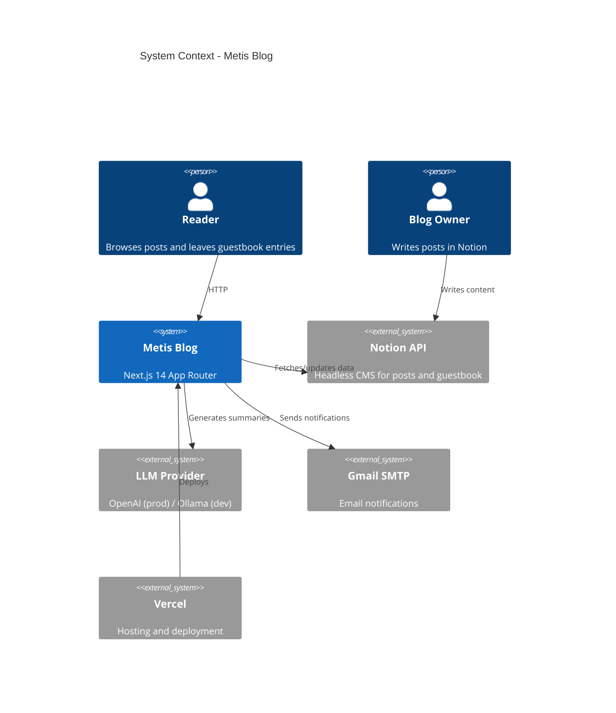
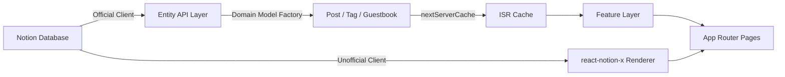

<!-- Created: 2026-04-03 | Last Modified: 2026-04-03 | Status: Active -->
<!-- Tech Stack: Next.js 14 (App Router), TypeScript (strict), Tailwind CSS, Notion API, OpenAI API -->
<!-- @reference: [config](config.md) | [infrastructure](infrastructure.md) -->

> [Config →](config.md) | [Infrastructure →](infrastructure.md)

# Architecture

## System Overview

Metis Blog is a personal technical blog built with Next.js 14 (App Router) and TypeScript. It uses Notion as a headless CMS and OpenAI/Ollama for AI-powered post summaries.

### Stakeholders

| Role | Description |
|------|-------------|
| Blog Owner | Writes posts in Notion, manages guestbook, triggers AI summaries |
| Reader | Browses posts, filters by tag, reads AI summaries, leaves guestbook entries |
| AI Agent | Claude Code / GitHub Copilot — develops features following this documentation |

### System Context



## Architecture Pattern: Feature-Sliced Design (FSD)

### Layer Hierarchy

```
app/     →  widgets/  →  features/  →  entities/  →  shared/
(Routes)    (Layouts)    (Features)     (Models)      (Utils)
```

**Import Rule**: Each layer may only import from the **same level or lower**. Never import upward.

### Layer Responsibilities

```
src/
├── app/           # Next.js App Router — routes, layouts, API endpoints
├── widgets/       # Composite UI — Header, Footer (cross-feature layouts)
├── features/      # User features — post display, guestbook, AI summary, tag filter, theme, profile
├── entities/      # Domain models — Post, Tag, Guestbook, Alarm (Notion client wrappers)
└── shared/        # Cross-cutting — cache, logger, UI primitives, config, API clients
```

### Module Inventory

| Layer | Module | Responsibility | Dependencies |
|-------|--------|---------------|--------------|
| `app/` | `posts/` | Post list and detail pages | `features/post`, `entities/post` |
| `app/` | `guestbooks/` | Guestbook page | `features/guestbook` |
| `app/` | `about/` | About/profile page | `features/profile` |
| `app/` | `api/guestbooks/` | Guestbook CRUD endpoint | `entities/guestbook`, `entities/alarm` |
| `app/` | `api/posts/[postId]/summary/` | AI summary PATCH endpoint | `features/summary`, `entities/post` |
| `app/` | `api/sitemap/` | Dynamic sitemap generation | `entities/post` |
| `app/` | `api/alarm/` | Email notification endpoint | `entities/alarm` |
| `widgets/ui/` | `header` | Site navigation with theme toggle | `features/theme` |
| `features/` | `post` | Post cards, grid, navigator, filtering | `entities/post`, `shared/ui` |
| `features/` | `tag` | Tag filter component | `entities/post` |
| `features/` | `guestbook` | Guestbook form and list | `entities/guestbook`, `shared/ui` |
| `features/` | `summary` | AI summary card and trigger button | `entities/post`, `shared/api` |
| `features/` | `profile` | Hero section and contact info | `shared/ui` |
| `features/` | `theme` | Dark/light mode toggle | — |
| `entities/` | `post/model` | Post and Tag domain models + type guards | `shared/api`, `shared/lib` |
| `entities/` | `post/api` | Notion API queries for posts + caching | `shared/api`, `shared/lib` |
| `entities/` | `post/utils` | `isNotionPageId()` — Notion page ID validation | — |
| `entities/` | `guestbook` | Guestbook domain model + Notion API | `shared/api`, `shared/lib` |
| `entities/` | `alarm` | Email service (Nodemailer) | — |
| `shared/` | `api` | Notion and OpenAI client instances | `shared/config` |
| `shared/` | `config` | Cache timing and LLM model configuration | — |
| `shared/` | `lib/cache` | `nextServerCache()` ISR cache wrapper | `shared/config` |
| `shared/` | `lib/errors` | `NotionApiError`, `SummaryServiceError` | — |
| `shared/` | `lib/logger` | `NotionAPILogger` (singleton), `withPinoLogger` (decorator), build stats | — |
| `shared/` | `lib/utils` | `cn()` — Tailwind class merge utility | — |
| `shared/` | `ui` | Button, Loading, Error, TagChip, Tooltip | — |

## Design Patterns

### Protected Constructor (Domain Models)

All domain entities use private constructors with static `create()` factory methods:

```typescript
export class Post {
  private constructor(
    public readonly id: string,
    public readonly title: string,
    // ...
  ) {}

  static create(page: DatabaseObjectResponse): Post {
    if (!isPostDatabaseResponse(page)) {
      throw new Error('Invalid post page structure');
    }
    return new Post(page.id, extractTitle(page), ...);
  }
}
```

**Applied to**: `Post`, `Tag`, `Guestbook`

### Dual Notion Client

Two separate Notion libraries serve different purposes:

| Client | Library | Auth | Purpose |
|--------|---------|------|---------|
| Official | `@notionhq/client` | `NOTION_KEY` (integration token) | Database queries, property updates |
| Unofficial | `notion-client` + `react-notion-x` | `NOTION_TOKEN_V2` (browser cookie) | Rich page content rendering |

### Server-Side Caching

All Notion data fetching is wrapped with `nextServerCache()` from `src/shared/lib/cache.ts`, which delegates to Next.js `unstable_cache` with ISR revalidation times from `src/shared/config/index.ts`.

### Environment-Based LLM Selection

AI summary generation uses different providers based on `NODE_ENV`:

| Environment | Provider | Model | Endpoint |
|-------------|----------|-------|----------|
| Development | Ollama (local) | `gemma3:1b` | `LOCAL_AI_ENDPOINT` (default: `http://localhost:11434`) |
| Production | OpenAI | `gpt-4o-mini` | OpenAI API |

### Custom Error Classes

| Class | Location | Usage |
|-------|----------|-------|
| `NotionApiError` | `src/shared/lib/errors.ts` | Notion API call failures |
| `SummaryServiceError` | `src/shared/lib/errors.ts` | AI summary generation failures |

## Data Flow



> **All Documents**
> **[Architecture]** | [Config](config.md) | [Infrastructure](infrastructure.md) | [Domains](README.md)
