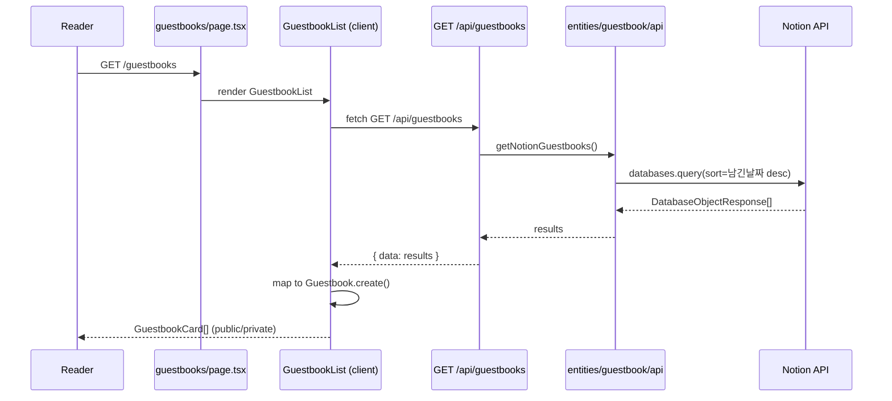
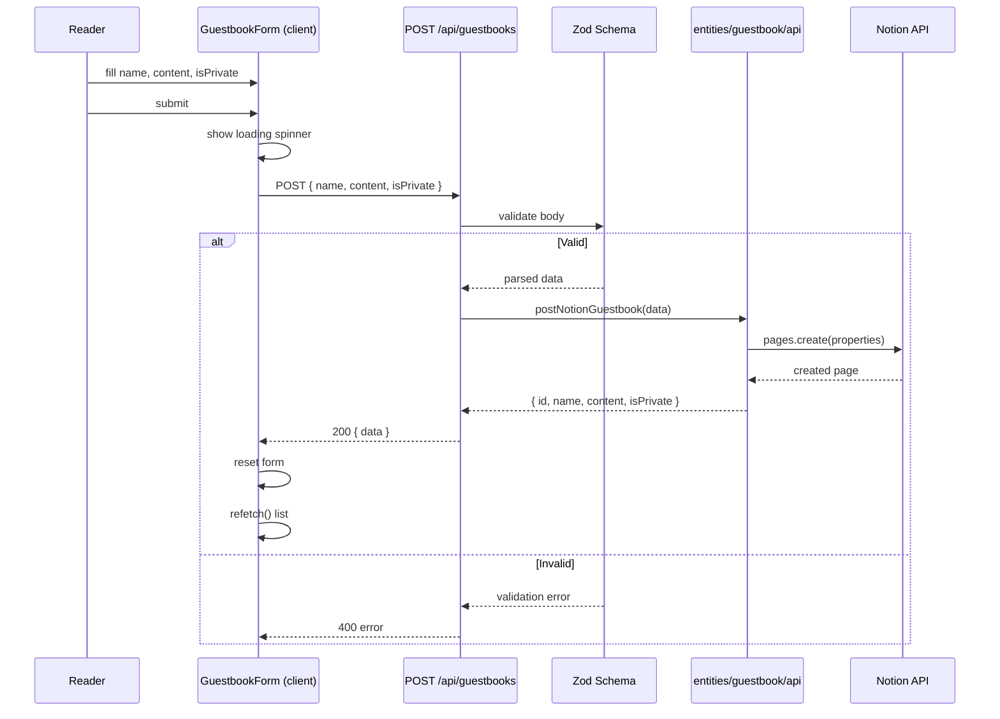
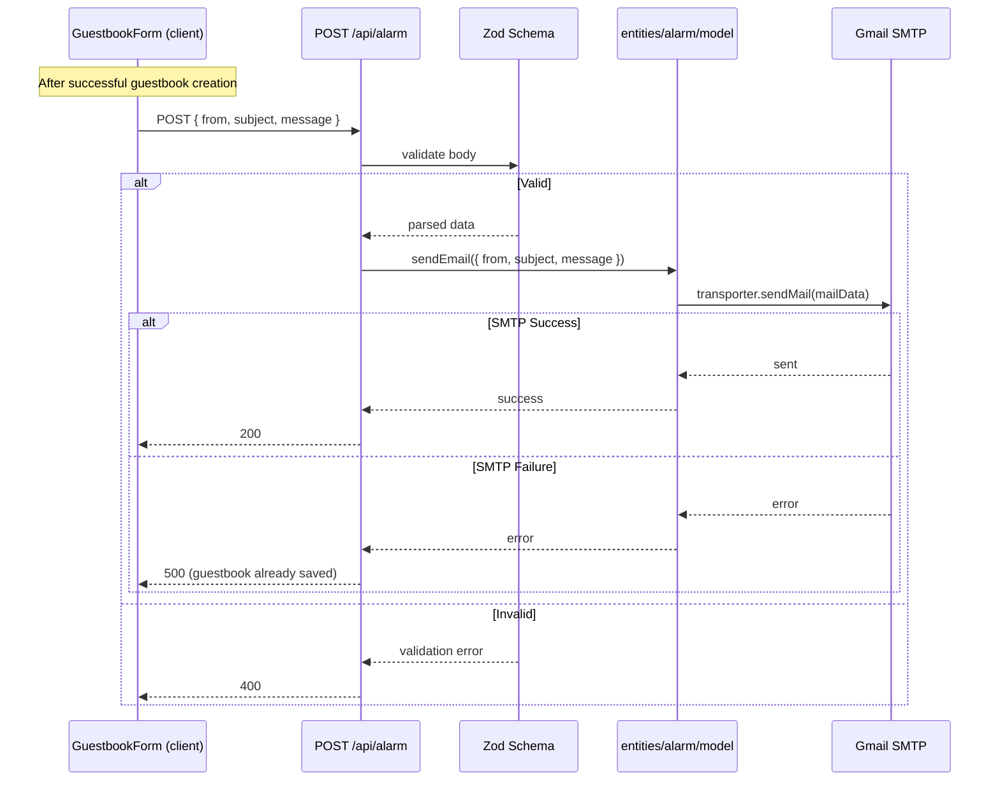

<!-- Created: 2026-04-06 | Last Modified: 2026-04-06 | Status: Active -->
<!-- @reference: [use-cases](use-cases.md) | [api-spec](api-spec.md) -->

> [← Use Cases](use-cases.md) | [API Spec →](api-spec.md)

# Guestbook Domain — Sequence Diagrams

## Flow 1: View Guestbook Entries (UC-GB-01)

## Flow 2: Create Guestbook Entry (UC-GB-02)

## Flow 3: Email Notification (UC-GB-03)

## Error Handling

| Scenario | HTTP Status | Effect on Guestbook |
|----------|------------|-------------------|
| Zod validation fails (guestbook) | 400 | Not created |
| Notion API fails (guestbook) | 500 | Not created |
| Zod validation fails (alarm) | 400 | Already saved |
| Gmail SMTP fails (alarm) | 500 | Already saved |

> **All Documents**
> [Requirements](../requirements/requirements.md) | [User Stories](../requirements/user-stories.md) | [Use Cases](use-cases.md) | **[Sequence Diagram]** | [API Spec](api-spec.md) | [Test Spec](test-spec.md)
