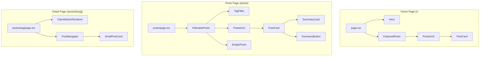

<!-- Created: 2026-04-06 | Last Modified: 2026-04-06 | Status: Active -->
<!-- @reference: [sequence-diagram](sequence-diagram.md) | [test-spec](test-spec.md) -->

> [← Sequence Diagram](sequence-diagram.md) | [Test Spec →](test-spec.md)

# Post Domain — Component Specification

## UI Overview

| View | URL | Access | Related Use Cases |
|------|-----|--------|-------------------|
| Home Page | `/` | Public | UC-POST-01 |
| Posts List | `/posts` | Public | UC-POST-01, UC-POST-03 |
| Post Detail | `/posts/[slug]` | Public | UC-POST-02, UC-POST-04 |

### Responsive Strategy

| Breakpoint | Layout |
|-----------|--------|
| Mobile (< 640px) | 1-column grid, tag filter above posts |
| Tablet (640-1024px) | 2-column grid |
| Desktop (> 1024px) | 4-column grid, sticky tag sidebar |

## Component Tree



## Component Classification

| Type | Count | Components |
|------|-------|------------|
| Page (Server) | 3 | `page.tsx`, `posts/page.tsx`, `posts/[slug]/page.tsx` |
| Feature (Server) | 3 | `FeaturedPosts`, `PostNavigator`, `PostsGrid` |
| Feature (Client) | 3 | `FilterablePosts`, `TagFilter`, `ClientNotionRenderer` |
| UI (Server) | 2 | `PostCard`, `SmallPostCard` |
| UI (Server) | 1 | `EmptyPosts` |

## Page Components

### Home Page (`src/app/page.tsx`)

- **Type**: Server Component
- **ISR**: 180 seconds
- **Renders**: `Hero` + `FeaturedPosts`

### Posts Page (`src/app/posts/page.tsx`)

- **Type**: Server Component
- **ISR**: 180 seconds
- **Data Fetching**: `getNotionPosts()`, `getNotionPostDatabaseTags()`
- **Renders**: `FilterablePosts` with server-fetched data

### Post Detail (`src/app/posts/[slug]/page.tsx`)

- **Type**: Server Component with dynamic route
- **SSG**: `generateStaticParams()` pre-renders all slugs
- **Data Fetching**: `getSlugMap()`, `getNotionPage()`, `getNotionPosts()`
- **Metadata**: Dynamic `generateMetadata()` from post title
- **Renders**: `ClientNotionRenderer` + `PostNavigator`

## Feature Components

### FeaturedPosts

```typescript
// src/features/post/ui/featured-post.tsx — Server Component
// No props — fetches data internally
export const FeaturedPosts: () => Promise<JSX.Element>
```

- Fetches all posts via `getNotionPosts()`
- Transforms to `Post` models via `Post.create()`
- Renders `PostsGrid`

### FilterablePosts

```typescript
// src/features/post/ui/filterable-post.tsx — Client Component
interface FilterablePostsProps {
  tagDataList: TagDatabaseResponse[];
  dataList: DatabaseObjectResponse[];
}
```

- Client-side state: `selectedTags: Set<string>`
- Filtering logic: OR condition across selected tags
- Derives active tags from actual posts (not all database tags)
- Renders `TagFilter` + `PostsGrid` or `EmptyPosts`

### TagFilter

```typescript
// src/features/tag/ui/tag-filter.tsx — Client Component
interface TagFilterProps {
  tags: Tag[];
  selectedTags: Set<string>;
  setSelectedTags: Dispatch<SetStateAction<Set<string>>>;
}
```

- Sticky sidebar with scrollable tag list
- Scroll hint when content overflows
- Tooltip explains multi-select behavior

### PostNavigator

```typescript
// src/features/post/ui/post-navigator.tsx — Server Component
interface PostNavigatorProps {
  id: string; // current post ID
}
```

- Fetches all posts, finds current post
- Filters posts sharing tags with current post
- Sorts by date proximity, takes up to 4
- Renders `SmallPostCard` in 2-column grid

### ClientNotionRenderer

```typescript
// src/features/post/ui/client-notion-renderer.tsx — Client Component
interface ClientNotionRendererProps {
  recordMap: ExtendedRecordMap;
}
```

- Renders Notion content via `react-notion-x`
- Loads Code, Collection, Equation components
- Theme-aware (dark/light mode via `useTheme()`)

## Shared UI Components

### PostCard

```typescript
// src/features/post/ui/post-card.tsx — Server Component
interface PostCardProps {
  post: Post;
}
```

- Link to `/posts/{slugifiedTitle}`
- Cover image (160px height) with gradient overlay
- Publish date, tag chips, truncated title (2 lines)
- Shows `SummaryCard` if `aiSummarized`, otherwise `SummaryButton`

### SmallPostCard

```typescript
// src/features/post/ui/small-post-card.tsx — Server Component
interface SmallPostCardProps {
  post: Post;
}
```

- Compact card with icon, title, tags
- Used in `PostNavigator` for related posts

### EmptyPosts

```typescript
// src/features/post/ui/empty-posts.tsx — Server Component
// No props
```

- Shown when tag filter yields no results
- Static Korean message

## State Management

| State | Type | Location | Description |
|-------|------|----------|-------------|
| `selectedTags` | Client | `FilterablePosts` | Set of selected tag names for filtering |
| Post data | Server | ISR cache | Notion posts cached via `nextServerCache` |
| Tag data | Server | ISR cache | Notion tags cached via `nextServerCache` |

## API Integration

| Endpoint | Method | Caching | Source |
|----------|--------|---------|--------|
| Notion `databases.query` | Server | `nextServerCache(["posts"])` | `entities/post/api` |
| Notion `databases.retrieve` | Server | `nextServerCache(["tags"])` | `entities/post/api` |
| Notion `getPage` (unofficial) | Server | None | `entities/post/api` |

> **All Documents**
> [Requirements](../requirements/requirements.md) | [User Stories](../requirements/user-stories.md) | [Use Cases](use-cases.md) | [Sequence Diagram](sequence-diagram.md) | **[Component Spec]** | [Test Spec](test-spec.md)
