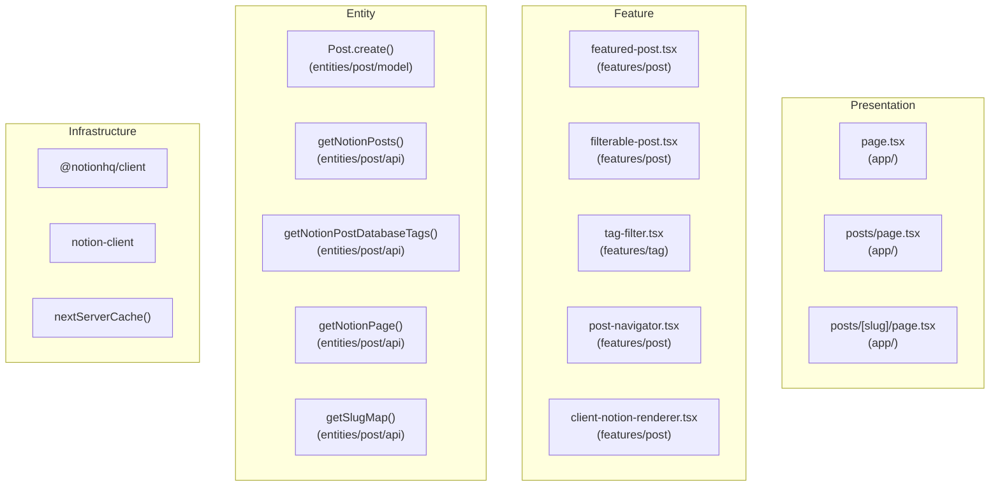
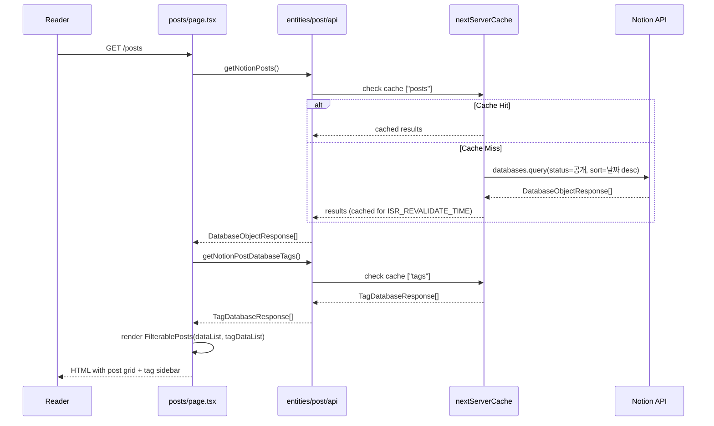
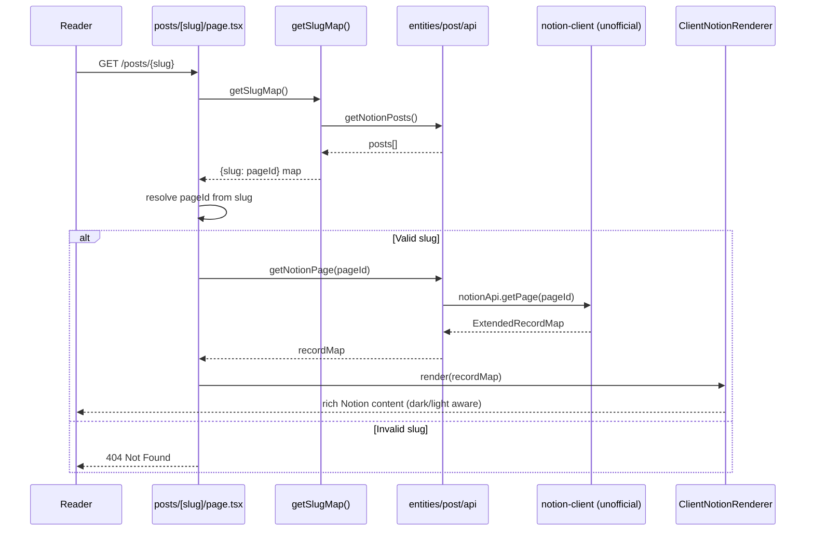
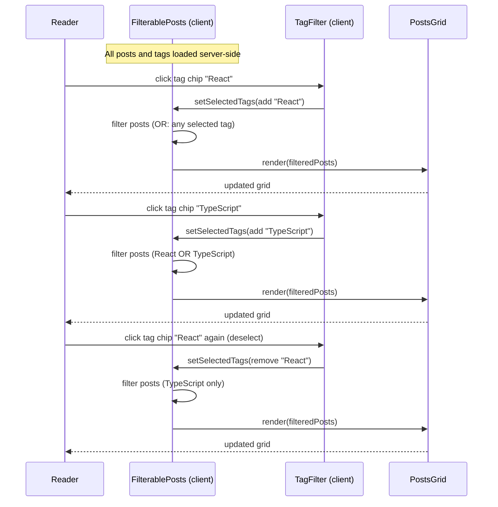
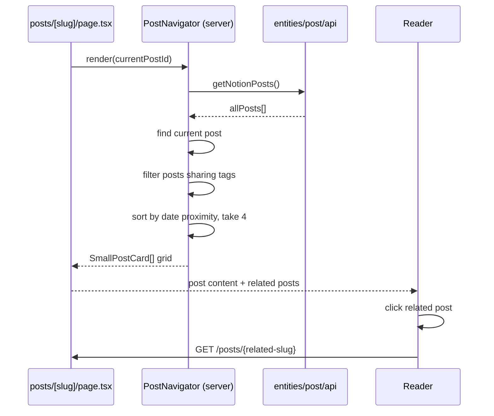
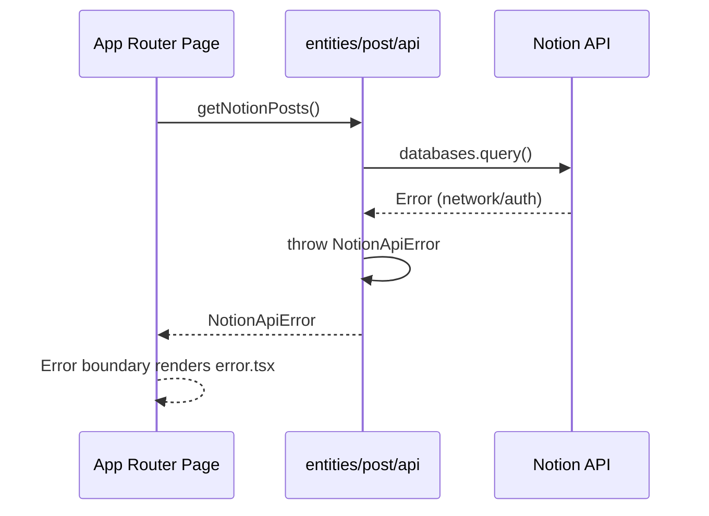

<!-- Created: 2026-04-06 | Last Modified: 2026-04-06 | Status: Active -->
<!-- @reference: [use-cases](use-cases.md) | [component-spec](component-spec.md) -->

> [← Use Cases](use-cases.md) | [Component Spec →](component-spec.md)

# Post Domain — Sequence Diagrams

## Architecture Layers

## Flow 1: Post List Loading (UC-POST-01)

## Flow 2: Post Detail Rendering (UC-POST-02)

## Flow 3: Tag Filtering (UC-POST-03)

## Flow 4: Related Post Navigation (UC-POST-04)

## Error Handling Flows

## Performance: Caching Strategy

| Function | Cache Key | Revalidation | Tags |
|----------|-----------|-------------|------|
| `getNotionPosts()` | `["posts"]` | `ISR_REVALIDATE_TIME` | — |
| `getNotionPostDatabaseTags()` | `["tags"]` | `ISR_REVALIDATE_TIME` | — |
| `getNotionPage()` | None (not cached) | — | — |
| `getSlugMap()` | None (derived from `getNotionPosts`) | — | — |

> **All Documents**
> [Requirements](../requirements/requirements.md) | [User Stories](../requirements/user-stories.md) | [Use Cases](use-cases.md) | **[Sequence Diagram]** | [Component Spec](component-spec.md) | [Test Spec](test-spec.md)
