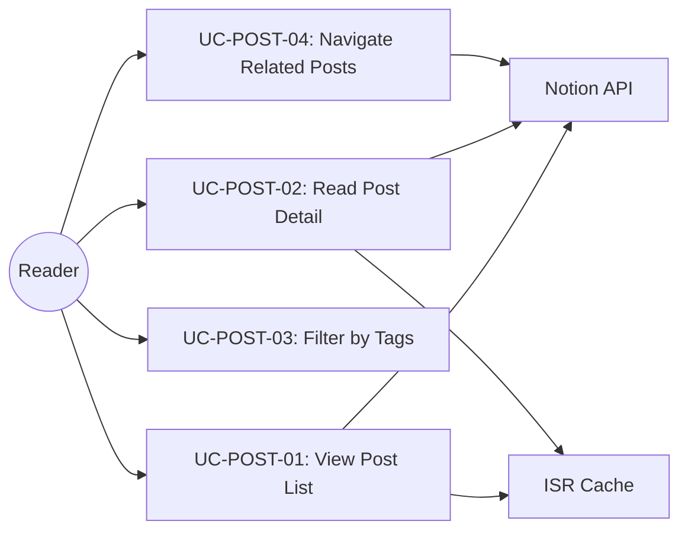

<!-- Created: 2026-04-03 | Last Modified: 2026-04-03 | Status: Active -->
<!-- @reference: [user-stories](../requirements/user-stories.md) | [sequence-diagram](sequence-diagram.md) -->

> [← User Stories](../requirements/user-stories.md) | [Sequence Diagram →](sequence-diagram.md)

# Post Domain — Use Cases

## Actors

| Actor | Type | Description |
|-------|------|-------------|
| Reader | Primary | Browses and reads blog posts |
| Notion API | Secondary | Provides post data and page content |
| ISR Cache | Secondary | Caches rendered pages |

## Use Case Diagram

## UC-POST-01: View Post List

| Field | Value |
|-------|-------|
| ID | UC-POST-01 |
| Name | View Post List |
| Actors | Reader, Notion API, ISR Cache |
| Related Requirements | FR-POST-01, FR-POST-05 |
| Related User Stories | US-01 |

### Description
Reader navigates to the home page or posts page and sees a grid of published blog posts.

### Preconditions
- Notion database contains posts with status "공개"

### Main Flow

1. Reader requests `/` (home) or `/posts` page
2. Server checks ISR cache for page data
3. If cache valid, serve cached page
4. If cache stale/miss, query Notion database for published posts (status = "공개", sorted by date desc)
5. Transform Notion responses to `Post` domain models via `Post.create()`
6. Render post grid with `PostCard` components
7. Cache the rendered page

### Postconditions
- Reader sees a responsive grid of post cards

### Alternative Flows
- **AF-01**: No published posts → Empty grid rendered
- **AF-02**: Notion API failure → `NotionApiError` thrown, error page displayed

## UC-POST-02: Read Post Detail

| Field | Value |
|-------|-------|
| ID | UC-POST-02 |
| Name | Read Post Detail |
| Actors | Reader, Notion API (official + unofficial), ISR Cache |
| Related Requirements | FR-POST-02 |
| Related User Stories | US-02 |

### Description
Reader clicks a post card and views the full Notion page content.

### Preconditions
- Post exists and is published

### Main Flow

1. Reader clicks post card, navigating to `/posts/[slug]`
2. Server resolves slug to Notion page ID via `getSlugMap()`
3. Fetch page content via unofficial Notion client (`getNotionPage()`)
4. Render content with `ClientNotionRenderer` (react-notion-x)
5. Render `PostNavigator` with related posts

### Postconditions
- Full Notion content displayed with proper formatting
- Related posts shown below content

### Alternative Flows
- **AF-01**: Invalid slug → `notFound()` called, 404 page
- **AF-02**: Page fetch failure → Error boundary displayed

## UC-POST-03: Filter by Tags

| Field | Value |
|-------|-------|
| ID | UC-POST-03 |
| Name | Filter Posts by Tags |
| Actors | Reader |
| Related Requirements | FR-POST-03 |
| Related User Stories | US-03 |

### Description
Reader selects tags in the sidebar to filter the post list client-side.

### Preconditions
- Posts page loaded with all posts and tag data

### Main Flow

1. Reader clicks a tag chip in `TagFilter` sidebar
2. `FilterablePosts` updates `selectedTags` state
3. Posts are filtered: show posts that have ANY of the selected tags
4. `PostsGrid` re-renders with filtered posts

### Postconditions
- Only matching posts are displayed
- Selected tags are visually highlighted

### Alternative Flows
- **AF-01**: No posts match → `EmptyPosts` component displayed
- **AF-02**: All tags deselected → All posts shown

## UC-POST-04: Navigate Related Posts

| Field | Value |
|-------|-------|
| ID | UC-POST-04 |
| Name | Navigate to Related Posts |
| Actors | Reader, Notion API |
| Related Requirements | FR-POST-04 |
| Related User Stories | US-04 |

### Description
Reader sees and clicks related posts at the bottom of a post detail page.

### Preconditions
- Post detail page is loaded

### Main Flow

1. `PostNavigator` fetches all posts
2. Filter posts sharing tags with current post
3. Sort by publish date proximity to current post
4. Display up to 4 closest related posts as `SmallPostCard` components
5. Reader clicks a related post → Navigate to that post's detail page

### Postconditions
- Reader is on the new post's detail page

## Use Case Relationships

| Use Case | Includes | Extends |
|----------|----------|---------|
| UC-POST-01 | — | UC-POST-03 (tag filtering) |
| UC-POST-02 | UC-POST-04 (related posts) | — |

> **All Documents**
> [Requirements](../requirements/requirements.md) | [User Stories](../requirements/user-stories.md) | **[Use Cases]** | [Sequence Diagram](sequence-diagram.md) | [Component Spec](component-spec.md) | [Test Spec](test-spec.md)
