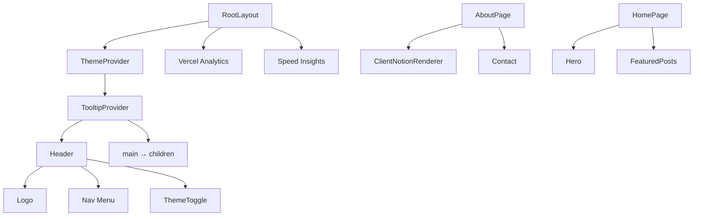

<!-- Created: 2026-04-07 | Last Modified: 2026-04-07 | Status: Active -->
<!-- @reference: [sequence-diagram](sequence-diagram.md) | [test-spec](test-spec.md) -->

> [← Sequence Diagram](sequence-diagram.md) | [Test Spec →](test-spec.md)

# Site Domain — Component Specification

## UI Overview

| View | URL | Access | Related Use Cases |
|------|-----|--------|-------------------|
| Root Layout | (all pages) | Public | UC-SITE-01, UC-SITE-02 |
| Home Hero | `/` | Public | UC-SITE-03 |
| About Page | `/about` | Public | UC-SITE-03 |
| Sitemap | `/sitemap.xml` | Public (crawlers) | UC-SITE-04 |
| Robots | `/robots.txt` | Public (crawlers) | UC-SITE-04 |

## Component Tree



## Component Classification

| Type | Count | Components |
|------|-------|------------|
| Layout (Server) | 1 | `RootLayout` |
| Page (Server) | 2 | `AboutPage`, `HomePage` |
| Widget (Server) | 1 | `Header` |
| Feature (Client) | 2 | `ThemeToggle`, `ThemeProvider` |
| Feature (Server) | 2 | `Hero`, `Contact` |
| API Route | 2 | `api/sitemap`, `robots.ts` |

## Layout Components

### RootLayout (`src/app/layout.tsx`)

- **Type**: Server Component
- **Props**: `{ children: React.ReactNode }`
- **Behavior**:
  - Loads Pretendard local font
  - Wraps app in `ThemeProvider` (system theme detection)
  - Wraps in `TooltipProvider`
  - Renders `Header` above `<main>{children}</main>`
  - Includes Vercel Analytics + Speed Insights
- **Metadata**: title template `%s | metis-blog`, description, icon

## Widget Components

### Header (`src/widgets/ui/header.tsx`)

- **Type**: Server Component
- **Props**: None
- **Renders**:
  - Logo (mascot image + blog title)
  - Nav menu: 소개, 방명록, 포스트
  - `ThemeToggle` on the right

## Feature Components

### ThemeProvider (`src/features/theme/hooks/theme-provider.tsx`)

```typescript
// Client component
type ThemeProviderProps = ComponentProps<typeof NextThemesProvider>;
```

- Wraps `next-themes` provider
- Passes through all props (typically: `attribute="class"`, `defaultTheme="system"`, `enableSystem`)

### ThemeToggle (`src/features/theme/ui/theme-toggle.tsx`)

```typescript
// Client component, no props
```

- Uses `useTheme()` from `next-themes`
- Renders `LoadingDot` until `mounted=true` (avoids hydration mismatch)
- Shows moon icon in light mode, sun icon in dark mode
- Click toggles between "light" and "dark"

### Hero (`src/features/profile/ui/hero.tsx`)

```typescript
// Server component, no props
```

- Renders mascot image (240×240, `priority` flag)
- Korean greeting and blog description
- GitHub link button with tooltip
- Centered layout

### Contact (`src/features/profile/ui/contact.tsx`)

```typescript
// Server component, no props
```

- Displays email (`dbsdndwo12@gmail.com`)
- Maps over `LINKS` array → renders GitHub, LinkedIn, Notion icons
- Each link has a tooltip
- Used on About page

## Page Components

### HomePage (`src/app/page.tsx`)

- **Type**: Server Component
- **ISR**: 180s
- **Renders**: `Hero` + `FeaturedPosts`

### AboutPage (`src/app/about/page.tsx`)

- **Type**: Server Component (async)
- **ISR**: 180s
- **Data Fetching**: `getNotionAboutPage()`
- **Renders**: `ClientNotionRenderer` + `Contact`
- **Metadata**: title "about", Korean description

## API Route Components

### Sitemap (`src/app/api/sitemap/route.ts`)

- **Type**: GET handler
- **Source**: `getNotionPosts()`
- **Output**: XML
- **Hardcoded routes**: `/` (priority 1.0), `/about`, `/posts`, `/guestbooks` (priority 0.8)
- **Dynamic routes**: All published posts
- **Change frequency**: daily

### Robots (`src/app/robots.ts`)

- **Type**: Next.js metadata route
- **Returns**: `MetadataRoute.Robots`
- **Rules**: Allow `/`, Disallow `/private/`
- **Sitemap**: `${BLOG_URL}/sitemap.xml`

## State Management

| State | Type | Location | Description |
|-------|------|----------|-------------|
| Theme | Client (next-themes) | `localStorage` | Light/dark/system |
| Mounted | Client | `ThemeToggle` | Prevents hydration mismatch |
| About content | Server | ISR cache (180s) | Notion page record map |

## Responsive Strategy

| Breakpoint | Header Layout |
|-----------|---------------|
| Mobile | Compact nav, smaller logo |
| Desktop | Full nav menu, larger logo |

> **All Documents**
> [Requirements](../requirements/requirements.md) | [User Stories](../requirements/user-stories.md) | [Use Cases](use-cases.md) | [Sequence Diagram](sequence-diagram.md) | **[Component Spec]** | [Test Spec](test-spec.md)
