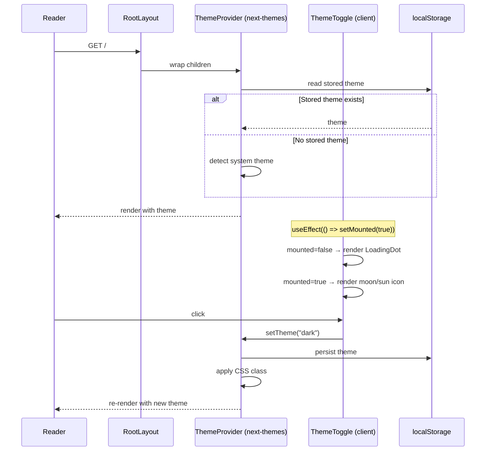
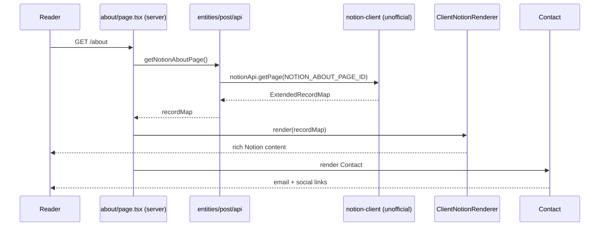
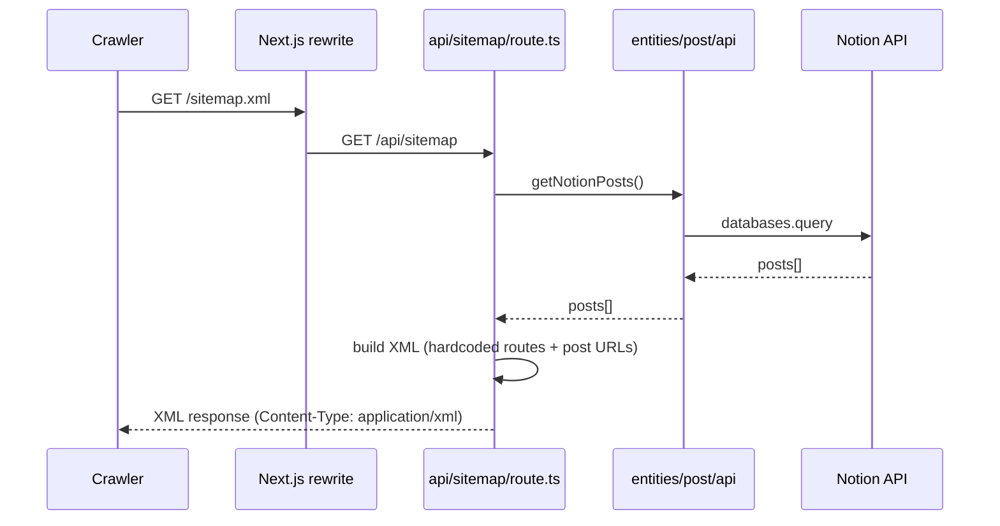
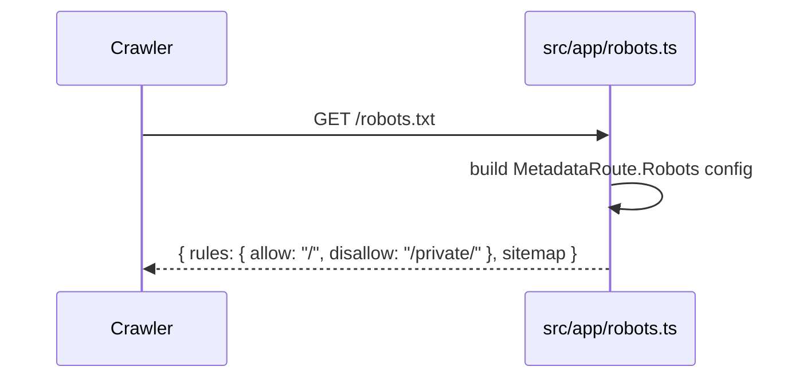
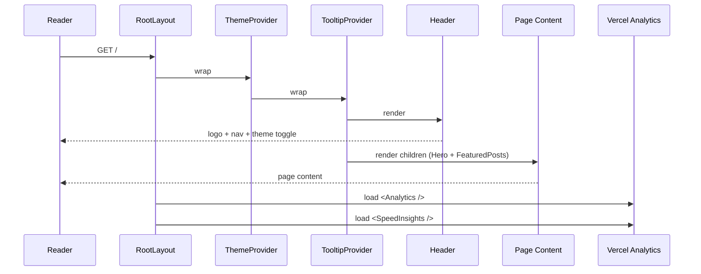

<!-- Created: 2026-04-07 | Last Modified: 2026-04-07 | Status: Active -->
<!-- @reference: [use-cases](use-cases.md) | [component-spec](component-spec.md) -->

> [← Use Cases](use-cases.md) | [Component Spec →](component-spec.md)

# Site Domain — Sequence Diagrams

## Flow 1: Theme Toggle (UC-SITE-01)

## Flow 2: About Page (UC-SITE-03)

## Flow 3: Sitemap Generation (UC-SITE-04)

## Flow 4: Robots.txt (UC-SITE-04)

## Flow 5: Initial Page Load (UC-SITE-02 + UC-SITE-07)

## Performance Notes

| Aspect | Strategy |
|--------|----------|
| Hero image | `priority` flag for Next.js Image (LCP optimization) |
| About page | ISR 180s revalidation |
| Pretendard font | Local font (no CDN, no FOUT) |
| Theme hydration | Mounted check prevents mismatch |

> **All Documents**
> [Requirements](../requirements/requirements.md) | [User Stories](../requirements/user-stories.md) | [Use Cases](use-cases.md) | **[Sequence Diagram]** | [Component Spec](component-spec.md) | [Test Spec](test-spec.md)
