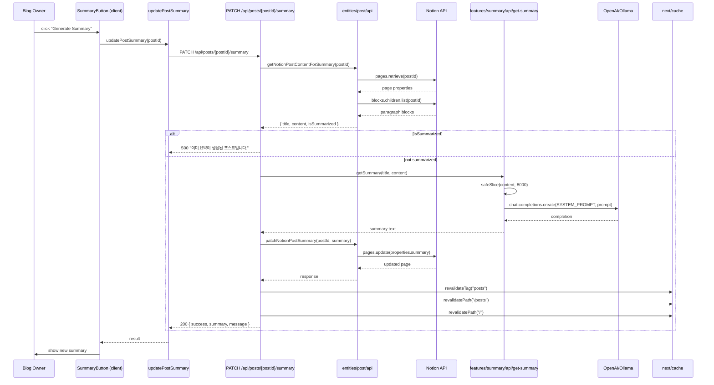
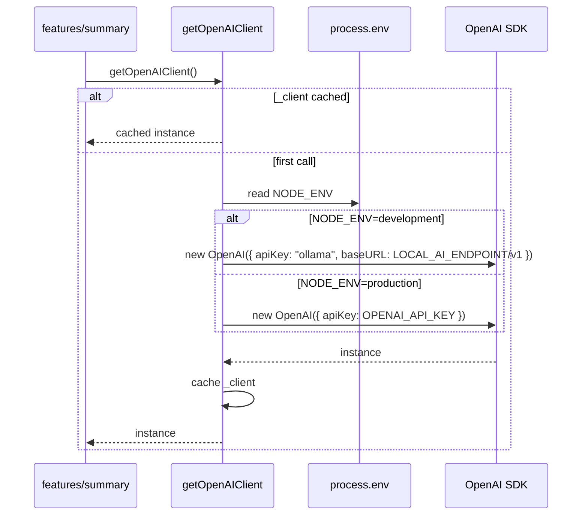
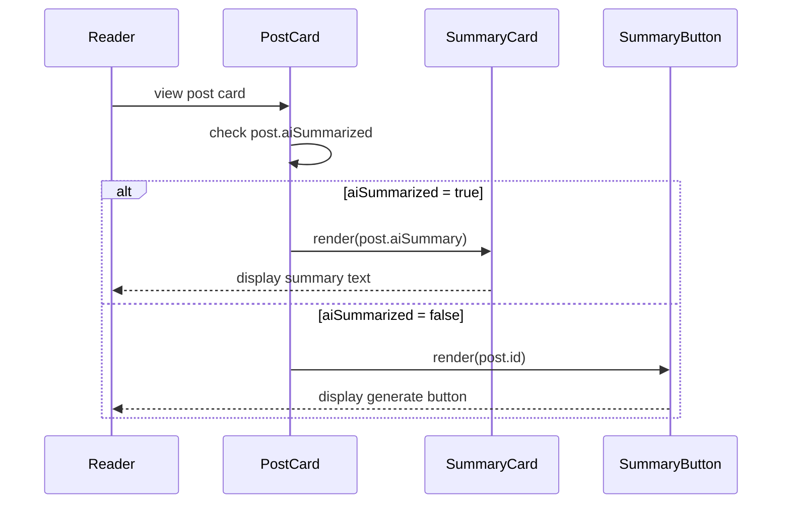
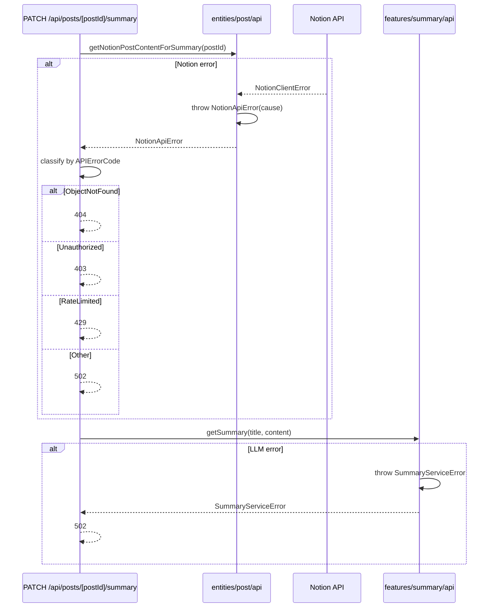

<!-- Created: 2026-04-07 | Last Modified: 2026-04-07 | Status: Active -->
<!-- @reference: [use-cases](use-cases.md) | [api-spec](api-spec.md) -->

> [← Use Cases](use-cases.md) | [API Spec →](api-spec.md)

# Summary Domain — Sequence Diagrams

## Flow 1: Generate and Store Summary (UC-SUMMARY-01)

## Flow 2: LLM Selection (UC-SUMMARY-02)

## Flow 3: Display Summary in UI (UC-SUMMARY-03)

## Error Handling

## Performance Notes

| Aspect | Strategy |
|--------|---------|
| Content size | `safeSlice(plainText, 8000)` truncates word-tokens |
| LLM determinism | `temperature: 0.2` for stable output |
| Output length | `max_tokens: 50` for concise summaries |
| Cache invalidation | After Notion update, refresh ISR caches immediately |

> **All Documents**
> [Requirements](../requirements/requirements.md) | [User Stories](../requirements/user-stories.md) | [Use Cases](use-cases.md) | **[Sequence Diagram]** | [API Spec](api-spec.md) | [Test Spec](test-spec.md)
