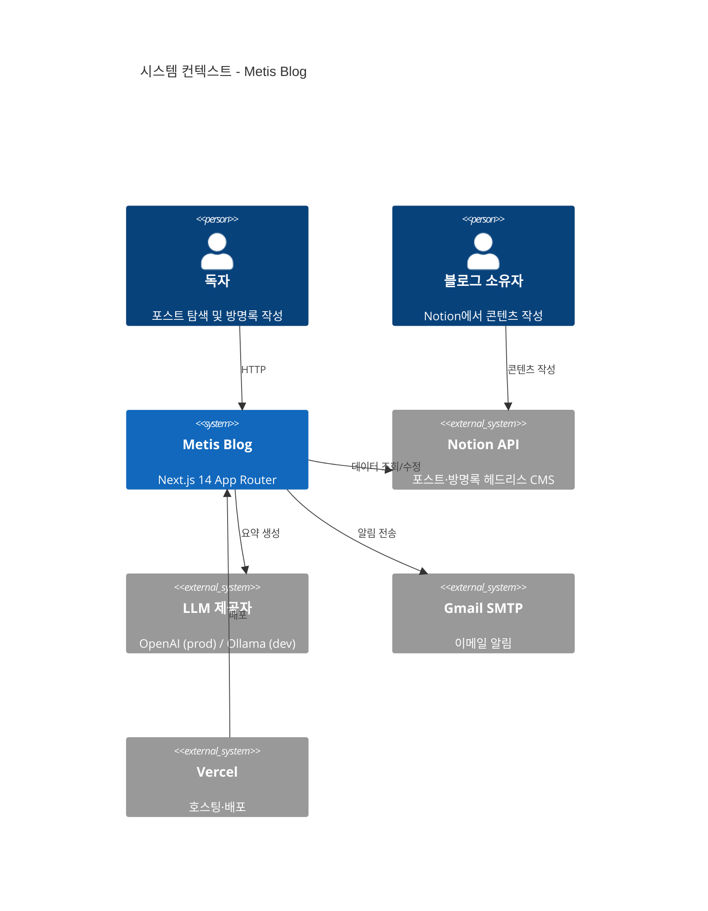
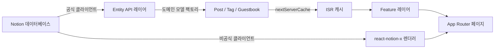

<!-- Created: 2026-04-03 | Last Modified: 2026-04-03 | Status: Active -->
<!-- Tech Stack: Next.js 14 (App Router), TypeScript (strict), Tailwind CSS, Notion API, OpenAI API -->
<!-- @reference: [config](config.md) | [infrastructure](infrastructure.md) -->

> [Config →](config.md) | [Infrastructure →](infrastructure.md)

# 아키텍처

## 시스템 개요

Metis Blog는 Next.js 14 (App Router)와 TypeScript로 구축된 개인 기술 블로그입니다. Notion을 헤드리스 CMS로, OpenAI/Ollama를 AI 포스트 요약에 사용합니다.

### 이해관계자

| 역할 | 설명 |
|------|------|
| 블로그 소유자 | Notion에서 글 작성, 방명록 관리, AI 요약 트리거 |
| 독자 | 포스트 탐색, 태그 필터링, AI 요약 확인, 방명록 작성 |
| AI 에이전트 | Claude Code / GitHub Copilot — 문서를 기반으로 기능 개발 |

### 시스템 컨텍스트



## 아키텍처 패턴: Feature-Sliced Design (FSD)

### 레이어 계층

```
app/     →  widgets/  →  features/  →  entities/  →  shared/
(라우트)    (레이아웃)    (기능)        (모델)        (유틸)
```

**임포트 규칙**: 각 레이어는 **같은 레벨 또는 하위**에서만 임포트 가능. 상위 임포트 금지.

### 레이어 책임

```
src/
├── app/           # Next.js App Router — 라우트, 레이아웃, API 엔드포인트
├── widgets/       # 복합 UI — Header, Footer (기능 간 레이아웃)
├── features/      # 사용자 기능 — 포스트, 방명록, AI 요약, 태그 필터, 테마, 프로필
├── entities/      # 도메인 모델 — Post, Tag, Guestbook, Alarm (Notion 클라이언트 래퍼)
└── shared/        # 공통 — 캐시, 로거, UI 프리미티브, 설정, API 클라이언트
```

### 모듈 목록

| 레이어 | 모듈 | 책임 | 의존성 |
|--------|------|------|--------|
| `app/` | `posts/` | 포스트 목록 및 상세 페이지 | `features/post`, `entities/post` |
| `app/` | `guestbooks/` | 방명록 페이지 | `features/guestbook` |
| `app/` | `about/` | 소개 페이지 | `features/profile` |
| `app/` | `api/guestbooks/` | 방명록 CRUD 엔드포인트 | `entities/guestbook`, `entities/alarm` |
| `app/` | `api/posts/[postId]/summary/` | AI 요약 PATCH 엔드포인트 | `features/summary`, `entities/post` |
| `app/` | `api/sitemap/` | 동적 사이트맵 생성 | `entities/post` |
| `app/` | `api/alarm/` | 이메일 알림 엔드포인트 | `entities/alarm` |
| `widgets/` | `header` | 사이트 네비게이션 + 테마 토글 | `features/theme` |
| `features/` | `post` | 포스트 카드, 그리드, 네비게이터, 필터링 | `entities/post`, `shared/ui` |
| `features/` | `tag` | 태그 필터 컴포넌트 | `entities/post` |
| `features/` | `guestbook` | 방명록 폼 및 목록 | `entities/guestbook`, `shared/ui` |
| `features/` | `summary` | AI 요약 카드 및 트리거 버튼 | `entities/post`, `shared/api` |
| `features/` | `profile` | 히어로 섹션, 연락처 정보 | `shared/ui` |
| `features/` | `theme` | 다크/라이트 모드 토글 | — |
| `entities/` | `post` | Post, Tag 도메인 모델 + Notion API | `shared/api`, `shared/lib` |
| `entities/` | `guestbook` | Guestbook 도메인 모델 + Notion API | `shared/api`, `shared/lib` |
| `entities/` | `alarm` | 이메일 서비스 (Nodemailer) | — |
| `shared/` | `api` | Notion, OpenAI 클라이언트 인스턴스 | `shared/config` |
| `shared/` | `config` | 캐시 타이밍, LLM 모델 설정 | — |
| `shared/` | `lib` | 캐시 래퍼, 에러 클래스, 로거, 유틸리티 | `shared/config` |
| `shared/` | `ui` | Button, Loading, Error, TagChip, Tooltip | — |

## 디자인 패턴

### Protected Constructor (도메인 모델)

모든 도메인 엔티티는 private 생성자와 static `create()` 팩토리 메서드를 사용합니다:

```typescript
export class Post {
  private constructor(
    public readonly id: string,
    public readonly title: string,
    // ...
  ) {}

  static create(page: DatabaseObjectResponse): Post {
    if (!isPostDatabaseResponse(page)) {
      throw new Error('Invalid post page structure');
    }
    return new Post(page.id, extractTitle(page), ...);
  }
}
```

**적용 대상**: `Post`, `Tag`, `Guestbook`

### 이중 Notion 클라이언트

두 개의 별도 Notion 라이브러리가 서로 다른 목적으로 사용됩니다:

| 클라이언트 | 라이브러리 | 인증 | 용도 |
|-----------|-----------|------|------|
| 공식 | `@notionhq/client` | `NOTION_KEY` (통합 토큰) | 데이터베이스 쿼리, 속성 업데이트 |
| 비공식 | `notion-client` + `react-notion-x` | `NOTION_TOKEN_V2` (브라우저 쿠키) | 리치 페이지 콘텐츠 렌더링 |

### 서버 사이드 캐싱

모든 Notion 데이터 페칭은 `src/shared/lib/cache.ts`의 `nextServerCache()`로 래핑되며, `src/shared/config/index.ts`의 ISR 재검증 시간과 함께 Next.js `unstable_cache`에 위임합니다.

### 환경 기반 LLM 선택

AI 요약 생성은 `NODE_ENV`에 따라 다른 제공자를 사용합니다:

| 환경 | 제공자 | 모델 | 엔드포인트 |
|------|--------|------|-----------|
| Development | Ollama (로컬) | `gemma3:1b` | `LOCAL_AI_ENDPOINT` (기본: `http://localhost:11434`) |
| Production | OpenAI | `gpt-4o-mini` | OpenAI API |

### 커스텀 에러 클래스

| 클래스 | 위치 | 용도 |
|--------|------|------|
| `NotionApiError` | `src/shared/lib/errors.ts` | Notion API 호출 실패 |
| `SummaryServiceError` | `src/shared/lib/errors.ts` | AI 요약 생성 실패 |

## 데이터 흐름



> **전체 문서**
> **[아키텍처]** | [설정](config.md) | [인프라](infrastructure.md) | [도메인](README.md)
