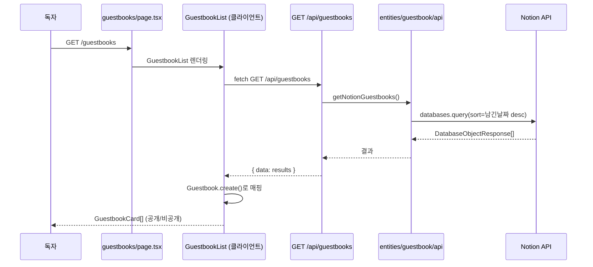
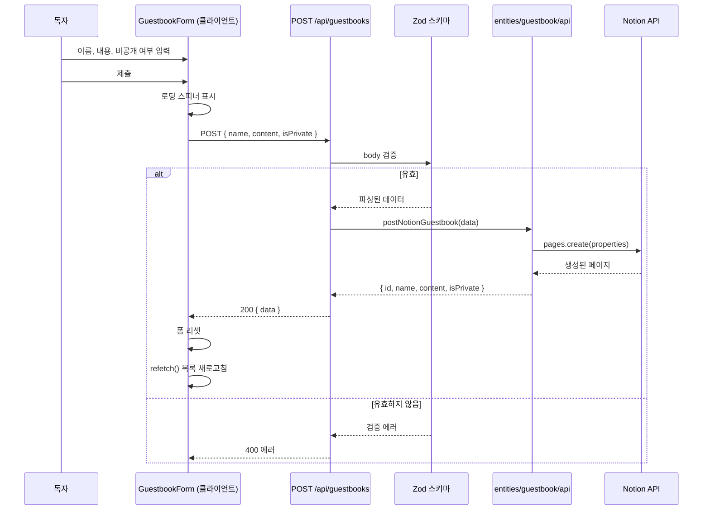
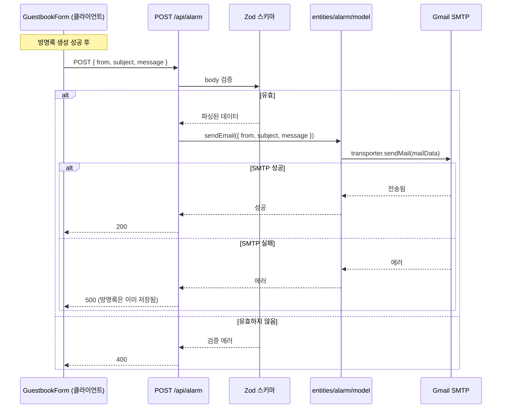

<!-- Created: 2026-04-06 | Last Modified: 2026-04-06 | Status: Active -->
<!-- @reference: [use-cases](use-cases.md) | [api-spec](api-spec.md) -->

> [← 유스케이스](use-cases.md) | [API 명세 →](api-spec.md)

# Guestbook 도메인 — 시퀀스 다이어그램

## 흐름 1: 방명록 목록 조회 (UC-GB-01)

## 흐름 2: 방명록 작성 (UC-GB-02)

## 흐름 3: 이메일 알림 (UC-GB-03)

## 에러 처리

| 시나리오 | HTTP 상태 | 방명록 영향 |
|---------|----------|-----------|
| Zod 검증 실패 (방명록) | 400 | 생성 안 됨 |
| Notion API 실패 (방명록) | 500 | 생성 안 됨 |
| Zod 검증 실패 (알람) | 400 | 이미 저장됨 |
| Gmail SMTP 실패 (알람) | 500 | 이미 저장됨 |

> **전체 문서**
> [요구사항](../requirements/requirements.md) | [유저 스토리](../requirements/user-stories.md) | [유스케이스](use-cases.md) | **[시퀀스 다이어그램]** | [API 명세](api-spec.md) | [테스트 명세](test-spec.md)
