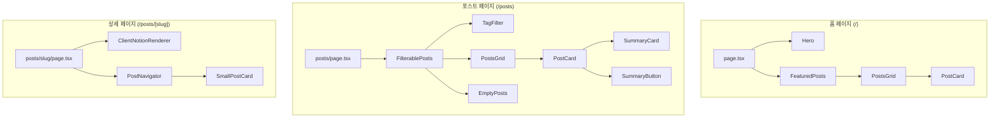

<!-- Created: 2026-04-06 | Last Modified: 2026-04-06 | Status: Active -->
<!-- @reference: [sequence-diagram](sequence-diagram.md) | [test-spec](test-spec.md) -->

> [← 시퀀스 다이어그램](sequence-diagram.md) | [테스트 명세 →](test-spec.md)

# Post 도메인 — 컴포넌트 명세

## UI 개요

| 뷰 | URL | 접근 | 관련 유스케이스 |
|---|-----|------|--------------|
| 홈 페이지 | `/` | 공개 | UC-POST-01 |
| 포스트 목록 | `/posts` | 공개 | UC-POST-01, UC-POST-03 |
| 포스트 상세 | `/posts/[slug]` | 공개 | UC-POST-02, UC-POST-04 |

### 반응형 전략

| 브레이크포인트 | 레이아웃 |
|-------------|---------|
| 모바일 (< 640px) | 1열 그리드, 태그 필터 포스트 위 |
| 태블릿 (640-1024px) | 2열 그리드 |
| 데스크톱 (> 1024px) | 4열 그리드, 고정 태그 사이드바 |

## 컴포넌트 트리



## 컴포넌트 분류

| 유형 | 수 | 컴포넌트 |
|------|---|---------|
| 페이지 (서버) | 3 | `page.tsx`, `posts/page.tsx`, `posts/[slug]/page.tsx` |
| 기능 (서버) | 3 | `FeaturedPosts`, `PostNavigator`, `PostsGrid` |
| 기능 (클라이언트) | 3 | `FilterablePosts`, `TagFilter`, `ClientNotionRenderer` |
| UI (서버) | 2 | `PostCard`, `SmallPostCard` |
| UI (서버) | 1 | `EmptyPosts` |

## 페이지 컴포넌트

### 홈 페이지 (`src/app/page.tsx`)

- **유형**: 서버 컴포넌트
- **ISR**: 180초
- **렌더링**: `Hero` + `FeaturedPosts`

### 포스트 페이지 (`src/app/posts/page.tsx`)

- **유형**: 서버 컴포넌트
- **ISR**: 180초
- **데이터 페칭**: `getNotionPosts()`, `getNotionPostDatabaseTags()`
- **렌더링**: 서버에서 가져온 데이터로 `FilterablePosts`

### 포스트 상세 (`src/app/posts/[slug]/page.tsx`)

- **유형**: 동적 라우트 서버 컴포넌트
- **SSG**: `generateStaticParams()`로 모든 slug 사전 렌더링
- **데이터 페칭**: `getSlugMap()`, `getNotionPage()`, `getNotionPosts()`
- **메타데이터**: 포스트 제목으로 동적 `generateMetadata()`
- **렌더링**: `ClientNotionRenderer` + `PostNavigator`

## 기능 컴포넌트

### FeaturedPosts

```typescript
// src/features/post/ui/featured-post.tsx — 서버 컴포넌트
// Props 없음 — 내부에서 데이터 페칭
export const FeaturedPosts: () => Promise<JSX.Element>
```

- `getNotionPosts()`로 모든 포스트 조회
- `Post.create()`로 `Post` 모델 변환
- `PostsGrid` 렌더링

### FilterablePosts

```typescript
// src/features/post/ui/filterable-post.tsx — 클라이언트 컴포넌트
interface FilterablePostsProps {
  tagDataList: TagDatabaseResponse[];
  dataList: DatabaseObjectResponse[];
}
```

- 클라이언트 사이드 상태: `selectedTags: Set<string>`
- 필터링 로직: 선택된 태그에 대한 OR 조건
- 실제 포스트에 존재하는 태그만 활성으로 파생
- `TagFilter` + `PostsGrid` 또는 `EmptyPosts` 렌더링

### TagFilter

```typescript
// src/features/tag/ui/tag-filter.tsx — 클라이언트 컴포넌트
interface TagFilterProps {
  tags: Tag[];
  selectedTags: Set<string>;
  setSelectedTags: Dispatch<SetStateAction<Set<string>>>;
}
```

- 스크롤 가능한 태그 목록의 고정 사이드바
- 콘텐츠 오버플로우 시 스크롤 힌트
- 다중 선택 동작 설명 툴팁

### PostNavigator

```typescript
// src/features/post/ui/post-navigator.tsx — 서버 컴포넌트
interface PostNavigatorProps {
  id: string; // 현재 포스트 ID
}
```

- 모든 포스트 조회 후 현재 포스트 찾기
- 현재 포스트와 태그를 공유하는 포스트 필터링
- 날짜 근접성으로 정렬, 최대 4개 선택
- 2열 그리드에 `SmallPostCard` 렌더링

### ClientNotionRenderer

```typescript
// src/features/post/ui/client-notion-renderer.tsx — 클라이언트 컴포넌트
interface ClientNotionRendererProps {
  recordMap: ExtendedRecordMap;
}
```

- `react-notion-x`로 Notion 콘텐츠 렌더링
- Code, Collection, Equation 컴포넌트 로드
- 테마 인식 (다크/라이트 모드, `useTheme()`)

## 공유 UI 컴포넌트

### PostCard

```typescript
// src/features/post/ui/post-card.tsx — 서버 컴포넌트
interface PostCardProps {
  post: Post;
}
```

- `/posts/{slugifiedTitle}`로 링크
- 커버 이미지 (160px 높이) + 그라데이션 오버레이
- 발행일, 태그 칩, 말줄임 제목 (2줄)
- `aiSummarized`면 `SummaryCard`, 아니면 `SummaryButton`

### SmallPostCard

```typescript
// src/features/post/ui/small-post-card.tsx — 서버 컴포넌트
interface SmallPostCardProps {
  post: Post;
}
```

- 아이콘, 제목, 태그가 있는 콤팩트 카드
- `PostNavigator`에서 관련 포스트용

### EmptyPosts

```typescript
// src/features/post/ui/empty-posts.tsx — 서버 컴포넌트
// Props 없음
```

- 태그 필터 결과 없을 때 표시
- 한국어 정적 메시지

## 상태 관리

| 상태 | 유형 | 위치 | 설명 |
|------|------|------|------|
| `selectedTags` | 클라이언트 | `FilterablePosts` | 필터링용 선택된 태그명 Set |
| 포스트 데이터 | 서버 | ISR 캐시 | `nextServerCache`로 캐시된 Notion 포스트 |
| 태그 데이터 | 서버 | ISR 캐시 | `nextServerCache`로 캐시된 Notion 태그 |

## API 연동

| 엔드포인트 | 메서드 | 캐싱 | 소스 |
|----------|--------|------|------|
| Notion `databases.query` | 서버 | `nextServerCache(["posts"])` | `entities/post/api` |
| Notion `databases.retrieve` | 서버 | `nextServerCache(["tags"])` | `entities/post/api` |
| Notion `getPage` (비공식) | 서버 | 없음 | `entities/post/api` |

> **전체 문서**
> [요구사항](../requirements/requirements.md) | [유저 스토리](../requirements/user-stories.md) | [유스케이스](use-cases.md) | [시퀀스 다이어그램](sequence-diagram.md) | **[컴포넌트 명세]** | [테스트 명세](test-spec.md)
