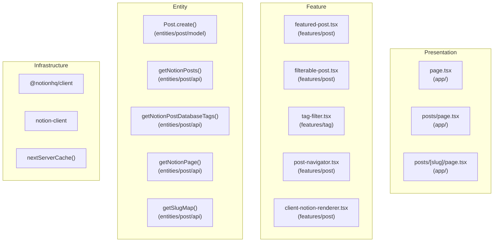
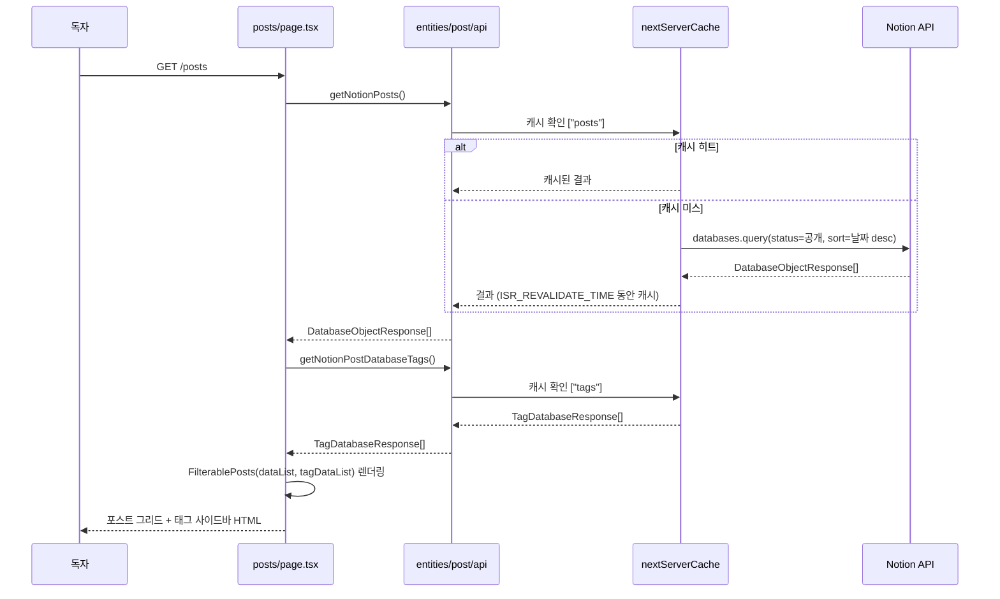
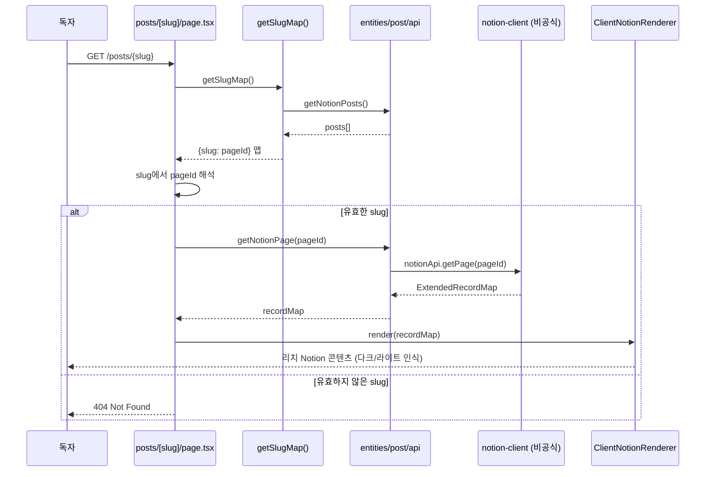
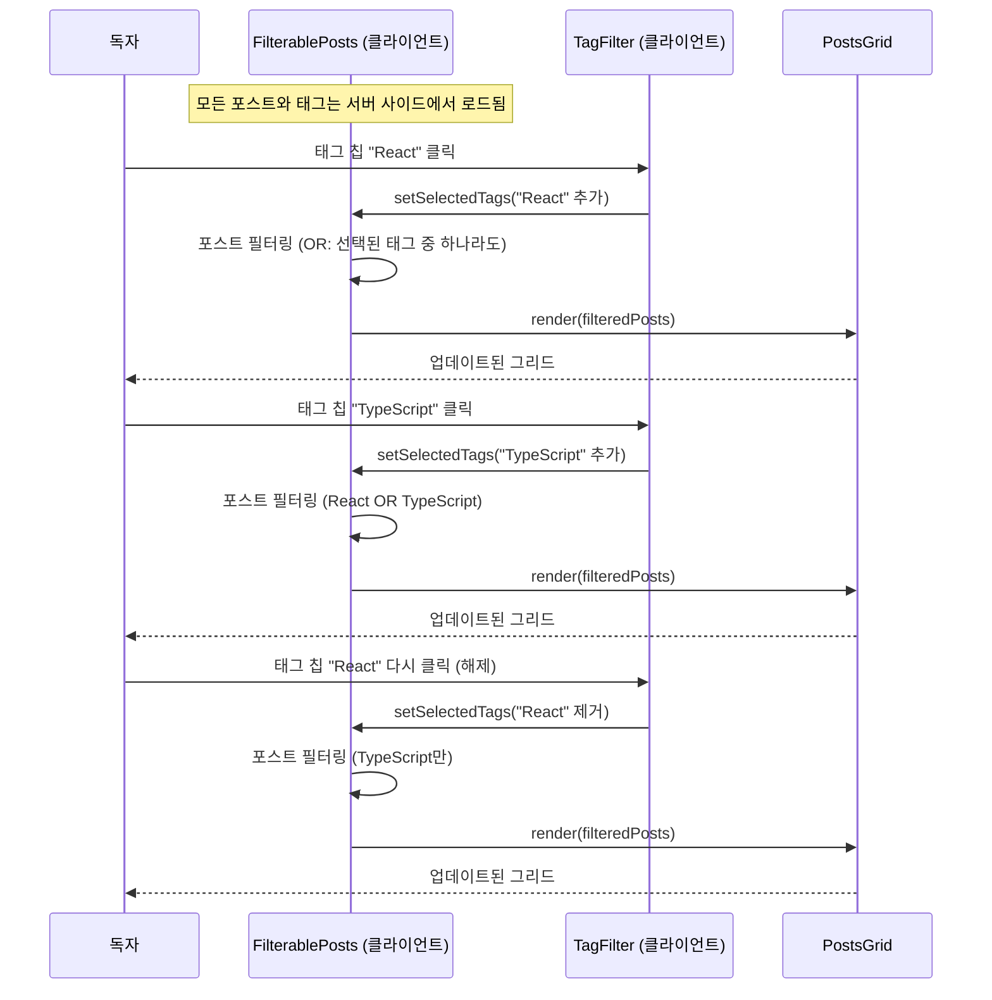
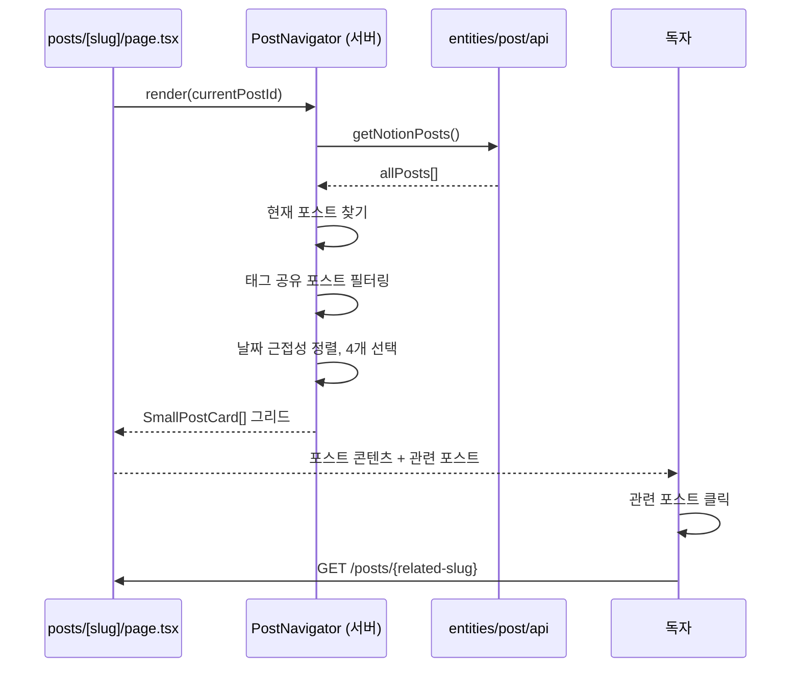
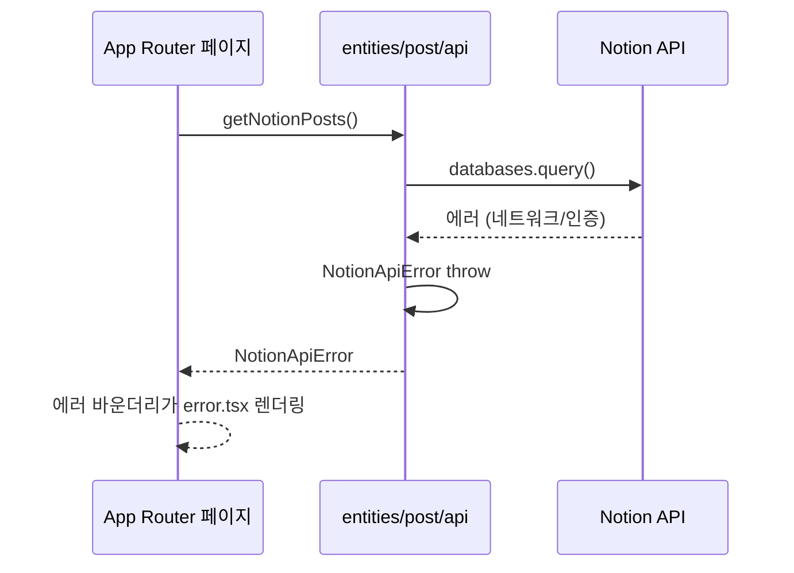

<!-- Created: 2026-04-06 | Last Modified: 2026-04-06 | Status: Active -->
<!-- @reference: [use-cases](use-cases.md) | [component-spec](component-spec.md) -->

> [← 유스케이스](use-cases.md) | [컴포넌트 명세 →](component-spec.md)

# Post 도메인 — 시퀀스 다이어그램

## 아키텍처 레이어

## 흐름 1: 포스트 목록 로딩 (UC-POST-01)

## 흐름 2: 포스트 상세 렌더링 (UC-POST-02)

## 흐름 3: 태그 필터링 (UC-POST-03)

## 흐름 4: 관련 포스트 네비게이션 (UC-POST-04)

## 에러 처리 흐름

## 성능: 캐싱 전략

| 함수 | 캐시 키 | 재검증 | 태그 |
|------|---------|-------|------|
| `getNotionPosts()` | `["posts"]` | `ISR_REVALIDATE_TIME` | — |
| `getNotionPostDatabaseTags()` | `["tags"]` | `ISR_REVALIDATE_TIME` | — |
| `getNotionPage()` | 없음 (캐시 안 됨) | — | — |
| `getSlugMap()` | 없음 (`getNotionPosts`에서 파생) | — | — |

> **전체 문서**
> [요구사항](../requirements/requirements.md) | [유저 스토리](../requirements/user-stories.md) | [유스케이스](use-cases.md) | **[시퀀스 다이어그램]** | [컴포넌트 명세](component-spec.md) | [테스트 명세](test-spec.md)
