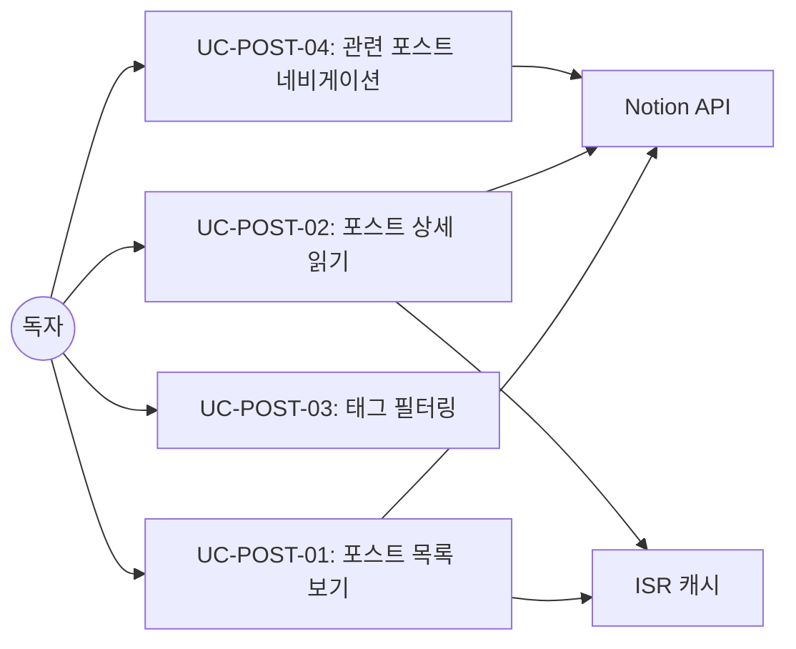

<!-- Created: 2026-04-03 | Last Modified: 2026-04-03 | Status: Active -->
<!-- @reference: [user-stories](../requirements/user-stories.md) | [sequence-diagram](sequence-diagram.md) -->

> [← 유저 스토리](../requirements/user-stories.md) | [시퀀스 다이어그램 →](sequence-diagram.md)

# Post 도메인 — 유스케이스

## 액터

| 액터 | 유형 | 설명 |
|------|------|------|
| 독자 | 주 | 블로그 포스트 탐색 및 읽기 |
| Notion API | 보조 | 포스트 데이터 및 페이지 콘텐츠 제공 |
| ISR 캐시 | 보조 | 렌더링된 페이지 캐시 |

## 유스케이스 다이어그램

## UC-POST-01: 포스트 목록 보기

| 항목 | 값 |
|------|---|
| ID | UC-POST-01 |
| 이름 | 포스트 목록 보기 |
| 액터 | 독자, Notion API, ISR 캐시 |
| 관련 요구사항 | FR-POST-01, FR-POST-05 |
| 관련 유저 스토리 | US-01 |

### 설명
독자가 홈 페이지 또는 포스트 페이지에 접근하여 공개된 블로그 포스트 그리드를 봅니다.

### 사전 조건
- Notion 데이터베이스에 상태가 "공개"인 포스트 존재

### 주요 흐름

1. 독자가 `/` (홈) 또는 `/posts` 페이지 요청
2. 서버가 ISR 캐시에서 페이지 데이터 확인
3. 캐시 유효 시 캐시된 페이지 제공
4. 캐시 만료/미스 시 Notion 데이터베이스에서 공개 포스트 쿼리 (상태 = "공개", 날짜 내림차순)
5. Notion 응답을 `Post.create()`로 `Post` 도메인 모델로 변환
6. `PostCard` 컴포넌트로 포스트 그리드 렌더링
7. 렌더링된 페이지 캐시

### 사후 조건
- 독자가 반응형 포스트 카드 그리드를 봄

### 대안 흐름
- **AF-01**: 공개 포스트 없음 → 빈 그리드 렌더링
- **AF-02**: Notion API 실패 → `NotionApiError` throw, 에러 페이지 표시

## UC-POST-02: 포스트 상세 읽기

| 항목 | 값 |
|------|---|
| ID | UC-POST-02 |
| 이름 | 포스트 상세 읽기 |
| 액터 | 독자, Notion API (공식 + 비공식), ISR 캐시 |
| 관련 요구사항 | FR-POST-02 |
| 관련 유저 스토리 | US-02 |

### 설명
독자가 포스트 카드를 클릭하여 전체 Notion 페이지 콘텐츠를 봅니다.

### 사전 조건
- 포스트가 존재하고 공개 상태

### 주요 흐름

1. 독자가 포스트 카드 클릭, `/posts/[slug]`로 이동
2. 서버가 `getSlugMap()`으로 slug를 Notion 페이지 ID로 해석
3. 비공식 Notion 클라이언트로 페이지 콘텐츠 조회 (`getNotionPage()`)
4. `ClientNotionRenderer` (react-notion-x)로 콘텐츠 렌더링
5. 관련 포스트와 함께 `PostNavigator` 렌더링

### 사후 조건
- 적절한 포맷의 전체 Notion 콘텐츠 표시
- 콘텐츠 하단에 관련 포스트 표시

### 대안 흐름
- **AF-01**: 유효하지 않은 slug → `notFound()` 호출, 404 페이지
- **AF-02**: 페이지 조회 실패 → 에러 바운더리 표시

## UC-POST-03: 태그 필터링

| 항목 | 값 |
|------|---|
| ID | UC-POST-03 |
| 이름 | 태그별 포스트 필터링 |
| 액터 | 독자 |
| 관련 요구사항 | FR-POST-03 |
| 관련 유저 스토리 | US-03 |

### 설명
독자가 사이드바에서 태그를 선택하여 클라이언트 사이드로 포스트 목록을 필터링합니다.

### 사전 조건
- 모든 포스트와 태그 데이터가 로드된 포스트 페이지

### 주요 흐름

1. 독자가 `TagFilter` 사이드바에서 태그 칩 클릭
2. `FilterablePosts`가 `selectedTags` 상태 업데이트
3. 선택된 태그 중 하나라도 있는 포스트 필터링
4. 필터링된 포스트로 `PostsGrid` 리렌더링

### 사후 조건
- 매칭되는 포스트만 표시
- 선택된 태그가 시각적으로 강조

### 대안 흐름
- **AF-01**: 매칭 포스트 없음 → `EmptyPosts` 컴포넌트 표시
- **AF-02**: 모든 태그 해제 → 모든 포스트 표시

## UC-POST-04: 관련 포스트 네비게이션

| 항목 | 값 |
|------|---|
| ID | UC-POST-04 |
| 이름 | 관련 포스트로 이동 |
| 액터 | 독자, Notion API |
| 관련 요구사항 | FR-POST-04 |
| 관련 유저 스토리 | US-04 |

### 설명
독자가 포스트 상세 페이지 하단에서 관련 포스트를 보고 클릭합니다.

### 사전 조건
- 포스트 상세 페이지 로드 완료

### 주요 흐름

1. `PostNavigator`가 모든 포스트 조회
2. 현재 포스트와 태그를 공유하는 포스트 필터링
3. 현재 포스트와 발행일 근접성으로 정렬
4. 가장 가까운 관련 포스트 최대 4개를 `SmallPostCard` 컴포넌트로 표시
5. 독자가 관련 포스트 클릭 → 해당 포스트 상세 페이지로 이동

### 사후 조건
- 독자가 새 포스트의 상세 페이지에 있음

## 유스케이스 관계

| 유스케이스 | 포함 | 확장 |
|----------|------|------|
| UC-POST-01 | — | UC-POST-03 (태그 필터링) |
| UC-POST-02 | UC-POST-04 (관련 포스트) | — |

> **전체 문서**
> [요구사항](../requirements/requirements.md) | [유저 스토리](../requirements/user-stories.md) | **[유스케이스]** | [시퀀스 다이어그램](sequence-diagram.md) | [컴포넌트 명세](component-spec.md) | [테스트 명세](test-spec.md)
