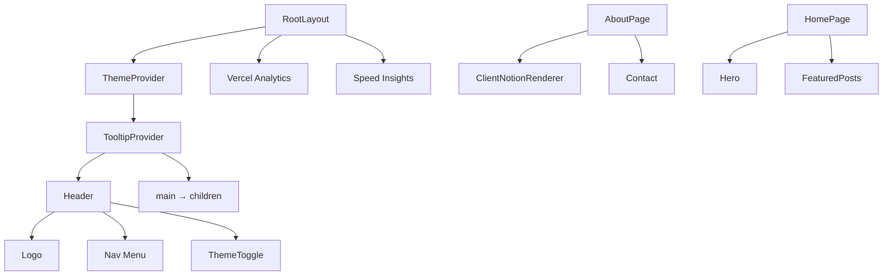

<!-- Created: 2026-04-07 | Last Modified: 2026-04-07 | Status: Active -->
<!-- @reference: [sequence-diagram](sequence-diagram.md) | [test-spec](test-spec.md) -->

> [← 시퀀스 다이어그램](sequence-diagram.md) | [테스트 명세 →](test-spec.md)

# Site 도메인 — 컴포넌트 명세

## UI 개요

| 뷰 | URL | 접근 | 관련 유스케이스 |
|---|-----|------|--------------|
| 루트 레이아웃 | (모든 페이지) | 공개 | UC-SITE-01, UC-SITE-02 |
| 홈 Hero | `/` | 공개 | UC-SITE-03 |
| About 페이지 | `/about` | 공개 | UC-SITE-03 |
| 사이트맵 | `/sitemap.xml` | 공개 (크롤러) | UC-SITE-04 |
| Robots | `/robots.txt` | 공개 (크롤러) | UC-SITE-04 |

## 컴포넌트 트리



## 컴포넌트 분류

| 유형 | 수 | 컴포넌트 |
|------|---|---------|
| 레이아웃 (서버) | 1 | `RootLayout` |
| 페이지 (서버) | 2 | `AboutPage`, `HomePage` |
| 위젯 (서버) | 1 | `Header` |
| 기능 (클라이언트) | 2 | `ThemeToggle`, `ThemeProvider` |
| 기능 (서버) | 2 | `Hero`, `Contact` |
| API 라우트 | 2 | `api/sitemap`, `robots.ts` |

## 레이아웃 컴포넌트

### RootLayout (`src/app/layout.tsx`)

- **유형**: 서버 컴포넌트
- **Props**: `{ children: React.ReactNode }`
- **동작**:
  - Pretendard 로컬 폰트 로드
  - `ThemeProvider`로 앱 래핑 (시스템 테마 감지)
  - `TooltipProvider`로 래핑
  - `<main>{children}</main>` 위에 `Header` 렌더링
  - Vercel Analytics + Speed Insights 포함
- **메타데이터**: title 템플릿 `%s | metis-blog`, description, icon

## 위젯 컴포넌트

### Header (`src/widgets/ui/header.tsx`)

- **유형**: 서버 컴포넌트
- **Props**: 없음
- **렌더링**:
  - 로고 (마스코트 이미지 + 블로그 제목)
  - 네비 메뉴: 소개, 방명록, 포스트
  - 우측에 `ThemeToggle`

## 기능 컴포넌트

### ThemeProvider (`src/features/theme/hooks/theme-provider.tsx`)

```typescript
// 클라이언트 컴포넌트
type ThemeProviderProps = ComponentProps<typeof NextThemesProvider>;
```

- `next-themes` 프로바이더 래핑
- 모든 props 통과 (일반적으로: `attribute="class"`, `defaultTheme="system"`, `enableSystem`)

### ThemeToggle (`src/features/theme/ui/theme-toggle.tsx`)

```typescript
// 클라이언트 컴포넌트, props 없음
```

- `next-themes`의 `useTheme()` 사용
- `mounted=true`까지 `LoadingDot` 렌더링 (하이드레이션 미스매치 방지)
- 라이트 모드에서 moon 아이콘, 다크 모드에서 sun 아이콘
- 클릭으로 "light"와 "dark" 사이 전환

### Hero (`src/features/profile/ui/hero.tsx`)

```typescript
// 서버 컴포넌트, props 없음
```

- 마스코트 이미지 렌더링 (240×240, `priority` 플래그)
- 한국어 인사말과 블로그 설명
- 툴팁이 있는 GitHub 링크 버튼
- 중앙 정렬 레이아웃

### Contact (`src/features/profile/ui/contact.tsx`)

```typescript
// 서버 컴포넌트, props 없음
```

- 이메일 표시 (`dbsdndwo12@gmail.com`)
- `LINKS` 배열 매핑 → GitHub, LinkedIn, Notion 아이콘 렌더링
- 각 링크에 툴팁
- About 페이지에서 사용

## 페이지 컴포넌트

### HomePage (`src/app/page.tsx`)

- **유형**: 서버 컴포넌트
- **ISR**: 180초
- **렌더링**: `Hero` + `FeaturedPosts`

### AboutPage (`src/app/about/page.tsx`)

- **유형**: 서버 컴포넌트 (async)
- **ISR**: 180초
- **데이터 페칭**: `getNotionAboutPage()`
- **렌더링**: `ClientNotionRenderer` + `Contact`
- **메타데이터**: title "about", 한국어 description

## API 라우트 컴포넌트

### Sitemap (`src/app/api/sitemap/route.ts`)

- **유형**: GET 핸들러
- **소스**: `getNotionPosts()`
- **출력**: XML
- **하드코딩 라우트**: `/` (우선순위 1.0), `/about`, `/posts`, `/guestbooks` (우선순위 0.8)
- **동적 라우트**: 모든 공개 포스트
- **변경 빈도**: 일간

### Robots (`src/app/robots.ts`)

- **유형**: Next.js 메타데이터 라우트
- **반환**: `MetadataRoute.Robots`
- **규칙**: `/` 허용, `/private/` 차단
- **사이트맵**: `${BLOG_URL}/sitemap.xml`

## 상태 관리

| 상태 | 유형 | 위치 | 설명 |
|------|------|------|------|
| 테마 | 클라이언트 (next-themes) | `localStorage` | 라이트/다크/시스템 |
| Mounted | 클라이언트 | `ThemeToggle` | 하이드레이션 미스매치 방지 |
| About 콘텐츠 | 서버 | ISR 캐시 (180초) | Notion 페이지 record map |

## 반응형 전략

| 브레이크포인트 | 헤더 레이아웃 |
|-------------|------------|
| 모바일 | 콤팩트 네비, 작은 로고 |
| 데스크톱 | 전체 네비 메뉴, 큰 로고 |

> **전체 문서**
> [요구사항](../requirements/requirements.md) | [유저 스토리](../requirements/user-stories.md) | [유스케이스](use-cases.md) | [시퀀스 다이어그램](sequence-diagram.md) | **[컴포넌트 명세]** | [테스트 명세](test-spec.md)
