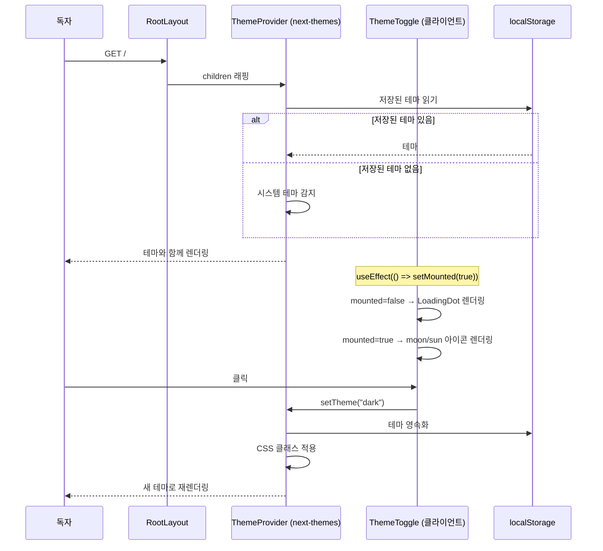
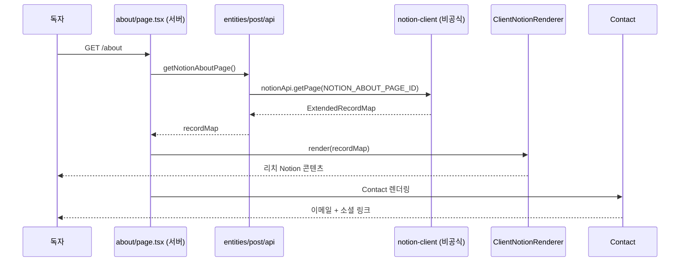
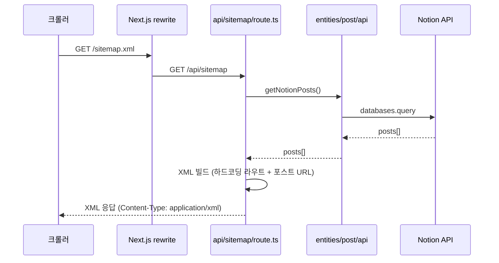
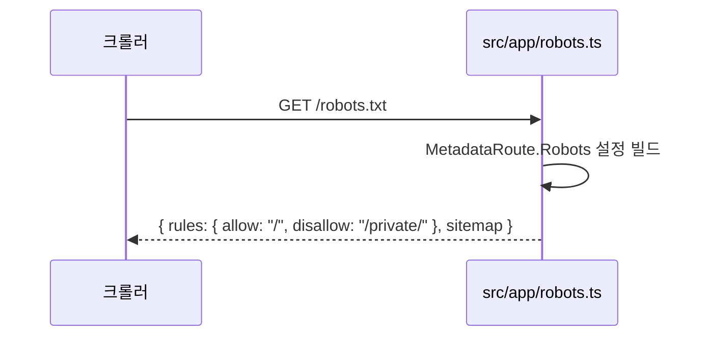
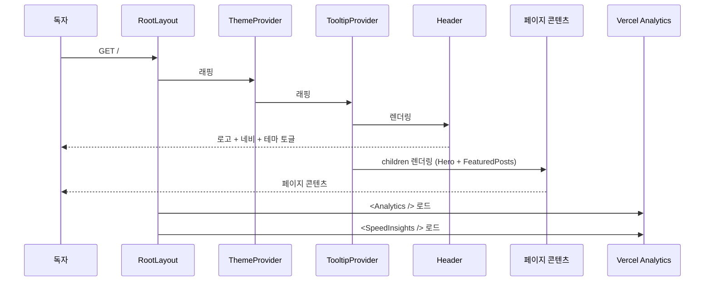

<!-- Created: 2026-04-07 | Last Modified: 2026-04-07 | Status: Active -->
<!-- @reference: [use-cases](use-cases.md) | [component-spec](component-spec.md) -->

> [← 유스케이스](use-cases.md) | [컴포넌트 명세 →](component-spec.md)

# Site 도메인 — 시퀀스 다이어그램

## 흐름 1: 테마 전환 (UC-SITE-01)

## 흐름 2: About 페이지 (UC-SITE-03)

## 흐름 3: 사이트맵 생성 (UC-SITE-04)

## 흐름 4: Robots.txt (UC-SITE-04)

## 흐름 5: 초기 페이지 로드 (UC-SITE-02 + UC-SITE-07)

## 성능 노트

| 측면 | 전략 |
|------|------|
| Hero 이미지 | Next.js Image의 `priority` 플래그 (LCP 최적화) |
| About 페이지 | ISR 180초 재검증 |
| Pretendard 폰트 | 로컬 폰트 (CDN 없음, FOUT 없음) |
| 테마 하이드레이션 | Mounted 체크로 미스매치 방지 |

> **전체 문서**
> [요구사항](../requirements/requirements.md) | [유저 스토리](../requirements/user-stories.md) | [유스케이스](use-cases.md) | **[시퀀스 다이어그램]** | [컴포넌트 명세](component-spec.md) | [테스트 명세](test-spec.md)
