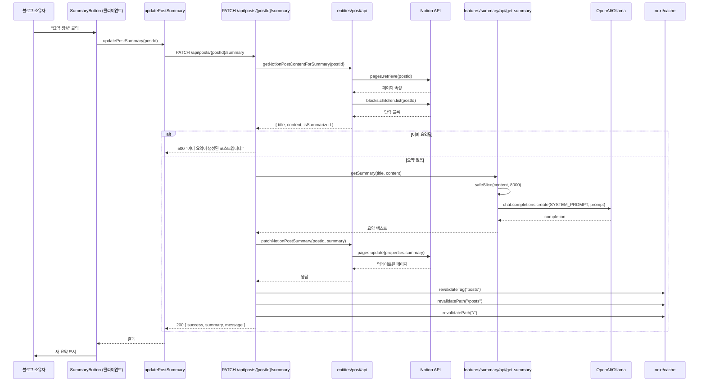
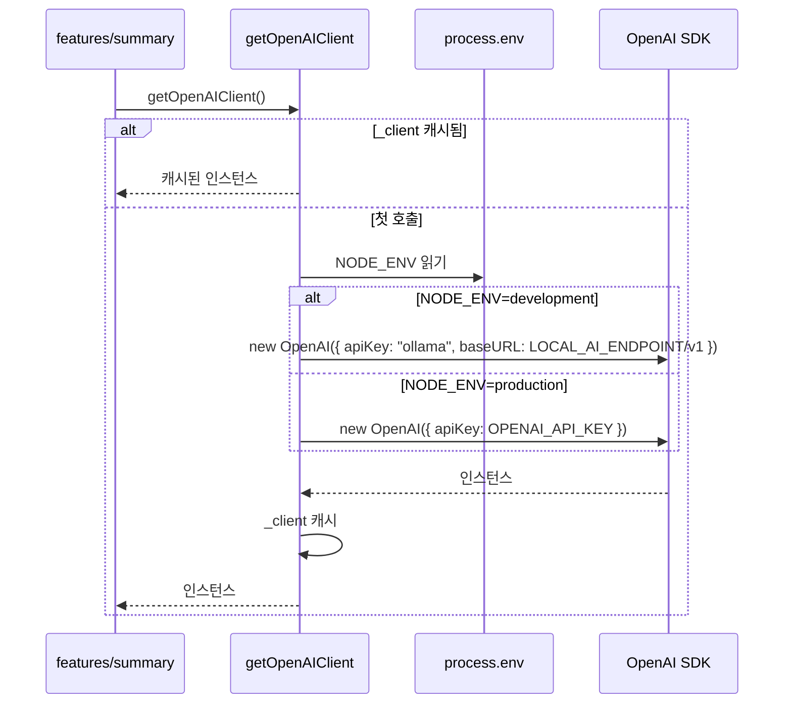
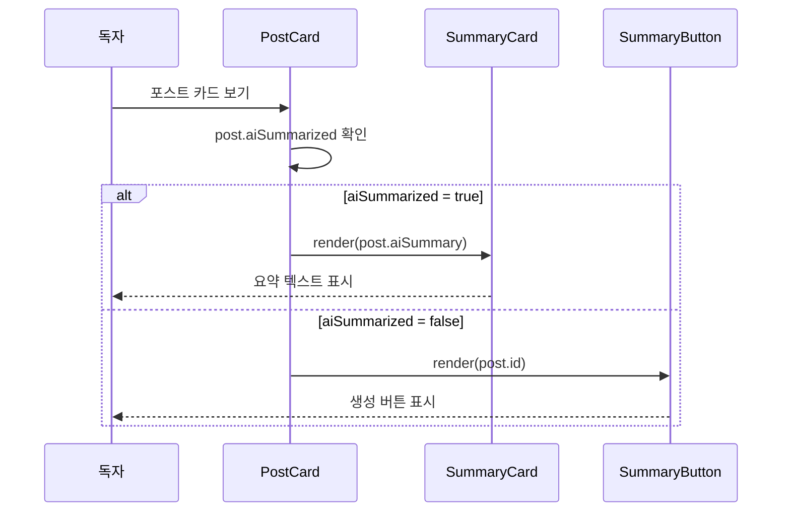
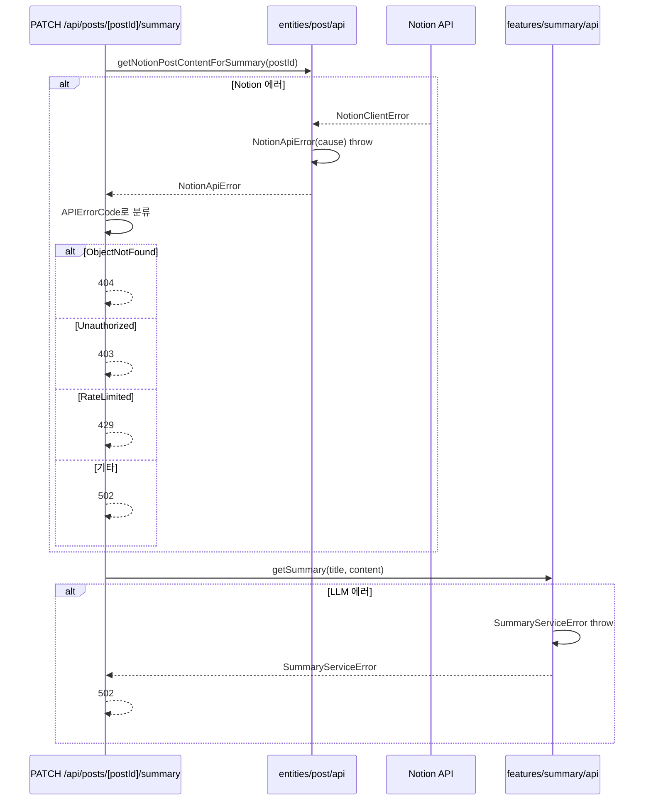

<!-- Created: 2026-04-07 | Last Modified: 2026-04-07 | Status: Active -->
<!-- @reference: [use-cases](use-cases.md) | [api-spec](api-spec.md) -->

> [← 유스케이스](use-cases.md) | [API 명세 →](api-spec.md)

# Summary 도메인 — 시퀀스 다이어그램

## 흐름 1: 요약 생성 및 저장 (UC-SUMMARY-01)

## 흐름 2: LLM 선택 (UC-SUMMARY-02)

## 흐름 3: UI에 요약 표시 (UC-SUMMARY-03)

## 에러 처리

## 성능 노트

| 측면 | 전략 |
|------|------|
| 콘텐츠 크기 | `safeSlice(plainText, 8000)`로 단어 토큰 트런케이션 |
| LLM 결정성 | 안정적 출력을 위한 `temperature: 0.2` |
| 출력 길이 | 간결한 요약을 위한 `max_tokens: 50` |
| 캐시 무효화 | Notion 업데이트 후 ISR 캐시 즉시 새로고침 |

> **전체 문서**
> [요구사항](../requirements/requirements.md) | [유저 스토리](../requirements/user-stories.md) | [유스케이스](use-cases.md) | **[시퀀스 다이어그램]** | [API 명세](api-spec.md) | [테스트 명세](test-spec.md)
