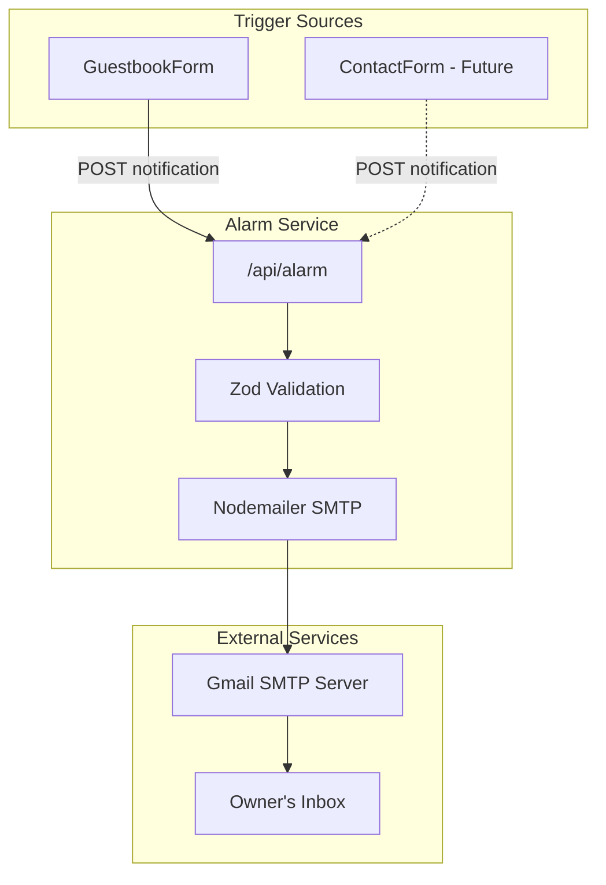
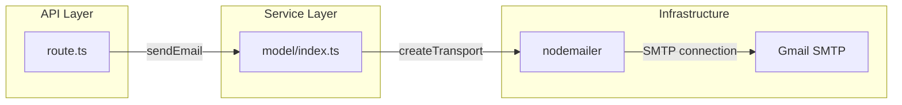
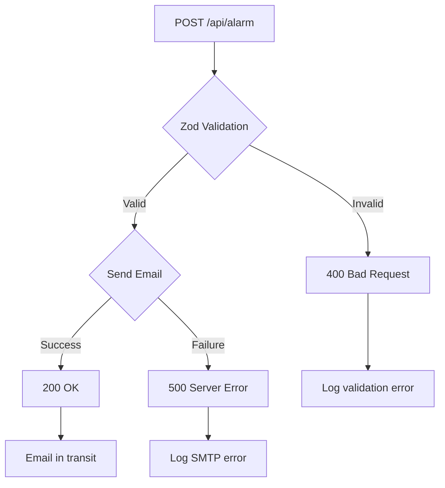

# Alarm Domain Information Architecture

This document describes the information architecture for the Alarm domain. Unlike other domains, Alarm is a background service with no dedicated UI screens.

## Service Overview

The Alarm domain operates as a backend service that processes notification requests and delivers emails. It has no user-facing interface but integrates with other features.



---

## Integration Points

### 1. Guestbook Form Integration

**Location**: `src/features/guestbooks/ui/guestbook-form.tsx`

**Trigger Point**: After successful guestbook submission

**Data Flow**:
```
GuestbookForm.onSubmit()
  → POST /api/guestbooks (success)
  → POST /api/alarm (fire-and-forget)
  → Continue to form reset and list refresh
```

**Integration Pattern**:
```typescript
// After successful guestbook submission
const response = await fetch('/api/guestbooks', {...});

if (response.ok) {
  // Fire and forget - don't await
  fetch('/api/alarm', {
    method: 'POST',
    body: JSON.stringify({
      from: 'guestbook@blog.com',
      subject: `새로운 방명록: ${data.name}`,
      message: `이름: ${data.name}\n내용: ${data.content}\n공개여부: ${data.isPrivate ? '비공개' : '공개'}`
    })
  });

  // Continue without waiting for notification
  reset();
  refetchGuestbooks();
}
```

### 2. Contact Form Integration (Future)

**Location**: Would be in `src/features/contact/ui/contact-form.tsx`

**Planned Trigger**: After contact message submission

---

## API Interface

### Endpoint Structure

```
POST /api/alarm
├── Request Validation (Zod)
├── Email Composition
├── SMTP Delivery
└── Response
```

### Request Schema

```typescript
// Zod validation schema
const bodySchema = z.object({
  from: z.string(),     // Sender identifier
  subject: z.string(),  // Email subject
  message: z.string(),  // Email body content
});
```

### Response Codes

| Status | Meaning | Response Body |
|--------|---------|---------------|
| 200 | Email sent successfully | `{ message: "메일을 성공적으로 보냈음" }` |
| 400 | Validation failed | `"보내는이, 제목, 내용은 문자열만 가능합니다."` |
| 500 | SMTP failure | `{ message: "메일 전송에 실패함", error }` |

---

## Email Composition

### Template Structure

```html
<!-- Generated email HTML -->
<h1>{subject}</h1>
<div>{message}</div>
<br />
<p>보낸사람: {from}</p>
```

### Header Configuration

| Header | Value | Purpose |
|--------|-------|---------|
| To | `AUTH_USER` | Blog owner's email |
| From | Request `from` field | Sender identifier |
| Subject | `[BLOG] {subject}` | Prefixed for filtering |

### Email Preview

**Guestbook Notification**:
```
To: owner@gmail.com
From: guestbook@blog.com
Subject: [BLOG] 새로운 방명록: 홍길동

---

<h1>새로운 방명록: 홍길동</h1>
<div>
이름: 홍길동
내용: 좋은 글 감사합니다!
공개여부: 공개
</div>
<br />
<p>보낸사람: guestbook@blog.com</p>
```

---

## Service Architecture

### Component Diagram



### File Structure

```
src/features/alarm/
├── model/
│   └── index.ts          # sendEmail function, transporter config
└── (no UI components)    # Background service only

src/app/api/alarm/
└── route.ts              # POST handler with validation
```

---

## Configuration

### Environment Variables

| Variable | Purpose | Example |
|----------|---------|---------|
| `AUTH_USER` | Gmail account (sender & recipient) | `owner@gmail.com` |
| `AUTH_PASS` | Gmail app password | `xxxx xxxx xxxx xxxx` |

### SMTP Configuration

```typescript
const transporter = nodemailer.createTransport({
  host: "smtp.gmail.com",
  port: 465,
  secure: true,  // SSL/TLS
  auth: {
    user: process.env.AUTH_USER,
    pass: process.env.AUTH_PASS,
  },
});
```

---

## Data Privacy

### What is Sent

| Data | In Email | Stored |
|------|----------|--------|
| Author name | Yes | No (email only) |
| Message content | Yes | No (email only) |
| Visibility status | Yes | No (email only) |
| IP address | No | No |
| Timestamp | Implicit (email header) | No |

### What is NOT Stored

- Email content is not persisted in the application
- No database records for sent notifications
- Logs may contain error information (not content)

---

## Error Handling Flow



---

## Monitoring Touchpoints

### Logging Points

| Event | Log Level | Information |
|-------|-----------|-------------|
| Request received | Debug | Request body |
| Validation failed | Warn | Error details |
| SMTP success | Info | None (privacy) |
| SMTP failure | Error | Error object |

### Health Check

No dedicated health endpoint. Service health indicated by:
- Successful guestbook submissions (notification fires)
- Emails arriving in owner inbox
- No SMTP errors in server logs

---

## Scalability Considerations

### Current Limitations

| Aspect | Current | Scalability Concern |
|--------|---------|---------------------|
| Throughput | ~1 email/submission | Gmail rate limits |
| Retry | None | Lost notifications |
| Queue | None | Blocking on high load |

### Future Enhancements

| Enhancement | Benefit | Complexity |
|-------------|---------|------------|
| Email queue | Reliable delivery | Medium |
| Retry mechanism | Handle transient failures | Low |
| Multiple providers | Failover capability | High |
| Rate limiting | Prevent abuse | Low |
