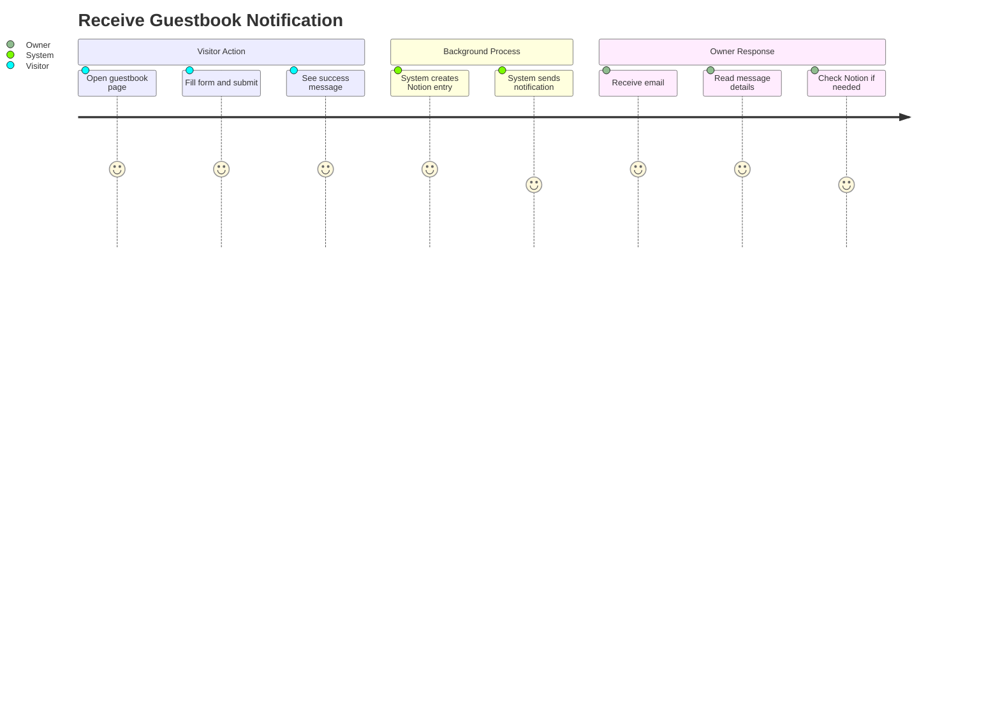
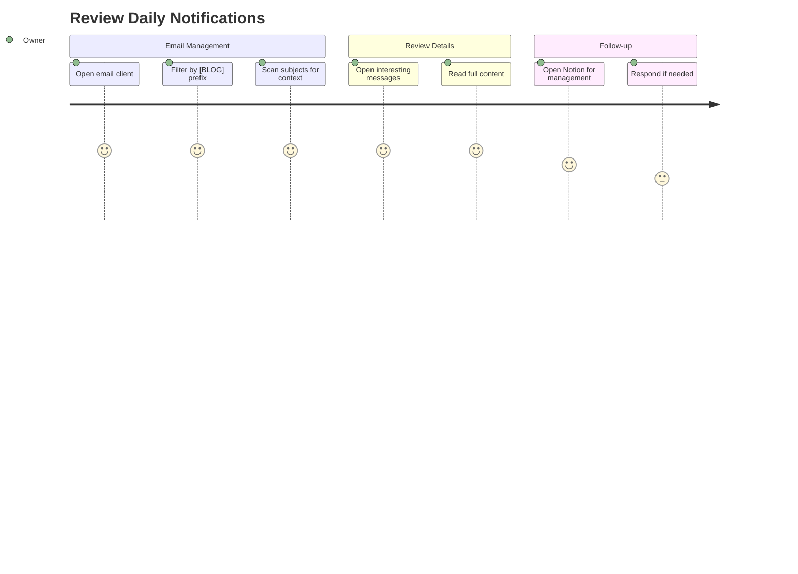
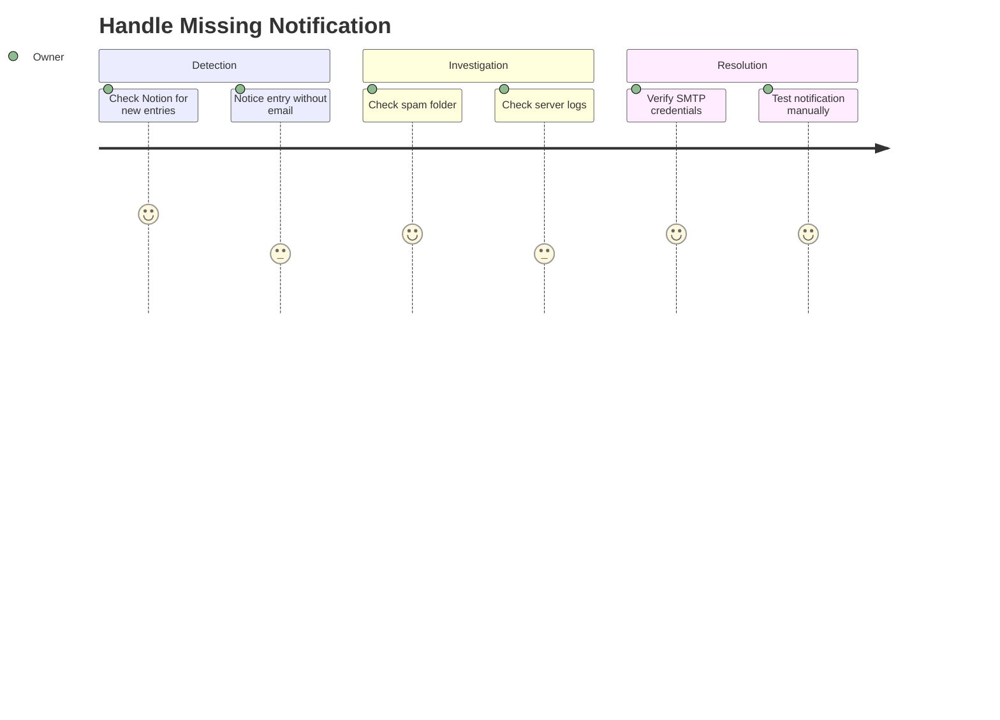

# Alarm Domain User Stories

This document describes end-to-end user journeys for the Alarm domain, focusing on email notification scenarios from the blog owner's perspective.

## User Personas

### Blog Owner (Meti)
Primary recipient of notifications who wants to be informed of visitor interactions without constantly checking the Notion dashboard.

### Visitor
Anonymous user who triggers notifications through blog interactions (guestbook, contact form).

---

## User Journeys

### Journey 1: Receive Guestbook Notification

**Persona**: Blog Owner
**Goal**: Be notified when a visitor leaves a guestbook message
**Preconditions**: Gmail account configured with app password



#### Steps

1. **Visitor Submits Guestbook**
   - User action: Complete and submit guestbook form
   - System response: Save entry to Notion, show success toast
   - Validation: Form submission succeeds

2. **System Triggers Notification**
   - System action: Call `/api/alarm` with guestbook data
   - Process: Fire-and-forget (non-blocking)
   - Validation: API accepts request

3. **Email Sent via SMTP**
   - System action: Connect to Gmail SMTP, send email
   - Content: Author name, message, visibility status
   - Validation: SMTP handshake completes

4. **Owner Receives Email**
   - Notification: Email arrives in inbox
   - Subject: `[BLOG] 새로운 방명록: {authorName}`
   - Timing: Typically within 1-2 minutes

5. **Owner Reviews Message**
   - User action: Read email content
   - Information: Full message with metadata
   - Next step: Optionally check Notion for management

#### Success Criteria
- [ ] Email received within 5 minutes of submission
- [ ] Email contains complete message content
- [ ] Email subject clearly identifies source
- [ ] Visitor submission flow is not blocked

#### Error Scenarios

| Scenario | Impact on Visitor | Impact on Owner | Recovery |
|----------|------------------|-----------------|----------|
| SMTP connection fails | None (submission succeeds) | No notification | Check server logs |
| Invalid credentials | None | No notification | Fix AUTH_PASS in env |
| Gmail rate limit | None | Delayed notification | Wait for limit reset |
| Network timeout | None | No notification | Retry not implemented |

---

### Journey 2: Review Daily Notifications

**Persona**: Blog Owner
**Goal**: Catch up on visitor interactions from notifications
**Preconditions**: Has received notification emails



#### Steps

1. **Open Email Client**
   - User action: Access Gmail or email app
   - Context: Part of daily routine
   - Validation: Logged into correct account

2. **Filter Blog Notifications**
   - User action: Search for `[BLOG]` prefix
   - System response: Show all blog notifications
   - Alternative: Set up Gmail filter/label

3. **Scan Notification Subjects**
   - User action: Review subject lines
   - Information: Message type and author name
   - Decision: Which messages to read in full

4. **Read Full Messages**
   - User action: Click to open email
   - Information: Complete message content, sender, timestamp
   - Validation: All data present and readable

5. **Optional: Manage in Notion**
   - User action: Open Notion guestbook database
   - Purpose: Delete spam, update status, respond
   - Validation: Entry exists in database

#### Success Criteria
- [ ] All submissions have corresponding emails
- [ ] Subject line provides sufficient context for triage
- [ ] Email content matches Notion entry
- [ ] Easy to distinguish message types

---

### Journey 3: Handle Missing Notification

**Persona**: Blog Owner
**Goal**: Investigate when expected notification doesn't arrive
**Preconditions**: Knows a guestbook was submitted but no email received



#### Steps

1. **Check Notion Dashboard**
   - User action: Open guestbook database
   - Observation: New entry exists
   - Problem: No corresponding email

2. **Check Spam/Filters**
   - User action: Check Gmail spam folder
   - Alternative: Check email filters/rules
   - Resolution: Mark as not spam, adjust filters

3. **Check Server Logs**
   - User action: Review Vercel deployment logs
   - Information: Error messages from `/api/alarm`
   - Common issues: Auth failure, network timeout

4. **Verify Configuration**
   - User action: Check environment variables
   - Validation: `AUTH_USER` and `AUTH_PASS` are correct
   - Test: Redeploy or test locally

5. **Manual Test**
   - User action: Submit test guestbook entry
   - Validation: Monitor for email arrival
   - Resolution: Fix and redeploy if needed

#### Success Criteria
- [ ] Root cause identified
- [ ] Configuration issue resolved
- [ ] Future notifications working
- [ ] Consider adding monitoring

---

## Acceptance Test Scenarios (E2E)

### Scenario 1: Successful Notification Delivery

```gherkin
Feature: Guestbook Notification
  As a blog owner
  I want to receive email notifications
  So that I know when visitors leave messages

  Scenario: Receive notification for public message
    Given the alarm API is configured correctly
    And a visitor submits a public guestbook entry
    When the submission completes successfully
    Then an email should be sent to AUTH_USER
    And the subject should contain "[BLOG] 새로운 방명록"
    And the body should contain the message content
    And the body should indicate "공개" status

  Scenario: Receive notification for private message
    Given the alarm API is configured correctly
    And a visitor submits a private guestbook entry
    When the submission completes successfully
    Then an email should be sent to AUTH_USER
    And the body should indicate "비공개" status
```

### Scenario 2: Notification Failure Handling

```gherkin
Feature: Graceful Failure
  As a blog system
  I want to handle notification failures gracefully
  So that visitor experience is not affected

  Scenario: Guestbook succeeds when notification fails
    Given the SMTP server is unreachable
    And a visitor submits a guestbook entry
    When the entry is saved to Notion
    Then the visitor should see success message
    And the notification failure should be logged
    And the entry should exist in Notion database
```

### Scenario 3: API Validation

```gherkin
Feature: Alarm API Validation
  As the alarm service
  I want to validate incoming requests
  So that only valid notifications are processed

  Scenario: Reject missing fields
    When POST /api/alarm is called without "from" field
    Then response status should be 400
    And response body should indicate validation error

  Scenario: Accept valid request
    When POST /api/alarm is called with from, subject, message
    Then response status should be 200
    And email should be queued for delivery
```

---

## Metrics & Success Indicators

| Metric | Target | Measurement |
|--------|--------|-------------|
| Email delivery success rate | > 99% | Server logs |
| Notification latency | < 5 seconds | API response time |
| Owner awareness | 100% of submissions | Manual verification |
| False positive rate | 0% | Spam complaints |

---

## Email Template Preview

### Guestbook Notification

**Subject**: `[BLOG] 새로운 방명록: 홍길동`

**Body**:
```html
<h1>새로운 방명록: 홍길동</h1>
<div>
  이름: 홍길동
  내용: 좋은 글 감사합니다!
  공개여부: 공개
</div>
<br />
<p>보낸사람: guestbook@blog.com</p>
```

---

## Future Enhancements

| Enhancement | Priority | Description |
|-------------|----------|-------------|
| Delivery tracking | Medium | Track email open rates |
| Retry mechanism | Medium | Retry failed deliveries |
| Template system | Low | Customizable email templates |
| Multiple recipients | Low | CC/BCC support |
| Rate limiting | Medium | Prevent notification spam |
