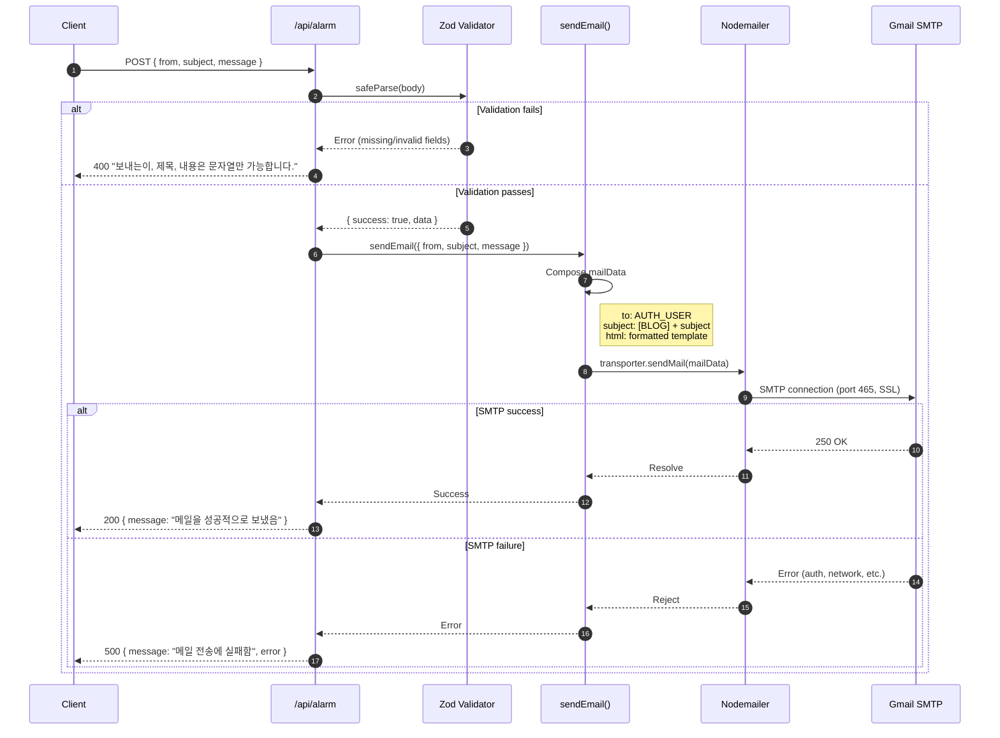
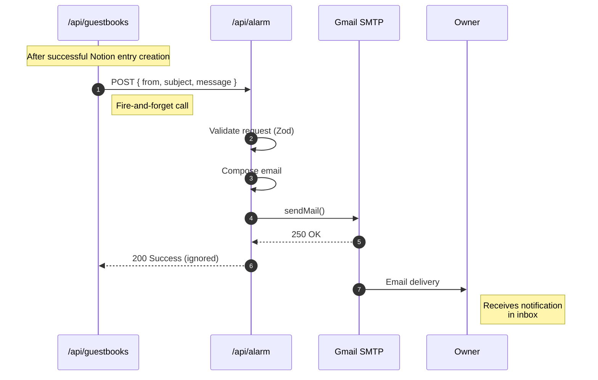
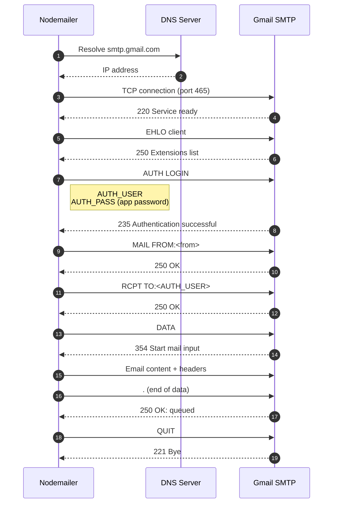
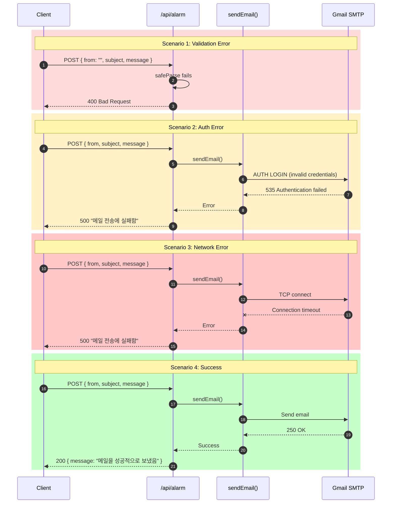
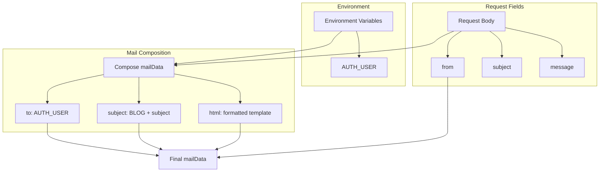

# Alarm Domain Sequence Diagrams

This document contains detailed sequence diagrams for all backend workflows in the Alarm domain.

## 1. Send Email Notification

### Overview

Process a notification request and deliver email via Gmail SMTP.

### Actors

- **Client**: Calling feature (e.g., Guestbook API)
- **API Route**: `/api/alarm`
- **Service**: Email service (`sendEmail`)
- **Nodemailer**: SMTP client library
- **Gmail**: External SMTP server

### Sequence



### Request/Response Schema

**Request**:
```typescript
POST /api/alarm
Content-Type: application/json

{
  from: string;     // Sender identifier
  subject: string;  // Email subject
  message: string;  // Email body content
}
```

**Success Response** (200):
```typescript
{
  message: "메일을 성공적으로 보냈음"
}
```

**Validation Error Response** (400):
```typescript
"보내는이, 제목, 내용은 문자열만 가능합니다."
```

**Server Error Response** (500):
```typescript
{
  message: "메일 전송에 실패함",
  error: Error
}
```

---

## 2. Guestbook Notification Flow

### Overview

Backend flow from guestbook API to owner notification (triggered after successful guestbook submission).

### Actors

- **Guestbook API**: `/api/guestbooks` (caller)
- **Alarm API**: `/api/alarm`
- **Gmail**: SMTP server
- **Owner**: Email recipient

### Sequence



### Notification Payload

```typescript
// Constructed by Guestbook API
{
  from: "guestbook@blog.com",
  subject: `새로운 방명록: ${authorName}`,
  message: `
    이름: ${authorName}
    내용: ${content}
    공개여부: ${isPrivate ? "비공개" : "공개"}
  `
}
```

---

## 3. SMTP Connection Details

### Overview

Internal details of SMTP handshake and email delivery.

### Sequence



### SMTP Configuration

```typescript
const transporter = nodemailer.createTransport({
  host: "smtp.gmail.com",
  port: 465,
  secure: true,  // Use SSL
  auth: {
    user: process.env.AUTH_USER,
    pass: process.env.AUTH_PASS,
  },
});
```

---

## 4. Error Handling Flow

### Overview

How different error scenarios are handled.

### Sequence



---

## 5. Email Template Generation

### Overview

How email content is composed from request data.

### Data Flow



### Template Code

```typescript
const mailData = {
  to: process.env.AUTH_USER,        // Blog owner
  subject: `[BLOG] ${subject}`,     // Prefixed for filtering
  from,                              // Sender identifier
  html: `
    <h1>${subject}</h1>
    <div>${message}</div>
    <br />
    <p>보낸사람: ${from}</p>
  `,
};
```

---

## Error Handling Matrix

| Scenario | Error Source | HTTP Status | User Impact | Recovery |
|----------|-------------|-------------|-------------|----------|
| Missing fields | Zod validation | 400 | None (caller handles) | Fix request |
| Invalid types | Zod validation | 400 | None (caller handles) | Fix request |
| Auth failure | Gmail SMTP | 500 | No notification | Fix AUTH_PASS |
| Network timeout | Nodemailer | 500 | No notification | Retry (not auto) |
| Rate limit | Gmail | 500 | Delayed notification | Wait & retry |
| Invalid recipient | Gmail | 500 | No notification | Fix AUTH_USER |

---

## Performance Characteristics

### Timing Breakdown

| Phase | Typical Duration | Notes |
|-------|------------------|-------|
| Validation | < 1ms | Synchronous |
| SMTP connection | 100-500ms | DNS + TCP + TLS |
| Authentication | 50-100ms | SMTP handshake |
| Email transmission | 50-200ms | Depends on size |
| **Total** | **200-800ms** | Normal conditions |

### Bottlenecks

| Bottleneck | Impact | Mitigation |
|------------|--------|------------|
| Cold SMTP connection | First email slower | Persistent connection (future) |
| Gmail rate limits | 500 emails/day | Batch or upgrade account |
| Network latency | Variable timing | Async pattern (current) |
