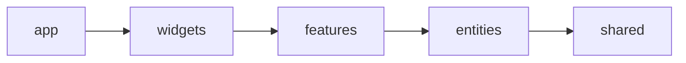
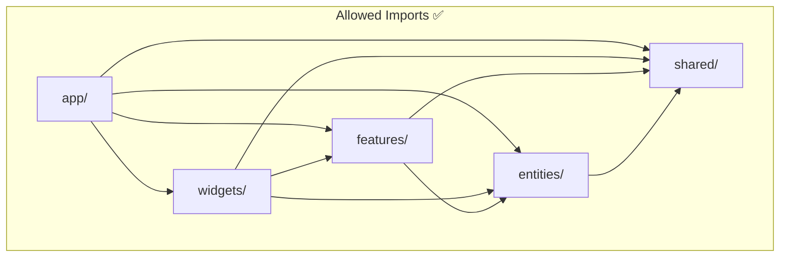
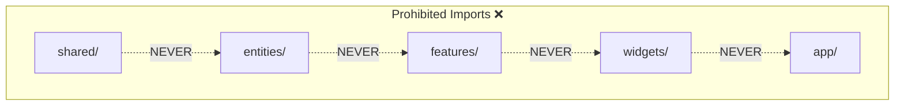
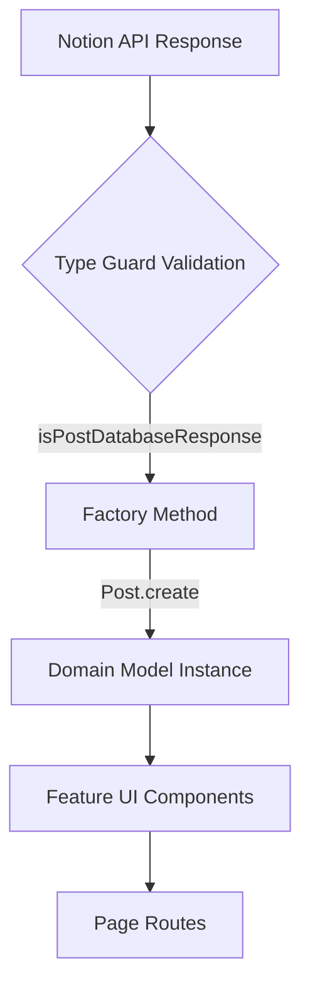
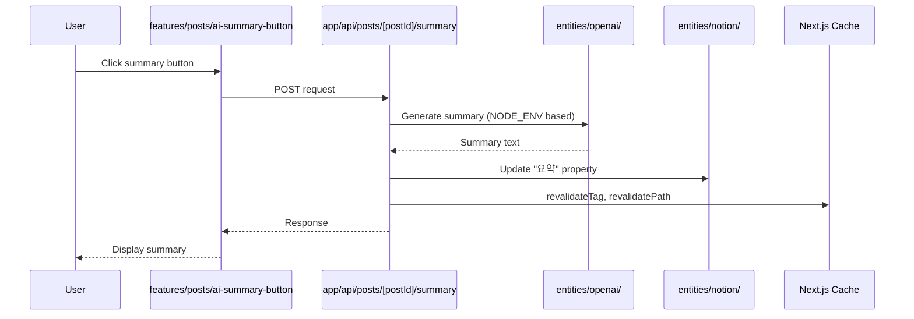
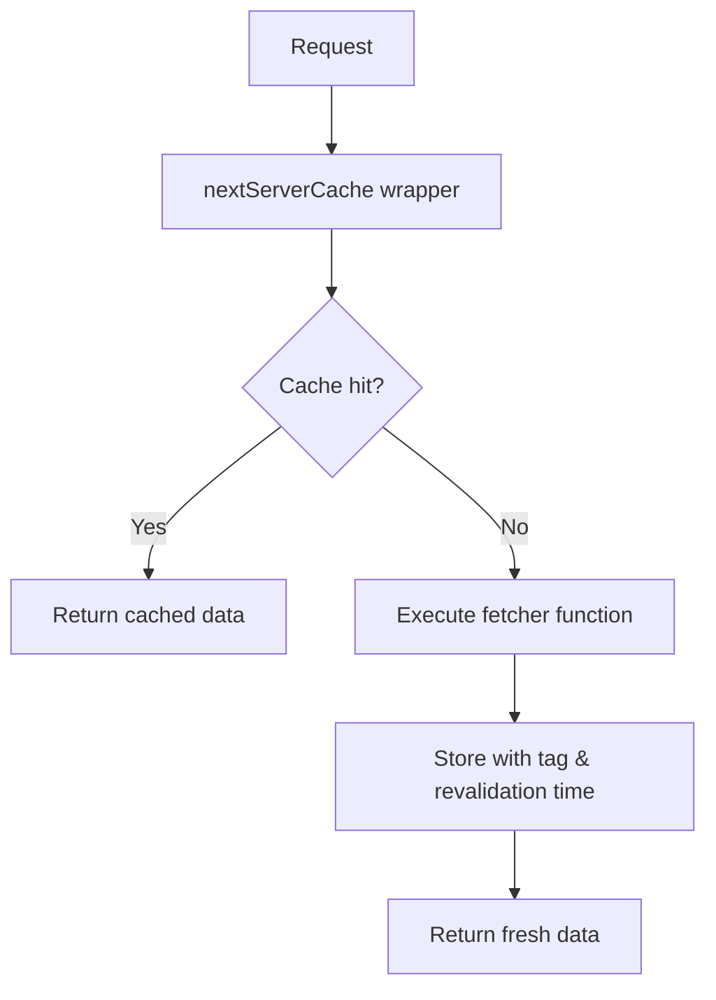

# Architecture Specification

## TL;DR (Quick Reference)

**Architecture**: Feature-Sliced Design (FSD) with strict layer boundaries

**Layer Hierarchy** (import direction →):



**Golden Rule**: NEVER import upward (e.g., entities/ cannot import features/)

**Key Layers**:

- `app/` - Routes, layouts, API endpoints (can import everything)
- `widgets/` - Composite layouts (Header, Footer)
- `features/` - User features (filtering, guestbook, AI summary)
- `entities/` - Domain models (Post, Tag, Notion clients)
- `shared/` - Utilities (cache, logger, UI primitives)

**Common Patterns**:

- Protected constructors with `static create()` factory methods
- Type guards for runtime validation (`isPostDatabaseResponse()`)
- Server-side caching wrapper (`nextServerCache`)
- Environment-based configuration (`config/index.ts`)

**See**: Full layer details and examples below

---

## Overview

The project is a Next.js App Router application that sources content from Notion, adds AI-powered enhancements, and serves a personal blog experience. The codebase follows **Feature-Sliced Design (FSD)** to keep domain logic, UI composition, and shared utilities well separated.

## Architectural Principles

### Feature-Sliced Design (FSD)

FSD organizes code into horizontal layers and vertical slices. Each layer has specific responsibilities and strict import rules to prevent circular dependencies and maintain clean separation of concerns.

### Layer Responsibilities

#### 1. `src/app/` - Application Layer
- **Purpose**: App Router routes, layouts, and API routes
- **Responsibility**: Composition only - wires together features and widgets
- **Contents**:
  - Page routes (`page.tsx`, `layout.tsx`)
  - API endpoints (`route.ts`)
  - Route groups and dynamic segments
- **Import Rules**: Can import from all lower layers

#### 2. `src/widgets/` - Widget Layer
- **Purpose**: Larger layout blocks reused across screens
- **Responsibility**: Composite UI components that combine multiple features
- **Contents**: Header, Footer, and other high-level layout components
- **Import Rules**: Can import from `features/`, `entities/`, and `shared/`

#### 3. `src/features/` - Features Layer
- **Purpose**: User-facing capabilities that solve specific tasks
- **Responsibility**: Task-oriented logic combining entities
- **Contents**:
  - Post filtering UI and logic
  - Guestbook submission flow
  - AI summary button and generation
  - Email alarm notifications
  - Tag filtering
- **Import Rules**: Can import from `entities/` and `shared/` only
- **Key Principle**: Features orchestrate entities but never contain core domain logic

#### 4. `src/entities/` - Entities Layer
- **Purpose**: Domain models, data mappers, and entity-specific UI
- **Responsibility**: Pure domain logic and low-level components tied to specific entities
- **Contents**:
  - `entities/posts/`: Post and Tag models, type guards, basic UI components
  - `entities/notion/`: Notion API clients (official and unofficial)
  - `entities/guestbooks/`: Guestbook domain model
  - `entities/theme/`: Theme provider and hooks
  - `entities/openai/`: OpenAI/local LLM integration
- **Import Rules**: Can import from `shared/` only
- **Key Principle**: Entities are self-contained and independent from features

#### 5. `src/shared/` - Shared Layer
- **Purpose**: Cross-cutting utilities, configuration, and primitives
- **Responsibility**: Reusable code with no business logic
- **Contents**:
  - `shared/config/`: Cache configuration, constants
  - `shared/lib/`: Utility functions (cache wrapper, logger, cn helper)
  - `shared/ui/`: Primitive UI components (Button, Tooltip, Loading, Error)
- **Import Rules**: Cannot import from any upper layer
- **Key Principle**: Must be generic and reusable across any context

#### 6. `src/mocks/` & `src/__test__/` - Testing Infrastructure
- **Purpose**: MSW handlers, test components, and Vitest suites
- **Responsibility**: Testing support without affecting production code
- **Contents**:
  - MSW API handlers
  - Test-specific components
  - Unit and integration tests

## Import Rules and Boundaries

### Import Rules Diagram





**Rules**:

- **Never** import upward (e.g., `entities/` cannot import from `features/`)
- **Never** skip layers for convenience
- **Never** create circular dependencies between features or entities

## Data Flow Patterns

### Notion to Domain Models



### AI Summary Generation Flow



### Caching Strategy



## Domain Model Design

### Protected Constructor Pattern

All domain entities use protected constructors with static factory methods to ensure validation:

```typescript
export class Post {
  private constructor(
    public readonly id: string,
    public readonly title: string,
    // ... other properties
  ) {}

  static create(page: DatabaseObjectResponse): Post {
    if (!isPostDatabaseResponse(page)) {
      throw new Error('Invalid post data');
    }
    // Validation and transformation
    return new Post(/* ... */);
  }
}
```

**Benefits**:
- Centralized validation logic
- Immutable instances
- Type-safe construction
- Clear API for creating instances

### Type Guards

Runtime validation ensures Notion API responses match expected structure:

- `isPostDatabaseResponse()`: Validates post database queries
- `isIPost()`: Runtime type checking for Post instances
- Type guards prevent runtime errors from API changes

## Key Architectural Decisions

### 1. Dual Notion Client Strategy

**Decision**: Use both official and unofficial Notion clients

**Rationale**:
- Official client (`@notionhq/client`): Reliable API for querying/updating
- Unofficial client (`notion-client`): Rich rendering capabilities

**Trade-off**: Additional dependency and `NOTION_TOKEN_V2` requirement for better UX

### 2. Server-Side Rendering with ISR

**Decision**: Use Next.js App Router with Incremental Static Regeneration

**Rationale**:
- Fast page loads for readers
- Fresh content without full rebuilds
- SEO optimization

**Configuration**:
- Development: 30 second revalidation
- Production: 5 minute revalidation

### 3. Environment-Based LLM Selection

**Decision**: OpenAI in production, local LLM in development

**Rationale**:
- Cost optimization (avoid API charges during development)
- Privacy for local testing
- Production quality maintained

**Implementation**: `entities/openai/` checks `NODE_ENV` and selects appropriate endpoint

### 4. Centralized Cache Management

**Decision**: Single cache wrapper with unified configuration

**Rationale**:
- Consistent cache behavior across application
- Easy to adjust revalidation times
- Simplified cache invalidation

**Implementation**: `shared/lib/cache.ts` wraps `unstable_cache` with project-specific defaults

## Adding New Features

When adding new behavior, follow this decision tree:

1. **Pure domain logic?** → Add to `entities/`
   - Example: New Post property, validation rule

2. **User-facing task?** → Add to `features/`
   - Example: Search functionality, comment system

3. **Layout composition?** → Add to `widgets/`
   - Example: Sidebar, navigation menu

4. **Generic utility?** → Add to `shared/`
   - Example: Date formatter, string helper

5. **Route or API endpoint?** → Add to `app/`
   - Example: New page, REST endpoint

**Key Rule**: Always add at the correct layer. Never bypass FSD principles for convenience.
