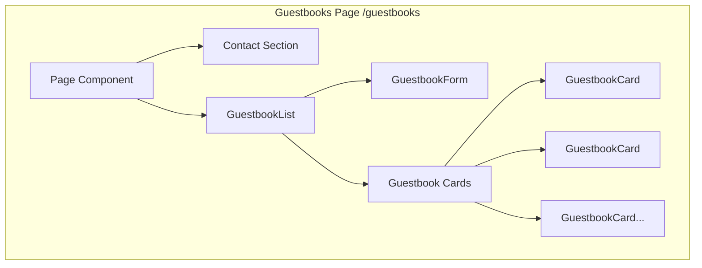
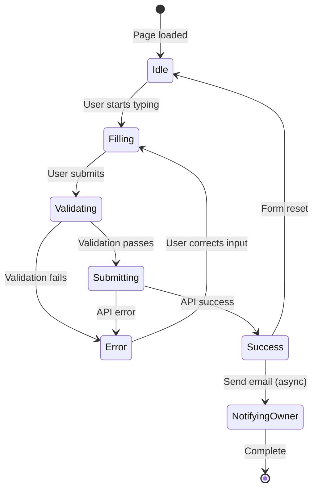
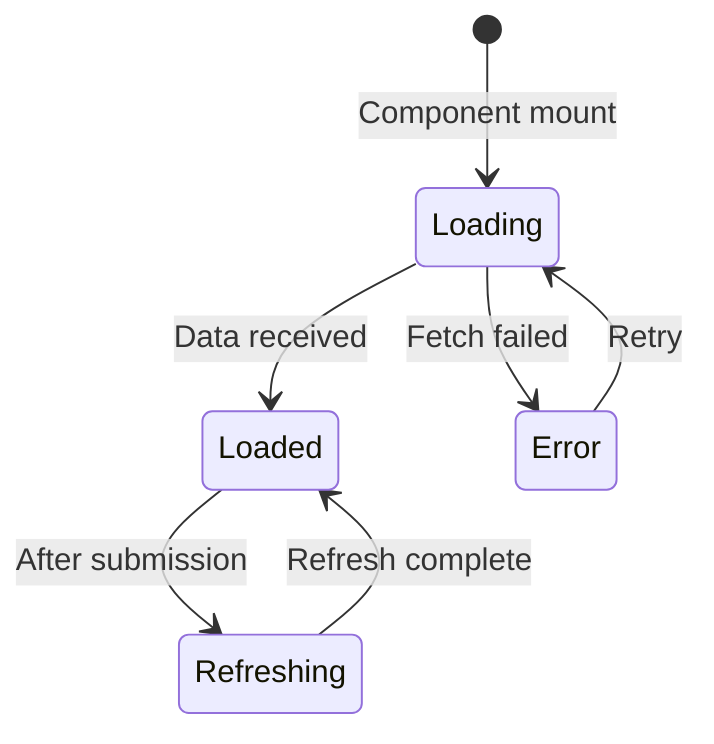

# Guestbook Domain Information Architecture

This document describes the screen structure, layout, components, and data flow for the Guestbook domain.

## Screen Inventory

### Guestbooks Page

**Route**: `/guestbooks`
**Purpose**: Allow visitors to leave messages and view existing public entries

#### Layout Structure

```
+--------------------------------------------------+
|                    Header                         |
+--------------------------------------------------+
|                                                  |
|  +--------------------------------------------+  |
|  |             Contact Section                 |  |
|  |                                            |  |
|  |  [Email Icon] meti@example.com             |  |
|  |  [GitHub Icon] github.com/meti             |  |
|  |  [LinkedIn Icon] linkedin.com/in/meti      |  |
|  |                                            |  |
|  +--------------------------------------------+  |
|                                                  |
|  +--------------------------------------------+  |
|  |            Guestbook Form                   |  |
|  |                                            |  |
|  |  Name: [________________]                  |  |
|  |                                            |  |
|  |  Message:                                  |  |
|  |  [__________________________________]      |  |
|  |  [__________________________________]      |  |
|  |                                            |  |
|  |  [ ] Keep this message private             |  |
|  |                                            |  |
|  |  [Submit Button]                           |  |
|  |                                            |  |
|  +--------------------------------------------+  |
|                                                  |
|  +--------------------------------------------+  |
|  |            Guestbook List                   |  |
|  |                                            |  |
|  |  +--------------------------------------+  |  |
|  |  | Author: John | Date: 2024-01-15      |  |  |
|  |  | "Great blog! Keep up the good work!" |  |  |
|  |  +--------------------------------------+  |  |
|  |  +--------------------------------------+  |  |
|  |  | Author: Jane | Date: 2024-01-14      |  |  |
|  |  | "Very helpful tutorials!"            |  |  |
|  |  +--------------------------------------+  |  |
|  |                                            |  |
|  +--------------------------------------------+  |
|                                                  |
+--------------------------------------------------+
|                    Footer                         |
+--------------------------------------------------+
```

#### Components

| Component | Type | Source |
|-----------|------|--------|
| Header | Server | `src/widgets/ui/header.tsx` |
| Contact | Server | `src/features/profile/ui/contact.tsx` |
| GuestbookList | Client | `src/features/guestbooks/ui/guestbook-list.tsx` |
| GuestbookForm | Client | `src/entities/guestbooks/ui/guestbook-form.tsx` |
| GuestbookCard | Client | `src/entities/guestbooks/ui/guestbook-card.tsx` |
| Footer | Server | `src/widgets/ui/footer.tsx` |

#### Data Requirements

**Server-side**:
- None (data fetched client-side for interactivity)

**Client-side**:
- `guestbooks: Guestbook[]` - List of public guestbook entries
- `isLoading: boolean` - Loading state for list
- `formState` - Form input values and validation state
- `isSubmitting: boolean` - Form submission state

#### SEO Metadata

| Property | Value |
|----------|-------|
| title | `contact` |
| description | `메티에게 방명록 남기기` |
| og:type | `website` |

---

## Component Hierarchy



---

## Data Flow Architecture

```mermaid
flowchart LR
    subgraph "External"
        Notion[(Notion API)]
        SMTP[Gmail SMTP]
    end

    subgraph "API Layer"
        GuestbookAPI[/api/guestbooks]
        AlarmAPI[/api/alarm]
    end

    subgraph "Feature Layer"
        GL[GuestbookList]
        GF[GuestbookForm]
    end

    subgraph "Entity Layer"
        GB[Guestbook Model]
        GC[GuestbookCard]
    end

    GF -->|POST| GuestbookAPI
    GL -->|GET| GuestbookAPI
    GuestbookAPI -->|Read/Write| Notion
    GuestbookAPI --> GB

    GF -->|Notify| AlarmAPI
    AlarmAPI --> SMTP

    GB --> GC
    GL --> GC
```

---

## State Flow

### Form Submission State



### List Loading State



---

## Form Specification

### Input Fields

| Field | Type | Required | Validation |
|-------|------|----------|------------|
| name | text | Yes | Non-empty string |
| content | textarea | Yes | Non-empty string |
| isPrivate | checkbox | No | Boolean (default: false) |

### Form States

| State | UI Representation |
|-------|------------------|
| Idle | Form enabled, no messages |
| Filling | Form enabled, real-time validation |
| Submitting | Button loading, form disabled |
| Success | Success toast, form reset |
| Error | Error message below field |

---

## Responsive Breakpoints

| Breakpoint | Width | Layout Adjustment |
|------------|-------|-------------------|
| Mobile | < 640px | Single column, full-width cards |
| Tablet | 640px - 1024px | Single column, padded cards |
| Desktop | > 1024px | Centered content, max-width |

---

## API Integration

### GET /api/guestbooks

**Trigger**: Component mount, after successful submission
**Response**: All guestbook entries (client filters public)

```typescript
// Response structure
{
  message: "게스트북을 성공적으로 가져왔습니다.",
  data: DatabaseObjectResponse[]
}
```

### POST /api/guestbooks

**Trigger**: Form submission
**Payload**:
```typescript
{
  name: string;
  content: string;
  isPrivate: boolean;
}
```

**Response**:
```typescript
{
  message: "게스트북을 성공적으로 생성했습니다.",
  data: { id, name, content, isPrivate }
}
```

---

## Error States

### Form Errors
- **Empty name**: "이름은 필수입니다."
- **Empty content**: "내용은 필수입니다."
- **Server error**: "게스트북 생성에 실패했습니다."

### List Errors
- **Fetch failed**: "게스트북 가져오기에 실패했습니다." + Retry button
- **Empty list**: "아직 남겨진 방명록이 없습니다." (friendly message)

---

## Accessibility Considerations

| Element | Accessibility Feature |
|---------|----------------------|
| Form | Label associations, ARIA labels |
| Submit button | Loading state announced |
| Error messages | Associated with form fields |
| Card list | Semantic list markup |
| Privacy toggle | Clear label, keyboard accessible |
