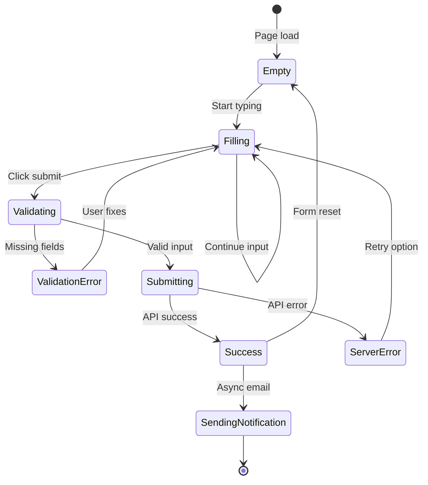
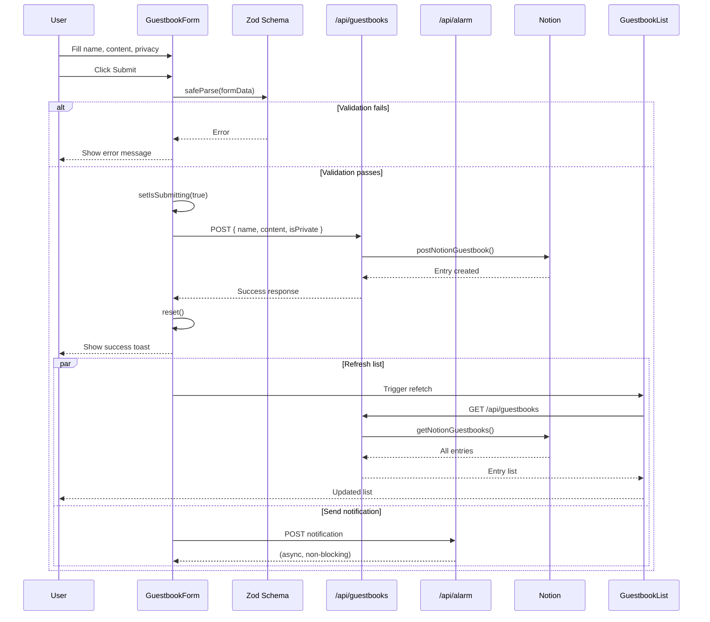
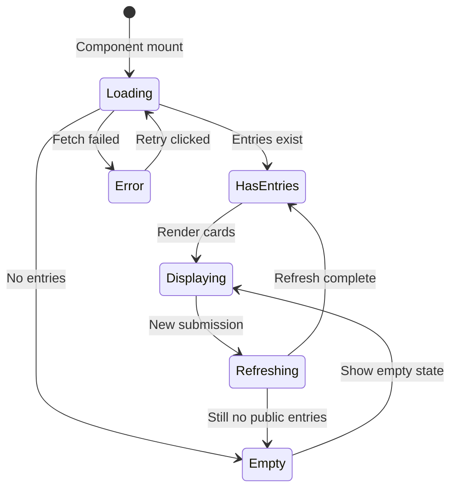
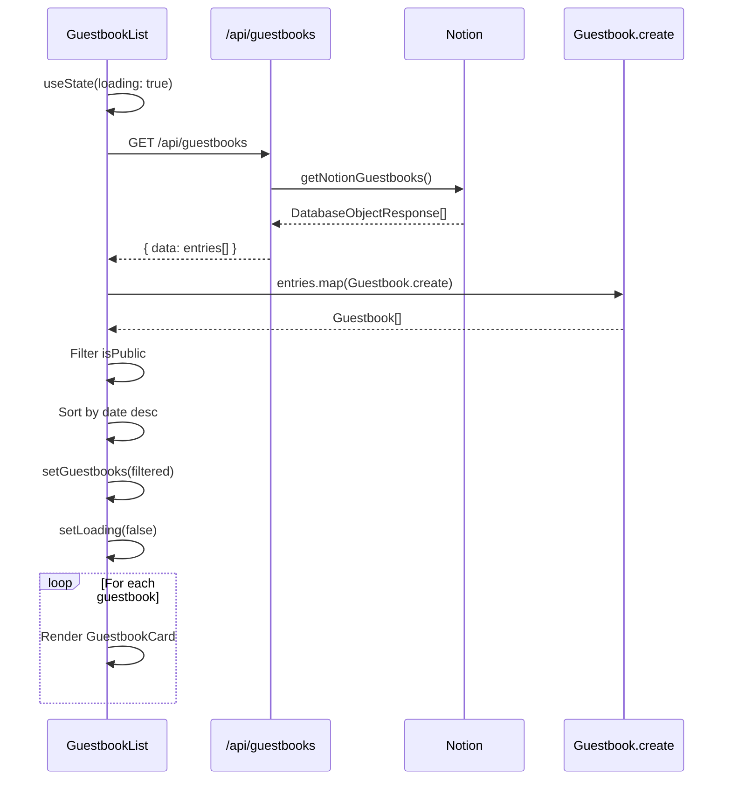

# Guestbook Domain Use Cases (Frontend)

This document describes the frontend use cases for the Guestbook domain, including form interactions and list display.

## UC-F-010: Submit Guestbook Entry

### Overview

| Property | Value |
|----------|-------|
| Primary Actor | Visitor |
| Trigger | User clicks submit button on guestbook form |
| Preconditions | Guestbook page loaded with form visible |
| Postconditions | Entry stored in Notion, list refreshed |

### Main Flow

1. **User** navigates to `/guestbooks` page
2. **System** displays contact section and guestbook form
3. **User** enters name in name field
4. **User** enters message in content field
5. **User** optionally toggles privacy setting
6. **User** clicks submit button
7. **System** validates input client-side
8. **System** shows loading state on button
9. **System** sends POST request to API
10. **API** stores entry in Notion database
11. **System** displays success message
12. **System** resets form
13. **System** refreshes guestbook list
14. **User** sees new entry in list (if public)

### Alternative Flows

**AF-1: Validation Failure**
1. At step 7, if name or content is empty
2. System displays validation error message
3. Button remains enabled
4. User corrects input and retries

**AF-2: Server Error**
1. At step 10, if API returns error
2. System displays error message
3. Form data preserved for retry
4. User can retry submission

**AF-3: Private Message**
1. At step 5, user toggles privacy to private
2. Message stored with "비공개" status
3. Message not shown in public list

### UI State Diagram



### Component Interactions



### State Management

```typescript
// In GuestbookForm component
const {
  register,
  handleSubmit,
  reset,
  formState: { errors, isSubmitting }
} = useForm<GuestbookFormData>({
  resolver: zodResolver(guestbookSchema)
});

const onSubmit = async (data: GuestbookFormData) => {
  try {
    const response = await fetch('/api/guestbooks', {
      method: 'POST',
      body: JSON.stringify(data),
    });

    if (!response.ok) throw new Error('Submission failed');

    toast.success('메시지가 등록되었습니다!');
    reset();
    refetchGuestbooks();

    // Async notification (fire and forget)
    sendNotification(data);
  } catch (error) {
    toast.error('등록에 실패했습니다. 다시 시도해주세요.');
  }
};
```

---

## UC-F-011: View Guestbook List

### Overview

| Property | Value |
|----------|-------|
| Primary Actor | Visitor |
| Trigger | Page load or after submission refresh |
| Preconditions | Guestbook page accessible |
| Postconditions | Public entries displayed |

### Main Flow

1. **System** component mounts
2. **System** sends GET request to API
3. **API** fetches all entries from Notion
4. **System** receives entry list
5. **System** maps entries to Guestbook domain model
6. **System** filters to show only public entries
7. **System** sorts by date descending
8. **System** renders GuestbookCard for each entry
9. **User** views message list

### Alternative Flows

**AF-1: Empty List**
1. At step 4, if no entries exist
2. System displays friendly empty state message
3. Form remains accessible for first entry

**AF-2: Fetch Error**
1. At step 3, if API call fails
2. System displays error message with retry button
3. User can click retry to attempt again

**AF-3: All Private Messages**
1. At step 6, if all entries are private
2. System displays same as empty state
3. User only sees their own public submissions

### UI State Diagram



### Component Interactions



### Data Transformation

```typescript
// In GuestbookList component
const [guestbooks, setGuestbooks] = useState<Guestbook[]>([]);
const [isLoading, setIsLoading] = useState(true);
const [error, setError] = useState<string | null>(null);

const fetchGuestbooks = async () => {
  setIsLoading(true);
  setError(null);

  try {
    const response = await fetch('/api/guestbooks');
    const { data } = await response.json();

    const entries = data
      .map(Guestbook.create)
      .filter((g: Guestbook) => g.isPublic)
      .sort((a: Guestbook, b: Guestbook) =>
        new Date(b.date).getTime() - new Date(a.date).getTime()
      );

    setGuestbooks(entries);
  } catch (err) {
    setError('게스트북을 불러오는데 실패했습니다.');
  } finally {
    setIsLoading(false);
  }
};
```

---

## Error Handling Summary

| Use Case | Error Type | User Message | Recovery Action |
|----------|------------|--------------|-----------------|
| UC-F-010 | Missing name | "이름은 필수입니다" | Fill name field |
| UC-F-010 | Missing content | "내용은 필수입니다" | Fill content field |
| UC-F-010 | Server error | "게스트북 생성에 실패했습니다" | Retry button |
| UC-F-011 | Fetch error | "게스트북 가져오기에 실패했습니다" | Retry button |
| UC-F-011 | Empty list | "아직 남겨진 방명록이 없습니다" | None needed |

---

## Accessibility Considerations

| Use Case | Accessibility Feature |
|----------|----------------------|
| UC-F-010 | Form labels, error announcements, loading state |
| UC-F-011 | Semantic list markup, loading announcements |

---

## Performance Considerations

| Aspect | Optimization |
|--------|-------------|
| Initial load | Show skeleton while loading |
| After submission | Optimistic update before refetch |
| Notification | Fire-and-forget (non-blocking) |
| List rendering | Virtualization for large lists |
