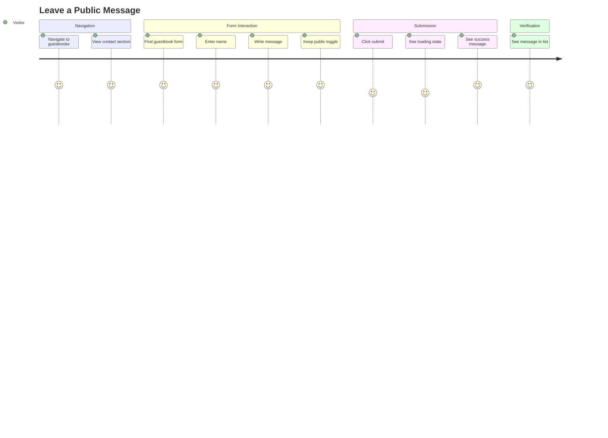
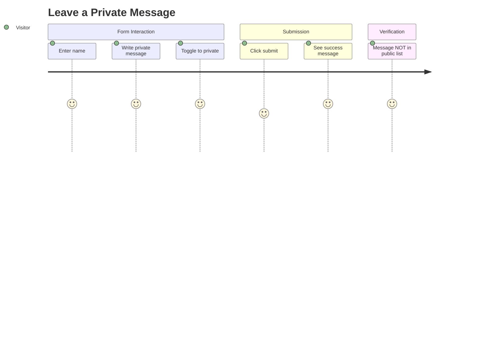
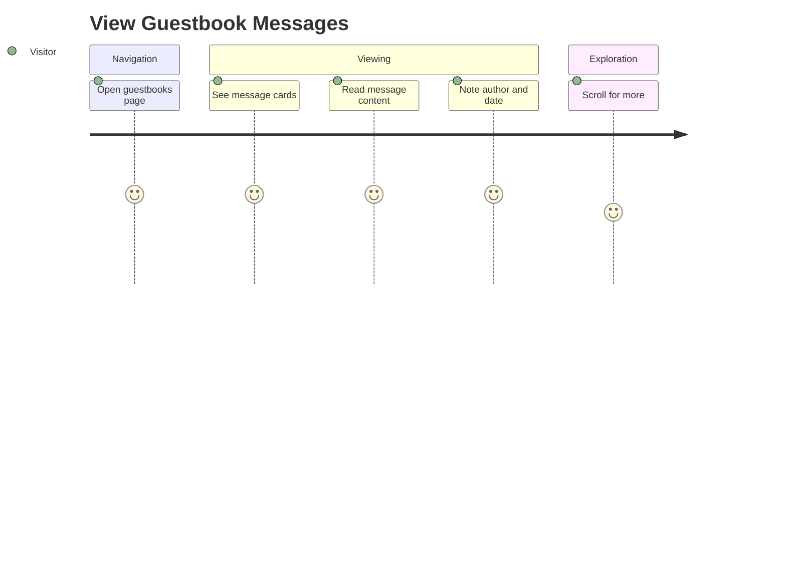
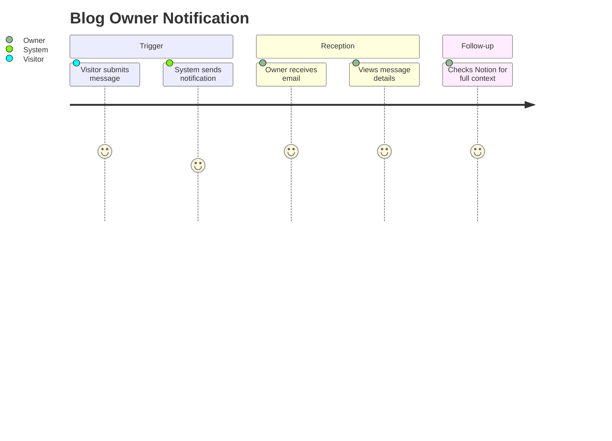

# Guestbook Domain User Stories

This document describes end-to-end user journeys for the Guestbook domain, covering message submission, viewing, and privacy controls.

## User Personas

### Visitor
Anonymous blog reader who wants to leave feedback, appreciation, or questions for the blog owner.

### Blog Owner (Meti)
Content creator who wants to receive and manage visitor messages through Notion.

---

## User Journeys

### Journey 1: Leave a Public Message

**Persona**: Visitor
**Goal**: Share appreciation or feedback visible to other visitors
**Preconditions**: User has navigated to the guestbook page



#### Steps

1. **Navigate to Guestbook Page**
   - User action: Click "Guestbooks" in navigation
   - System response: Display guestbook page with contact section and form
   - Validation: Page loads within 2 seconds

2. **View Contact Information**
   - User action: Observe contact section
   - System response: Display email, social links, contact info
   - Validation: Contact information is visible

3. **Locate Guestbook Form**
   - User action: Scroll to form section
   - System response: Display form with name, message, and privacy toggle
   - Validation: All form fields visible and interactive

4. **Fill Out Form**
   - User action: Enter name and message
   - System response: Real-time validation feedback
   - Validation: Required field indicators visible

5. **Keep Public Setting**
   - User action: Leave privacy toggle as default (public)
   - System response: Toggle shows "public" state
   - Validation: Default is public visibility

6. **Submit Form**
   - User action: Click submit button
   - System response:
     - Button shows loading state
     - API call to POST /api/guestbooks
     - Success message displayed
     - Form resets
   - Validation: Submission completes within 3 seconds

7. **View Submitted Message**
   - User action: Scroll to guestbook list
   - System response: New message appears at top of list
   - Validation: Message content matches submission

#### Success Criteria
- [ ] Form validates required fields
- [ ] Loading state visible during submission
- [ ] Success message displayed after submission
- [ ] Form resets after successful submission
- [ ] New message appears in public list

#### Error Scenarios

| Scenario | User Experience | Recovery |
|----------|----------------|----------|
| Empty name | Error: "이름은 필수입니다" | Enter name |
| Empty content | Error: "내용은 필수입니다" | Enter content |
| Server error | Error: "게스트북 생성에 실패했습니다" | Retry submission |
| Network timeout | Error message with retry option | Retry submission |

---

### Journey 2: Leave a Private Message

**Persona**: Visitor
**Goal**: Share private feedback only visible to blog owner
**Preconditions**: User wants to communicate privately



#### Steps

1. **Fill Out Form**
   - User action: Enter name and private message content
   - System response: Validation passes
   - Validation: Fields are valid

2. **Enable Private Mode**
   - User action: Toggle visibility to "private"
   - System response: Toggle switches to private state
   - Validation: Privacy setting is "private"

3. **Submit Private Message**
   - User action: Click submit
   - System response:
     - Store with status "비공개" in Notion
     - Show success message
     - Form resets
   - Validation: Submission successful

4. **Verify Privacy**
   - User action: Check guestbook list
   - System response: Private message NOT displayed in public list
   - Validation: Only owner sees private messages in Notion

#### Success Criteria
- [ ] Privacy toggle works correctly
- [ ] Private message stored with "비공개" status
- [ ] Private message not visible in public list
- [ ] Success confirmation still shown

---

### Journey 3: View Guestbook Messages

**Persona**: Visitor
**Goal**: Read messages from other visitors
**Preconditions**: Guestbook page is accessible



#### Steps

1. **Navigate to Guestbook**
   - User action: Navigate to /guestbooks
   - System response: Page loads with contact info and message list
   - Validation: Page fully rendered

2. **View Message List**
   - User action: Observe message cards
   - System response: Display cards with author, date, content
   - Validation: Only public messages shown

3. **Read Individual Messages**
   - User action: Read message content
   - System response: Full content visible without truncation
   - Validation: Content is readable and well-formatted

4. **Browse More Messages**
   - User action: Scroll down for more
   - System response: Additional messages load (if pagination)
   - Validation: All public messages accessible

#### Success Criteria
- [ ] All public messages displayed
- [ ] No private messages visible
- [ ] Messages sorted by date (newest first)
- [ ] Author name and date visible
- [ ] Responsive layout on all devices

---

### Journey 4: Blog Owner Receives Notification

**Persona**: Blog Owner (Meti)
**Goal**: Be notified of new guestbook entries
**Preconditions**: Email notification configured



#### Steps

1. **Visitor Submits Message**
   - Trigger: Form submission successful
   - System action: API stores message in Notion
   - Validation: Notion database updated

2. **System Triggers Notification**
   - System action: Call /api/alarm endpoint
   - Payload: From address, subject, message content
   - Validation: Notification request sent

3. **Owner Receives Email**
   - System action: Email delivered via Gmail SMTP
   - Content: Visitor name, message, privacy status
   - Validation: Email arrives in inbox

4. **Owner Reviews in Notion**
   - Owner action: Open Notion guestbook database
   - System response: Full entry visible with all properties
   - Validation: Entry matches email notification

#### Success Criteria
- [ ] Notification sent for each submission
- [ ] Email contains relevant details
- [ ] Non-blocking (doesn't slow user experience)
- [ ] Handles email failures gracefully

---

## Acceptance Test Scenarios (E2E)

### Scenario 1: Complete Submission Flow

```gherkin
Feature: Guestbook Submission
  As a visitor
  I want to leave a message
  So that I can share feedback with the blog owner

  Scenario: Submit public message
    Given I am on the guestbooks page
    When I enter "John" in the name field
    And I enter "Great blog!" in the content field
    And I click the submit button
    Then I should see a success message
    And the form should be reset
    And my message should appear in the list

  Scenario: Submit with missing name
    Given I am on the guestbooks page
    When I leave the name field empty
    And I enter "Hello" in the content field
    And I click the submit button
    Then I should see an error message "이름은 필수입니다"
    And the form should not be submitted
```

### Scenario 2: Privacy Control

```gherkin
Feature: Message Privacy
  As a visitor
  I want to control message visibility
  So that I can choose public or private communication

  Scenario: Submit private message
    Given I am on the guestbooks page
    When I enter my name and message
    And I toggle the privacy setting to private
    And I submit the form
    Then I should see a success message
    And my message should NOT appear in the public list

  Scenario: Default to public
    Given I am on the guestbooks page
    When I fill out the form without changing privacy
    And I submit the form
    Then my message should appear in the public list
```

### Scenario 3: Message Display

```gherkin
Feature: Guestbook Display
  As a visitor
  I want to view guestbook messages
  So that I can read what others have shared

  Scenario: View public messages only
    Given there are public and private messages
    When I visit the guestbooks page
    Then I should only see public messages
    And messages should be sorted by date descending

  Scenario: View empty guestbook
    Given there are no guestbook entries
    When I visit the guestbooks page
    Then I should see an appropriate empty state message
```

---

## Metrics & Success Indicators

| Metric | Target | Measurement |
|--------|--------|-------------|
| Form submission success rate | > 95% | API success/error ratio |
| Page load time | < 2s | Lighthouse |
| Form completion rate | > 70% | Analytics |
| Private message ratio | Informational | Database query |
| Email notification delivery | > 99% | Email service logs |
