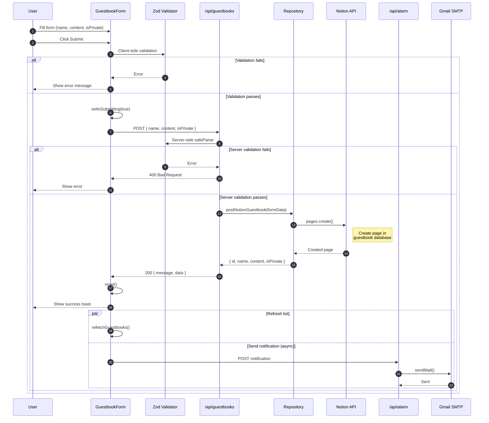
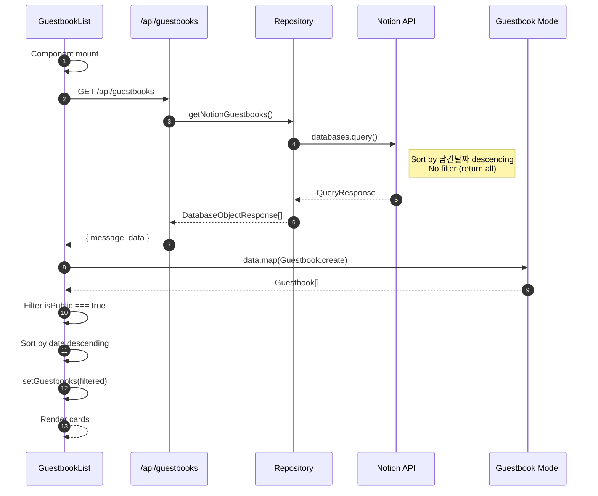
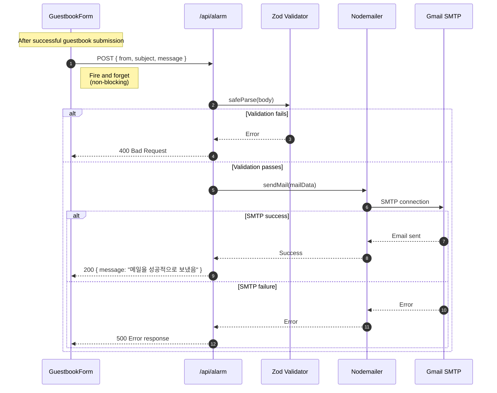
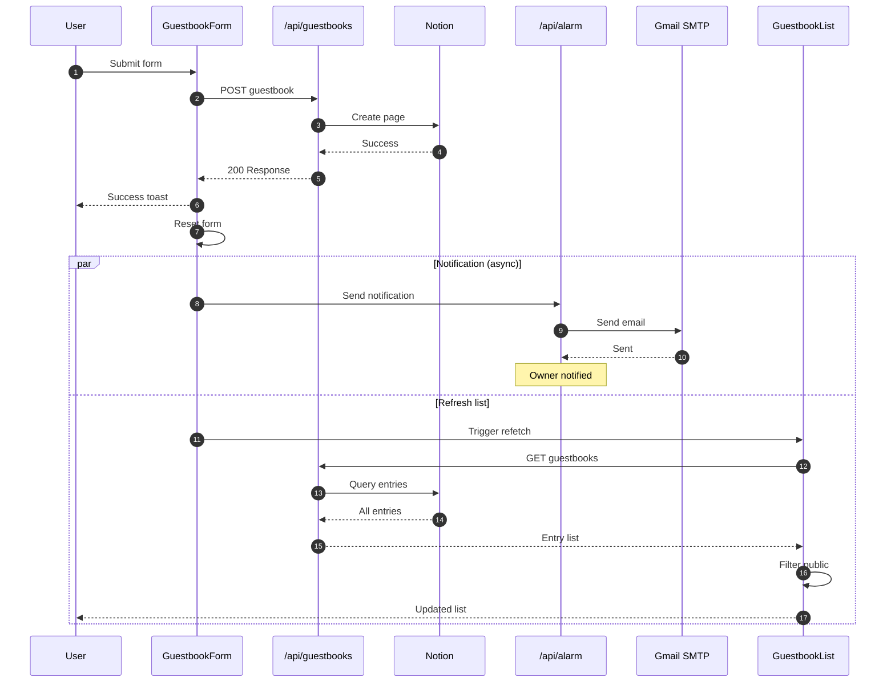
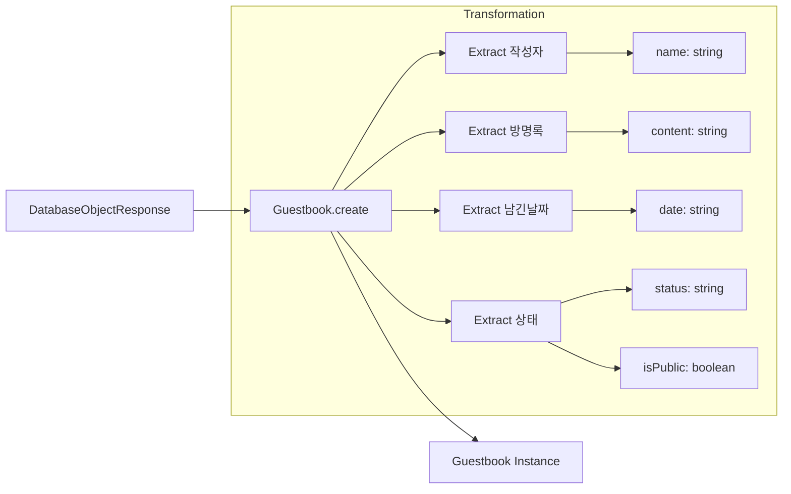

# Guestbook Domain Sequence Diagrams

This document contains detailed sequence diagrams for all backend workflows in the Guestbook domain.

## 1. Submit Guestbook Entry

### Overview

Submit a new guestbook entry with validation and optional email notification.

### Actors

- **Client**: Browser UI (GuestbookForm)
- **API Route**: `/api/guestbooks`
- **Repository**: Notion client wrapper
- **Alarm API**: Email notification service
- **Notion**: External Notion API

### Sequence



### Request/Response Schema

**Request**:
```typescript
POST /api/guestbooks
Content-Type: application/json

{
  name: string;      // Author name
  content: string;   // Message content
  isPrivate: boolean; // Visibility flag
}
```

**Success Response** (200):
```typescript
{
  message: "게스트북을 성공적으로 생성했습니다.",
  data: {
    id: string;        // Notion page ID
    name: string;
    content: string;
    isPrivate: boolean;
  }
}
```

**Validation Error Response** (400):
```typescript
"이름, 내용을 입력 해주세요."
```

**Server Error Response** (500):
```typescript
{
  message: "게스트북 생성에 실패했습니다.",
  error: Error
}
```

### Notion Page Creation

```typescript
// Data stored in Notion
await notion.pages.create({
  parent: { database_id: GUESTBOOK_DATABASE_ID },
  properties: {
    작성자: {
      title: [{ text: { content: `${name} 님의 방명록` } }]
    },
    방명록: {
      rich_text: [{ text: { content: content } }]
    },
    남긴날짜: {
      date: { start: new Date().toISOString() }
    },
    상태: {
      status: { name: isPrivate ? "비공개" : "공개" }
    }
  }
});
```

---

## 2. Fetch Guestbook Entries

### Overview

Fetch all guestbook entries from Notion database.

### Actors

- **Client**: Browser UI (GuestbookList)
- **API Route**: `/api/guestbooks`
- **Repository**: Notion client wrapper
- **Notion**: External Notion API

### Sequence



### Request/Response Schema

**Request**:
```typescript
GET /api/guestbooks
```

**Success Response** (200):
```typescript
{
  message: "게스트북을 성공적으로 가져왔습니다.",
  data: DatabaseObjectResponse[]  // Raw Notion data
}
```

**Error Response** (500):
```typescript
{
  message: "게스트북 가져오기에 실패했습니다.",
  error: Error
}
```

### Notion Query

```typescript
await notion.databases.query({
  database_id: GUESTBOOK_DATABASE_ID,
  sorts: [
    {
      property: "남긴날짜",
      direction: "descending"
    }
  ]
  // No filter - all entries returned
  // Client-side filtering for public entries
});
```

---

## 3. Email Notification Flow

### Overview

Send email notification to blog owner after guestbook submission.

### Actors

- **Client**: GuestbookForm (after successful submission)
- **Alarm API**: `/api/alarm`
- **Nodemailer**: Email library
- **SMTP**: Gmail SMTP server

### Sequence



### Notification Payload

```typescript
// Sent from GuestbookForm after submission
{
  from: "guestbook@blog.com",
  subject: `새로운 방명록: ${formData.name}`,
  message: `
    이름: ${formData.name}
    내용: ${formData.content}
    공개여부: ${formData.isPrivate ? "비공개" : "공개"}
  `
}
```

---

## 4. Complete Submission Workflow

### Overview

End-to-end flow from user submission to notification.

### Sequence



---

## Error Handling Matrix

| Flow | Error Type | HTTP Status | Recovery |
|------|-----------|-------------|----------|
| Submit | Validation failed | 400 | Show field errors |
| Submit | Notion API error | 500 | Retry submission |
| Fetch | Notion API error | 500 | Retry button |
| Notification | Email failed | 500 | Log error (non-blocking) |

---

## Data Transformation

### Notion Response to Domain Model



### Property Extraction

```typescript
// In Guestbook.create()
if (isGuestbookDatabaseResponse(data)) {
  const id = data.id;
  const name = data.properties.작성자.title[0].plain_text;
  const content = data.properties.방명록.rich_text[0].plain_text;
  const date = data.properties.남긴날짜.date.start.split("T")[0];
  const status = data.properties.상태.status.name;

  return new Guestbook({ id, name, content, date, status });
}
```
