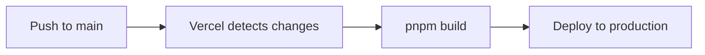
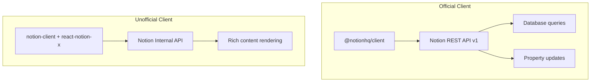
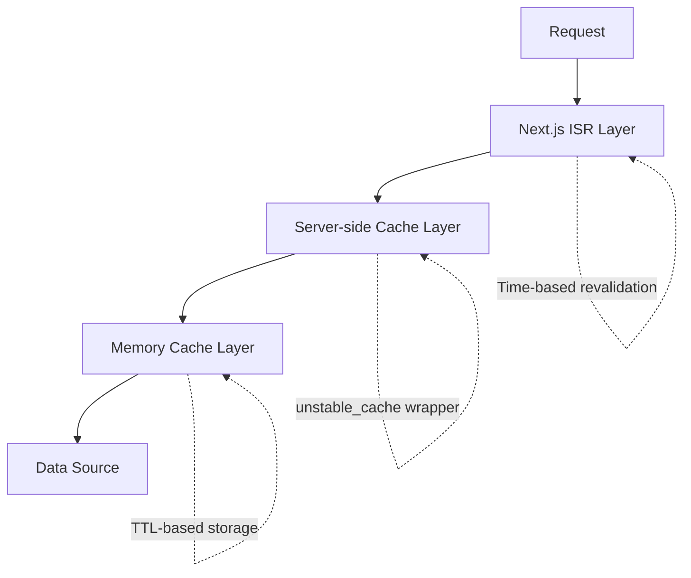
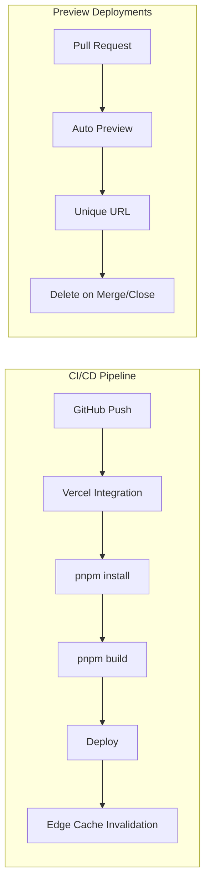

# Infrastructure Specification

## Local Development Environment

### Required Software

- **Node.js**: Version `22.x` (see `package.json` engines field)
- **Package Manager**: pnpm (workspace catalog feature required)
- **Git**: For version control

### Installation Steps

1. **Install dependencies**:

   ```bash
   pnpm install
   ```

2. **Configure environment variables**:
   - Copy `.env.local.example` to `.env.local` (if template exists)
   - Fill in required environment variables (see Environment Variables section)

3. **Start development server**:

   ```bash
   pnpm dev
   ```

   - Runs on `http://localhost:3000`
   - Hot reload enabled
   - Environment: `NODE_ENV=development`

### Environment Variables

Create `.env.local` in the project root with the following variables:

#### Notion Integration

```bash
NOTION_KEY=secret_xxxxxxxxxxxxx           # Notion integration token
NOTION_TOKEN_V2=xxxxxxxxxxxxxxxxxx        # Browser cookie for unofficial client
NOTION_POST_DATABASE_ID=xxxxxxxx          # Post database ID
NOTION_GUESTBOOK_DATABASE_ID=xxxxxxxx    # Guestbook database ID
NOTION_ABOUT_PAGE_ID=xxxxxxxx            # About page ID
NOTION_USER_ID=xxxxxxxx                  # Your Notion user ID
```

#### AI Integration

```bash
# Production: OpenAI
OPENAI_API_KEY=sk-xxxxxxxxxxxxx

# Development: Local LLM (optional)
LOCAL_AI_ENDPOINT=http://localhost:11434
```

#### Email (Gmail SMTP)

```bash
AUTH_USER=your-email@gmail.com           # Gmail address
AUTH_PASS=xxxx xxxx xxxx xxxx            # Gmail app password (not regular password)
```

#### Deployment & SEO

```bash
BLOG_URL=https://yourdomain.com          # Production URL
GOOGLE_SITE_VERIFICATION=xxxxxxxx        # Google Search Console verification
VERCEL_TOKEN=xxxxxxxx                    # For API access (if needed)
```

**Security Notes**:

- Never commit `.env.local` to version control
- Use `.env.local` for local development only
- Store production secrets in Vercel project settings

## Tooling & Scripts

### Development Commands

```bash
pnpm dev              # Start Next.js dev server (hot reload, port 3000)
```

### Build Commands

```bash
pnpm build            # Production build with ISR optimization
pnpm start            # Serve production build locally
```

### Code Quality Commands

```bash
pnpm lint             # Run Next.js ESLint (extends next/core-web-vitals)
pnpm biome:write      # Format code with Biome (src/ directory)
```

### Testing Commands

```bash
pnpm test             # Run Vitest with MSW mocking
pnpm test:deep        # Extended tests with real Notion API calls
                      # Requires valid NOTION_* credentials
                      # Sets DEEP_TEST=true flag
```

### Pre-Push Checklist

Before pushing to remote:

1. Run `pnpm lint` - ensure no ESLint errors
2. Run `pnpm biome:write` - format code consistently
3. Run `pnpm test` - verify tests pass
4. Run `pnpm build` - ensure production build succeeds

## Build & Deployment

### Production Build Process

```bash
pnpm build
```

**Build Output**:

- Optimized for Vercel deployment
- Static pages pre-rendered where possible
- API routes bundled as serverless functions
- Image optimization via `sharp` dependency

**Build Optimizations**:

- SWC minification enabled (see `next.config.mjs`)
- Tree shaking for unused code
- Code splitting by route
- Image optimization with Next.js Image component

### Deployment Target: Vercel

**Platform**: Vercel (optimized for Next.js)

**Deployment Flow**:



**Environment Configuration**:

- Set environment variables in Vercel project settings
- Use Vercel dashboard for secret management
- Configure custom domain if applicable

### ISR Configuration

Incremental Static Regeneration settings (in `src/shared/config/index.ts`):

```typescript
// Development
ISR_REVALIDATE_TIME: 30 seconds
MEMORY_CACHE_TTL: 30000 milliseconds

// Production
ISR_REVALIDATE_TIME: 300 seconds (5 minutes)
MEMORY_CACHE_TTL: 300000 milliseconds
```

**Revalidation Strategy**:

- Time-based: Automatic refresh after configured interval
- On-demand: `revalidateTag()` and `revalidatePath()` for immediate updates

## Data & Integrations

### Notion CMS

**Integration Type**: Headless CMS

**Client Libraries**:



| Client | Package | Authentication | Usage | Location |
|--------|---------|---------------|-------|----------|
| Official | `@notionhq/client` | `NOTION_KEY` | Database queries, property updates | `src/entities/notion/api/server-side.ts` |
| Unofficial | `notion-client` + `react-notion-x` | `NOTION_TOKEN_V2` | Rich content rendering | `src/entities/notion/api/react-notion-x.ts` |

**Database Structure**:

- **Posts Database**: Contains blog posts with Korean property names
  - "제목" (Title)
  - "날짜" (Date)
  - "상태" (Status) - must be "Published" for public visibility
  - "태그" (Tags)
  - "요약" (Summary) - AI-generated summary storage

- **Guestbook Database**: Stores visitor messages
  - Name, email, message, visibility (public/private)

**API Call Tracking**:

- `NotionAPILogger` singleton logs statistics
- Development: Writes to `logs/notion-api.log`
- Production: Lightweight logging to avoid data leakage

### OpenAI / Local LLM

**Environment-Based Selection**:

- **Production** (`NODE_ENV=production`): OpenAI API
  - Endpoint: `https://api.openai.com/v1`
  - Authentication: `OPENAI_API_KEY`
  - Model: GPT-4 or configured model

- **Development** (`NODE_ENV=development`): Local LLM
  - Endpoint: `LOCAL_AI_ENDPOINT` (e.g., `http://localhost:11434`)
  - No authentication required
  - Compatible with Ollama or similar

**Usage**: AI summary generation for blog posts

**Implementation**: `src/entities/openai/`

### Email Notifications

**Provider**: Gmail SMTP

**Configuration**:

- SMTP Host: `smtp.gmail.com`
- Port: 465 (SSL) or 587 (TLS)
- Authentication: App password (not regular Gmail password)

**Setup Gmail App Password**:

1. Enable 2-factor authentication on Gmail
2. Go to Google Account > Security > App Passwords
3. Generate new app password for "Mail"
4. Use generated password in `AUTH_PASS`

**Usage**: Contact form and guestbook notifications

**Implementation**: `src/features/alarm/` using `nodemailer`

## Logging, Caching & Observability

### Logging

**Framework**: Pino logger with pretty-printing

**Configuration**:

- Development: Pretty-printed console output
- Production: JSON-formatted logs

**Utilities**:

- `withPinoLogger`: Wrapper for instrumenting functions
- `NotionAPILogger`: Tracks Notion API call statistics

**Location**: `src/shared/lib/logger.ts`

**Log Files**:

- `logs/notion-api.log`: Notion API call tracking (development only)

### Caching

**Strategy**: Multi-layer caching



**Layers**:

1. **Next.js ISR**: Static generation with time-based revalidation
2. **Server-side cache**: `unstable_cache` wrapper for data fetching
3. **Memory cache**: TTL-based in-memory storage (aligned with ISR)

**Cache Wrapper**: `nextServerCache` in `src/shared/lib/cache.ts`

**Cache Tags**:

- `posts`: All post-related queries
- Custom tags for specific queries

**Cache Invalidation**:

```typescript
import { revalidateTag, revalidatePath } from 'next/cache';

// Invalidate all posts
revalidateTag('posts');

// Invalidate specific route
revalidatePath('/posts');
```

**Use Case**: After AI summary generation, invalidate caches to show updated content

### Monitoring

**Production Monitoring**:

- **Vercel Analytics**: Traffic and user behavior
- **Vercel Speed Insights**: Core Web Vitals tracking

**Implementation**: Enabled in root layout (`src/app/layout.tsx`)

**Metrics Tracked**:

- Page views
- User sessions
- Performance metrics (LCP, FID, CLS)
- Geographic distribution

## CI/CD Pipeline

### GitHub Actions

**Workflows**:

1. **Pull Request Check** (`.github/workflows/pull_request.yml`):
   - Trigger: PR to `main` branch
   - Steps:
     - Install dependencies
     - Run Biome formatter check
   - Purpose: Code quality gate

2. **Cleanup Preview Deployments** (`.github/workflows/cleanup.yml`):
   - Trigger: PR merged or closed
   - Steps:
     - Delete associated Vercel preview deployment
   - Purpose: Resource cleanup

### Continuous Deployment

**Platform**: Vercel

**Trigger**: Push to `main` branch



## Security Considerations

### Secret Management

- **Never commit** `.env.local` or any file containing secrets
- Use Vercel environment variables for production
- Rotate API keys periodically
- Use Gmail app passwords (not regular passwords)

### API Security

- Notion tokens have scoped permissions (read-only where possible)
- OpenAI API keys restricted to specific models
- Email credentials limited to sending only

### Content Security

- Notion "상태" (Status) property controls post visibility
- Only "Published" posts appear on blog
- Guestbook messages can be public or private
- No user authentication required (public blog)

## Troubleshooting

### Common Issues

1. **Notion API errors**:
   - Verify `NOTION_KEY` has access to databases
   - Check database IDs are correct
   - Ensure Korean property names match exactly

2. **Build failures**:
   - Clear `.next` directory: `rm -rf .next`
   - Delete `node_modules` and reinstall: `rm -rf node_modules && pnpm install`
   - Check TypeScript errors: `pnpm tsc --noEmit`

3. **Cache not invalidating**:
   - Verify `revalidateTag()` calls after updates
   - Check ISR revalidation times in config
   - Clear browser cache for testing

4. **Email sending fails**:
   - Confirm Gmail app password (not regular password)
   - Check firewall allows SMTP port 465/587
   - Verify `AUTH_USER` is full email address
