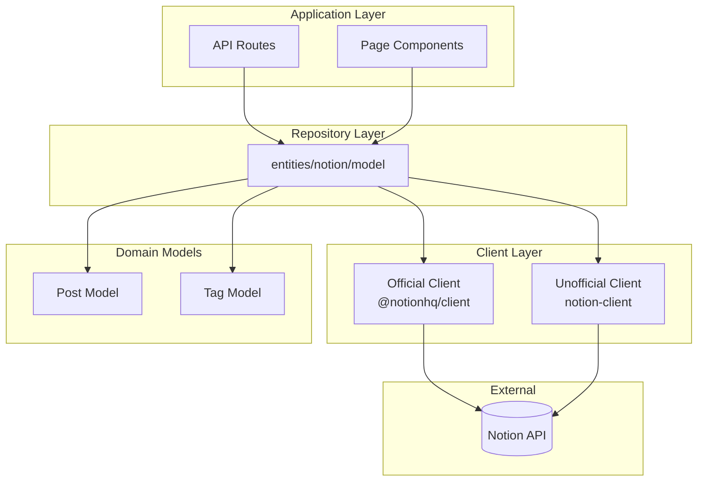
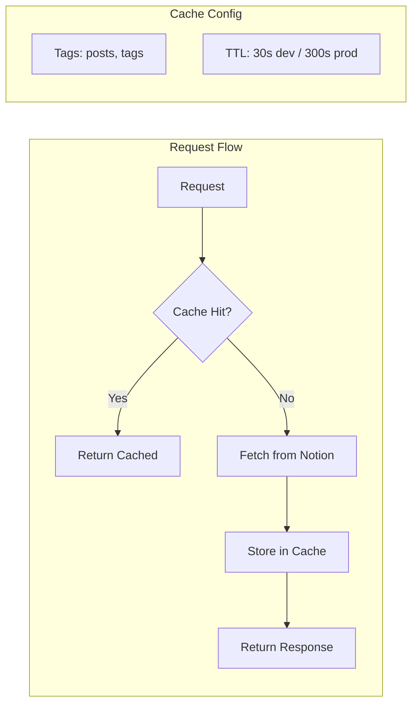
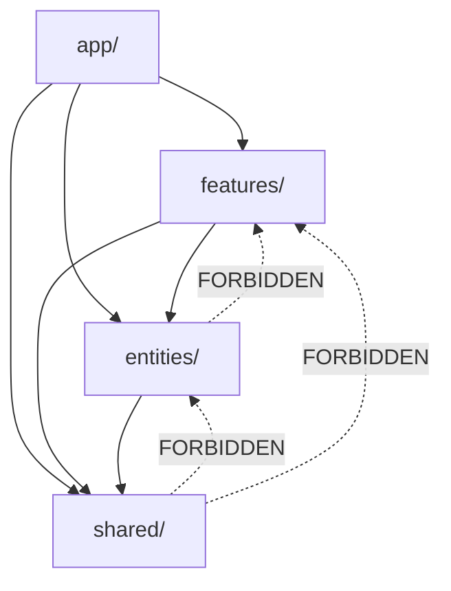
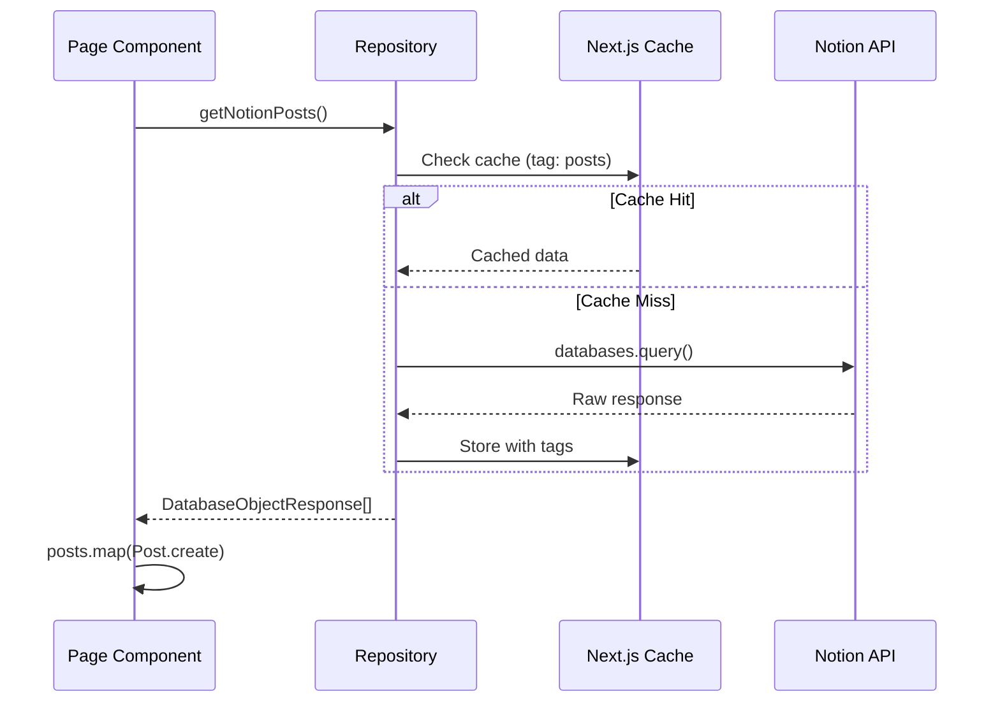
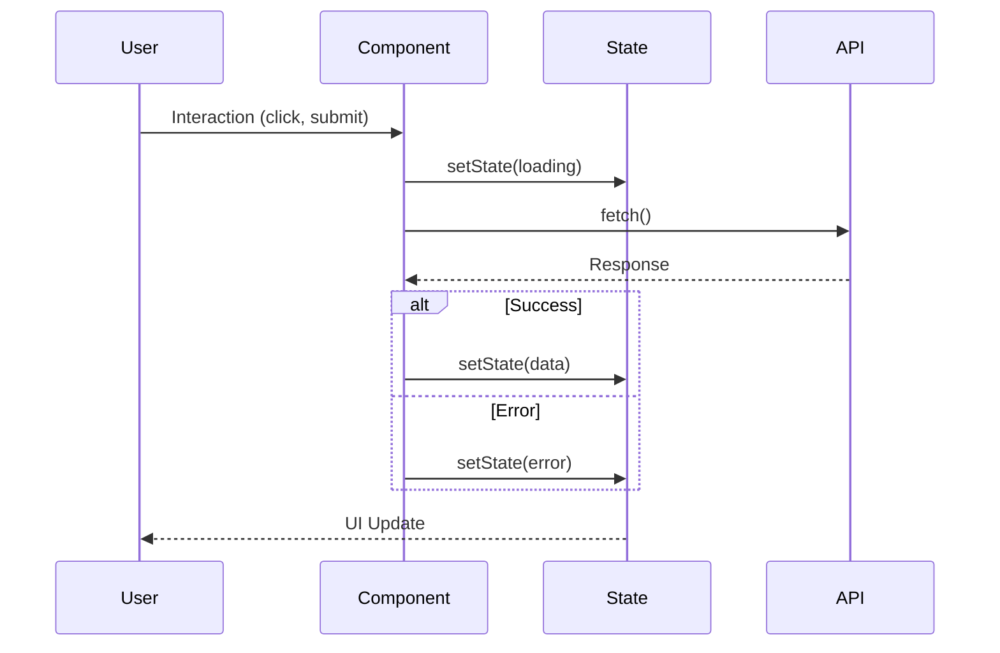

# Posts Domain Component Design

This document describes the component architecture, repository pattern implementation, and design patterns used in the Posts domain.

## Repository Pattern: Notion Client Abstraction

### Overview

The project uses a **repository pattern** to abstract Notion API interactions. This allows:
- Swapping Notion clients without affecting business logic
- Centralized caching strategy
- Unified error handling
- Type-safe data access

### Architecture Diagram



### Dual Client Strategy

| Client | Library | Purpose | Token |
|--------|---------|---------|-------|
| Official | `@notionhq/client` | Database queries, property updates | `NOTION_KEY` |
| Unofficial | `notion-client` | Rich page content rendering | `NOTION_TOKEN_V2` |

**Why Two Clients?**
- Official API lacks support for complex content rendering
- Unofficial client provides better UI rendering with `react-notion-x`
- Both needed for full functionality

### Repository Functions

```typescript
// src/entities/notion/model/index.ts

// Posts - Read Operations
export const getNotionPosts = nextServerCache(_getNotionPosts, ["posts"]);
export const getNotionPostMetadata = _getNotionPostMetadata;
export const getNotionPostContentForSummary = _getNotionPostContentForSummary;
export const getNotionPostDatabaseTags = nextServerCache(
  _getNotionPostDatabaseTags,
  ["tags"]
);
export const getNotionPage = _getNotionPage;
export const getSlugMap = _getSlugMap;

// Posts - Write Operations
export const patchNotionPostSummary = _patchNotionPostSummary;
```

### Caching Layer



**Cache Wrapper Function**:
```typescript
// src/shared/lib/cache.ts
export function nextServerCache<T>(
  fn: () => Promise<T>,
  tags: string[]
): () => Promise<T> {
  return unstable_cache(fn, tags, {
    revalidate: CACHE_CONFIG.ISR_REVALIDATE_TIME,
    tags,
  });
}
```

### Cache Invalidation

After write operations, invalidate affected caches:

```typescript
// In API route after successful update
revalidateTag("posts");     // Invalidate all post queries
revalidatePath("/posts");   // Invalidate posts list page
revalidatePath("/");        // Invalidate home page
```

---

## Domain Model Pattern

### Protected Constructor Pattern

Domain entities use protected constructors to ensure:
- All instances are properly validated
- Centralized data transformation logic
- Immutable domain objects
- Type safety at creation time

### Post Model

```typescript
// src/entities/posts/model/index.ts

export class Post implements IPost {
  public id;
  public title;
  public slugifiedTitle;
  public tags;
  public cover;
  public icon;
  public publishTime;
  public lastEditedTime;
  public aiSummary;

  protected constructor(post: IPost) {
    this.id = post.id;
    this.title = post.title;
    this.slugifiedTitle = post.slugifiedTitle;
    this.tags = post.tags.map(Tag.create);
    this.cover = post.cover;
    this.icon = post.icon;
    this.publishTime = post.publishTime;
    this.lastEditedTime = post.lastEditedTime;
    this.aiSummary = post.aiSummary;
  }

  public static create(data: unknown): Post {
    if (data instanceof Post) return data;
    if (isIPost(data)) return new Post(data);
    if (isPostDatabaseResponse(data)) {
      // Transform Notion response to domain model
      return new Post({
        id: data.id,
        title: data.properties.제목.title[0].plain_text,
        slugifiedTitle: slug(title),
        tags: data.properties.Tags.multi_select,
        cover: data.cover?.external?.url ?? "",
        icon: data.icon?.external?.url ?? "/mascot.png",
        publishTime: data.properties.날짜.date.start,
        lastEditedTime: data.last_edited_time,
        aiSummary: data.properties.summary?.rich_text[0]?.plain_text ?? "",
      });
    }
    throw Error("Post 객체 생성 오류");
  }

  get aiSummarized(): boolean {
    return this.aiSummary !== "";
  }
}
```

### Tag Model

```typescript
export class Tag implements ITag {
  public id;
  public name;
  public color;
  public description;

  protected constructor(tag: ITag) {
    this.id = tag.id;
    this.name = tag.name;
    this.color = tag.color;
    this.description = tag.description;
  }

  public static create(data: unknown): Tag {
    if (data instanceof Tag) return data;
    if (isITag(data)) return new Tag(data);
    if (isTagDatabaseResponse(data)) return new Tag(data);
    throw Error("Tag 객체 생성 오류");
  }
}
```

### Type Guards

```typescript
export function isIPost(obj: unknown): obj is IPost {
  if (typeof obj !== "object" || obj === null) return false;
  const o = obj as IPost;
  return (
    typeof o.id === "string" &&
    typeof o.title === "string" &&
    Array.isArray(o.tags) &&
    o.tags.every(isITag) &&
    typeof o.cover === "string" &&
    typeof o.icon === "string" &&
    typeof o.publishTime === "string"
  );
}

export function isPostDatabaseResponse(
  obj: unknown
): obj is PostDatabaseResponse {
  // Validates Notion API response structure
  // Checks for Korean property names (제목, 날짜, 상태)
}
```

---

## Component Hierarchy

### Feature-Sliced Design Layers

```
src/
├── app/                    # Routes & API
│   ├── posts/
│   │   ├── page.tsx       # Posts list page
│   │   └── [slug]/
│   │       └── page.tsx   # Post detail page
│   └── api/
│       └── posts/
│           └── [postId]/
│               └── summary/
│                   └── route.ts
│
├── features/posts/         # User-facing features
│   ├── api/
│   │   └── index.ts       # Feature API functions
│   └── ui/
│       ├── ai-summary-button.tsx
│       ├── featured-post.tsx
│       ├── filterable-post.tsx
│       ├── post-navigator.tsx
│       └── posts-grid.tsx
│
├── entities/posts/         # Domain model & UI
│   ├── model/
│   │   ├── index.ts       # Post, Tag classes
│   │   └── type.d.ts      # Type definitions
│   ├── ui/
│   │   ├── post-card.tsx
│   │   ├── small-post-card.tsx
│   │   ├── ai-summary-card.tsx
│   │   ├── empty-posts.tsx
│   │   └── client-notion-renderer.tsx
│   └── utils/
│       └── index.ts       # Utility functions
│
└── shared/                 # Cross-cutting
    ├── lib/
    │   └── cache.ts       # Caching utilities
    └── config/
        └── index.ts       # Configuration
```

### Import Rules (FSD)



---

## Key Components

### AISummaryButton

**Purpose**: Trigger AI summary generation for posts without summary

**Props**:
```typescript
interface AISummaryButtonProps {
  postId: string;
  initialSummary?: string;
}
```

**State**:
```typescript
const [isGenerating, setIsGenerating] = useState(false);
const [summary, setSummary] = useState<string | null>(initialSummary ?? null);
const [error, setError] = useState<string | null>(null);
```

**Render Logic**:
```typescript
if (summary) {
  return <AISummaryCard summary={summary} />;
}
return (
  <Button onClick={handleGenerate} disabled={isGenerating}>
    {isGenerating ? <Spinner /> : "Generate AI Summary"}
  </Button>
);
```

### FilterablePosts

**Purpose**: Container for tag filter and posts grid with client-side filtering

**Props**:
```typescript
interface FilterablePostsProps {
  dataList: DatabaseObjectResponse[];
  tagDataList: TagDatabaseResponse[];
}
```

**State**:
```typescript
const [selectedTags, setSelectedTags] = useState<Set<string>>(new Set());
```

**Filter Logic**:
```typescript
const filteredPosts = useMemo(() => {
  const posts = dataList.map(Post.create);
  if (selectedTags.size === 0) return posts;
  return posts.filter(post =>
    post.tags.some(tag => selectedTags.has(tag.id))
  );
}, [dataList, selectedTags]);
```

### ClientNotionRenderer

**Purpose**: Render Notion page content using react-notion-x

**Props**:
```typescript
interface ClientNotionRendererProps {
  recordMap: ExtendedRecordMap;
}
```

**Features**:
- Code block syntax highlighting
- Image optimization
- Dark mode support
- Equation rendering (KaTeX)
- Table of contents

### PostNavigator

**Purpose**: Display prev/next and related post links

**Props**:
```typescript
interface PostNavigatorProps {
  id: string; // Current post ID
}
```

**Data Fetching**:
```typescript
// Server component
const posts = await getNotionPosts();
const sortedPosts = posts.map(Post.create).sort(byDate);
const currentIndex = sortedPosts.findIndex(p => p.id === id);
```

---

## Data Flow Patterns

### Server-Side Data Fetching



### Client-Side State Updates



---

## Error Boundary Strategy

```typescript
// Wrap client components with error boundaries
<ErrorBoundary fallback={<PostErrorFallback />}>
  <ClientNotionRenderer recordMap={recordMap} />
</ErrorBoundary>
```

**Error States**:
| Component | Error Fallback |
|-----------|---------------|
| FilterablePosts | Show all posts without filter |
| ClientNotionRenderer | "Failed to load content" message |
| AISummaryButton | Error message with retry button |
| PostNavigator | Hide navigation section |

---

## Performance Optimizations

### Code Splitting

```typescript
// Dynamic import for heavy components
const ClientNotionRenderer = dynamic(
  () => import("@/entities/posts/ui/client-notion-renderer"),
  { loading: () => <PostSkeleton /> }
);
```

### Image Optimization

```typescript
// Use Next.js Image component
<Image
  src={post.cover}
  alt={post.title}
  width={800}
  height={400}
  loading="lazy"
/>
```

### Memoization

```typescript
// Memoize filtered posts
const filteredPosts = useMemo(() => {
  return posts.filter(/* ... */);
}, [posts, selectedTags]);

// Memoize expensive computations
const relatedPosts = useMemo(() => {
  return calculateRelatedPosts(currentPost, allPosts);
}, [currentPost.id, allPosts]);
```
