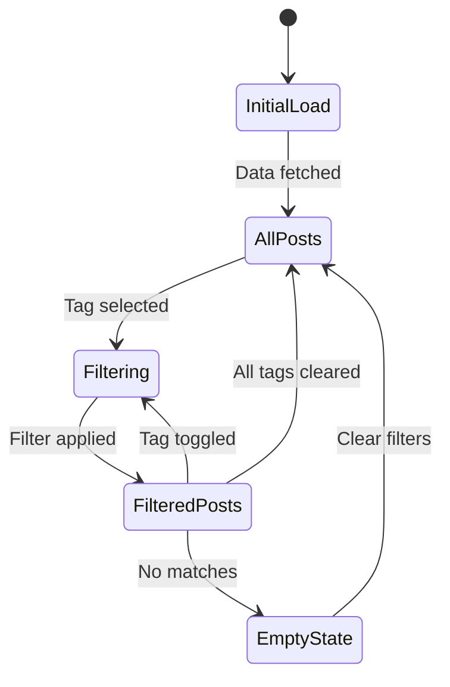
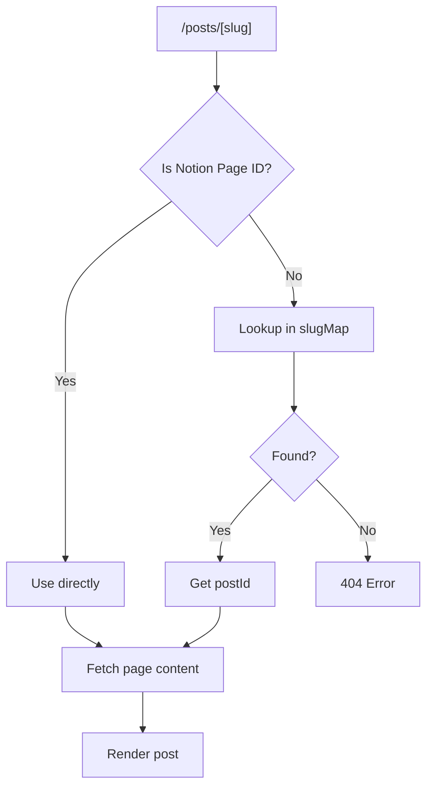
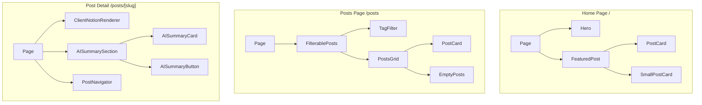
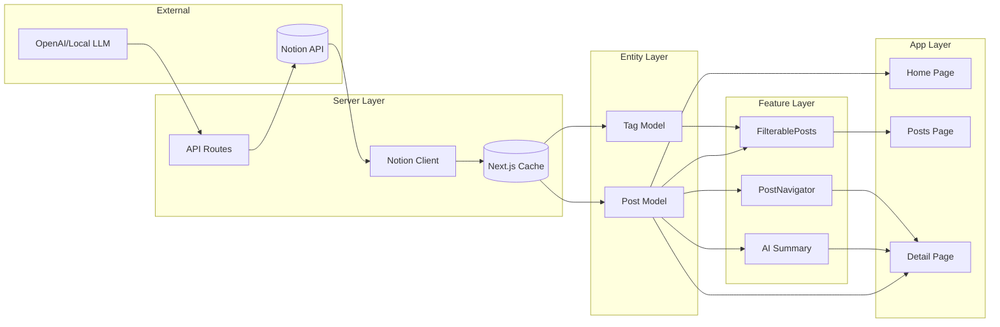

# Posts Domain Information Architecture

This document describes the screen structure, layout, components, and data flow for all pages related to the Posts domain.

## Screen Inventory

### 1. Home Page (Posts Section)

**Route**: `/`
**Purpose**: Display featured posts to attract visitor engagement

#### Layout Structure

```
+--------------------------------------------------+
|                    Header                         |
+--------------------------------------------------+
|                                                  |
|                 Hero Section                     |
|              (Profile/Introduction)              |
|                                                  |
+--------------------------------------------------+
|                                                  |
|              Featured Posts Grid                 |
|                                                  |
|  +------------+  +------------+  +------------+  |
|  | Post Card  |  | Post Card  |  | Post Card  |  |
|  +------------+  +------------+  +------------+  |
|  +------------+  +------------+  +------------+  |
|  | Post Card  |  | Post Card  |  | Post Card  |  |
|  +------------+  +------------+  +------------+  |
|                                                  |
+--------------------------------------------------+
|                    Footer                         |
+--------------------------------------------------+
```

#### Components

| Component | Type | Source |
|-----------|------|--------|
| Header | Server | `src/widgets/ui/header.tsx` |
| Hero | Server | `src/features/profile/ui/hero.tsx` |
| FeaturedPost | Server | `src/features/posts/ui/featured-post.tsx` |
| PostCard | Server | `src/entities/posts/ui/post-card.tsx` |
| SmallPostCard | Server | `src/entities/posts/ui/small-post-card.tsx` |
| Footer | Server | `src/widgets/ui/footer.tsx` |

#### Data Requirements

**Server-side**:
- `getNotionPosts()` - Fetch all published posts
- Posts mapped to `Post.create()` for domain model

**Client-side**:
- None (static rendering)

#### SEO Metadata

| Property | Value |
|----------|-------|
| title | `Meti's Blog` |
| description | Blog introduction |
| og:image | Default blog image |

---

### 2. Posts List Page

**Route**: `/posts`
**Purpose**: Browse all posts with tag-based filtering

#### Layout Structure

```
+--------------------------------------------------+
|                    Header                         |
+--------------------------------------------------+
|                                                  |
|  +--------------------------------------------+  |
|  |             Tag Filter Section              |  |
|  |  [React] [TypeScript] [CSS] [Node.js] ...  |  |
|  +--------------------------------------------+  |
|                                                  |
|  +--------------------------------------------+  |
|  |              Posts Grid                     |  |
|  |                                            |  |
|  |  +----------+  +----------+  +----------+  |  |
|  |  |Post Card |  |Post Card |  |Post Card |  |  |
|  |  +----------+  +----------+  +----------+  |  |
|  |  +----------+  +----------+  +----------+  |  |
|  |  |Post Card |  |Post Card |  |Post Card |  |  |
|  |  +----------+  +----------+  +----------+  |  |
|  |                                            |  |
|  +--------------------------------------------+  |
|                                                  |
+--------------------------------------------------+
|                    Footer                         |
+--------------------------------------------------+
```

#### Components

| Component | Type | Source |
|-----------|------|--------|
| Header | Server | `src/widgets/ui/header.tsx` |
| FilterablePosts | Client | `src/features/posts/ui/filterable-post.tsx` |
| TagFilter | Client | `src/features/tags/ui/tag-filter.tsx` |
| PostsGrid | Client | `src/features/posts/ui/posts-grid.tsx` |
| PostCard | Server | `src/entities/posts/ui/post-card.tsx` |
| EmptyPosts | Client | `src/entities/posts/ui/empty-posts.tsx` |
| Footer | Server | `src/widgets/ui/footer.tsx` |

#### Data Requirements

**Server-side**:
- `getNotionPosts()` - Fetch all published posts
- `getNotionPostDatabaseTags()` - Fetch available tag options

**Client-side**:
- `selectedTags: Set<string>` - Currently selected tag IDs
- `filteredPosts: Post[]` - Posts matching filter criteria
- URL query params sync for shareable links

#### State Flow



#### SEO Metadata

| Property | Value |
|----------|-------|
| title | `posts` |
| description | `메티의 포스트` |
| og:type | `website` |

---

### 3. Post Detail Page

**Route**: `/posts/[slug]`
**Purpose**: Display full post content with AI summary and navigation

#### Layout Structure

```
+--------------------------------------------------+
|                    Header                         |
+--------------------------------------------------+
|                                                  |
|  +--------------------------------------------+  |
|  |              Post Header                    |  |
|  |  Title: "Building a Blog with Next.js"     |  |
|  |  Date: 2024-01-15                          |  |
|  |  Tags: [React] [Next.js] [TypeScript]      |  |
|  +--------------------------------------------+  |
|                                                  |
|  +--------------------------------------------+  |
|  |           AI Summary Section                |  |
|  |  +--------------------------------------+  |  |
|  |  | AI Summary Card                      |  |  |
|  |  | "This post explains how to build..." |  |  |
|  |  +--------------------------------------+  |  |
|  |            OR                              |  |
|  |  +--------------------------------------+  |  |
|  |  | [Generate AI Summary] Button         |  |  |
|  |  +--------------------------------------+  |  |
|  +--------------------------------------------+  |
|                                                  |
|  +--------------------------------------------+  |
|  |            Post Content                     |  |
|  |  (Notion Rich Text Rendering)              |  |
|  |                                            |  |
|  |  ## Introduction                           |  |
|  |  Lorem ipsum dolor sit amet...            |  |
|  |                                            |  |
|  |  ```typescript                             |  |
|  |  const example = "code block";             |  |
|  |  ```                                       |  |
|  |                                            |  |
|  |                               |  |
|  |                                            |  |
|  +--------------------------------------------+  |
|                                                  |
|  +--------------------------------------------+  |
|  |           Post Navigator                    |  |
|  |  <- Previous Post    |    Next Post ->     |  |
|  |  +------------------+  +------------------+ |  |
|  |  | Related Post 1   |  | Related Post 2   | |  |
|  |  +------------------+  +------------------+ |  |
|  +--------------------------------------------+  |
|                                                  |
+--------------------------------------------------+
|                    Footer                         |
+--------------------------------------------------+
```

#### Components

| Component | Type | Source |
|-----------|------|--------|
| Header | Server | `src/widgets/ui/header.tsx` |
| ClientNotionRenderer | Client | `src/entities/posts/ui/client-notion-renderer.tsx` |
| AISummaryCard | Client | `src/entities/posts/ui/ai-summary-card.tsx` |
| AISummaryButton | Client | `src/features/posts/ui/ai-summary-button.tsx` |
| PostNavigator | Server | `src/features/posts/ui/post-navigator.tsx` |
| Footer | Server | `src/widgets/ui/footer.tsx` |

#### Data Requirements

**Server-side**:
- `getSlugMap()` - Map URL slug to Notion page ID
- `getNotionPage(postId)` - Fetch page content via unofficial client
- `getNotionPostMetadata(postId)` - Fetch title, description, tags
- `getNotionPosts()` - For navigation (prev/next/related)

**Client-side**:
- `recordMap: ExtendedRecordMap` - Notion page data for renderer
- `summary: string` - AI summary text
- `isGenerating: boolean` - Summary generation loading state

#### URL Routing



#### SEO Metadata

| Property | Source |
|----------|--------|
| title | Post title from Notion |
| description | First paragraph excerpt (77 chars) |
| keywords | Post tags |
| canonical | `/posts/[slugified-title]` |
| og:type | `article` |

---

## Component Hierarchy



---

## Data Flow Architecture



---

## Responsive Breakpoints

| Breakpoint | Width | Posts Grid Columns |
|------------|-------|-------------------|
| Mobile | < 640px | 1 |
| Tablet | 640px - 1024px | 2 |
| Desktop | > 1024px | 3 |

---

## Navigation Structure

```
/                     # Home (Featured Posts)
├── /posts           # All Posts (Filterable)
│   └── /posts/[slug]  # Post Detail
├── /about           # About Page
└── /guestbooks      # Guestbook
```

---

## Caching Strategy by Page

| Page | Revalidation | Cache Tags |
|------|--------------|------------|
| `/` | 300s (prod) | `posts` |
| `/posts` | 180s | `posts`, `tags` |
| `/posts/[slug]` | ISR config | - |

---

## Error States

### 404 Not Found
- **Trigger**: Invalid slug or deleted post
- **Display**: Custom 404 page with link to posts list

### Loading States
- **Posts Grid**: Skeleton cards
- **Post Detail**: Full-page skeleton
- **AI Summary**: Button spinner, then card

### Empty States
- **No Posts**: "No posts published yet"
- **No Filter Match**: "No posts match selected tags" + Clear button
