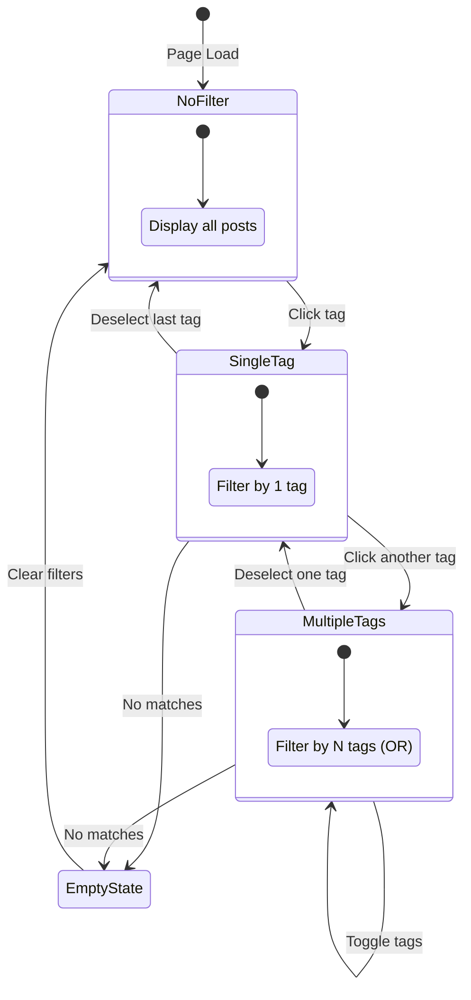
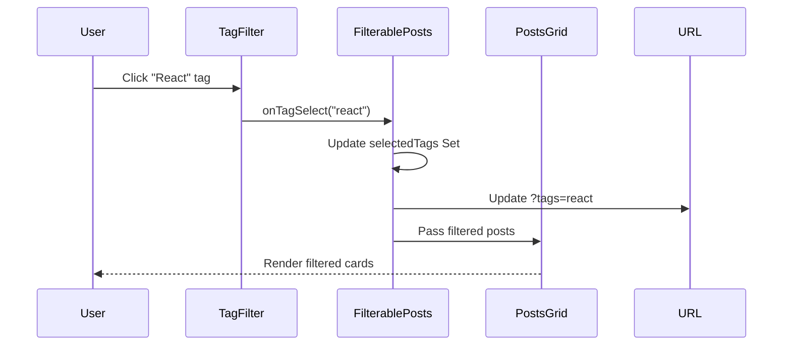
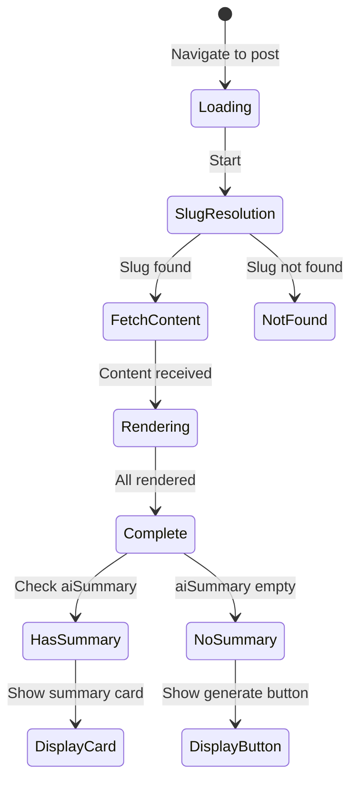
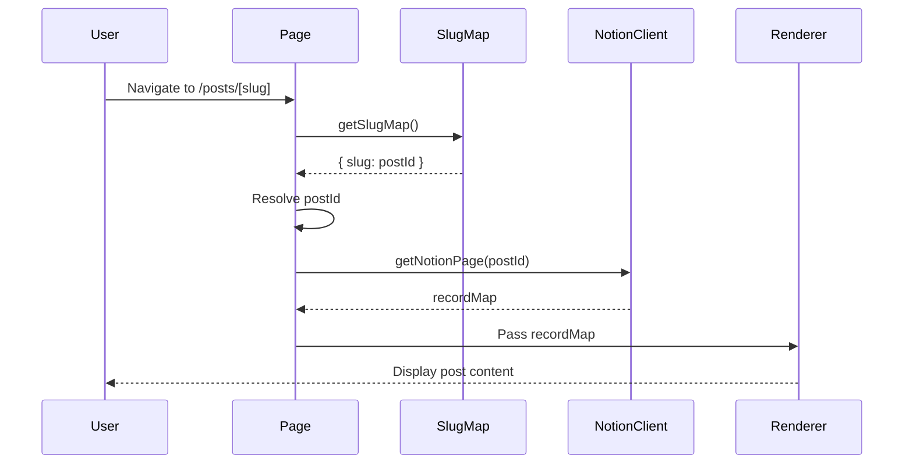
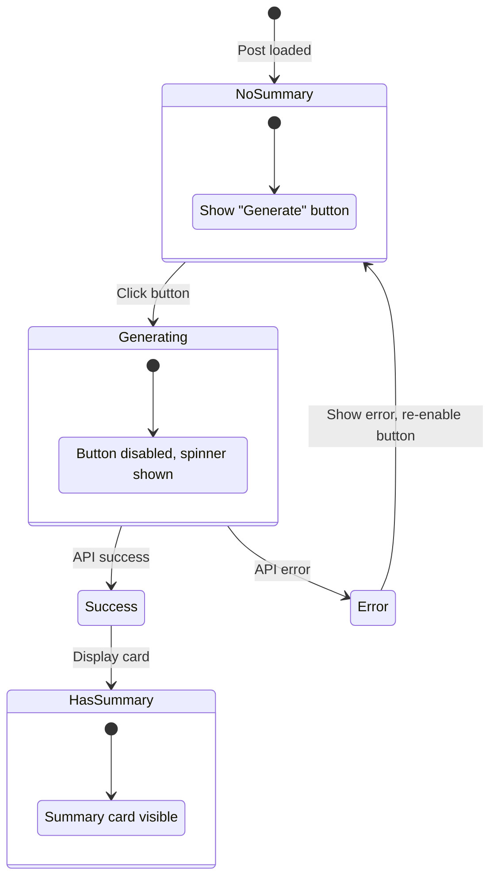
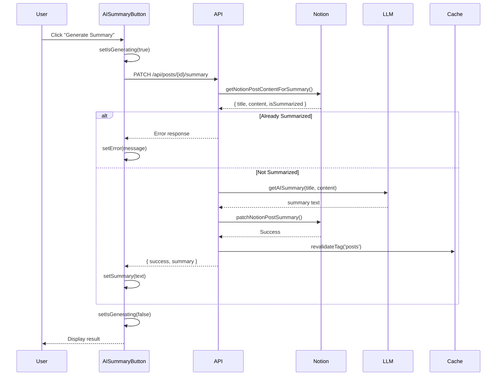
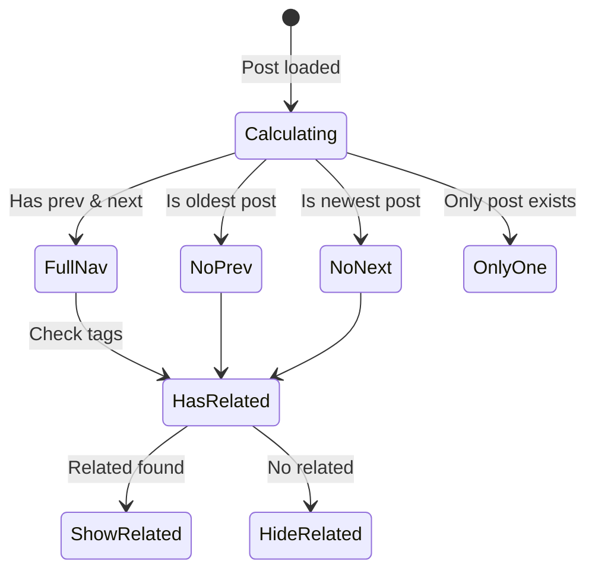
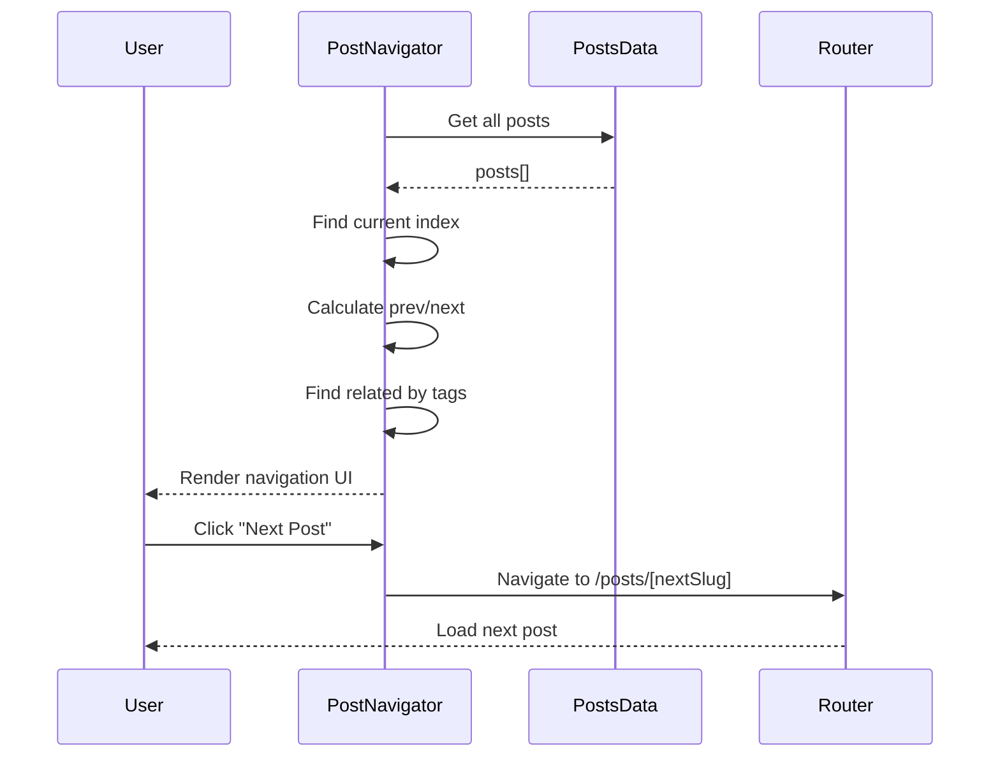

# Posts Domain Use Cases (Frontend)

This document describes the frontend use cases for the Posts domain, including user interactions, UI state management, and component behavior.

## UC-F-001: Filter Posts by Tag

### Overview

| Property | Value |
|----------|-------|
| Primary Actor | Visitor |
| Trigger | User clicks on a tag in the filter section |
| Preconditions | Posts list page is loaded with all posts visible |
| Postconditions | Only posts matching selected tags are displayed |

### Main Flow

1. **User** views the posts list page at `/posts`
2. **System** displays all published posts and available tags
3. **User** clicks on a tag (e.g., "React")
4. **System** highlights the selected tag visually
5. **System** filters posts to show only those containing the selected tag
6. **System** updates URL query parameter (`?tags=react`)
7. **User** sees filtered post grid

### Alternative Flows

**AF-1: Add Additional Tag**
1. At step 3, user clicks another tag (e.g., "TypeScript")
2. System applies OR filter (posts with React OR TypeScript)
3. URL updates to `?tags=react,typescript`

**AF-2: Remove Tag from Filter**
1. At step 7, user clicks the already-selected tag
2. System deselects tag and updates filter
3. If no tags remain selected, show all posts

**AF-3: No Matching Posts**
1. At step 5, if no posts match the filter
2. System displays EmptyPosts component with "No posts found"
3. System shows "Clear filters" action

### UI State Diagram



### Component Interactions



### State Management

```typescript
// In FilterablePosts component
const [selectedTags, setSelectedTags] = useState<Set<string>>(new Set());

const filteredPosts = useMemo(() => {
  if (selectedTags.size === 0) return posts;
  return posts.filter(post =>
    post.tags.some(tag => selectedTags.has(tag.id))
  );
}, [posts, selectedTags]);
```

---

## UC-F-002: View Post Detail

### Overview

| Property | Value |
|----------|-------|
| Primary Actor | Visitor |
| Trigger | User clicks on a post card |
| Preconditions | Post card is visible (home page or posts list) |
| Postconditions | Full post content is displayed |

### Main Flow

1. **User** clicks on a post card
2. **System** navigates to `/posts/[slug]`
3. **System** resolves slug to Notion page ID
4. **System** fetches page content via unofficial Notion client
5. **System** renders post header (title, date, tags)
6. **System** renders AI summary card (if summary exists)
7. **System** renders full Notion content via react-notion-x
8. **System** renders post navigator with prev/next/related posts
9. **User** views complete post

### Alternative Flows

**AF-1: Direct URL Access**
1. User navigates directly to `/posts/[slug]`
2. Continue from step 3

**AF-2: Invalid Slug**
1. At step 3, slug not found in slug map
2. System shows 404 error page
3. User can navigate to posts list

**AF-3: No AI Summary**
1. At step 6, post has no AI summary
2. System shows "Generate AI Summary" button instead
3. See UC-F-003 for generation flow

### UI State Diagram



### Component Interactions



---

## UC-F-003: Generate AI Summary

### Overview

| Property | Value |
|----------|-------|
| Primary Actor | Visitor |
| Trigger | User clicks "Generate AI Summary" button |
| Preconditions | Post detail page loaded, no existing summary |
| Postconditions | AI summary generated and displayed |

### Main Flow

1. **User** views post without existing AI summary
2. **System** displays "Generate AI Summary" button
3. **User** clicks the button
4. **System** disables button, shows loading spinner
5. **System** sends PATCH request to `/api/posts/[postId]/summary`
6. **API** extracts post content from Notion
7. **API** generates summary via LLM (OpenAI/local)
8. **API** stores summary in Notion "summary" property
9. **API** invalidates cache tags
10. **API** returns success response with summary
11. **System** replaces button with AI Summary Card
12. **User** reads the generated summary

### Alternative Flows

**AF-1: Generation Timeout**
1. At step 7, LLM request times out (>30s)
2. API returns error response
3. System shows error message with retry option
4. Button returns to enabled state

**AF-2: Already Summarized (Race Condition)**
1. At step 6, API finds existing summary
2. API returns error: "이미 요약이 생성된 포스트입니다"
3. System shows error message
4. User refreshes to see existing summary

**AF-3: API Rate Limit**
1. At step 5, API returns rate limit error
2. System shows "Please wait and try again"
3. Button re-enabled after cooldown

### UI State Diagram



### Component Interactions



### State Management

```typescript
// In AISummaryButton component
const [isGenerating, setIsGenerating] = useState(false);
const [summary, setSummary] = useState<string | null>(null);
const [error, setError] = useState<string | null>(null);

const handleGenerate = async () => {
  setIsGenerating(true);
  setError(null);

  try {
    const response = await fetch(`/api/posts/${postId}/summary`, {
      method: 'PATCH',
    });
    const result = await response.json();

    if (result.success) {
      setSummary(result.summary);
    } else {
      setError(result.error);
    }
  } catch (err) {
    setError('Failed to generate summary');
  } finally {
    setIsGenerating(false);
  }
};
```

---

## UC-F-004: Navigate Between Posts

### Overview

| Property | Value |
|----------|-------|
| Primary Actor | Visitor |
| Trigger | User clicks prev/next or related post link |
| Preconditions | Post detail page loaded with navigation section visible |
| Postconditions | User navigated to selected post |

### Main Flow

1. **User** scrolls to bottom of post content
2. **System** displays PostNavigator with:
   - Previous post link (chronologically older)
   - Next post link (chronologically newer)
   - Related posts (shared tags)
3. **User** clicks on a navigation link
4. **System** navigates to selected post's detail page
5. **User** views new post

### Alternative Flows

**AF-1: First Post (No Previous)**
1. At step 2, current post is the oldest
2. System hides or disables "Previous" link
3. Only "Next" and related posts shown

**AF-2: Last Post (No Next)**
1. At step 2, current post is the newest
2. System hides or disables "Next" link
3. Only "Previous" and related posts shown

**AF-3: No Related Posts**
1. At step 2, no other posts share tags
2. System hides related posts section
3. Only prev/next navigation shown

### UI State Diagram



### Component Interactions



### Navigation Logic

```typescript
// In PostNavigator component
const currentIndex = sortedPosts.findIndex(p => p.id === currentId);

const prevPost = currentIndex > 0
  ? sortedPosts[currentIndex - 1]
  : null;

const nextPost = currentIndex < sortedPosts.length - 1
  ? sortedPosts[currentIndex + 1]
  : null;

const relatedPosts = sortedPosts
  .filter(p => p.id !== currentId)
  .filter(p => p.tags.some(t => currentTags.includes(t.name)))
  .slice(0, 3); // Limit to 3 related posts
```

---

## Error Handling Summary

| Use Case | Error Type | User Message | Recovery Action |
|----------|------------|--------------|-----------------|
| UC-F-001 | No matches | "No posts found for selected tags" | Clear filters button |
| UC-F-002 | Invalid slug | 404 page | Link to posts list |
| UC-F-003 | API timeout | "Generation timed out" | Retry button |
| UC-F-003 | Rate limit | "Please wait and try again" | Auto-retry after delay |
| UC-F-003 | Already summarized | "Summary already exists" | Refresh page |
| UC-F-004 | Navigation error | Graceful fallback | Disable broken link |

---

## Accessibility Considerations

| Use Case | Accessibility Feature |
|----------|----------------------|
| UC-F-001 | Keyboard navigation for tag selection, ARIA labels |
| UC-F-002 | Semantic headings in post content, alt text for images |
| UC-F-003 | Loading state announced to screen readers |
| UC-F-004 | Focus management on navigation, keyboard accessible links |
