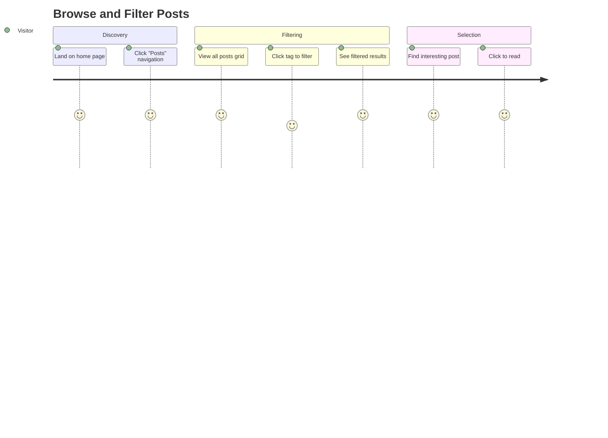
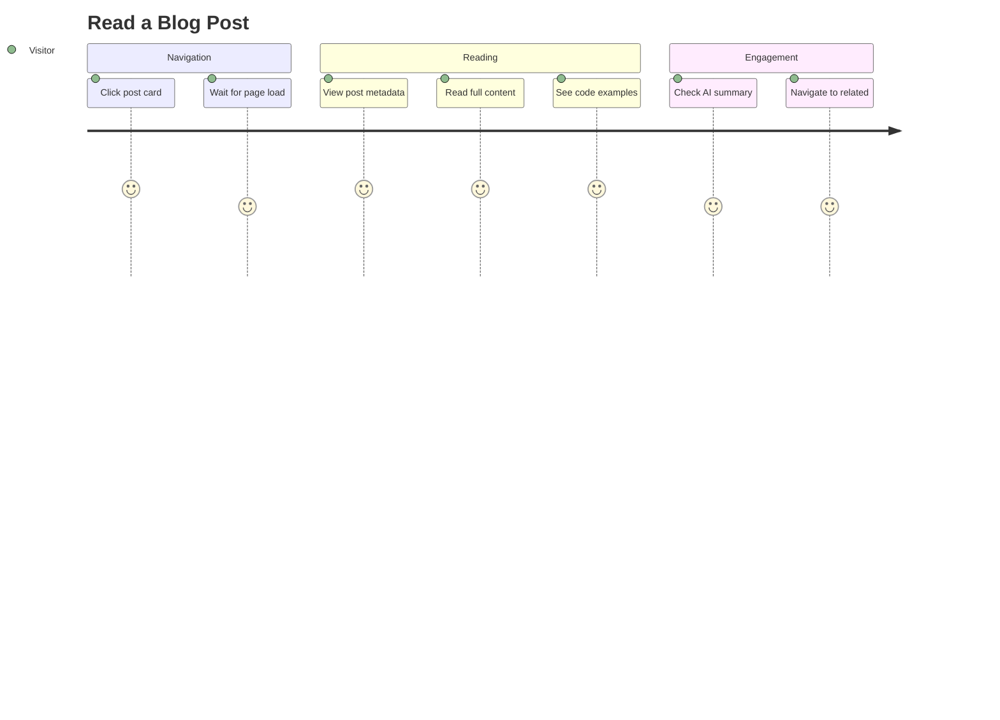
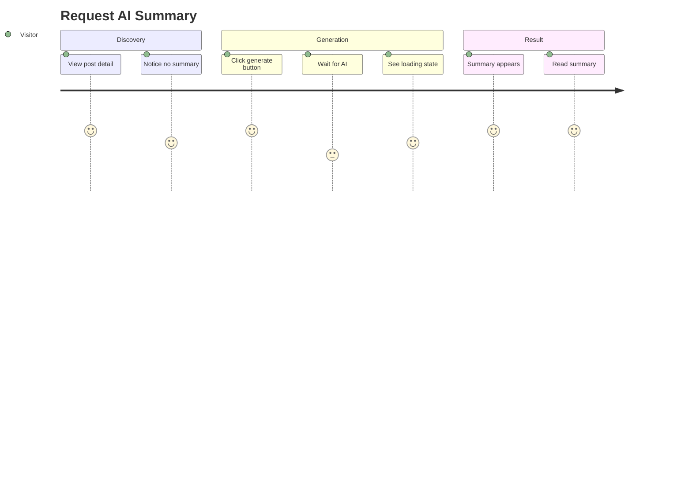
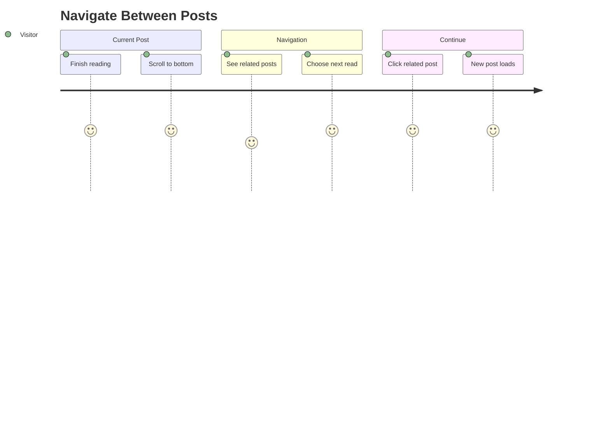

# Posts Domain User Stories

This document describes end-to-end user journeys for the Posts domain, covering content discovery, reading, AI summary generation, and navigation features.

## User Personas

### Visitor
Anonymous blog reader who wants to discover and consume technical content. May be a developer, student, or tech enthusiast searching for specific topics or browsing casually.

### Blog Owner (Meti)
Content creator and site administrator who publishes posts via Notion and wants readers to engage with AI-enhanced content.

---

## User Journeys

### Journey 1: Browse and Filter Posts

**Persona**: Visitor
**Goal**: Find posts on specific topics of interest
**Preconditions**: User has navigated to the blog



#### Steps

1. **Land on Home Page**
   - User action: Navigate to blog URL
   - System response: Display hero section and featured posts
   - Validation: Page loads within 2 seconds

2. **Navigate to Posts**
   - User action: Click "Posts" link in header navigation
   - System response: Route to `/posts` page, display all published posts
   - Validation: Posts grid renders with all published content

3. **View Tag Options**
   - User action: Observe tag filter sidebar/section
   - System response: Display all available tags from Notion database
   - Validation: Tags match Notion database schema

4. **Select Tag Filter**
   - User action: Click on a tag (e.g., "React", "TypeScript")
   - System response:
     - Highlight selected tag
     - Filter posts to show only those with selected tag
     - Update URL with query parameter (`?tags=react`)
   - Validation: Only matching posts displayed

5. **Add Multiple Tags**
   - User action: Click additional tags
   - System response:
     - Apply OR filter (posts with ANY selected tag)
     - URL reflects all selected tags
   - Validation: Filter logic is inclusive (OR), not exclusive (AND)

6. **Clear Filters**
   - User action: Deselect all tags or click "Clear" button
   - System response: Show all posts again
   - Validation: URL query parameters cleared

#### Success Criteria
- [ ] All published posts visible on initial load
- [ ] Tag filter updates instantly (< 100ms)
- [ ] URL is shareable and restores filter state
- [ ] Empty state shown when no posts match

#### Error Scenarios

| Scenario | User Experience | Recovery |
|----------|----------------|----------|
| No posts match filter | "No posts found" message with clear filter option | Click to clear filters |
| Tags fail to load | Posts display without filter option | Refresh page |
| Network timeout | Loading skeleton, then error message | Retry button |

---

### Journey 2: Read a Blog Post

**Persona**: Visitor
**Goal**: Consume full content of a specific blog post
**Preconditions**: User found a post of interest (via home, posts list, or direct link)



#### Steps

1. **Click Post Card**
   - User action: Click on post card from grid or featured section
   - System response: Navigate to `/posts/[slug]`
   - Validation: Correct post loads based on slug

2. **View Post Metadata**
   - User action: Observe post header
   - System response: Display title, publication date, tags
   - Validation: Metadata matches Notion source

3. **Read Post Content**
   - User action: Scroll through content
   - System response: Render rich Notion content including:
     - Formatted text (bold, italic, etc.)
     - Headings with proper hierarchy
     - Code blocks with syntax highlighting
     - Images with lazy loading
     - Embedded media
   - Validation: All content types render correctly

4. **View AI Summary (if exists)**
   - User action: Look for summary section
   - System response: Display AI summary card with 2-sentence summary
   - Validation: Summary provides accurate post overview

5. **Navigate to Related Posts**
   - User action: Scroll to post footer
   - System response: Show previous/next posts and related content
   - Validation: Navigation links are functional

#### Success Criteria
- [ ] Post content renders completely
- [ ] Code blocks have syntax highlighting
- [ ] Images load with proper sizing
- [ ] AI summary card visible if summary exists
- [ ] Navigation to prev/next works

#### Error Scenarios

| Scenario | User Experience | Recovery |
|----------|----------------|----------|
| Invalid slug | 404 page | Link to posts list |
| Content rendering fails | Partial content with error boundary | Refresh or report issue |
| Images fail to load | Placeholder with alt text | Browser refresh |

---

### Journey 3: Request AI Summary

**Persona**: Visitor
**Goal**: Get a quick AI-generated summary of a long post
**Preconditions**: User is viewing a post without existing AI summary



#### Steps

1. **Notice Missing Summary**
   - User action: Look for AI summary section on post
   - System response: Display "Generate AI Summary" button instead of summary card
   - Validation: Button visible for posts without `aiSummary`

2. **Click Generate Button**
   - User action: Click "Generate AI Summary" button
   - System response:
     - Button enters loading state
     - Disable button to prevent duplicate clicks
     - Show loading spinner/animation
   - Validation: UI reflects processing state

3. **Wait for Generation**
   - User action: Wait (typically 5-15 seconds)
   - System response:
     - API call to `/api/posts/[postId]/summary`
     - LLM generates 2-sentence summary
     - Summary stored in Notion
     - Cache invalidated
   - Validation: Process completes without timeout

4. **View Generated Summary**
   - User action: Observe summary card appearance
   - System response:
     - Replace button with AI summary card
     - Display summary text
     - Show success indication
   - Validation: Summary is contextually relevant to post content

5. **Return Visit**
   - User action: Revisit same post later
   - System response: Summary card displayed immediately (persisted)
   - Validation: No regeneration needed

#### Success Criteria
- [ ] Button appears only when no summary exists
- [ ] Loading state clearly communicated
- [ ] Summary generated within 30 seconds
- [ ] Summary accurately reflects post content
- [ ] Summary persists across page refreshes

#### Error Scenarios

| Scenario | User Experience | Recovery |
|----------|----------------|----------|
| LLM API timeout | Error message: "Generation timed out" | Retry button |
| Rate limit exceeded | Error message with wait time | Wait and retry |
| Already summarized | Error message (shouldn't happen in normal flow) | Refresh page |
| Notion update fails | Error message: "Failed to save summary" | Retry or contact owner |

---

### Journey 4: Navigate Between Posts

**Persona**: Visitor
**Goal**: Discover related content and continue reading
**Preconditions**: User finished reading current post



#### Steps

1. **Complete Current Post**
   - User action: Scroll to end of post content
   - System response: Post navigator section becomes visible
   - Validation: Navigator renders at post footer

2. **View Navigation Options**
   - User action: Examine available links
   - System response: Display:
     - Previous post (chronologically)
     - Next post (chronologically)
     - Related posts (tag similarity)
   - Validation: Links are contextually relevant

3. **Choose Next Post**
   - User action: Click on a navigation link
   - System response: Navigate to selected post
   - Validation: Correct post loads

4. **Continue Reading Loop**
   - User action: Read new post, repeat navigation
   - System response: Each post has appropriate navigation
   - Validation: User can traverse entire blog

#### Success Criteria
- [ ] Previous/Next links work correctly
- [ ] Related posts share tags with current post
- [ ] First post shows no "Previous" link
- [ ] Last post shows no "Next" link
- [ ] Navigation is keyboard accessible

#### Error Scenarios

| Scenario | User Experience | Recovery |
|----------|----------------|----------|
| No related posts | Section hidden or "No related posts" | Use prev/next instead |
| Stale navigation data | Potentially broken links | Refresh page |

---

## Acceptance Test Scenarios (E2E)

### Scenario 1: Complete Post Discovery Flow

```gherkin
Feature: Post Discovery
  As a visitor
  I want to browse and filter posts
  So that I can find content matching my interests

  Scenario: Filter posts by tag
    Given I am on the posts page
    And there are posts with tags "React", "TypeScript", "CSS"
    When I click the "React" tag filter
    Then I should only see posts tagged with "React"
    And the URL should contain "tags=react"

  Scenario: Clear tag filter
    Given I have filtered posts by "React" tag
    When I deselect the "React" tag
    Then I should see all posts
    And the URL should not contain query parameters
```

### Scenario 2: AI Summary Generation

```gherkin
Feature: AI Summary Generation
  As a visitor
  I want to generate an AI summary
  So that I can quickly understand a post's content

  Scenario: Generate summary for new post
    Given I am viewing a post without AI summary
    When I click "Generate AI Summary"
    And I wait for generation to complete
    Then I should see the summary card
    And the summary should be 2 sentences
    And the summary should be persisted

  Scenario: View existing summary
    Given a post has an AI summary
    When I visit the post page
    Then I should see the summary card immediately
    And there should be no generate button
```

### Scenario 3: Post Navigation

```gherkin
Feature: Post Navigation
  As a visitor
  I want to navigate between posts
  So that I can continue reading related content

  Scenario: Navigate to next post
    Given I am viewing a post that is not the newest
    When I click "Next Post"
    Then I should be on the chronologically next post

  Scenario: View related posts
    Given I am viewing a post tagged "React"
    When I scroll to the navigation section
    Then I should see related posts that share the "React" tag
```

---

## Metrics & Success Indicators

| Metric | Target | Measurement |
|--------|--------|-------------|
| Post list load time | < 2s | Lighthouse |
| Post detail load time | < 3s | Lighthouse |
| Filter response time | < 100ms | Client-side timing |
| AI summary generation | < 30s | API response time |
| Navigation click-through | > 20% | Analytics |
| Summary generation rate | > 10% of post views | Analytics |
