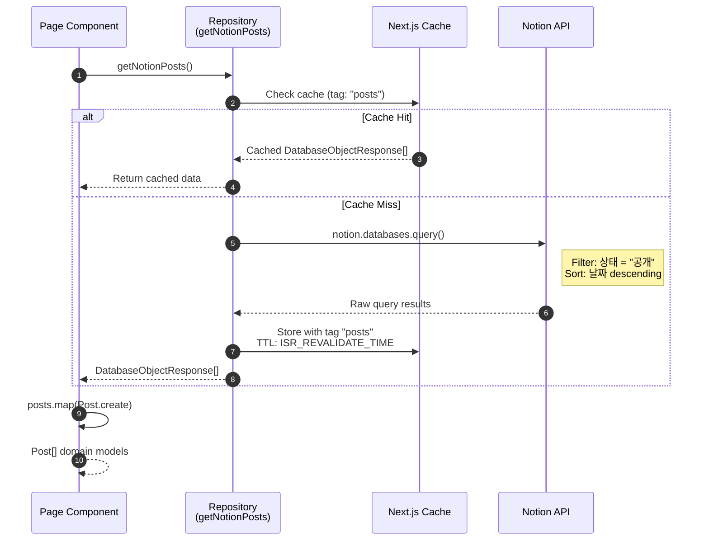
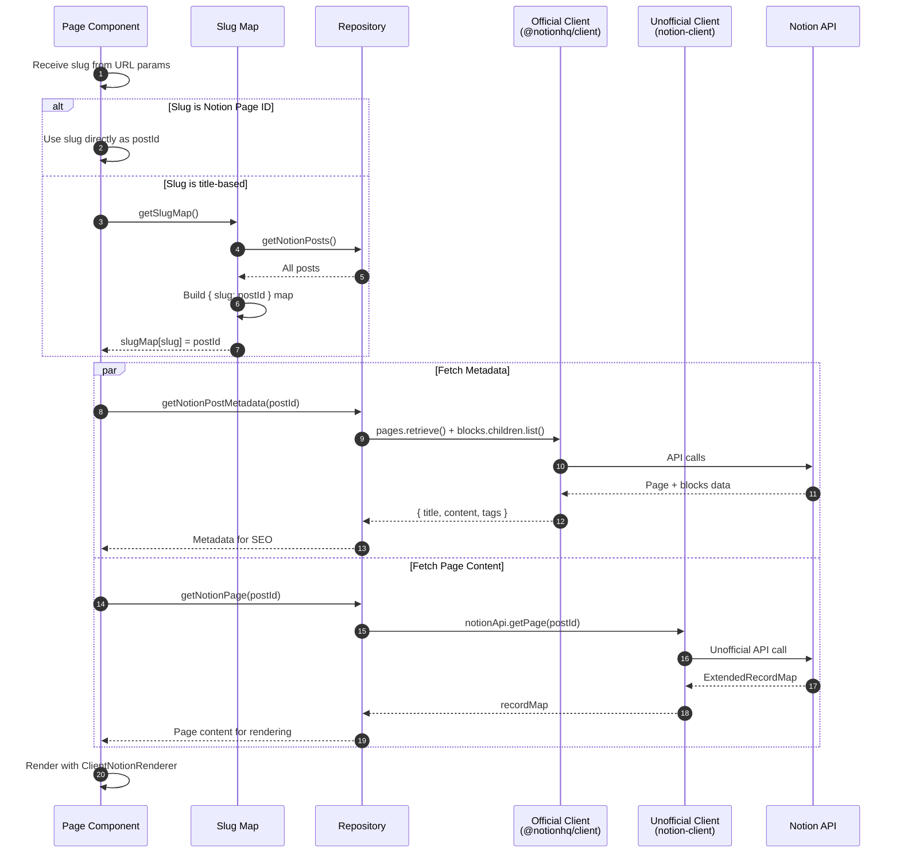
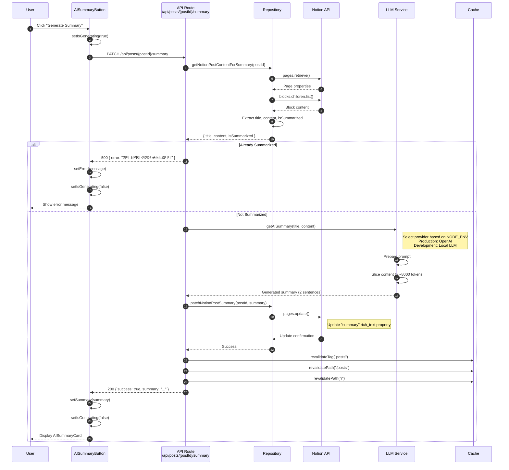
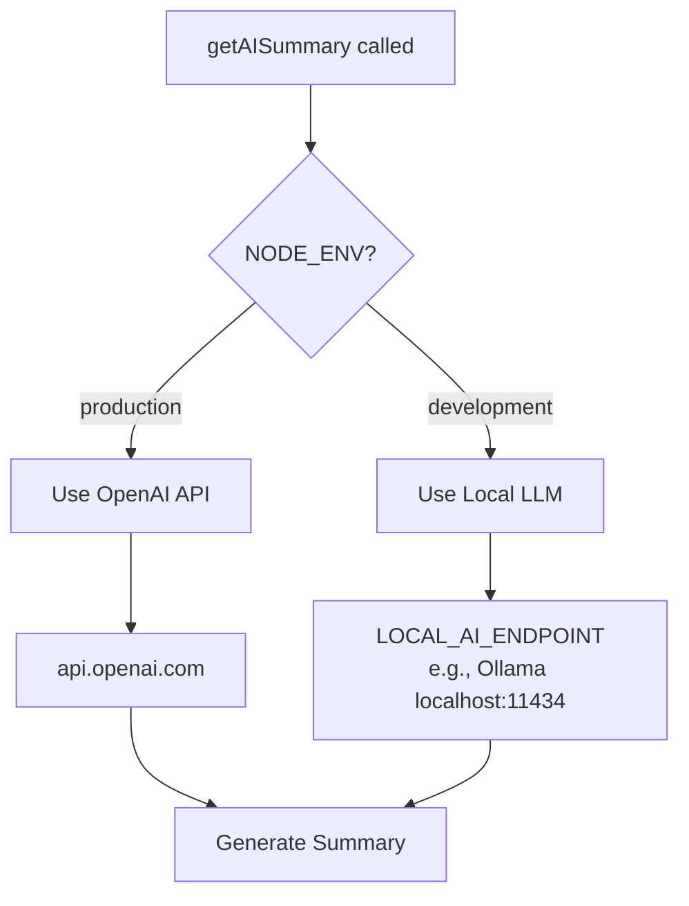
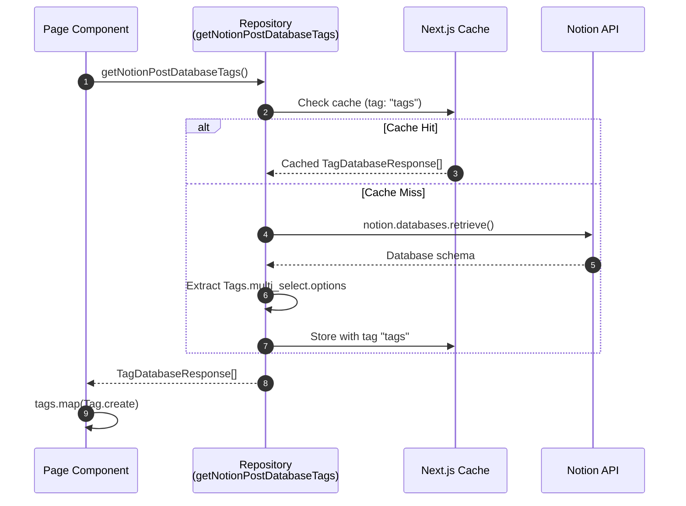
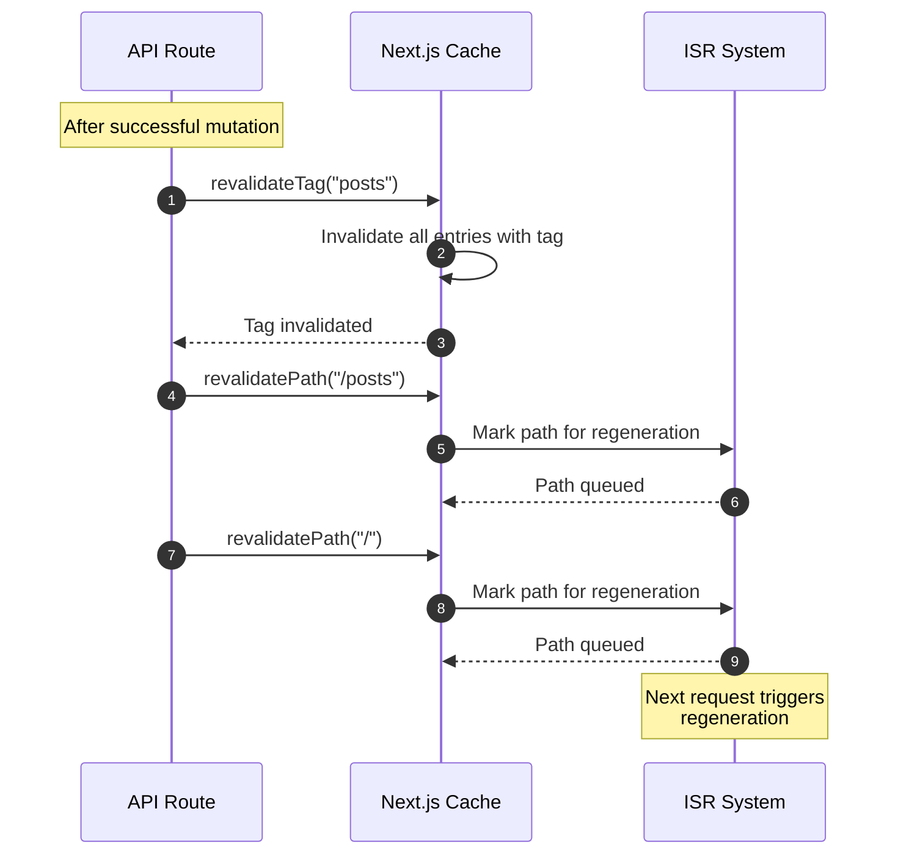
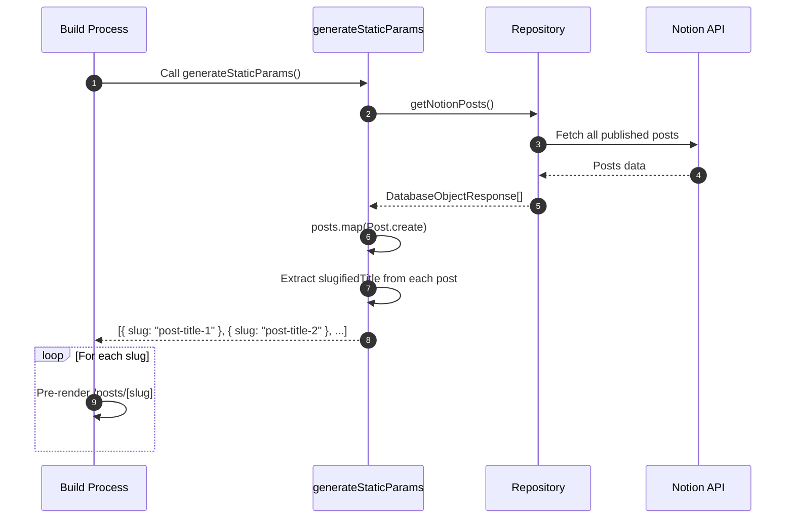

# Posts Domain Sequence Diagrams

This document contains detailed sequence diagrams for all backend workflows in the Posts domain.

## 1. Fetch Posts List

### Overview

Fetch all published posts from Notion database with server-side caching.

### Actors

- **Page Component**: Next.js page requesting data
- **Repository**: `entities/notion/model`
- **Cache**: Next.js `unstable_cache`
- **Notion**: External Notion API

### Sequence



### Request Details

**Notion Query**:
```typescript
{
  database_id: NOTION_POST_DATABASE_ID,
  filter: {
    property: "상태",
    status: { equals: "공개" }
  },
  sorts: [{
    property: "날짜",
    direction: "descending"
  }]
}
```

### Cache Configuration

| Property | Value |
|----------|-------|
| Cache Tag | `posts` |
| Revalidate (dev) | 30 seconds |
| Revalidate (prod) | 300 seconds |

---

## 2. Fetch Post Detail

### Overview

Resolve URL slug to Notion page ID and fetch full page content for rendering.

### Actors

- **Page Component**: Post detail page
- **Slug Map**: Cached slug-to-ID mapping
- **Repository**: Notion API wrapper
- **Official Client**: For metadata
- **Unofficial Client**: For content rendering

### Sequence



### Slug Resolution Logic

```typescript
async function slugToPostId(slugOrId: string) {
  // Check if already a Notion page ID
  if (isNotionPageId(slugOrId)) {
    return slugOrId;
  }

  // Lookup in slug map
  const slugMap = await getSlugMap();
  const postId = slugMap[decodeURIComponent(slugOrId)];

  if (!postId) {
    throw new Error("Post not found for given slug or id.");
  }

  return postId;
}
```

---

## 3. Generate AI Summary

### Overview

Generate AI-powered summary for a blog post and store it in Notion.

### Actors

- **Client**: Browser UI (AISummaryButton)
- **API Route**: `/api/posts/[postId]/summary`
- **Repository**: Notion client wrapper
- **LLM Service**: OpenAI or Local LLM
- **Cache**: Next.js cache invalidation

### Sequence



### Request/Response Schema

**Request**:
```typescript
PATCH /api/posts/{postId}/summary
Content-Type: application/json

// No body required - postId from URL params
```

**Success Response** (200):
```typescript
{
  success: true,
  summary: "This post explains... In conclusion...",
  message: "AI 요약이 성공적으로 생성되었습니다."
}
```

**Error Response** (500):
```typescript
{
  success: false,
  error: "이미 요약이 생성된 포스트입니다." | "Notion API 권한이 부족합니다." | ...
}
```

### LLM Provider Selection



### Content Extraction

```typescript
// Extract text content from Notion blocks
const content = contentResponse.results
  .filter(block => block.type === "paragraph")
  .map(block =>
    block.paragraph.rich_text
      .map(text => text.plain_text)
      .join("")
  )
  .join("");
```

---

## 4. Fetch Tags List

### Overview

Retrieve available tag options from Notion database schema.

### Sequence



### Response Schema

```typescript
interface TagDatabaseResponse {
  id: string;      // Notion tag ID
  name: string;    // Display name (e.g., "React", "TypeScript")
  color: string;   // Notion color value
}
```

---

## 5. Cache Invalidation Flow

### Overview

Cache invalidation triggered after data mutations.

### Sequence



### Invalidation Triggers

| Operation | Tags Invalidated | Paths Invalidated |
|-----------|-----------------|-------------------|
| AI Summary Generated | `posts` | `/`, `/posts` |
| (Future) Post Created | `posts`, `tags` | `/`, `/posts` |
| (Future) Post Updated | `posts` | `/`, `/posts`, `/posts/[slug]` |
| (Future) Post Deleted | `posts` | `/`, `/posts` |

---

## 6. Static Generation Flow

### Overview

Generate static paths for all posts at build time.

### Sequence



### Implementation

```typescript
export async function generateStaticParams() {
  const posts = (await getNotionPosts()).map(Post.create);

  return posts.map(({ slugifiedTitle }) => ({
    slug: slugifiedTitle,
  }));
}
```

---

## Error Handling Matrix

| Flow | Error Type | HTTP Status | Recovery |
|------|-----------|-------------|----------|
| Fetch Posts | Notion API error | 500 | Serve stale cache |
| Fetch Detail | Invalid slug | 404 | Show 404 page |
| Fetch Detail | Notion page deleted | 404 | Show 404 page |
| AI Summary | Already summarized | 500 | Show error message |
| AI Summary | LLM timeout | 500 | Retry button |
| AI Summary | Rate limited | 429 | Wait and retry |
| AI Summary | Notion update failed | 500 | Retry button |
| Fetch Tags | Notion API error | 500 | Hide filter section |
