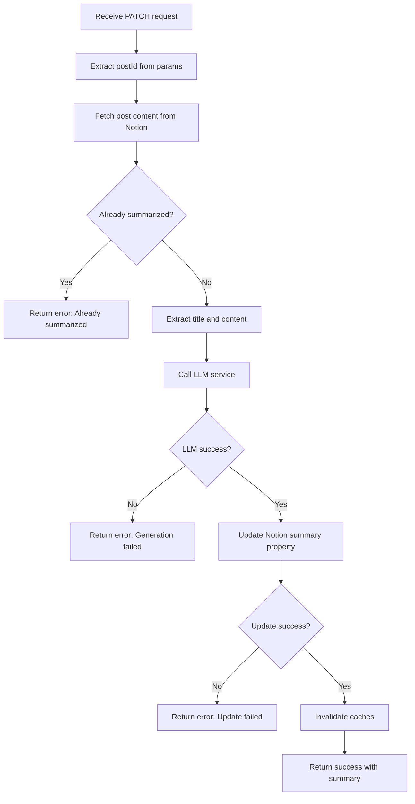

# Posts Domain Use Cases (Backend)

This document describes the backend API use cases for the Posts domain.

## UC-API-001: Generate AI Summary

### Endpoint Details

| Property | Value |
|----------|-------|
| Method | `PATCH` |
| Path | `/api/posts/[postId]/summary` |
| Auth | None (public) |
| Rate Limit | Implicit (LLM provider limits) |

### Purpose

Generate an AI-powered summary for a blog post and persist it to the Notion database.

### Request

```typescript
// Method
PATCH

// URL Parameters
postId: string  // Notion page ID

// Headers
Content-Type: application/json

// Body
// None required - postId comes from URL
```

### Response

**Success (200)**:
```typescript
interface SuccessResponse {
  success: true;
  summary: string;  // Generated 2-sentence summary
  message: string;  // "AI 요약이 성공적으로 생성되었습니다."
}
```

**Error (500)**:
```typescript
interface ErrorResponse {
  success: false;
  error: string;  // Human-readable error message
}
```

### Implementation Flow



### Code Implementation

```typescript
// src/app/api/posts/[postId]/summary/route.ts

export async function PATCH(
  _: NextRequest,
  { params }: { params: { postId: string } }
) {
  const { postId } = params;

  try {
    // 1. Fetch post content
    const { title, content, isSummarized } =
      await getNotionPostContentForSummary(postId);

    // 2. Check if already summarized
    if (isSummarized) {
      throw new Error("이미 요약이 생성된 포스트입니다.");
    }

    // 3. Generate AI summary
    const newSummary = await getAISummary(title, content);

    // 4. Update Notion database
    await patchNotionPostSummary(postId, newSummary);

    // 5. Invalidate caches
    revalidateTag("posts");
    revalidatePath("/posts");
    revalidatePath("/");

    // 6. Return success
    return NextResponse.json({
      success: true,
      summary: newSummary,
      message: "AI 요약이 성공적으로 생성되었습니다.",
    });
  } catch (error) {
    // Error handling with specific messages
    let errorMessage = "AI 요약 생성에 실패했습니다.";

    if (error instanceof Error) {
      if (error.message.includes("unauthorized")) {
        errorMessage = "Notion API 권한이 부족합니다.";
      } else if (error.message.includes("not found")) {
        errorMessage = "포스트를 찾을 수 없습니다.";
      } else if (error.message.includes("rate limit")) {
        errorMessage = "요청 제한에 걸렸습니다. 잠시 후 다시 시도해주세요.";
      } else {
        errorMessage = error.message;
      }
    }

    return NextResponse.json(
      { success: false, error: errorMessage },
      { status: 500 }
    );
  }
}
```

### Dependencies

**Internal Modules**:
- `src/entities/notion/model/index.ts`
  - `getNotionPostContentForSummary()`
  - `patchNotionPostSummary()`
- `src/entities/openai/model/index.ts`
  - `getAISummary()`

**External Services**:
- Notion API (read/write)
- OpenAI API or Local LLM

### Error Handling

| Error Condition | Status | Error Message |
|-----------------|--------|---------------|
| Post already has summary | 500 | "이미 요약이 생성된 포스트입니다." |
| Notion API unauthorized | 500 | "Notion API 권한이 부족합니다." |
| Post not found | 500 | "포스트를 찾을 수 없습니다." |
| LLM rate limit | 500 | "요청 제한에 걸렸습니다. 잠시 후 다시 시도해주세요." |
| Generic failure | 500 | "AI 요약 생성에 실패했습니다." |

### Cache Strategy

| Action | Cache Operation |
|--------|-----------------|
| After summary stored | `revalidateTag("posts")` |
| After summary stored | `revalidatePath("/posts")` |
| After summary stored | `revalidatePath("/")` |

### LLM Service Configuration

```typescript
// src/entities/openai/model/index.ts

export async function getAISummary(
  title: string,
  content: string
): Promise<string> {
  // Content truncation for token limit
  const truncatedContent = safeSlice(content, 8000);

  // Provider selection based on environment
  const provider = process.env.NODE_ENV === "production"
    ? openaiProvider
    : localLLMProvider;

  // Generate summary
  const response = await provider.chat.completions.create({
    model: modelConfig.model,
    messages: [
      { role: "system", content: SUMMARY_SYSTEM_PROMPT },
      { role: "user", content: `Title: ${title}\n\nContent: ${truncatedContent}` }
    ],
    max_tokens: 200,
  });

  return response.choices[0].message.content;
}
```

### Notion Update Schema

```typescript
// Update summary property in Notion
await notion.pages.update({
  page_id: postId,
  properties: {
    summary: {
      rich_text: [
        {
          text: {
            content: aiSummary,
          },
        },
      ],
    },
  },
});
```

---

## Repository Functions Used

### getNotionPostContentForSummary

**Purpose**: Extract post title and content for AI summarization

**Signature**:
```typescript
async function getNotionPostContentForSummary(id: string): Promise<{
  title: string;
  content: string;
  isSummarized: boolean;
}>
```

**Implementation**:
```typescript
async function _getNotionPostContentForSummary(id: string) {
  // Fetch page metadata
  const pageResponse = await notion.pages.retrieve({ page_id: id });

  // Fetch block content
  const contentResponse = await notion.blocks.children.list({ block_id: id });

  // Extract title
  const title = pageResponse.properties.제목.title[0].plain_text;

  // Extract paragraph text content
  const content = contentResponse.results
    .filter(block => block.type === "paragraph")
    .map(block =>
      block.paragraph.rich_text
        .map(text => text.plain_text)
        .join("")
    )
    .join("");

  // Check existing summary
  const summary = pageResponse.properties.summary.rich_text
    .map(text => text.plain_text)
    .join("");

  return {
    title,
    content,
    isSummarized: summary.length > 0,
  };
}
```

### patchNotionPostSummary

**Purpose**: Update the summary property in Notion database

**Signature**:
```typescript
async function patchNotionPostSummary(
  postId: string,
  aiSummary: string
): Promise<PageObjectResponse>
```

**Implementation**:
```typescript
const _patchNotionPostSummary = async (postId: string, aiSummary: string) => {
  const response = await notion.pages.update({
    page_id: postId,
    properties: {
      summary: {
        rich_text: [
          {
            text: { content: aiSummary },
          },
        ],
      },
    },
  });

  return response;
};
```

---

## Security Considerations

### Input Validation

- `postId` is validated as a valid Notion page ID format
- No user-provided content is directly passed to LLM without sanitization

### Rate Limiting

- Implicit rate limiting via LLM provider (OpenAI/local)
- No server-side rate limiting currently implemented
- Consider adding rate limiting for production

### Authorization

- Currently public endpoint (no auth required)
- Consider adding authentication for production to prevent abuse

### Data Privacy

- Post content is sent to external LLM service (OpenAI in production)
- Local LLM option available for development to keep data private

---

## Testing

### Unit Test Scenarios

```typescript
describe("PATCH /api/posts/[postId]/summary", () => {
  it("should generate summary for post without existing summary", async () => {
    // Mock Notion API responses
    // Mock LLM response
    // Assert success response
  });

  it("should return error for already summarized post", async () => {
    // Mock Notion API with existing summary
    // Assert error response with correct message
  });

  it("should handle LLM service failure", async () => {
    // Mock LLM timeout/error
    // Assert error response
  });

  it("should invalidate caches after successful summary", async () => {
    // Mock successful flow
    // Assert revalidateTag and revalidatePath called
  });
});
```

### Integration Test Scenarios

```typescript
describe("AI Summary Integration", () => {
  it("should persist summary to Notion and appear on page refresh", async () => {
    // Generate summary via API
    // Fetch post and verify summary property updated
    // Verify cache invalidation works
  });
});
```

---

## Monitoring & Observability

### Logging

```typescript
// Current implementation logs errors
console.error(`❌ [API Route] AI 요약 업데이트 실패 (${postId}):`, error);
```

### Recommended Metrics

| Metric | Description |
|--------|-------------|
| `ai_summary_requests_total` | Total summary generation requests |
| `ai_summary_success_total` | Successful generations |
| `ai_summary_errors_total` | Failed generations by error type |
| `ai_summary_duration_seconds` | Time to generate summary |
| `llm_tokens_used` | Tokens consumed per request |

### Alerting

| Condition | Severity | Action |
|-----------|----------|--------|
| Error rate > 10% | Warning | Investigate LLM service |
| Latency > 30s | Warning | Check LLM provider status |
| Notion API failures | Critical | Check API credentials |
